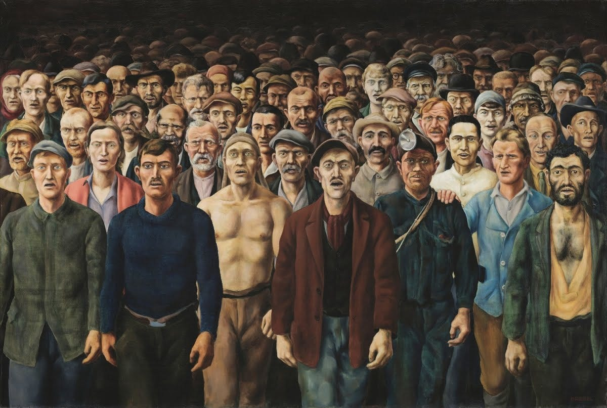

## True Character

The idea that a person's true character is revealed by how they treat those who can offer them nothing in return has been around for centuries. The origin of this concept has been attributed to 18th-century German writer Johann Wolfgang von Goethe, who stated: ‘You can easily judge the character of a man by how he treats those who can do nothing for him.’ His contemporary, the English writer Samuel Johnson, offered a similar perspective: ‘The true measure of a man is how he treats someone who can do him absolutely no good.’

Though we can't be certain who first coined this idea, the origins of this sentiment may be with another 18th century notable, Immanuel Kant, who wrote in his _Groundwork of the Metaphysics of Morals_ that we should, ‘Act in such a way that you treat humanity, whether in your own person or in the person of another, always at the same time as an end, never merely as a means to an end.’1

Although this doesn't explicitly emphasise doing something for someone who can do nothing for us, the idea is implied by the fact Kant argues that we should treat others with the equal regard, regardless of whether we expect anything from them or not.2

So, if a person's character can be judged by how they treat those who offer them nothing and who are of no value to them, then this may be the best indicator of whether someone is a good person, and the best way to judge the goodness of a someone's actions.

## Should Any Child Starve?

Based on this principle, if you want to know someone's moral view of the world you could ask them this one simple question: ‘ **Should any child starve to death?** ’

A small child is the most hopeless of all humans and the most dependent on others for food, and the most liable to die without it.3 If there ever was a test of what should be done for those who can't do things for themselves, and who can't do anything for us, it is this.

Yet to some people there is an acceptable number of children dying they are willing to tolerate in order for them to have something else they want. Such as a ruler that wants control over a piece of land, for the owner who wants control over a resource like water, or for the seller who wants control over the price of food. In each case there are those who would be prepared to use violence to maintain their power, or to restrict what a child needs to survive to maintain their wealth.

A baby represents the greatest possibility for human potential. They might grow up to save the very person who once denied them food, or discover a cure for a disease that could have claimed the life of a rich man's child prematurely. Even if they don't change the world on a grand scale, they have the potential to bring more happiness, love, and peace to those around them. This capacity to positively impact the lives of others, no matter how poor the parents or how small the scale, is as compelling a reason for them to live as anyone else.

Over three million children under the age of five die per year from starvation, malnutrition and undernutrition.4 Yet we produce far more food than is needed for humanity. This is an inexcusable tragedy that few people will try to justify, except those few in whose interest it is to keep in place the economic and political forces that keep this happening.5

But children dying isn't the only acceptable cost of doing business and politics, there are also the lives affected by the slow death of twenty percent of them being born into extreme poverty, and the forty percent who still suffer with food, housing and medical insecurity, which often comes with long term health problems that continue long into their shortened adult lives.

## Welfare & Precarity

This situation is one they are born into. They had no choice in the matter. They have no individual blame for what is happening to them, and they do not deserve it. Which raises another moral question: ‘Should any child be destined to struggle their whole life because they are born into the poor circumstances of their parents?’6

This question is what led many campaigners on the Left of the political spectrum to promote and push for social reforms, through pressuring governments via unions and protests to enact welfare programmes following the Second World War. In America this took the form of Social Security and Medicare, in the U.K. it took the form of National Insurance and the National Health System.

There was a time in the 1950s and '60s when one income could buy a house, support a family, and you could be assured of a retirement. It was also a time of eighty to ninety percent marginal tax rate, and those being taxed were not content to let this situation continue, and extended their influence in the media and politics, putting their favoured Neo-Liberal economists and compliant politicians into place and beginning to undermine these benefits in the 1980s.7

Now we find ourselves in a situation with greater than ever insecurity and precarity, where two people working overtime can barely afford to rent and can't save enough or qualify for a mortgage, where social housing is scarce, education can take decades to pay off, and insurance is too expensive to afford if an emergency should happen.

The last time the world was in a similar situation it ended up with major revolutions, but the gains - which did have some positives were not lasting because there were still structures in place which allowed the centralisation and corruption of power and wealth, leading to a repeat of the old problems but with a new veneer.

So we continue to be faced with similar moral questions, and how we answer these questions determines our moral character, and by how others answer these questions we can determine their moral stance or lack of it.

## Hunger & Housing

The questions we began with were limited to innocent children, but things often get more complicated when we are dealing with adults, as adults may make decisions we don't agree with, and they may face consequences as the result of their decisions. This still raises the question of how far our compassion goes:

  * Should anyone be hungry when there is more than enough food to feed them?

  * Should anyone be homeless when there are enough empty homes to house them?

In trying to address these scenarios, we are not talking about a situation in which someone is purposely starving themselves or refusing food, or one where they refuse to live in a safe home or prefer to sleep under the stars.

What about those who - for whatever reason or decisions made in the past - are now hungry and need food, or homeless and need shelter to stay healthy and safe? In such a situation is there any reason the hungry should not be given food, or the homeless not be given a roof over their head?

Do you think it would be right for you to personally go hungry when there is an excess of food available? Would you hope that someone might give you food if that happened? Wouldn't you want that for others?

Do you think it would be right for you to be homeless when there is a surplus of empty houses? Would you hope that someone might give you shelter if that happened? Wouldn't you want others to be offered such help too?

If you don't believe others should go hungry or should be homeless when there are the resources to feed and house them then there is a term for you: **Anti-Capitalist**.8

Die Internationale, Otto Griebel

## Anti-Capitalism & Compassion

It is capitalism that puts these essentials behind a paywall, and all but the wealthy few have to earn money access to them, unless someone else shows them charity.

If you don't believe society and economics should be constructed around financial winners and losers, between those who make others wealthy with their work, and the wealthy who withhold the things workers need unless they work, then you are an Anti-Capitalist. You don't believe that the essential things we need to survive should be made into and used as private capital at the expense of others.

But we are not only defined by what we are against, but what we are for, and a person who believes others shouldn't suffer for their benefit, who believes that everyone is entitled to dignity and what they need to live, is a compassionate person.

Wanting others not to suffer needlessly is compassion, not just sympathy nor empathy. Sympathy may be the start of compassion, but if sympathy is a form of pity, then compassion is the intention to do something if its within your power to relieve another's suffering. Unlike empathy, which requires having understanding, compassion is wanting someone to be relieved of pain even if you don't understand their circumstances.

There is another term for someone who accepts and honours the fundamental dignity and worth of others: **Egalitarian***. It is the belief that all individuals should be treated with equal respect and consideration, regardless of their past or status.

In other words, to paraphrase our original quotes, ‘The true measure of a man's character is revealed by how he treats those who can offer him nothing in return.’

This isn't just the measure of your character, but of your ideals, and of any system you belong to, or anything you believe in. It is one thing to have good intentions and another to have a society and culture that represents them. 

Do you want to live in a world in which there are no hungry or homeless? The next article in this series will look at what it would take to have a society in which everyone was entitled to this level of human dignity, in which everyone was guaranteed what they need to live and even thrive.

Subscribe

[Share](https://peacefulrevolutionary.substack.com/p/the-moral-question?utm_source=substack&utm_medium=email&utm_content=share&action=share)

 _The second article in this series is here:_

## *Equitarian

Although I like the word ‘egalitarian’ I might suggest another one: ‘Equitarian’. The root ‘equi-’ comes from Latin, meaning ‘equal’ or ‘even’, which is seen in words like ‘equitable’ or ‘equilibrium’. This suggests equality in balance with fairness. That which is unbalance is also unfair and vice-versa.

The suffix ‘-tarian’ is used to denote a person who advocates or practices a certain philosophy or set of principles, as in ‘humanitarian’. 

So, an Equitarian is someone who advocates for or believes in equality and fairness in a broad sense, and an Equitarian society would be one that achieves these ideals. This would require equal access to essential needs in order to be fair and just. 

This is the Equitarian principle: You cannot achieve equilibrium in society while allowing inequality (in people’s essential needs), or if you allow inequitable power (and allow one person to rule over another).9

In other words: Any power which is created by inequality or that is maintained by inequitable power is imbalanced, unjust and illegitimate. Therefore, a just and stable society can only be achieved through the equal distribution of essential resources and the elimination of hierarchical power structures.

### Entitlement Series

If you liked this consider reading more of the [The Universal Entitlement Series](https://peacefulrevolutionary.substack.com/about#§entitlement-series)

1

Kant, Immanuel, 1785, Translated by Ellington, James W. (3rd ed, 1993). p. 36. 4:429.

2

This differs from the 'Golden Rule' in that it doesn't expect anything in return, and is closer to the Platinum Rule of ‘treat others how they would like to be treated’, whether we would like to to be treated like that or not. Note: There is also Karl Popper's ‘Negative Golden Rule’ which states: ‘Do not do unto others as you would not have them do unto you.’

3

Human children could conceivably acquire basic survival skills between 7 years old, similar to other great apes.

4

See <https://www.theworldcounts.com/challenges/people-and-poverty/hunger-and-obesity/how-many-people-die-from-hunger-each-year>

5

Or those convinced that these people are inspirational heroes and wish to be like them, and justify their actions.

6

Especially while another child flourishes because of the wealthy circumstances of their parents when there is enough for both to flourish.

7

See Reaganomics and Thatcherism for example.

8

To paraphrase this comment: 

9

Of course there is other words for when this process is realised which is Libertarian Socialism or Anarcho-Communism: an anti-hierarchy, anti-capitalist, decentralised, decommodified, communal, classless society.
