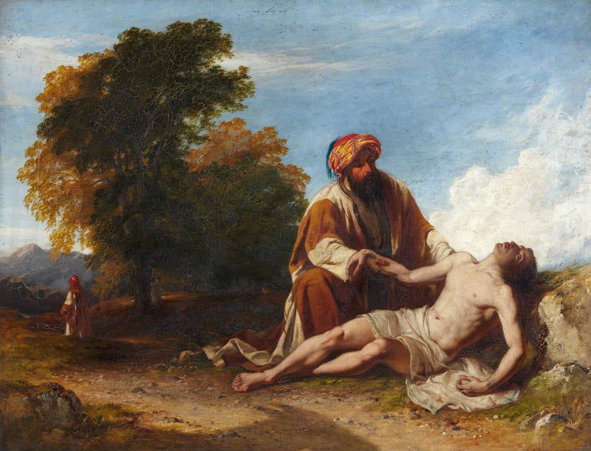

My previous article, ‘[The Moral Question](https://peacefulrevolutionary.substack.com/p/the-moral-question)’ received some very encouraging responses, although there wasn’t anything particularly new about it’s premise or conclusions, starting and ending as it did with a moral test that has been around for centuries. Yet, I felt it summed up well the way I looked at my responsibility to others, and our collective responsibility as fellow members of the human family.

However, one commentator took exception to some of the points made within the article, and which I may not have adequately addressed:

> ‘Your “should” questions in their current form are invalid unless we are to assume that you have implied that it is being asked to society. However, there is no such entity: a society is simply a group of individuals living in close proximity to each other. If your questions are addressed to individuals, we come full circle to an invalid form of question. Of course, we could each answer that we wish no harm or misfortune on any individuals, but if we chose to be less kind or compassionate and answer that we are not the cause of this reality for these people there is no immoral act involved. Abstract human beings are at best potentially abstract values to specific individuals. Philosophy is not a party tool or a cheap device to be used to extract alms for the misfortunate. Individuals should take responsibility for their own lives and their own chosen values: loved ones and friends. We are not responsible for everyone.’ _([Original comment](https://open.substack.com/pub/peacefulrevolutionary/p/the-moral-question?r=25vj2b&utm_campaign=comment-list-share-cta&utm_medium=web&comments=true&commentId=68929978))_

In answer to these objections I decided to write a short reply which kept getting longer until it turned into this article.

Dear Daniel,

Thank you for taking the time to respond to my article. I appreciate the effort you’ve put into sharing your views.

If I have understand you correctly you are saying that: 1) Society doesn't exist as an entity, and 2) Individuals are only responsible for themselves, not for others or collective problems. Is that right? If so ...

I believe this subject relates to a classic moral quandary which I drafted a different article to address, that looked at how different philosophers have approached the subject of our responsibility toward a drowning child we don't know, and how far our culpability - if any - might extend to save them and other children. I wish now that I'd posted that article first, as in it I'd tried to addressed that point in more detail there. However, like those philosophers we seem to have different views of what we are responsible for, and may be approaching this subject starting with a different set of assumptions.

## Assumptions

Here are some of my assumptions: 

**1) I believe that some problems are not (or not just) the result of individual failings, but (also) of inequalities inherent in structures and systems (and even states and hierarchy itself).**

An example of this is a president in a capitalist state making a policy decision that enriches his cronies at the expense of a larger group of poorer people, such as: Raising taxes (to to go toward a bigger presidential palace), stopping them collecting rain water (so the water companies become more profitable), or enacting laws against homelessness and giving to beggars (thus filling the private prisons with cheap labour). 

_I do believe that the failure of a system to address issues like hunger and homelessness does bear on the effectiveness and morality of the system (or those in charge of it and carry out its plans), and that such systems and their actions (and those who direct them) can and do affect us collectively and individually for good or ill._

 **2) I believe that there is such a thing as collective responsibility and collective progress through combining our efforts.**

It took a tribe to keep the fires going, to bring down a Woolly Mammoth for dinner, and to get the harvest in, so everyone could share the bread and beer at the end of the day, and dance the night away together. If someone fails to keep watch when it is their turn to look out for wild animals, then such a beast may kill someone, which not only deprives them of an important skilled community member, but causes insecurity and anxiety that is felt by and affects the tribe.

 **3) I believe that choosing to be 'less kind or compassionate' is an 'immoral act', as I see it as a dangerous form of ethical egoism.**

I do believe that we have a moral obligation to help others, not out of abstract philosophy, but out of real human solidarity. I realise that we cannot help everyone, but the feeling of sympathy toward those in pain and the desire to help them is - I believe - one of the most beautiful aspect of being human, and is something that unites most humans. However, for those who did not feel similarly it is still in their self-interest to offer the compassion to others they may later require from others.

 **4) I believe the question of ‘can we help?’, ‘should we help?’, and ‘do we have a responsibility individually or collectively?’ is an important one.**

Such questions prompt thought and potentially action. If I am unaware of the plight of someone, and then discover I am in a position to help them, then I can make the choice to do so. If I realise that a group of people could prevent a problem from happening (say by building a fence to keep out wild beasts), or deal with a problem when it happens (like putting lifebuoys near lakes, or even taking turns being life guards), then I can reach out to others and ask for their help (which they can refuse, but may feel inclined to give).

All of these issues are abstract and impersonal until they aren't. I have come into contact with real people in similar situations and sometimes have been able to give real help, and at other times have helped them find help from others who are better organised or have better skills than I am able to offer. Thinking about them, mentally (and sometimes practically) preparing for such situations, individually and with others can make substantial differences to those we help, to us personally (if one believes in a conscience, soul, or self-worth), and to humanity (small actions can and do inspire others).

I see theory and practice as inextricably linked, with philosophical inquiry being crucial to understanding and even changing social conditions.

## Society

As for ‘society’, it is definitely an imprecise and inadequate word, whereas ‘community’ seems too narrow a term, and ‘humanity’ seems too impersonal. I'm not sure what a better one would be: ‘collective social ecosystem’, ‘human commons’, ‘mutually reliant reciprocal co-operative people's community network’? Either way I was trying to describe something that covers the complexity of worldwide human relationships, interactions, and interdependencies.

As for ‘strangers’, as corny though it sounds I think of strangers as the friends and family we haven’t met yet. This is an idea that goes back at least as far a Jesus (and probably before), with his ‘Inasmuch as you have done it unto the least of these’ (doing good to others - even those you think the least about - is just as good as doing it for your best friend), and ‘love your neighbour as yourself’ (even if they are not your literal neighbour, and that includes those who you really dislike, such as Samaritans, people in jail etc.)

For me it is a question of what kind of world do we want, what kind of people do we want to be and see there, and what kind of person do we need to be to make that happen? _In that process I feel personally responsible._

A couple of my favourite philosophical books on these subjects, which have informed the way I look at this, include: ‘The Theory of Moral Sentiments’ by Adam Smith. ‘Mutual Aid’ and ‘Ethics: Origin and Development’ by Peter Kropotkin & ‘Humankind’ by Rutger Bregman.

 _I can say that I think that in a healthy world this ‘should’ happen, and by saying it should I am making a moral statement - or at least a statement of my ideals - that starvation and homelessness shouldn’t exist. However, as to what you ‘should’ do, I may have my opinions, but ultimately it is up to you (and us and others)._

Sincerely, Nate

### Entitlement Series

This article is part of The Universal Entitlement Series _( & adjacent articles):_

  * [The Moral Question](https://peacefulrevolutionary.substack.com/p/the-moral-question)

  * [Society And Shoulds](https://peacefulrevolutionary.substack.com/p/society-and-shoulds)

  * [The Myth Of Merit](https://peacefulrevolutionary.substack.com/p/the-myth-of-merit)

  * [Were We Born Evil?](https://peacefulrevolutionary.substack.com/p/were-we-born-evil-or-did-capitalism)

  * [Competition vs Co-operation](https://peacefulrevolutionary.substack.com/p/co-operation-vs-competition)

  * [Universal Basic Illusion](https://peacefulrevolutionary.substack.com/p/universal-basic-illusion)

  * [How The World Became This Way](https://peacefulrevolutionary.substack.com/p/how-the-world-became-this-way)

  * [A Better World Is Possible](https://peacefulrevolutionary.substack.com/p/a-better-world-is-possible)

Subscribe

[Share](https://peacefulrevolutionary.substack.com/p/society-and-shoulds?utm_source=substack&utm_medium=email&utm_content=share&action=share)

 _Note: Updated text in italics._

See the next article in this series: 

### Entitlement Series

If you liked this consider reading more of the [The Universal Entitlement Series](https://peacefulrevolutionary.substack.com/about#§entitlement-series)
