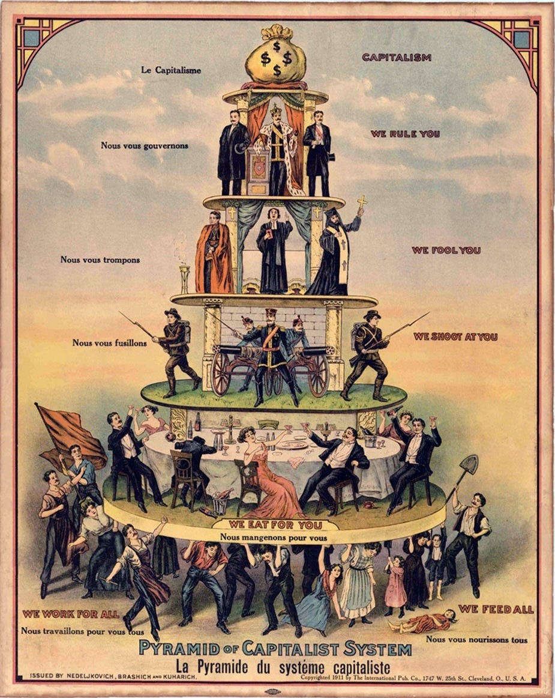
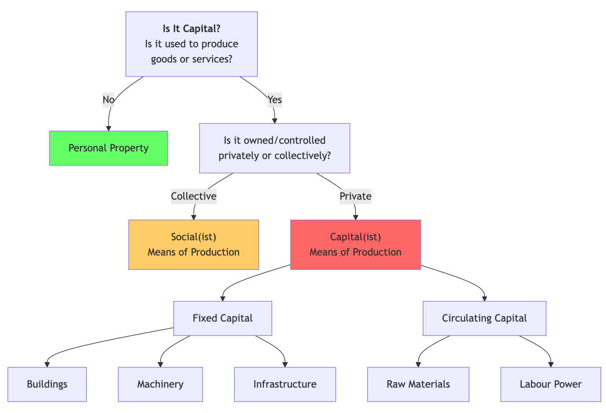
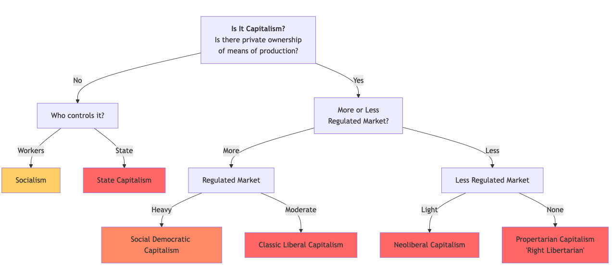

It seems that several times a week now I get told, ‘That’s not Capitalism’, ‘You don’t know what Capitalism is’, or ‘Capitalism really is this instead.’ I suppose it is my own fault for starting a regular series titled, ‘Reasons To Hate Capitalism’, and just presuming that everyone will know what the term means. Most do, but there are enough people taking exception to my use of the word that I feel I need to clarify the definition once and for all.

## Whence Came Capitalism?

Capitalism’s father was born on the 31st of December 1600, with the creation of the world’s first corporation, the English East India Company1, he laboured for a couple hundred years under the precarious situation of competing against Feudalism and the risk of his capital being taken by the king, until his only child, Capitalism, finally reached adulthood on the 24th of June 1846, when ownership and trade was opened up, and was no longer under the control of kings.

From the start Capitalism was inextricably tied to corporations and the state that incorporated them, because without this power capital could not be invested in or shared in the modern sense. Before this capital was held and lost at the potential whim of a monarch (or lords) under Feudalism. It could be argued that this situation continued until the ‘Glorious Revolution’ of 1688 when the Bills Of Rights was made law2 which enshrined modern property rights. However, for those who believe that Capitalism cannot exist without ‘free’ markets, then that date has to be moved later, to 1846, when the Corn laws were repealed which liberalised trade policies (and perhaps in America to 1863 with the end of slavery and plantations in the U.S.).

Of course many other movements contributed to the conditions which birthed Capitalism:

  * The rise of Venetian merchants (14th-15th centuries), which established advanced trading networks, modern banking systems, and created a new merchant class.

  * The European voyages of discovery and colonialism to the Americas, Africas and Asia (15th-16th centuries), which allowed the exploitation of new resources and lands for capital accumulation.

  * The Protestant Reformation (16th century), which created a new Calvinistic work ethic.3

  * The creation of Liberalism (17th-18th centuries), which justified the kind of individualism necessary for Capitalism to operate.4

  * & The publication of Adam Smith's ‘The Wealth of Nations’ (1776) which gave Capitalism its philosophical rationales and justifications (although it can be argued Smith was more of an observer and critic than supporter).

However, I would argue that it took the following for Capitalism to grow and survive in its early stages:

  * The International Africa / European Slave Trade (from 1518 when it was used for cross-Atlantic labour, until it’s end in the UK in 1807) - which gave it captive workers until wage labour became the norm. 

  * The English Enclosure Acts (18th-19th centuries) - which created a landless working class, inventing homelessness and insecure wage labour.

  * The Industrial Revolution in Britain (late 18th to early 19th century) - which moved from feudal rental / produce economy to a commodity one.

Thus it took a combination of factors, including major societal changes, to make Capitalism possible.

## What Is Capitalism - The Earliest Definitions

Like the words Socialism, Communism and Libertarian5, the word Capitalism was originally French: ‘capitalisme’ meaning ‘the condition of one who is rich.’ Capital meant significant owned property that could be profited off of, first used in the case of Medieval heads of cattle, and has the same origin as the word ‘chattel’ which means both transferrable property and the kind slavery in which people are property.6

In its original language, the term ‘Capitalism’ initially referred to the practice of individuals using their personal funds to purchase government bonds, especially for financing military conflicts. This concept implies that the system emerged from individuals having private control over financial resources. Michael Sonenscher in ‘Capitalism: The Story Behind The Word’ writes that ‘Its beneficiaries were its owners, while its victims were those without capital.’ Thus, the original conception of capitalism was fundamentally rooted in ideas about who possessed property and controlled wealth.7

It moved from being applied to what was owned to whom owned it, when British Anarchist William Godwin first spoke of ‘the capitalist’ in his influential 1793 book, ‘An Enquiry Concerning Political Justice’:

> ‘The higher and governing part of the community are like the lion who hunted in concert with the weaker beasts. The landed proprietor first takes a very disproportionate share of the produce to himself; the capitalist follows, and shows himself equally voracious. Both these classes, in the form in which they now appear, might, under a different mode of society, be dispensed with.’8

The initial use of the term ‘Capitalism’ in its modern sense is attributed to French Utopian Socialist Louis Blanc in 1850: ‘What I call “Capitalism” that is to say the appropriation of capital by some to the exclusion of others’.9

It was further popularised by French Anarchist Socialist Pierre-Joseph Proudhon in his 1861 book ‘War And Peace’: ‘Economic and social regime in which capital, the source of income, does not generally belong to those who make it work through their labour.’10

From these three definitions we learn that those who first used the word Capitalist and Capitalism understood it to mean that:

  *  **Capitalists** were a superfluous class, who take from workers through exploitation.

  *  **Capitalism** was an economic system in which capital does not belong to the workers, although they often create it or support it through their labour.

They all agreed that capitalists have privately owned capital, while workers do not, so workers are excluded from the benefits of owning and profiting from it. All of the men who gave these definitions were Socialists,11 and had the same basic understanding that under Capitalism that capital was owned by a few, instead of in the hands of workers and society in general as in Socialism.12

Perhaps because of its Socialist origins, for the first one hundred years of its existence of the word, capitalists didn’t use Capitalism to refer to themselves, or to the economic system they operated under. Then, by the early 1900s the word began to be used more widely, and it started appearing in non-Socialist dictionaries and encyclopaedias.

## Early 20th Century Definitions

One of the earliest examples of Capitalism being defined by a non-partisan source was the Chambers dictionary (at one time the official Scrabble dictionary), which in 1867 defined a capitalist as ‘one who has capital or money.’ Although it wasn’t until 1908 when it added the word, Capitalism, meaning, ‘condition of possessing capital: the economic system which generates capitalists’.13

Three years later, in Encyclopaedia Britannica’s famous 1911 edition, it defined capital in the economic sense as ‘the accumulated wealth either of a man or a community, that is available for earning interest and producing fresh wealth.’ However, it still did not define Capitalism.14

By 1913 Webster’s dictionary was defining capitalist as, ‘One who has capital; one who has money for investment, or money invested; esp. a person of large property, which is employed in business.’ However, it still did not include the word Capitalism, showing it still wasn’t in common usage in America.15

It took decades more for a distinction between private and public capital, and the association of Capitalism with a ‘free’ market came about, as economists broadened their own definition of what the term included. (Which we will look into in more detail in a future article.)

## Capitalism As It Was Once Defined

Using theses definitions, prior to the 1920s, these terms would have had this generally accepted meaning:

  *  **Capital** : ‘Accumulated wealth (or objects of wealth such as land and property) belonging to an individual or community, used to produce more wealth, by earning interest or other means.’

  *  **Capitalists** : ‘Those who possesses capital or money invested with the expectation of financial return, who uses their wealth in business or for generating more wealth.’

  *  **Capitalism** : ‘An economic system, characterised by the possession of capital, which produces or enables capitalists to own and use their capital to produce wealth.’

 _If we were to simplify this even further we’d say that capital was a money making machine, a capitalist was the one who owned the machine, and Capitalism was when society was organised around the ownership and operation of these machines (including most having to work on the machines to survive)._16

Back then, no one was arguing that it wasn’t really Capitalism if governments regulated some elements of the economic, or if capitalists formed cartels or received government contracts. They might have been criticised by their competitors for it, but it didn’t stop any of them being capitalists of the system of Capitalism from existing.

So how did the word go from being a negative term, to a neutral one, and then to capitalists and their supporters embracing and extending its definition?

How did it go from being associated with exploitation by its earliest definers to being associated with freedom by some on the right-wing of the political spectrum in the 20th century? This is a question I hope to answer in the next article in this series, ‘Capitalism According To The Philosophers’.

Subscribe

[Share](https://peacefulrevolutionary.substack.com/p/what-is-capitalism?utm_source=substack&utm_medium=email&utm_content=share&action=share)

Here is the second part of this series:

### Capitalism Series

If you liked this consider reading more of my [series on Capitalism](https://peacefulrevolutionary.substack.com/about#§capitalism-series)

1

The Dutch East India company started two years later, and the Virginia Company in America in 1606.

2

16 Dec 1689 to be exact.

3

As argued by Max Weber.

4

John Locke etc.

5

The word Socialism was created to differentiate those who believe in a social or collective systems and responsibilities, rather than Liberalism, which focused on individual rights (Conservatism was original a Liberalist philosophy). Communism meant a system organised around communes (rather than states, money or hierarchy). Libertarian meant Socialists who did not believe in a state (Left Anarchism).

6

<https://en.wiktionary.org/wiki/capital> & <https://en.wiktionary.org/wiki/capitalism>

7

Quotes from ‘Capitalism: The Story Behind the Word’, Michael Sonenscher, 2022.

8

In a latter chapter, he speaks of, ‘a capitalist, an idle and useless monopoliser, as he will then be found, to fatten upon his spoils.’

9

Organisation du Travail, 1851.

10

He first used the term capitalist 1840 in ‘What Is Property?’ using similar imagery to Godwin: ‘the robber, is the capitalist who takes all, who gets the lion’s share.’

11

There were notable contemporary female socialists, such as Flora Tristan (1803–1844) too.

12

Under Capitalism wealth is generated from capital for the small number who own it, with the majority of workers having to work for them to access some of it. Rather than every worker working for themselves and each other, and sharing the wealth under a Socialist arrangement. This kind of capital is sometimes called ‘the means of production’.

13

<https://en.wikipedia.org/wiki/Chambers_Dictionary#External_links>

14

11th Edition, Volume 5, which includes an entry on Anarchism by Peter Kropotkin.

15

<https://en.wikipedia.org/wiki/Webster%27s_Dictionary#1913_edition>

16

This is of course a simplified analogy, and a mine producing ore might be a better metaphor than a machine.
