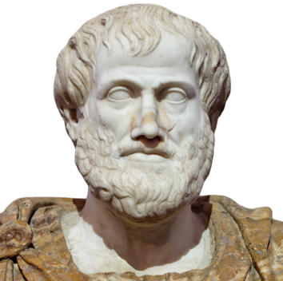
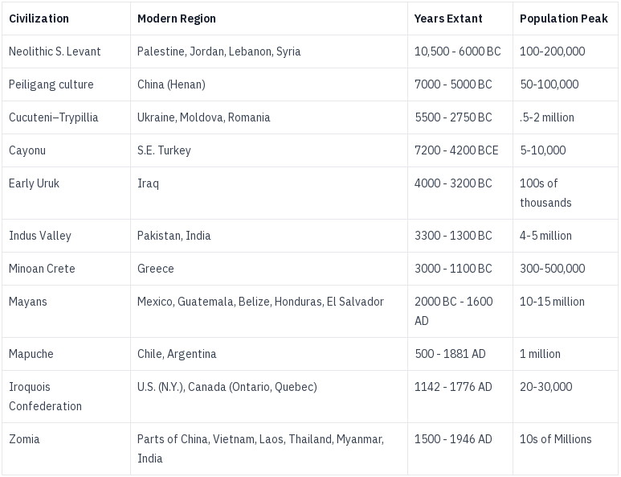
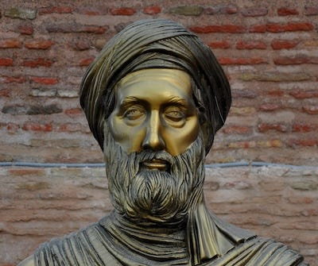
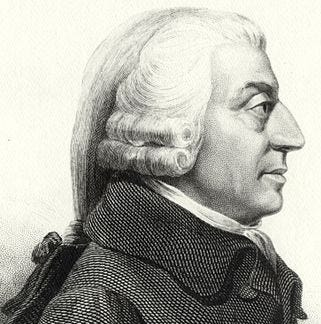
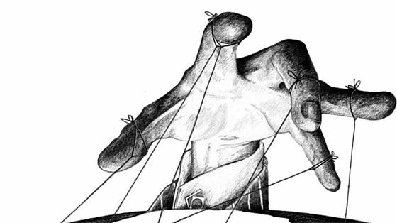

_This is the next in the series of ‘[What Is Capitalism?](https://peacefulrevolutionary.substack.com/p/what-is-capitalism)’. See the previous article for the origins of the term._

## The First Economists

Economics has been called the dismal science because, unlike the pure science of mathematics, it cannot produce reliable models, and is carried out by unreliable people. But this has not stopped economists from coming up with new theories about how economies should work, much like those coming up with new betting formulas, occasionally getting lucky, but usually ultimately losing their shirts in the process.1

The primary two candidates for the first economists are the 4th century B.C. Greek philosophers Xenophon and Aristotle. Xenophon in his work, ‘Oeconomicus’, discussed household management and the division of labour. While Aristotle examined concepts like property, trade, and money in ‘Politics and Nicomachean Ethics’.2

The value and use of slaves was common to both of their approaches. To Xenophon they were considered assets who needed to be treated strictly to maximise their productivity, to Aristotle they were necessary to the functioning of society, to enable the ruling class the leisure time to engage in philosophy.3

### Early Stateless Non-Money, Distributed or Gift Economies

Elsewhere in the world other civilisations took a less centralised approach to organising society, and their practiced their economics in a more needs based way, such as the Indus Valley and Minoan civilisations.4

The Greek and later Roman empires had a mixed economic system which involved trade, slavery and redistribution upwards, and this lasted until the downfall of the Roman empire in 476 AD, when a combination of over-reliance on trade, military expansion, economic stagnation, inflation, and increasing internal corruption, lead to fragmentation and a the fall of central authority.5

### The Transition To Capitalism

In the absence of a strong centralised empire, this power vacuum led to the rise of theocratic and monarchic systems, which dominated for five centuries, largely under the auspices of Catholicism.6 By the 9th century this began to be replaced by manorialism, which evolved into Feudalism, which was prominent until the 13th century.

While this was the story of Western Europe, elsewhere in the world other regions had their own cultural and economic journeys, as well as their own economists. In the Islamic world Ibn Khaldun, the 14th-century Arab philosopher was the most notable of these. He wrote about labour, production, and the role of government in his work ‘Muqaddimah’. Unlike our earlier Greek examples he did not advocate for slavery, yet still accepted it as a normal feature of historical societies.7

Although we often discuss history and regions in terms of their most predominant empires, there were always places and groups of people who pursued various social and economic experiments, some of which proved successful—at least until they were deemed dangerous by Popes or Kings. Notable examples include monastic and religious communes and co-operatives, such as the Taborites, Anabaptists and Mennonites, who sought alternative ways of living and organizing society based on their interpretations of faith and community. (One of these groups still lives communally today, five hundred years later).8

### Adam Smith, Father Of Capitalism

In the previous article we discussed the economic and philosophical precursors of Capitalism from the 1600s that ultimately led to it becoming the dominant system in the 1850s. One particularly prescient philosopher who saw the emerging elements of this new system was 18th century Scotsman Adam Smith, who would come to be called ‘the father of Capitalism’ himself.9 His seminal work, ‘The Wealth of Nations’ (1776), was the origin of many of the concepts we associate with Capitalism today. 

However, Smith never used the word Capitalism himself, because — as explained last time — it was invented later by Socialists to describe this newly emerging financial system. Instead of ‘capital’ Smith speaks of ‘stocks’, and instead of Capitalism he uses the term ‘commercial society’. This society, according to him, included (using more modern terms) private property, free markets, self interest, the profit motive, the labour theory of value, the division of labour, specialisation, a limited role for government (comparative to previous financial involvement under monarchy), capital accumulation, investment, and the invisible hand. 

Many of these ideas were new and still emerging when he first wrote about them, but they were all dependent on and inextricably linked to the existence of capital (or stocks as he calls it): 

> ‘… three portions, into which the stock of any individual may naturally be divided. These are, first, the immediate produce of the land; secondly, the produce which is presently in the hands of the original producer; and, thirdly, the produce which is stored for future sale or distribution.’10

As for the term ‘Invisible Hand’ Smith first used it negatively in his previous book, but later reused it to mean the unintended positive consequences that sometimes happen in competitive markets. The phrase was reused and given a new meaning by economist Paul Samuelson, who suggested that truly free markets are self-regulating systems that create economically optimal outcomes. This is something Smith definitely didn’t believe,11 and is a concept many modern economists reject, as Nobel Prize-winning economist Joseph E. Stiglitz, observed: ‘the reason that the invisible hand often seems invisible is that it is often not there.’12

#### Capitalism And Morality

Unlike later economists who stressed the amoral nature of economics, morality was very important to Smith, who wrote ‘A Theory Of Moral Sentiments’ several years earlier.13 Unlike his ancient predecessors, Smith was anti-slavery and tried to make the case that ‘free’ labour was cheaper than slavery. He also foresaw many of the possible immoral outcomes that could come from Capitalism and which he cautioned about.

Among his most savage criticisms were reserved for landlords, who he spared no love for, having created the term free market to describe a system free from them and rent, which had been the source of income under Feudalism. As he realised, ‘As soon as the land of any country has all become private property, the landlords, like all other men, love to reap where they never sowed.’ In fact he divided those under Capitalism into three classes: workers, capitalists, and landlords.

> ‘The whole annual produce of the land and labour of every country, or what comes to the same thing, the whole price of that annual produce, naturally divides itself, it has already been observed, into three parts; the rent of land, the wages of labour, and the profits of stock; and constitutes a revenue to three different orders of people; to **those who live by rent, to those who live by wages, and to those who live by profit**. These are the three great, original, and constituent orders of every civilised society, from whose revenue that of every other order is ultimately derived.’

Smith warned that the wealthy who wished to pay their employees as little as possible,14 had a tendency to try to influence government to adopt policies for their own benefit, against the interest of workers:15

> ‘[Proposals] come from an order of men whose interest is never exactly the same with that of the public, **who have generally an interest to deceive and even to oppress the public** , and who accordingly have, upon many occasions, both deceived and oppressed it.”

One of the major causes of this oppression he believed, was the existence of private (privatised profit making) property. Smith recognized that the concentration of wealth in the hands of a few inevitably led to social and economic disparities, creating a system where the rich could exert undue influence over society and government. This insight is particularly evident in the following quote:

> ‘Wherever there is great property there is great inequality. **For one very rich man there must be at least five hundred poor** , and the affluence of the few supposes the indigence of the many. The affluence of the rich excites the indignation of the poor, who are often both driven by want, and prompted by envy, to invade his possessions … **Civil government, so far as it is instituted for the security of property, is in reality instituted for the defence of the rich against the poor** , or of those who have some property against those who have none at all.’

#### State Intervention And Regulation

To mitigate the excesses and inequalities of Capitalism he suggested the need for state intervention and welfare, inventing what we might call Social Democratic policies.

  *  **Public Works:** ‘The third and last duty of the sovereign or commonwealth is that of erecting and maintaining those public institutions and those public works, which, though they may be in the highest degree advantageous to a great society …’

  *  **Public health:** ‘The prosperity and happiness of a country depends upon the health of its workers and its people. Cleanliness of streets, proper ventilation, and prevention of epidemics should be enforced by the government.’

  *  **Labour regulation:** ‘Whenever the legislature attempts to regulate the differences between masters and their workmen, its counsellors are always the masters. When the regulation, therefore, is in favour of the workmen, it is always just and equitable; …’

  *  **Progressive Taxation:** ‘The subjects of every state ought to contribute towards the support of the government, as nearly as possible, in proportion to their respective abilities; that is, in proportion to the revenue which they respectively enjoy under the protection of the state.’

Smith believed that while free markets were generally beneficial, certain regulations were necessary to protect the public interest and maintain economic stability. To those who opposed the idea of government regulation he had this to say, speaking of bank regulation:

> ‘Such regulations may, no doubt, be considered as in some respects a violation of natural liberty. But **those exertions of the natural liberty of a few individuals, which might endanger the security of the whole society, are, and ought to be, restraine** d by the laws of all governments, of the most free as well as of the most despotical. The obligation of building party walls, in order to prevent the communication of fire, is a violation of natural liberty exactly of the same kind with the regulations of the banking trade which are here proposed.’

#### The Dangers Of Capitalism

Quite prophetically he saw the end result of Capitalism as one in which people would earn just enough wages to barely survive. This grim prediction stemmed from Smith's observation of the power dynamics between employers and workers, and the tendency of wages to be driven down by competition in a fully populated country. He expressed this concern in stark terms:

> ‘In a country fully peopled in proportion to what either its territory could maintain or its stock employ, the competition for employment would necessarily be so great as **to reduce the wages of labour to what was barely sufficient** to keep up the number of labourers, and, the country being already fully peopled, that number could never be augmented.’16

Although the idea would be anathema to modern Capitalists, his solution to avoid such a situation was for corporations to make just enough profit to exist and no more. Smith envisioned a more equitable economic system where the pursuit of excessive profits would be tempered, leading to a more balanced distribution of wealth and preventing the concentration of economic power in the hands of a few. He described his ideal scenario as follows:

> ‘In a country which had acquired its full complement of riches, where in every particular branch of business there was the greatest quantity of stock that could be employed in it, as **the ordinary rate of clear profit would be very small, so the usual market rate of interest which could be afforded out of it would be so low as to render it impossible for any but the very wealthiest people to live upon the interest of their money**. All people of small or middling fortunes would be obliged to superintend themselves the employment of their own stocks.’

This vision of a more equitable economic system, where wealth concentration is limited and government plays a more active role in enforcing this, stands in stark contrast to the reality Smith observed in society, and which exists today. Back then the wealthy had their admirers and sycophants too, and Smith despaired over the tendency of people to admire the rich and criticise the poor:

> ‘This disposition to admire, and almost to worship, the rich and the powerful, and to despise, or, at least, to neglect persons of poor and mean condition, … is, at the same time, **the great and most universal cause of the corruption of our moral sentiments**.’17

Others went on to champion and expand Smith’s ideas, such as David Ricardo, Thomas Malthus, Jean-Baptiste Say and Alfred Marshall. They, like Smith, were primarily academics acting out of personal interest, and so their works were written for a scholarly audience, rather than to promote Capitalism to the general public. This approach would later change.

Following Smith’s landmark study which influenced so many, including Karl Marx, those who first used the word capitalist had their own ideas to share about this new system too. Capitalism also had philosophical competition from those who first coined the word, the Socialists, and in our next article we will see how they reacted to its establishment.

Subscribe

[Share](https://peacefulrevolutionary.substack.com/p/adam-smith-father-of-capitalism?utm_source=substack&utm_medium=email&utm_content=share&action=share)

See the next article in this series: 

### Capitalism Series

If you liked this consider reading more of my [series on Capitalism](https://peacefulrevolutionary.substack.com/about#§capitalism-series)

1

However, unlike those with gambling addictions, economists tend to lose other peoples money. The American government has employed an increasing number of economists with decreasing returns on their investment. 4,400 in 2022 in the federal government, and many others at the state and local level (and 1,800 in the UK).   
_Joke: How many economists does it take to predict a recession? None, because they will all deny there is one until it is half way through, then tell you afterwards how perfectly it fit their models._

2

Xenophon, 430-355 BC, Oeconomicus, after 401 BC.  
Aristotle, 384–322 BC, Politics, after 336 BC.

3

I resisted making a comparison with our current system in the body of the article, but I’m sure I’m not alone in noticing how similar that seems to our situation now.

4

See Anarchy In Action, [Anti-Authoritarian Societies](https://anarchyinaction.org/#Anti-Authoritarian), based on the book by Colin Ward, 1973.

5

https://en.wikipedia.org/wiki/Fall_of_the_Western_Roman_Empire

6

As this article is focused on Capitalism, which was a largely Western European invention, I have missed out the rich and interesting economic history of the rest of the world.

7

Ibn Khaldun (1332-1406), Muqaddimah, 1377.

8

The Hutterites, 1527 to the present. https://en.wikipedia.org/wiki/Hutterites

9

Adam Smith, 1723-1790. https://en.wikipedia.org/wiki/Adam_Smith

10

Adam Smith, The Wealth of Nations, 1776. Throughout, unless otherwise specified.

11

It is an idea I hope to return to in a later article.

12

Joseph E. Stiglitz, The Roaring Nineties, 2006. However, the ‘Invisible Hammer’ definitely does exist, as I’ll detail in a later article.

13

Adam Smith, The Theory Of Moral Sentiments, 1759.

14

‘The workmen desire to get as much, the masters to give as little as possible.’, Smith, Wealth, Ibid.

15

He recognised the tendency of them to form cartels: ‘People of the same trade seldom meet together, even for merriment and diversion, but the conversation ends in a conspiracy against the public.’, Smith, Wealth, Ibid.

16

When applied to state hierarchy this is called ‘The Iron Law Of Oligarchy’. Perhaps when applied to governments of the wealthy acting for the benefit of the wealthy it could be called, ‘The Iron Law Of Plutocracy’.

17

Smith, Theory, Ibid.
