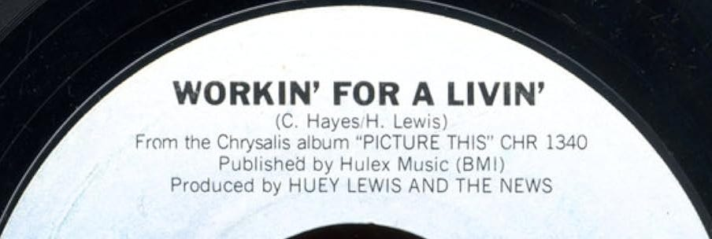
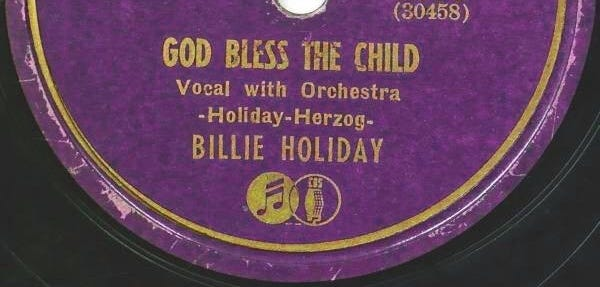
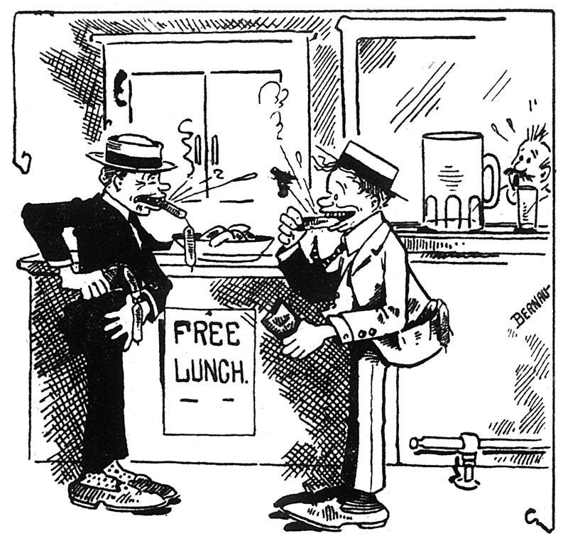
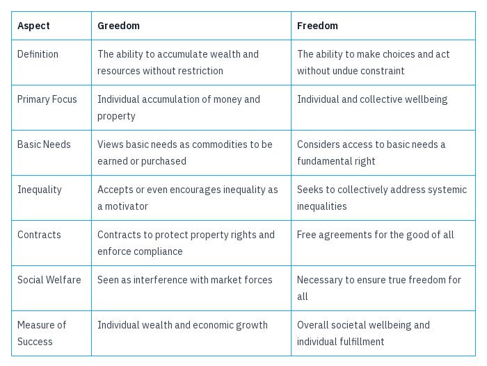

_After[my last article](https://peacefulrevolutionary.substack.com/p/the-moral-question) in this series on the moral imperative to care for others, I wrote [another articl](https://peacefulrevolutionary.substack.com/p/society-and-shoulds)e replying to objections someone raised to it. I had thought that would be enough to clarify the points I’d made, and hoped to skip straight to addressing how everyone’s needs should and could be met. But, in between I’ve received several responses in which people claim that the primary reason that most people suffer is due to their own bad choices. So I feel I need to address that fallacy more thoroughly first._

## Born Helpless

We come into this world naked and helpless and rely completely on the kindness of others, initially our mother and father, who must feed, clothe and shelter us (if we are not an orphan, in which case we may rely on the state, then adoptive parents, to do this). This transition from childhood dependence to adult self-sufficiency is not always smooth or equitable. While the government supporting sick or parentless children is generally accepted, the expectations for adults vary greatly across countries.

Adults may receive some help if they are unemployed for a short while, or longer if they are disabled. But such benefits tends to be a low amount to encourage people into employment or to penalise them for not working.1 Many on the right of the political spectrum have argued that even this meagre benefit should not exist, especially into adulthood, saying no-one deserves anything for free, least of all those who can work for it.

## What You Deserve

Some of the more economically conservative complain that:

> ‘We shouldn't give money to the unemployed, because they should work for it.’
> 
> ‘We shouldn't give healthcare free to the sick, because they should have got insurance.’

Sounds reasonable, doesn't it? It does to many. I've heard these sentiments many times. They reflect common beliefs about personal responsibility and merit-based success, and come with fundamental assumptions about human motivation and the structure of our economic systems. 

But, why doesn’t a person deserve to live whether they work or not? Why do they need to work for a living? Must people be motivated by starvation to want to work?

If we weren’t forced by the fear of hunger would we be left with fields full of rotting vegetables going uneaten, and people starving because people failed to harvest the crops? Is this really what would happen if people weren’t required to earn money to eat? Is this still true for someone’s work which isn’t remotely related to producing or distributing food?

## Working For What You Get?

Consider how individuals often view their own success and achievements. You may have heard them making statements similar to these:

> ‘I've worked hard and succeeded.’
> 
> ‘I've paid into insurance and had it pay out when I've needed it.’ (or ‘I didn't need health care because I made good choices.’)

No one would argue that these people have indeed worked hard, prepared for emergencies, and for all that they are to be congratulated. Their experiences have seemed to prove to them that by doing what was right they received what was good and fair, and they can't see why others couldn't have done the same. But would they think differently if their own experiences had been different? Would they come to different conclusions if they hadn't been so lucky?

People often have sympathy for children, realising that they cannot work and are reliant on others, but lose that sympathy the moment we talk about adults.

But none of us asked to be born, we didn’t have any choice in the matter, that decision was made for us. Now as adults the situations we have found ourselves in are - at least in part - because of the choice of our parents (or in some tragic cases not even then).

One child is born to rich parents and will never face hunger, another is born to poor parents and will know food insecurity most of their young lives. Some will argue they can just work harder or smarter when they are older, but the children of rich parents aren’t required to do this even when they become adults.2

Many people have children thinking they’ll be able to cover all the costs, and maybe their confidence is well placed and it is entirely possible, until they experience some sickness or where they work closes down, or the kind of work they do no longer carries the same value, nor pays the same as it once did. 

These are things over which the parents have no control over, even though they may have worked hard and did their best to prepare for such emergencies. But despite their best efforts they may remain stuck in their circumstances. Their children aren’t responsible for their parents bad fortune, but it still will decrease the chances of that child escape the poverty they have ended up in.

This cycle of poverty illustrates a crucial point in the debate between environment and choice. While individual choices certainly play a role, the environment into which one is born can significantly limit or expand the choices available.

## Genetics & Breeding

There was once a group of researchers who carried out a seemingly harmless social science experiment on young children. They put in front of them a piece of chocolate and said that if they waited for a little while – while the adult went way – they would get two treats. Then they left the children alone for five minutes and made a note of who gave into the temptation to eat the treats. Fast forward to ten, twenty years later and the children who waited turned out to be much more financially successful in life.

The researchers concluded from this that later success in life is about being able to resist gratifying your urges. You give into sin you pay the consequences. Right?

That’s what people thought. So some parents started testing their children themselves, and seeing if they could get them to wait longer. There were training programmes, parents conferences, and kids classes - at some cost of course - to help them and their kids with this process.

It seems so simple. Eat or do not eat the sweets. Those who have self control do better than those who don't. Don’t they? But there was a problem with study. They didn't mention one major factor: the wealth of the parents.

The kids in richer families were used to having treats available, or at least knowing it was possible for them to have them. The kids from poorer families didn't get treated as often, and rightly concluded that the treat in front of them was certain, as there was no guarantee of a treat later. It was really the financial environment that determined, not only their level of self control, but their level of success later in life.

Kids from richer families will tend to get better educations, better jobs due to better education and networking, have less exposure to some social problems and more association with others who are successful. Of course a much higher percentage of rich kids will do well than poor kids, they started life already much further ahead.

Wait a second you say, what about that one poor kid who became rich? Yes, it happens sometimes. But this is what is called the exception that proves the rule. The fact that it is an exception – that it isn't that common – proves that most poor kids will never become rich kids, and most rich kids will stay rich kids. This is because of the privileges they were born with.

This realisation challenges the notion that success is solely determined by individual choices or innate qualities. It raises questions about the fairness of a system where initial circumstances play such a significant role in outcomes. Some might argue that there are other factors at play, genetics3, or perhaps even divine intervention. But is this so?

## Divine Favour Or Privilege?

There are those who believe in a special system beneath or above the one we live in that will somehow always or eventually reward hard work, at least enough to meet all the needs of the person working hard. That somehow no amount of bad luck or tragedies will prevent the truly determined person from ultimately prospering. A simple look at inequality statistics, and a basic knowledge of mathematics, show this to be false. 

This belief in an infallible meritocracy can be seen as a modern form of faith, not in a traditional deity, but in what some might call the 'god of Mammon' - a system that supposedly rewards those who serve the market and produce profits. However, this belief often fails to account for the complex realities of privilege, luck, and systemic inequalities that shape individual outcomes.

Some will be lucky enough (combined with their hard work and the profitability of their skills) to get a well paid job, and to avoid unexpected ill health.

When people do succeed despite the odds against them they are held up as an example of, ‘look what can be done with some hard work.’

But hard work is not consistently rewarded, in fact it usually barely covers the bills (and sometimes not that). One need only look at sweat shop workers in third world countries who barely get a break, and work for pennies making many of the luxuries we enjoy.

## Environment vs Choice

It is a simple concept. If you lived in a place where there were lots of tornados then the poor houses would probably get blown away a lot more. They might try to build sturdier houses if they could afford them, but it also could lead to them building worse houses knowing that it was likely to blow away anyway. Might as well spend the money on something else you need right now.

So, how does this relate to morality? To what is ethically right or wrong in principle for us as individuals?

Let's broaden this to the specific circumstances someone is born into to answer this, and look at how that affects their life and choices, to see how a poor child’s circumstances relate to what is morally just and fair. This child:

  * Grows up in an orphanage.

  * Doesn't manage to get a college scholarship.

  * Has to get a student loan, and ends up with major debts that will take decades to pay off. 

  * Puts off getting married, until at least together they can afford an apartment. 

  * Puts off getting a house because his income after college barely covers his rent. 

  * Puts off having children, because they couldn’t afford childcare. 

  * Fails to save much for their retirement. 

Older people see this indebted, non-home-owning, single, childless person as someone just not working hard enough. Maybe if they are lucky and never get seriously ill then they may eventually get a house, spouse, kids, and even pay off their home and if somehow they still found money for retirement, then they may be lucky enough to be able to leave something for their kids. But most wont - statistically that dream is dead for most people but once upon a time it was achievable, so what changed?

The previous generation could afford a home because houses were much cheaper (proportional to their income), so the loans were smaller and the wages proportionally higher. They didn’t need to afford to pay for childcare, because they could afford for one parent to stay at home to look after the children. Their retirements were guaranteed by their lifelong job or better covered by the government. None of this is true now.

The problem isn't avocados and lattes, video games and streaming subscriptions. The younger generation now has proportionally lower wages, higher education, house, car and health costs, and higher prices for food etc. (although lower costs for some electronics, but you can't eat those).

So – theoretically speaking – a person now could work just as hard, have the same background, the same university degree, and make similar good choices, but start off further behind, and have further to go to obtain the same things, which their parents didn't have to work as hard or as long for. Is that just?

## Justice And Fairness In Society

By justice I don't mean the law specifically, although it applies to that too. The law claims to be unbiased and to not do any favours for the wealthy. It stops the rich sleeping under bridges just as much as it stops the poor doing so. It fines the poor $100 for speeding to work just as it does the rich man. Of course a rich man rarely has need to sleep under a bridge, and a rich man might find a $100 fine an inconvenience, but it isn't likely to mean he goes without food.

Let's take the orphan we mentioned earlier. He may ultimately be successful. He may make a good life for himself. Then through no fault of his own he is hit by a drunk driver, someone without insurance, someone who may be liable but is too poor to pay him anything.

The hospital may treat him in an emergency, in the first instance, but his health problems continue, affecting his ability to work, which affects his ability to keep a home, which affects his relationship, and he ends up homeless.

Such a scenario illustrates how quickly circumstances beyond one's control can derail even the most diligent efforts. It challenges our notions of justice and fairness in society. How do we reconcile individual responsibility with the reality of uncontrollable events?

In America such medical emergencies are the number one cause of bankruptcy, and often an indirect contributor to housing insecurity. But being hit by a car can happen to anybody, no matter how safely they drive, or even if they are pedestrian.

Every time you step out the door you are making a bet that you'll be safe from someone else. Nothing bad will happen to most of us, beyond getting caught in a traffic jam, or our car breaking down. The question is if you lost that bet - if something happened that wasn't your fault, that was beyond what your insurance or savings or family could cover or doctors could heal - what help would you hope would be available then?4

Someone who did everything right can still end up homeless and hungry, and if - driven to desperation - they steal a loaf of bread they become a criminal, because the system deems it less of a crime to let them starve to death than to take bread that might get thrown away. 

## It Is Designed This Way

The uncertainties the poor are born into do benefit a few people, those employers who benefit from their cheap labour to make a greater profit, who take advantage of their desperation to make their rich shareholders richer. Landlords capitalise on their precarious financial situation to rent them a run down apartment no one would chose to live in if they could afford something better, to put more money in the pocket of slumlords who live far more comfortably. Armies also rely on the poor risking their lives in the hope of escaping poverty, and should they get on the wrong side of the law and be sent to prison then they can be even cheaper slave labour for some corporation.

In this system employers see themselves as saviours, job creators, providing jobs without which their employees might starve, even though these employers don’t base their wages on how much their employees need to live and pay rent, but on how little they can get away with paying. But if we assume that corporations are job creators then we must accept that they are job destroyers too, and that they are unemployment creators. Because if they can produce the same profit with less workers they will terminate the employment of any excess workers no matter what that means for the workers. They even do this sometimes to drive down wages by dismissing well paid workers to replace them with cheaper ones, even if the new employees require two jobs to make ends meet, or even must claim government benefits to workers in order for them to afford to work, all to subsidise their corporate profits. But the employers children will probably never know such insecurity, as Billie Holiday observed lyrically:

> Them that's got shall get
> 
> Them that's not shall lose5

## I Earnt This

People used to use the term ‘self-made man’ to describe someone who was successful, often ignoring all the other people and privileges which put them in that position

Some people still boast about working hard to get where they are, and many of them probably did work hard and were rewarded for their hard work in their given field, but some overlook that there were often many other factors besides hard work that helped to get them there, and that didn’t work out for others who worked as hard but didn’t benefit from those privileges.

No one achieves anything major solely on their own, without having benefitted from innumerable advantages others have worked hard to provide and support. You have to go back to caveman days to find anyone who ever determined their own entire success by themselves, and even then they wouldn’t have enjoyed it long or very much without involving others. Back then only those who achieved success together survived long.

Individualism leads to death and destruction. Individualism is a luxury that requires a lot of other people to achieve. Pretending you alone did _this_ and you can succeed at _that_ on your own is a privileged position which ignores all those creating and supplying and maintaining everything that allowed you to claim you did something on your own. 

This myth of pure individualism overlooks the complex web of interdependence that underlies all human achievement. Even the most seemingly individual successes are built upon a foundation of collective effort and shared resources. Consider something as simple as baking a pie:

We take pride when we bake a good pie, and a good pie is indeed a wonderful thing, and I am grateful to anyone who makes one and shares it with me. But, a pie exists because someone grew the grain, someone milled the grain into flour, and someone delivered the flour to you. Yet even that wouldn't have happened if someone hadn't grown the food to feed the person who grew the grain, or built their house to shelter in, or cut the wood, or made the bricks for that house. Even when it comes to the grain itself someone else supplied the seeds, they probably used some implement or machine which involved mining ores, manufacturing the parts and assembling them. 

Of course for you to know how to make a pie, you had to learn it from your parents, or a teachers in a cookery class. Your needed people helping you grow up, keeping you safe, teaching you to read, and how to use kitchen implements. All of which was essential in the process of producing one tasty pie, which is far better to share to others than to try to eat it all yourself (and healthier too).

This example illustrates how even our smallest accomplishments are deeply rooted in a vast network of human cooperation and shared knowledge. It challenges the notion of the 'self-made' individual and reminds us that our successes are always, to some degree, collective achievements.

## No Such Thing As A Free Lunch?

We receive free things all the time. Nature gives us so many things freely that we enjoy: trees to decorate the planet, water to swim in, mountains to hike up. Those who lived before us provided us with roads to travel on, bridges and tunnels to go over and through, libraries and schools, hospitals and sports fields, churches and concert venues, and pubs to hang out with our friends and family in. Most of us think of these things in terms of the benefits they offer, rather than the focusing on the cost involved in building or preserving them.

The existence of these things helps us to live, but doesn’t provide a living for most of us. However, if we owned them then they might. ‘You have to work for a living’, we are told when it comes to having to meeting our financial obligation, paying bills, rent, and having to work for a living.

Yet the rich earn free stuff all the time: through inherited wealth, through interest, through people paying for access to what they have. There are some people who are so famous that restaurants would pay them to eat lunch at their expensive restaurant just for the publicity value, even though they could afford it more easily than most.

This is one of the central arguments of Robert Heinlein's ‘The Moon Is A Harsh Mistress’ is ‘TINSTAAFL’: ‘There Is No Such Thing As A Free Lunch’.6 However, there is such thing as a free lunch! Mankind survived for most of its existence by eating a free lunch. They hunted, gathered, planted and harvested where they wanted, and shared the bounty equally. Then some greedy men introduced cordoning off the ingredients of the free lunch, putting them behind a fence and guards, and charging to access them. While the greedy still eat a free lunch at others expense.

This situation exists solely to maintain the wealth of a few, and to maintain the structures that protect and empower them. This is why we must live in scarcity in a world which produces a surplus, not because it is necessary for the health and welfare of society, not because there is no other possible way, but because it is the only way accessible to these few people. Their freedom to amass wealth is considered greater (at least to them) than others freedom to eat. 

This prioritisation of wealth accumulation over basic needs has led to a distortion of the concept of freedom. One commentator on one of my posts called it 'Greedom' - a portmanteau of 'greed' and 'freedom' - to describe this phenomenon. Greedom encapsulates an idea of liberty that serves to justify the pursuit of excessive wealth, at the expense of the broader wellbeing of society.

This world is the the way it is because some invented artificial scarcity, and used the threat of starvation to coerce people into being serfs and employees. It's not taxes that stand in the way of free lunch, it's the rich, their corporations, their low wages, and us having to work for them at all. A better world is possible, but not without inconveniencing those hoarding most of the wealth and property.

Wouldn't it be great if we could be less concerned about where we'd get our lunch, and focus more on living a good long enjoyable life with our friends and families? 

## Greedom vs Freedom

 _The next article in this series will look at what it would take to have a society in which everyone was entitled to this level of human dignity, in which everyone was guaranteed what they need to live and even thrive._

Subscribe

[Share](https://peacefulrevolutionary.substack.com/p/the-myth-of-merit?utm_source=substack&utm_medium=email&utm_content=share&action=share)

This article is part of The Universal Entitlement Series:

### Entitlement Series

If you liked this consider reading more of the [The Universal Entitlement Series](https://peacefulrevolutionary.substack.com/about#§entitlement-series)

1

32 out of the 33 ‘developed’ nations offer universal health care, free college-level education, pensions, and state housing.

2

Neither do they have the long term healthy side effects of malnutrition or mental health challenges of growing up with such anxiety.

3

The term for this view is eugenics, or simply racism.

4

Of course it could have just has easily been some other bad luck. There might be a war and he is drafted. This is something that has happened in most generations, so maybe it happens to him too. Is he responsible if he gets injured? If it causes major mental health problems? (After all homelessness and suicide are much higher among ex-soldiers.)

5

‘God Bless The Child’, Billie Holiday / Arthur Herzog. Making the point that God seems to bless rich children more, just as Santa brings rich children better toys.

6

The Moon Is A Harsh Mistress, Robert A. Heinlein, 1966.
