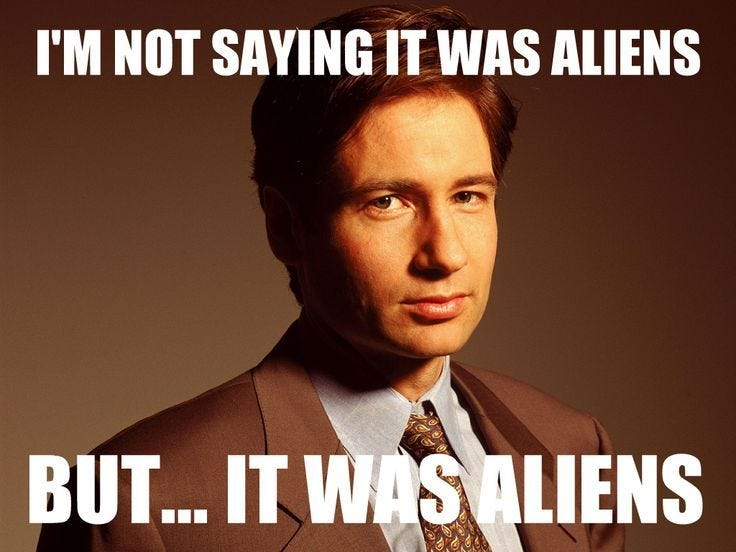
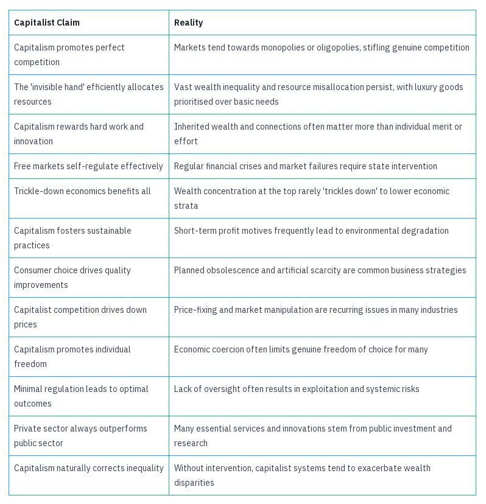
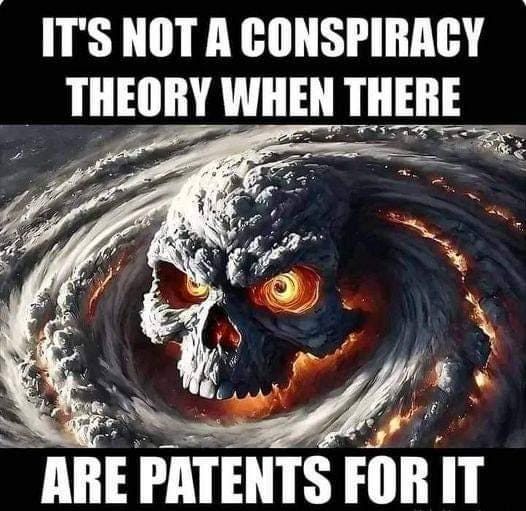
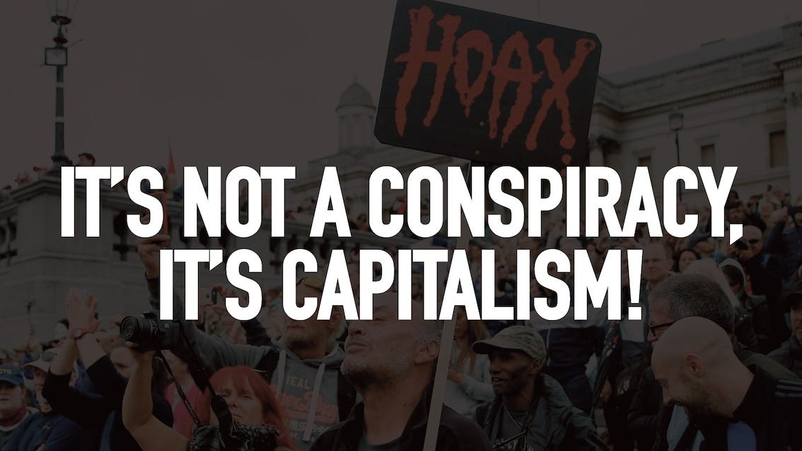
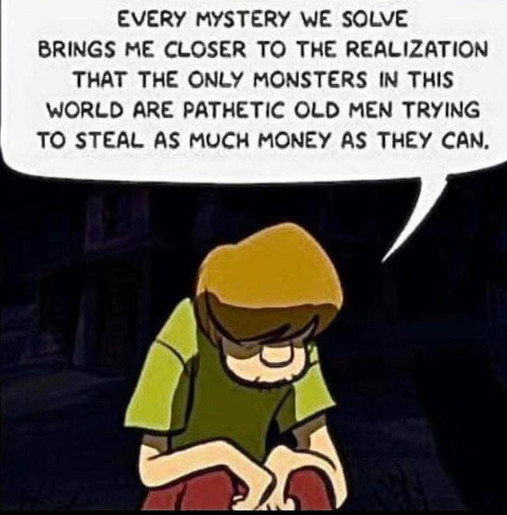
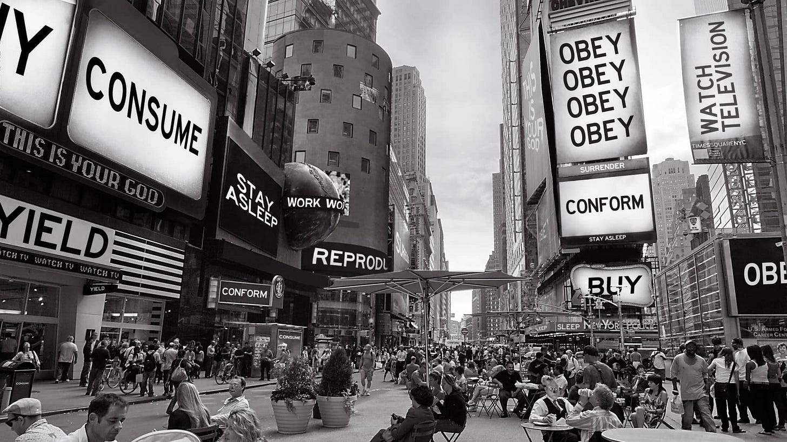
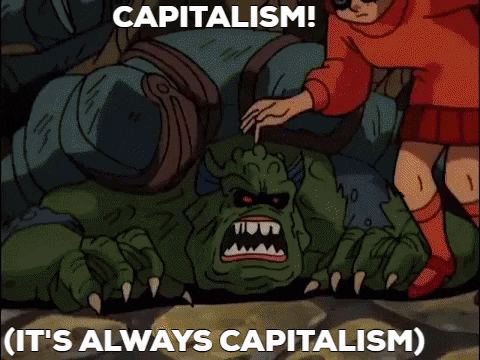

## An appeal to conspiracy theorists

Conspiracy Theorists - You are right! At least about the fact that there have been real conspiracies carried out by the government. The government itself has admitted that it lied about:

  * The effects of their atomic bomb tests on people nearby.

 _(Officially acknowledged in the 1990 Radiation Exposure Compensation Act.)_

  * The medical experiments they carried out on minorities.

 _(Tuskegee Syphilis Study: Officially acknowledged and apologised for by President Clinton in 1997.)_1

  * The experiments they carried out to try to brainwash civilians into being assassins.

 _(Project MKUltra: Officially acknowledged in 1975 during the Church Committee hearings.)_2

  * The extent to which they opposed the civil rights movement and attacked its leaders.

 _(COINTELPRO: Officially exposed in 1971 after activists broke into an FBI office.)_3

  * That they overthrew other peaceful democratic governments.

 _(1953 Iranian coup: CIA involvement officially acknowledged in 2013, although it had been widely known since the 1970s.)_4

  * The infiltration of the government into the media in the past.

 _(Operation Mockingbird: CIA influence on media was confirmed in the 1976 Church Committee report.)_5

You are right if you think you can’t trust corporations either. It is now widely accepted by historians that:

  * Corporations have killed striking workers to shut down strikes 

_(Coca-Cola’s violence against union leaders in Colombia in the 1990s.)_6

  * Corporations have hidden unsafe ingredients to keep making money.

 _(Johnson & Johnson knew about asbestos in its baby powder for decades. Revealed in 2018.)_7

  * Corporations have bribed politicians - although in the US and UK this is now legal.

 _(Citizens United v. FEC (2010) effectively legalised unlimited corporate political spending.)_

  * Corporations have plotted to overthrow governments.

 _(ITT's involvement in Chilean coup (1973): Admitted in 1976 Senate hearings.)_8

  * Corporations secretly supported repressive governments.

 _(Ford collaborated with Argentine military dictatorship (1976-1983))_9

From these examples we learn at least about these three things:

  *  **You can’t trust the government** , except to expand its power, and to let the favoured rich off the hook.

  *  **You can’t trust corporations** , except to try to sell you overpriced badly made crap and pay politicians to keep it that way.

  *  **You can’t always trust the media** , especially when it is owned by the rich and it is reporting on issues that may affect stock prices or upset the state, and there are limits to what it can and will cover.10

At the centre of all these claims is the idea that the the rich and powerful are conspiring against us. Fortunately for us, unlike some more dubious claims, this one is easily provable. This is the most important, most powerful conspiracy in the world today. It goes by the name of Capitalism. 

## Capitalism is the conspiracy

  * It’s not lizard people - if there are any they’re Capitalists too.

  * It’s not the freemasons - although many of them are Capitalists too.

  * It is not the deep state - those behind the state are Capitalists too.

Capitalism is the conspiracy, and the conspirators are well known, well funded, and well placed. We know who they are because they tell us. They know what their plans are because they tell us.

Capitalism could not exist without a conspiracy. It requires a network of support that involves threats, moral compromises, and even punishment, confinement, and occasionally death for those who won’t conform to it. It works hand in hand with the state to coerce and violently enforce this situation and silence dissenters, and it takes a government to guarantee the currency they created, to form the laws they enacted, and to maintain the borders of their country which we didn’t agree to be a part of.11

## A Real Conspiracy?

You cannot believe every conspiracy. You can try, but some contradict eachother, and some have been thoroughly debunked. So, when someone brings up a conspiracy theory to me personally I have four tests for finding out if it may be true:

  *  **Is it plausible?** \- Does it conflict with proven facts / is it likely / unlikely?

  *  **Is it possible?** \- Is it theoretically tenable?

  *  **Is it provable?** \- Has it been proven already or have provable claims?

  *  **Is it disprovable?** \- Would it be possible to disprove it if it was false?

### Plausible

Three hundred years ago philosophers didn’t sit around and think up a new system and call it Capitalism. It wasn’t the result of trying every other system and saying we’ve finally found the best system and it is Capitalism. Economists didn’t think to themselves, ‘do you know what would really help most of humanity? Having a few people with Capital get the rest of humanity working for them.’ 

Ethicists didn’t decide that it was in peoples best interest to remove others economic security, drive them off the land they live on, forcing them into factories,12 and make them work for poor wages, that barely pay the rent on the hovels they now have to live in. Yet promoters of Capitalism today expect us to believe that you can have wondrous results from a few people owning nearly everything.

Are Capitalist claims plausible? Or is it more plausible that a cartel of the wealthy is promoting what is in their best interests? The plausibility that Capitalism is a conspiracy is shown by the patterns of behaviour and outcomes in Capitalist systems. We see recurring financial crises, growing wealth inequality, and consistent prioritisation of corporate interests in policy-making. These patterns suggest a system that may be manipulated to benefit a select few, rather than functioning as a truly free and fair world.

### Possible

What makes Capitalism possible? It requires some people having exclusive control to certain valuable resources: land, minerals, housing, factories, and major patents. This requires a system such as a state to provide currency, police and prisons (or failing that private equivalents which is an even more scarier prospect).

Capitalism is only possible because of a complex systems of coordination and control that can be manipulated by those with power and wealth. The structures necessary for capitalism to function — financial systems, legal frameworks, and market mechanisms — provide ample opportunity for collusion and conspiracy amongst those who control these systems.

Yet Capitalism is not only possible, it is happening now, but only just, and only if Capitalists conspire amongst each other, with the state, and against the market. It can also only exist if you are willing to accept very dystopian outcomes for the majority. These outcomes will inevitably lead to the destruction of humanity if allowed to continue, so in the long term Capitalism isn’t possible, because Capitalism requires people to stay alive, and a finite planet able to somehow produce infinite growth. For it to work thus far has required a number of possible Capitalist conspiracies:

  1.  **Price fixing** : Cartels and tacit agreements between major players in industries to maintain artificially high prices, ensuring profitability at consumers' expense.

  2.  **Wage suppression** : Collaboration among employers to keep wages low, often through informal agreements not to compete aggressively for labour.

  3.  **Regulatory capture** : Corporations working together to influence government policy and regulations in their favour, effectively co-opting regulatory bodies.

  4.  **Tax havens** : A system of international financial secrecy and tax avoidance that requires cooperation between multinational corporations, banks, and certain states.

  5.  **Planned obsolescence** : An implicit agreement across industries to design products with limited lifespans, driving continuous consumption.

  6.  **Market division** : Cartels dividing markets geographically or by product type to reduce competition and maintain higher profits.

  7.  **Lobbying networks** : Coordinated efforts by industry groups to influence legislation, often in ways that prioritise corporate interests over workers or consumers.

  8.  **Media control** : Collaboration between major media outlets and corporate interests to shape public opinion and maintain the status quo.

  9.  **Suppression of labour movements** : Coordinated efforts between corporations and state actors to undermine unionisation and workers' rights.

  10.  **Bailouts and subsidies** : A system where the state rescues failing corporations, effectively socialising losses while privatising profits.

  11.  **Resource monopolisation** : Collaboration to control access to key resources, creating artificial scarcity and driving up prices.

  12.  **Intellectual property manipulation** : Corporations working together to extend patent protections or create patent thickets, stifling innovation and competition.

  13.  **Financial market manipulation** : Collusion among major financial institutions to influence market trends for their benefit.

  14.  **Education system design** : Collaboration between corporations and educational institutions to shape curricula in ways that produce workers suited to corporate needs.

  15.  **Trade agreements** : International treaties negotiated in secret that often prioritise corporate interests over national sovereignty or workers' rights.13

Don’t these seem possible to you? To me they seem certain. However, the challenge is when it comes to proving that they happen.

### Provable

You can believe in any unproven thing you want. You have that right. You might be right, you might not. Yet I wouldn’t stake my life on anything that was unprovable, and I would encourage you not to either. The provability of there being a Capitalist conspiracy comes from documented instances of collusion and manipulation. Some of the examples of this include:

  1. Price-fixing cartels:

    1. The Lysine cartel (1992-1995): ADM and other companies fixed prices in the lysine market.

    2. The Vitamins cartel (1990s): Involving BASF, Hoffmann-La Roche and others.

    3. The LCD panel cartel (2001-2006): Involving Samsung, LG, and other manufacturers.

  2. Corporate lobbying strategies:

    1. The 'Phillip Morris Papers': Leaked documents revealing tobacco industry lobbying.

    2. The American Legislative Exchange Council (ALEC) leaked documents: Showing corporate influence on legislation.

    3. The 'ClimateGate' emails: Revealing fossil fuel industry efforts to influence climate policy.

  3. Wage-fixing agreements:

    1. The Silicon Valley 'no-poach' agreements (2005-2015): Involving Apple, Google, Intel, and others.

    2. The Animation Workers antitrust lawsuit (2014): Against major animation studios.

    3. The Jimmy John's non-compete clause case (2016): Restricting low-wage workers.

  4. Financial market manipulation:

    1. The LIBOR scandal (2012): Involving multiple major banks.

    2. The Forex trading scandal (2013): Currency market manipulation by major banks.

    3. The Gold fixing scandal (2014): Involving Barclays and other banks.

  5. Regulatory capture:

    1. The Deepwater Horizon oil spill (2010): Revealing lax regulation of offshore drilling.

    2. The 2008 financial crisis: Exposing regulatory failures in the banking sector.

    3. The Boeing 737 MAX controversy (2018-2019): Highlighting issues with FAA oversight.

But, even without these specific unethical and often illegal actions, there is the fundamental nature of Capitalism itself:

Capitalism relies on a few having capital and many having none - it is a relationship of coercion and exploitation, as workers must sell their labour to survive,14 whilst essential resources and services are often privatised, restricting access based on ability to pay.15

Capitalism's primary goal is maximising profits, regardless of the wasteful production and consumption patterns this creates, which often conflicts with social and environmental well-being. Short-term profits frequently undermine long-term sustainability and social good.16 This includes externalising environmental and social costs onto society rather than bearing them.17

The system tends to reduce everything, including human needs and natural resources, to marketable commodities.18 It relies on creating and manipulating desires, often at odds with genuine human needs and well-being.19

To return to the conspiratorial nature of Capitalism: The system naturally leads to the accumulation of wealth in fewer hands over time, corrupting political processes to the point where most new laws are written by corporate lobbyists and the votes of the public have no statistical bearing on government policy.20

#### Follow the money

To discover the source of any conspiracy you need only ‘follow the money’. It always leads to who is financially behind the conspiracy, that is if you can trace it back through shell companies, money laundering, and tax havens.

The rich would love for you to think its not them behind this (or any other) conspiracy. They actually pay influencers, public relations firms, and own news media to spread the idea it’s not them (or divert attention away from them), then they laugh all the way to the bank when you believe their lies.21

It is perhaps no accident that at the end of every Scooby Doo episode that the Mystery team uncover that the real monster who is almost always either someone who is already rich or seeking to be so. Likewise, following the money always leads back to Capitalists and Capitalism.

This is why you can't trust the rich who are promoting crazy conspiracy theories either, they are the same people who head the corporations, pay the politicians, and own the media.22 They are just trying to distract you, and can often make even more money out of you paying attention to their disinformation too.

### Disprovable

When it comes to how you might disprove that Capitalism was a conspiracy, the disprovability lies in demonstrating that Capitalist systems are good and could function without collusion or conspiracy. 

However, if Capitalism were functioning as its proponents claim, we might expect to see:

  * Genuine free market competition without monopolies or oligopolies.

  * Equitable distribution of wealth based on merit and innovation.

  * Responsive markets that efficiently allocate resources to meet societal needs.

  * Corporate behaviour that consistently prioritises long-term sustainability over short-term profits.

  * Regulatory systems immune to corporate influence.

  * Economic growth that benefits all sectors of society equally.23

The absence of these outcomes confirms that Capitalism is a conspiracy, while their theoretical possibility keeps the idea disprovable. Perhaps unsurprising, Capitalist sponsored economists say all of this it isn’t true. Who would have guessed that those who make a living from defending Capitalism disagree with any criticism of it?24

#### If Capitalism Was Good

So if Capitalism were good, and you wanted to disprove that Capitalism is bad how would you prove it? If Capitalism is a good system it would have good outcomes. One way to prove Capitalism is good would be to show that it makes everyone better off. You could claim that Capitalism has made poverty go down over time. This claim was a popular headline-grabbing story in the early 2010s. 

Using the the International Poverty Line the World Bank discovered that if you only used the part of the graph which covered those earning $1.90 per day (in 2011) per year - those earning less than they needed to live - then the number of people leaving poverty had actually increased (although almost all that growth happened in China, and not Western Capitalist countries). Wonderful news! (At least for the Chinese)

However, as Anthropologist Jason Hickel later pointed out, if we use a more realistic poverty line of about $7.40 per day (as the United Nations suggests the number should be), we see that the number of people living in poverty has increased since 1981, rising from 3.2 billion to 4.2 billion in 2018.25

But the World Bank still managed to convince some people with no statistical academic qualifications like Steven Pinker and Bill Gates, who promoted this erroneous idea in the press, and luckily (for proponents of Capitalism) most of the press didn’t fact check it, and many of the public heard the positive version of the news in the corporate media and took it for granted that it was true.

However, if even if it were true that somehow $1.90 was enough to live on and that this increasing was progress, then it would still mean that at the current rate it would take about 300 years for Capitalism to end poverty, possibly after the death of billions, and probably after the earth become uninhabitable, but that’ll be nice if it does happen then wont it?

As some of even the economists who defend it admit, Capitalism is at best an amoral system,, but one which always inevitably leads to immoral outcomes:

  * If Capitalism were good, would it try to kill anyone who tries anything else? (especially when it seems like alternatives might succeed)

 _See: The CIA-backed coup in Chile in 1973, which overthrew the democratically elected socialist government of Salvador Allende, leading to the installation of the Pinochet dictatorship._

  * If Capitalism were good would it have to indoctrinate kids that it is the best and everything else is evil? 

_See: The prevalence of corporate-sponsored educational materials in US schools, such as McDonald's-branded nutrition curriculum or Chevron's energy education programme, which present capitalist perspectives as objective facts._

  * If Capitalism were good would it have to hide all the deaths and sickness it causes? 

_See: The tobacco industry's decades-long campaign to suppress and discredit research linking smoking to cancer and other health issues, as revealed in the 1998 Master Settlement Agreement._

  * If Capitalism were good would they have to invoke God as approving of their system? 

_See: The rise of the ‘Prosperity Gospel’ in American Christianity, which equates financial success with divine favour, effectively sanctifying capitalist pursuit of wealth._

  * If Capitalism were good would they have to redefine words like freedom and good to make them fit? 

_See: The use of ‘right-to-work’ laws in the US, which, despite the name, primarily serve to weaken labour unions and workers' collective bargaining power._

  * If Capitalism were good would it have to use propaganda to tell lies about any other systems? 

_See: The Red Scare campaigns in the US during the Cold War (and recently among the Republicans), which exaggerated and distorted the threat of communism to justify capitalist policies and suppress leftist movements._

  * If Capitalism were good why would they pick the worst examples of other systems - especially the ones they did everything to sabotage - and try to convince people they are the only examples. 

_See: The frequent citation of Venezuela's or Cuba’s economic crisis as a failure of socialism, while ignoring the role of US sanctions, oil price fluctuations, and specific policy mistakes unrelated to socialist principles._

There is a word for a system in which people can go hungry or even starve when there is a surplus of food, in which people can be homeless when there is a surplus of housing, and in which people can die of preventable and curable diseases in one richer region while in another poorer one they would have been saved. That word is: evil!

## Real vs Fake Conspiracies

Whether man walked on the moon, or whether the moon is made of cheese, might be uncertain, but we can be certain that if Capitalists can make money from the moon by selling it’s free cheese for a profit they’ll do so, even if people are starving here on earth for lack of lunar dairy products.

We have already cited many Capitalists conspiracies that later came to light, here are a few others that historians now accept:

  *  **Teapot Dome Scandal** (1921-1922): U.S. Secretary of the Interior Albert Fall secretly leased federal oil reserves to private oil companies in exchange for bribes.

  *  **Plot to overthrow FDR** (1933): A group of wealthy businessmen allegedly planned a coup to replace President Franklin D. Roosevelt with a fascist dictatorship.

  *  **Tobacco Industry** (1950s-1990s): Major tobacco companies conspired to hide the health risks of smoking from the public, despite internal knowledge of its dangers.

  *  **Sugar Industry** (1960s-1970s): The sugar industry funded research to downplay the link between sugar consumption and heart disease, instead blaming it on fats in food.

  *  **Ford Pinto** (1970s): Ford Motor Company knowingly sold Pinto cars with dangerous fuel tank defects, determining it was cheaper to pay settlements for deaths and injuries than to fix the problem.

  *  **Oil Industry** (1970s-present): Oil companies, including ExxonMobil, conducted early research on climate change but then funded climate denial campaigns to protect their interests.

  *  **Fleet Street Phone Hacking** (1990s-2011): British tabloid newspapers, particularly those owned by Rupert Murdoch, engaged in widespread phone hacking to obtain stories, leading to a major scandal and public inquiry.

‘By their fruits shall ye know them.’26 These are the fruits of Capitalism. Capitalism is what all these scandals and all the negative outcomes we’ve mentioned have in common.27 So next time you hear a politician or influencer or news anchor talk about: 

  * ‘Illegal’ immigrants & Welfare ‘cheats’ (to distract you from the largest group not paying their taxes: the wealthy.)

  * Nasty ‘foreigners’ & their bad countries (to distract you from corporations having overseas sweatshop factories).

  * Stories stoking fear of your neighbours (to get you to support corporations and the state cracking down on protest and the poor).

  * Those ‘evil’ ungodly Socialists, Communists or Anarchists (to get you not to question the system that keeps people wealthy and in power).

Or if you see seemingly positive news about:

  * A good politician, who’ll save the country (who’ll sell you down the road to corporations as soon as they get into power).

  * Salacious celebrity news (who are promoting useless wasteful products).

  * Good cops who help kittens out of trees (while evicting poor families from their homes and making them homeless).28

Don’t forget that:

  * Corporations steal more money from you than all types of other theft.29 Their profits could be your wages.

  * They made you pay student loans to go after the educated.30 Your training - which you paid for - creates their profits.

  * They made laws against drugs to go after black people and the Left, and then created private prisons to get cheap slave labour for the corporations.31 Your choices become their business when it comes to harming or helping their shareholders.

If you think there is a conspiracy, a cabal of Capitalists, whether secret or not, there is no better way to dismantle it than remove the source of their power: money, capital and hierarchy.

Remember that powerful people want you believing fake conspiracies, that the real conspiracy is always the rich and powerful against the poor and powerless. Remember who is paying for positive news stories and sycophant economists, and what they don’t want you to focus on: them and their wealth and power, and the system that makes it possible: Capitalism.32

 **Choose the good - Choose Anti-Capitalism.**

### Capitalism Series

Part of my series on Capitalism: 

  * [What Is Capitalism](https://peacefulrevolutionary.substack.com/p/what-is-capitalism)

  * [The Father Of Capitalism](https://peacefulrevolutionary.substack.com/p/adam-smith-father-of-capitalism)

  * [The Real Conspiracy: Capitalism](https://peacefulrevolutionary.substack.com/p/the-real-conspiracy-capitalism)

  * [The Real Cost Of Capitalism](https://peacefulrevolutionary.substack.com/p/what-are-the-real-costs?r=25vj2b)

  * [The Capitalist Empire Strikes Back](https://peacefulrevolutionary.substack.com/p/the-capitalist-empire-strikes-back-284)

  * [How Capitalism Co-Opted Christianity](https://peacefulrevolutionary.substack.com/p/how-capitalism-co-opted-christianity)

  * [Are We Property?](https://peacefulrevolutionary.substack.com/p/are-we-property)

  * Also see [I, Pencil, The True Story](https://peacefulrevolutionary.substack.com/p/i-pencil-the-true-story)

Subscribe

[Share](https://peacefulrevolutionary.substack.com/p/the-real-conspiracy-capitalism?utm_source=substack&utm_medium=email&utm_content=share&action=share)

The next article in this series is here: 

If you haven’t read it already and would like to learn more about the history of Capitalism:

### Capitalism Series

If you liked this consider reading more of my [series on Capitalism](https://peacefulrevolutionary.substack.com/about#§capitalism-series)

1

Also the Guatemala syphilis experiments: Officially acknowledged and apologised for by President Obama in 2010.

2

Also Operation Midnight Climax: Acknowledged as part of the broader MKUltra revelations.

3

Also FBI surveillance of MLK: Partially revealed in the 1970s, with further details acknowledged over time. In 2017, the FBI released its full archive of materials on King.

4

Also the 1954 Guatemalan coup: CIA involvement officially acknowledged in 1997 with the release of declassified documents. 1973 Chilean coup: US involvement gradually acknowledged through document declassifications, notably in 1998-2000.

5

Also the Sinclair Broadcast Group: Forced local stations to air pro-Trump content. Revealed in 2018.

6

Also Chiquita’s involvement in the 1928 Banana Massacre in Colombia, and admitting to paying Colombian paramilitary groups in 2007.

7

Also Monsanto (now Bayer) suppressed information about the health risks of glyphosate. Revealed through lawsuits in 2018-2019.

8

Also the overthrow of Hawaiian monarchy in 1893, led by American businessmen, including those involved in the sugar industry. Business Plot (1933) conspiracy by businessmen to overthrow FDR. 

9

Also IBM supplied technology to Nazi Germany. Acknowledged in 2001. HP supplied biometric technology to Chinese government for surveillance. Reported in 2020.

10

Although I do believe there have been heroic examples of reporting too. It is beyond the purpose of this article to cover them, here is a list of some significant ones:

  * Watergate Scandal (1972-1974): Bob Woodward and Carl Bernstein of The Washington Post

  * Pentagon Papers (1971): Neil Sheehan of The New York Times

  * Thalidomide Scandal (1960s): Harold Evans of The Sunday Times

  * Abu Ghraib Prison Abuse (2004): Seymour Hersh for The New Yorker

  * Panama Papers (2016): International Consortium of Investigative Journalists

  * Cambridge Analytica Scandal (2018): Carole Cadwalladr for The Guardian and The Observer

  * Catholic Church Sexual Abuse Scandal (2002): Boston Globe Spotlight Team

  * Windrush Scandal (2018): Amelia Gentleman for The Guardian

  * The News of the World Phone Hacking Scandal (2011): Nick Davies for The Guardian

  * Tobacco Industry Expose (1990s): Lowell Bergman for CBS's 60 Minutes

11

See my article: [Countries & Borders](https://peacefulrevolutionary.substack.com/p/countries-and-borders)

12

I am of course talking about The Enclosure Acts.

13

I’m leaving those reading this to look up the particular evidence for each point, as some of it is already covered in the first section of this article.

14

Consider the prevalence of zero-hour contracts in many countries give employers maximum flexibility whilst leaving workers with little job security or reliable income, forcing them to be constantly available without guaranteed work.

15

The privatisation of water services in England and Wales in 1989 led to significant price increases, with water bills rising by 40% in real terms over the following decade, making access to this essential resource more difficult for low-income households.

16

BP's cost-cutting measures and inadequate safety protocols, driven by profit motives, led to one of the worst environmental disasters in history, the Deepwater Horizon oil spill in 2010.

17

Companies like Primark or H&M produce cheap, disposable clothing by outsourcing production to countries with lax labour and environmental regulations, effectively shifting the true costs of production onto workers and the environment.

18

The US healthcare system treats basic health needs as market commodities. This results in millions of Americans being unable to afford necessary medical care, with medical debt being a leading cause of personal bankruptcy.

19

Companies like Apple and Samsung create artificial obsolescence and manipulate consumer desire for the 'latest' model, despite minimal improvements, leading to wasteful consumption.

20

In the US, oil and gas companies spent $124.4 million on lobbying in 2022 alone, consistently delaying effective climate action despite overwhelming scientific evidence of its necessity.

21

There is a good reason why you don’t see more negative stories about Robert Murdoch: Murdoch's News Corp owns numerous influential outlets worldwide, including Fox News, The Wall Street Journal, and The Sun. Likewise, Jeff Bezos, Amazon's founder, owns The Washington Post.

22

The Sinclair Broadcast Group, owned by the wealthy Smith family, controls a large number of local TV stations across the US. 

23

I don’t think any of these are possible for long within Capitalism because of its terrible record in these areas, but Capitalists and their proponents could at least make a good faith effort if they are trying to convince us Capitalism can be good.

24

I plan on covering corporate sponsored economists and economic departments in more detail in a future article. But one modern group of Capitalists behind this are the Koch brothers, who have donated millions to universities and think tanks to promote free-market ideologies.

25

https://www.academia.edu/33476429/Is_global_inequality_getting_better_or_worse_A_critique_of_the_World_Banks_convergence_narrative

26

Jesus, Matthew 7:16.

27

Of course there have been conspiracies in which there has been no profit to be made too, but have furthered the power of the state carrying them out.

28

There may be the occasional kitten loving cop, but ask them if they’d evict a family and make them homeless if told to, and then you’ll really find out who they serve.

29

In the US, a 2017 study by the Economic Policy Institute estimated that employers steal around $15 billion annually from workers through minimum wage violations alone. The Tax Justice Network estimated in 2021 that countries lose $483 billion in tax revenue annually due to global corporate tax abuse.

30

The 1980 Postsecondary Student Assistance Amendments under Reagan's governorship in California marked a shift from grants to loans. As president, Reagan's 1981 Budget Reconciliation Act eliminated social security benefits for students and restricted Pell Grant eligibility.

31

John Ehrlichman, Nixon's domestic policy chief, admitted in a 1994 interview that the War on Drugs was designed to criminalise Black people and hippies. The 1986 Anti-Drug Abuse Act created vast disparities in sentencing between crack and powder cocaine, disproportionately affecting Black communities. The prison population in the US grew from about 300,000 in 1980 to over 2 million by 2000. Private prisons expanded rapidly in the 1980s and 1990s, with companies like CCA (now CoreCivic) and Wackenhut (now GEO Group) profiting from increased incarceration. Federal Prison Industries (UNICOR) reported sales of $531 million in 2019, with inmates earning as little as $0.23 to $1.15 per hour.

32

There may of course be some reporters who love light hearted news stories, and the news should have some, but not to the detriment of using them to hide the truth.
