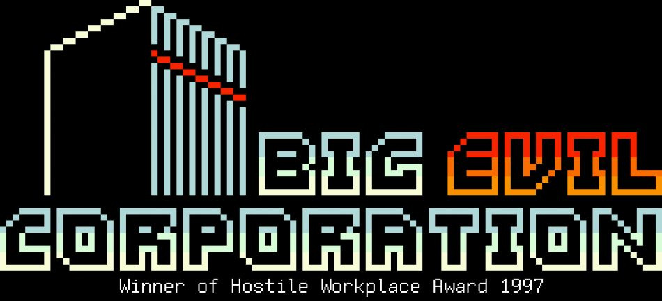
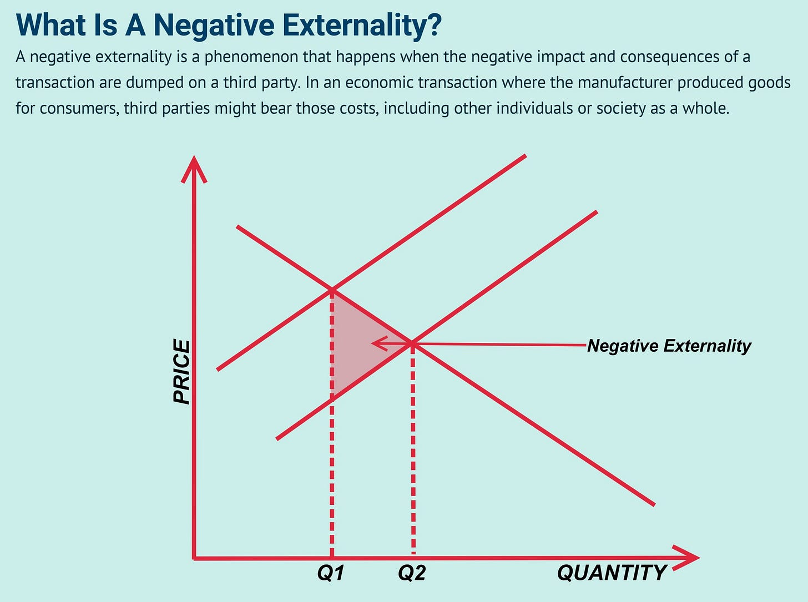
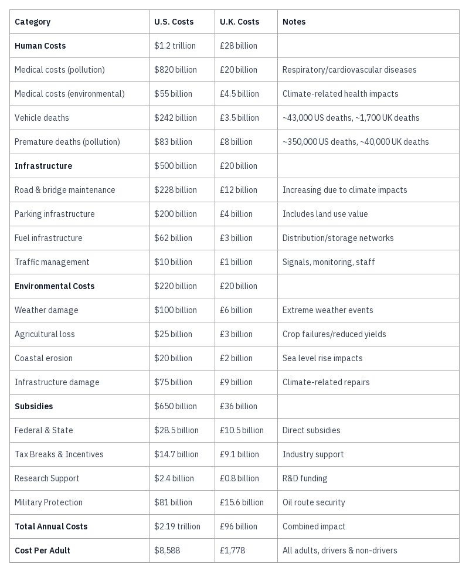
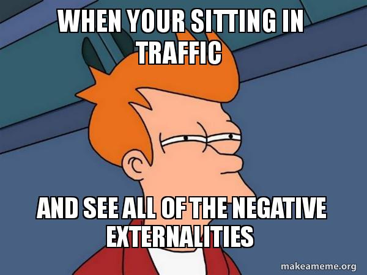
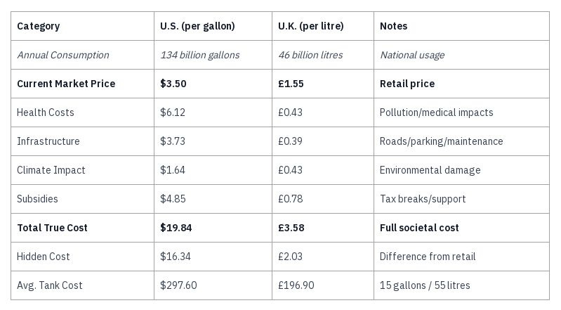
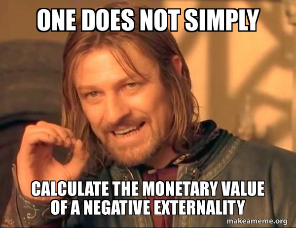
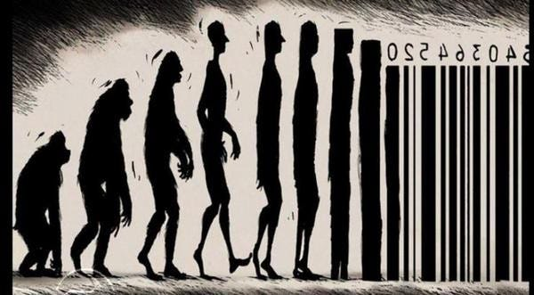

_In my last article on the[Conspiracy Of Capitalism](https://peacefulrevolutionary.substack.com/p/the-real-conspiracy-capitalism) I only briefly mentioned why the human costs of Capitalism are so much higher than what you pay for it’s products and services. In this article I focus on a particular example of how serious this issue is and how badly it affects all of us._

Everything you do has the potential to affect others. This can be a wonderful thing. If you are kind you might make someone’s day. If you are charitable you might save someone pain. If you are fair you help uphold justice. If you are sweet you help bring light into someone’s life.

Some call this good karma, with the opposite being bad karma.1 Likewise if we are unfriendly we might make someone feel rejected. If we criticise someone harshly we might make them feel insecure. If we shout angrily at someone we might make them afraid. Even if we ignore someone they may feel less valued.

Could this kind of karma be as true for corporations as it is for people? Could they contribute toward the good or bad in the world? Especially as they may employ tens of thousands of people, and may have millions of customers.

## What Good Could A Corporation Do?

One example is that of SC Johnson, the maker of Saran Wrap, which in a rare move for a large corporation, voluntarily stopped using Polyvinylidene chloride due to environmental and health concerns. This shift made the product safer, but reduced its cling and they lost a substantial market share to their competitors.

Stories like this are as heart warming as they are rare. For every rare CEO who defies their shareholders to do the right thing, there are dozens of other examples of industries that know they are poisoning people and the planet who carry on doing so at great profit. An example of this is the Bhopal disaster in which a pesticide leak at a Dow Chemical (then Union Carbide) factory in India killed as many as 20,000 people.2

 _Note: When speaking about corporations I am not talking about small sole traders, family businesses, and charities that have a legal corporation for the purposes of taxation. These are not my concern. It is the large for-profit corporations that own substantial capital and use it to produce substantial profits for their owners and shareholders, and the negative results that come from this._

Let’s look at another example. Many healthcare insurance companies made substantial donations to Barack Obama’s election fund, despite him promising a public healthcare option in which the government would have competed directly with their services. This seemed directly opposed to their financial interests.

However, when Barak Obama became U.S. President he dropped the public option, despite having a majority of politicians being from the same party as him in government, something which usually allows a President to pass bills and laws with little opposition.

We may never know exactly what happened in the interim, but would it be unreasonable to wonder that - in return for their generous donations and continued support - the President stayed on the good side of the corporations by not keeping his promise, and allowing them to keep their profits?

 **So, the real question is: ‘Can a corporation ever do more good than they do evil?’**

Non-profit corporations were invented to ensure that charitable institutions like hospitals could be supported by generously minded benefactors, without the liabilities of other kinds of business. Governments intended that this power would never be given to profit-making businesses, because of the lack of liability, and the potential for their corrupting influence on the state. Yet when England found itself unable to govern India without the help of the British East India company they had to concede corporate status in order to get their assistance.3

Corporations have had the power from the beginning to influence states and have often done so, even as far as convincing them to overthrow other governments to make them more friendly for investment (in the form of low paid works and cheap materials.)

On one continent, a fossil fuel corporation plants trees; across the ocean, their pollution destroys forests. In disaster zones, they distribute water bottles; during the Super Bowl they pour more money into advertising their generosity. At press conferences, they announce withdrawals from anti-abortion states, claiming they are doing so to support women’s rights; behind closed doors, they donate to the campaigns of anti-abortion candidates. In wealthy nations, they fund life saving care; in developing countries, they finance death squads targeting union leaders. _(All real examples!)_

Is the evil they do far outweighed on the moral scales by the little good they perform? (Which is usually for the benefit of free publicity or tax breaks.) What if corporations had to pay for their human and financial costs that they pass on to us?

## Externalities

The costs that corporations pass on to consumers are called Externalities. For example if you buy a water bottle and have to dispose of it the cost of that disposal is usually covered by your local city if you use a public trash can / rubbish bin, or perhaps by you personally if you pay for your refuse collection. Some states and countries try to cover this cost through extra charges, or by leveraging a special fee or tax upon the corporation producing disposable products.

In the case of fossil fuels, most states do the opposite of holding corporations liable for their pollution: they actually subsidise it! If drivers had to pay the full cost of a gallon of gas / litre of petrol almost no-one could afford it. Let us look at what some of those costs passed on to consumers are:4

### The Real Cost Of Cars

 _Before anyone misses the point and says, ‘I’m not paying $8588 / £1778 on gas per year!’ These amounts are what you are paying on top of what you are already spending on gas, but it isn’t all coming directly out of your pocket. Much of this amount is coming out in the form of taxes, higher prices you pay on other goods and for other services, and in the form of lost wages converted to extra profits for the gas companies, or passed on as extra expenses for others. So think of it as extra money you’d have each year, if the gas companies weren’t taking it from you in other ways, and on top of what you already pay them for gas._

These are generalised costs, to give a more detailed example - the negative health effects of fossil fuels include:

  * Respiratory problems from asthma to lung cancer.

  * Cardiovascular diseases from heart attacks to strokes.

  * Birth Defects and Reproductive Issues.

  * Water Contamination and Related Health Risks.

  * Neurological Effects.

  * This is not including the health effects of the increase in climate disasters and unhealthy conditions due to climate change brought about by the burning of fossil fuels.

Instead of the government having the fossil fuel producers cover these costs, they are covered through a combination of taxes in the areas where the government deals with the costs directly, or they are paid for individually by members of the public directly. This leads to a situation in which:

  * Non-drivers subsidise drivers despite not benefiting directly.

  * Lower-income people often subsidise higher-income car owners.

  * Public transport users double-pay (subsidising roads while paying fares).

  * Rural residents typically subsidise urban infrastructure more per capita.

  * These costs are largely hidden.

 **The Real Cost At The Gas Pump**

If you were to have all of this paid for taxes then those who didn’t drive might object, and the full cost might be put on the price of gas at the pump instead. To work out how much this would cost you would look at how many gallons were used and divide the cost down to per gallon:5

So we see that the market price represents only 18-25% of true costs, with 75-82% of the real costs being passed on to people in other ways and through other means, so that the true cost ends up being nearer $20 a gallon (£3.60 a litre). This may price some out of being able to afford the same level of driving as before, and so costs may be even higher.6

### Unquantifiable Costs

All of these costs are only estimates, if anything they are likely to be even higher in some categories. This also doesn’t cover unquantifiable costs such as:

 **Community Fragmentation**

  * Physical division of neighbourhoods (& often racial division) by major roads.

  * Reduced social interaction and community cohesion.

  * Loss of public gathering spaces and street culture.

 **Health and Wellbeing Impact**

  * Reduced physical activity due to car dependency.

  * Mental health effects from noise and stress.

  * Limited children's independence and development.

 **Economic Distortion**

  * Property devaluation near major roads.

  * Decline of local high streets and small businesses.

  * Shift to car-dependent out-of-town retail.

 **Environmental Degradation**

  * Habitat fragmentation and biodiversity loss.

  * Multiple pollution types (water, soil, light, microplastic).

  * Urban heat island effect from excessive paving.

 **Public Space Loss**

  * Conversion of green spaces to parking.

  * Demolition of historic buildings for road widening.

  * Reduced space for cultural events and activities.

People often talk about the loss of community cohesiveness between the 30s-50s and now, and yet the car is rarely held up as the cause. Television and tribalism may play their part, but I’d argue that: the creation of suburbs, out of town shopping, bussing and driving kids to schools in other areas, getting food from far off industrial farmer instead of local ones, and long commutes play as large a part in our society becoming more fractured and lonely.

There is no way that using gas at the rate we do know would be feasible if the corporations or even governments were directly responsible for these costs, and even if they did cover them the human costs and dangers to humanity are already too high to justify everyone having a car, and continue to structure our whole world around the use of them.

This isn’t just true of cars but of much of the disposable, wasteful, and harmful products made by corporations. I personally believe that if corporations were a form of medicine (and people directly saw the harm they do) we’d have to ban them for their horrifically deadly side effects, if they were a machine we’d have to destroy them because they eat people’s lives and defecate on the world with poison. _Or at least that’s how I see it._

## Commodification

So what is the solution? What would stop this from happening?

At the moment our economic system works by taking things which are natural and freely available from nature (albeit sometimes with some mining, digging, or drilling involved), claiming exclusive access to them, and selling them back to consumers. This is commodification, and is fundamental to the existence of Capitalism.

For most of mankind’s history food was not a commodity, even for most working people it wasn’t a commodity 300-600 years ago and before. Before the advent of Mercantilism and Capitalism workers rarely if ever saw money or needed to use it to buy food. It tended to only become a commodity if bought and supplied to soldiers (and even then armies often stole it as part of their invasions).

Commodification is why you pay a utility bill to access water even though nature supplies it. Of course the water company would argue that they add value by treating the water and delivering it, although these same companies have also pushed at times for laws to make collecting rain water illegal. They also oppose community owned water treatment and distribution which is far cheaper, because without their commodification of that essential resource they wouldn’t make any profits.

Some countries have nationalised utilities and others have privatised ones. In some cases the costs are similar, due to nationalised countries spending more on infrastructure and safety. So in such cases you could argue that - unlike gas - the price they pay for water is the real price. Yet privatised systems ultimately charge 35% more on average and have lower water quality (in order to generate more profit for shareholders).

 **Decommodified Water Examples**

  * Kerala, India: Community-owned water systems

    * 30% lower costs

    * Better maintenance

    * Higher quality

  * Uruguay: Constitutional right to water

    * Banned privatisation

    * Universal access achieved

    * Costs reduced by 40%7

Like water, gas is another natural commodity, and like water is one that is processed and refined, usually by private companies who have exclusive rights over it in specific regions. Gas remains integral to individual transport via car and the transport of goods via trucks and container ships.

If you were to try to construct a Capitalist solution you would have to pass the true cost of gas on to the consumers directly, it would mean that only the richest could drive a car, or even buy many other conveniences we are all used to having access to, and which we require in order to work to pay our rent and bills. This - I believe - is beyond the cost of humanity to pay financially and environmentally. For this reason (and many others) I believe Capitalism is too unsustainable to continue on for long as it has been, and that we need another solution.

### Decommodification

So what would be my solution? Make gas free!

I admit that is a gross oversimplification of my position designed to get your attention, although it is basically true: If we de-commodify gas, water, and whatever else we rely upon in the world; If we detach the drilling for, refining, and distribution of gas from the need to make a profit and make shareholders richer; If we distribute it where it is essentially needed, and treat it as a the potentially dangerous substance that it is (transported by potentially dangerous vehicles); If we rearrange our infrastructure to use more efficient ways of delivering goods, getting to and doing work, and accessing our needs; Then we will need very few cars and far less gas, and will save the world in the process.8

Let’s presume that under such a system there are still monetary costs and they are part of the equation. What would a comparison of one alternative, rail, be to the current car and road system:

 **Transport Mode Costs Comparison**

  * Infrastructure costs: Rail 60% lower

  * Maintenance costs: Rail 55% lower

  * Environmental impact: Rail 75% lower emissions

  * Land use: Rail needs 1/3 space

  * Capacity comparison:

    * Single rail track: 50,000 people/hour

    * Highway lane: 2,500 people/hour

  * Safety comparison:

    * Rail: 0.15 deaths per billion passenger miles

    * Road: 7.3 deaths per billion passenger miles9

If we look at a couple countries that decommodified transport we can see the benefits easily:

  * Luxembourg: Free public transport nationwide

    * 70% reduction in car usage

    * Improved air quality

    * Reduced inequality

  * Tallinn, Estonia: Free public transport

    * Increased mobility for low-income residents

    * Reduced car dependency

    * Generated net economic benefits10

Cities built around communities rather than out of town shopping and far off offices are why half as many Europeans have or need cars, and why their public transport networks tend to be far more extensive, efficient and well used. In places like London or Paris, unless you are making deliveries or need a vehicle to carry your tools, then a car is a liability, and almost always more expensive and slower than public transport. Even though the U.K. and France could still do far better, it shows that a city can have tens of millions of people who still get about mostly on foot, and yet can access everything they need easily and quickly.

It take a massive human costs, even substantial human deaths, for everyone to have a car and cheap gas, and it will ultimately cause the extinction of humanity if we allow it to continue as it has been. 

_I plan on covering the practical aspects of the transition to a decommodified & decentralised world more in future articles._

Subscribe

[Share](https://peacefulrevolutionary.substack.com/p/what-are-the-real-costs?utm_source=substack&utm_medium=email&utm_content=share&action=share)

### Capitalism Series

If you liked this consider reading more of my [series on Capitalism](https://peacefulrevolutionary.substack.com/about#§capitalism-series)

1

This is an oversimplification of the concept, but a popular one for speaking of the consequences of actions.

2

They paid about £2400 for each person killed in compensation before whatever went to lawyers.

3

Not forgetting that it was also in its financial interests to do so.

4

U.S. Figures:

  * Medical/pollution costs: EPA's ‘The Benefits and Costs of the Clean Air Act’ reports.

  * Vehicle deaths: National Highway Traffic Safety Administration (NHTSA) annual reports.

  * Infrastructure costs: American Society of Civil Engineers (ASCE) Infrastructure Report Card.

  * Subsidies: International Monetary Fund (IMF) ‘Global Fossil Fuel Subsidies’ reports. 

U.K. Figures:

  * Health costs: Public Health England's air quality reports.

  * Road maintenance: Department for Transport annual statistics.

  * Environmental costs: Committee on Climate Change reports.

  * Infrastructure: National Infrastructure Commission assessments.

5

The U.K. figures do not use gallons due to British gallons being a different size than American ones. UK costs lower per unit due to: Better public transport, stricter regulations, higher fuel efficiency standards, denser urban development.

6

Please let me know if you see any inaccuracies in these figures or the calculations related to them - they are meant to broadly show that the real costs are substantially higher than the ‘price at the pump’. However, I suspect these figures are underestimates of some of the costs, and leave out some related costs entirely.

7

Kerala's community water systems study by the World Bank's Water and Sanitation Program, Uruguay's water system reform: 2004 constitutional amendment and subsequent studies by the UN Human Rights Council. _Note: The World Bank punishes countries financially who do this, which is one of the reasons there aren’t more examples of it._

8

EVs, while better, still don't solve many infrastructure/social costs costs between different transport modes (rail vs road) - EV Infrastructure/Social Costs:

  * Still require massive road infrastructure

  * Parking requirements remain unchanged

  * Battery production has significant environmental impact:

    * Mining (especially lithium and cobalt)

    * Child labour in mining operations

    * High water usage in extraction

  * Tire and brake dust pollution remains

  * Electricity production still often fossil fuel-based

  * Community severance issues unchanged

  * Urban sprawl encouragement continues

  * Traffic deaths/injuries remain similar

  * Most social costs (community fragmentation, etc.) unchanged

9

U.S. Department of Transportation data on rail vs road capacity and safety statistics, European Environment Agency comparative emissions data, The International Union of Railways (UIC) efficiency comparisons.

10

Luxembourg: Ministry of Mobility and Public Works data since implementation in 2020, Tallinn: European Commission mobility studies.
