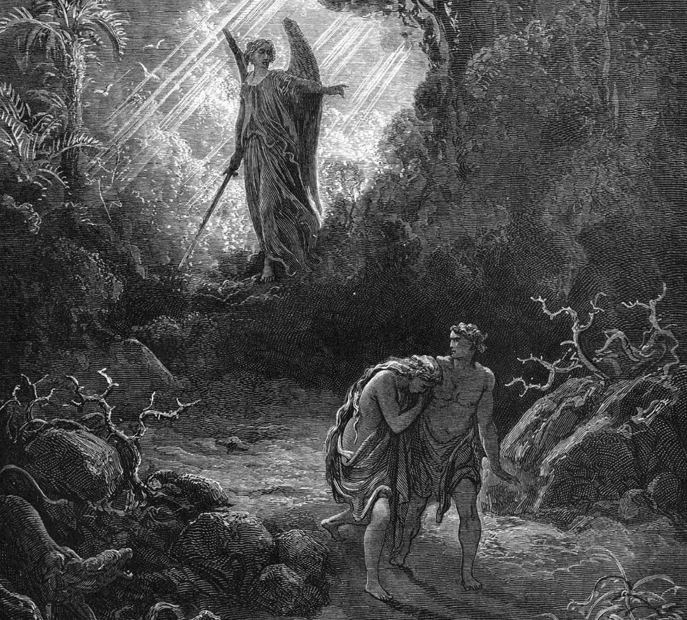
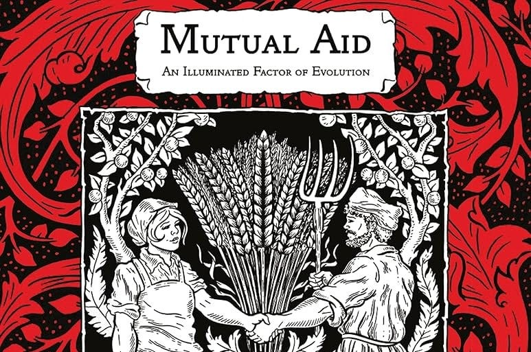
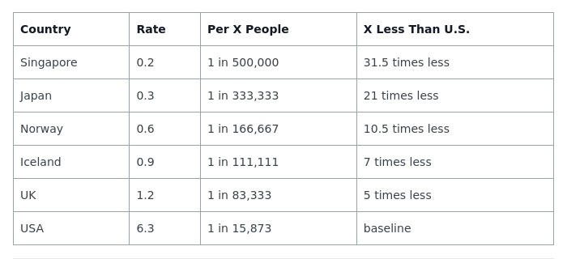
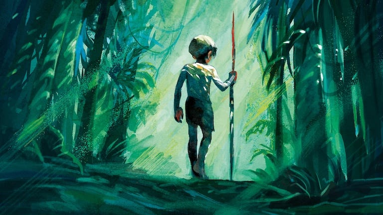
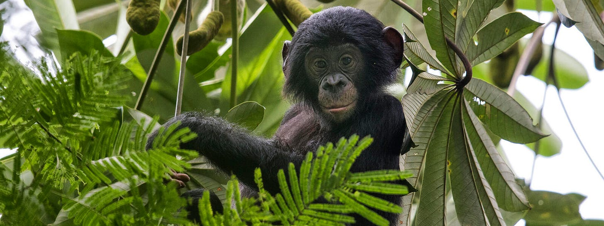
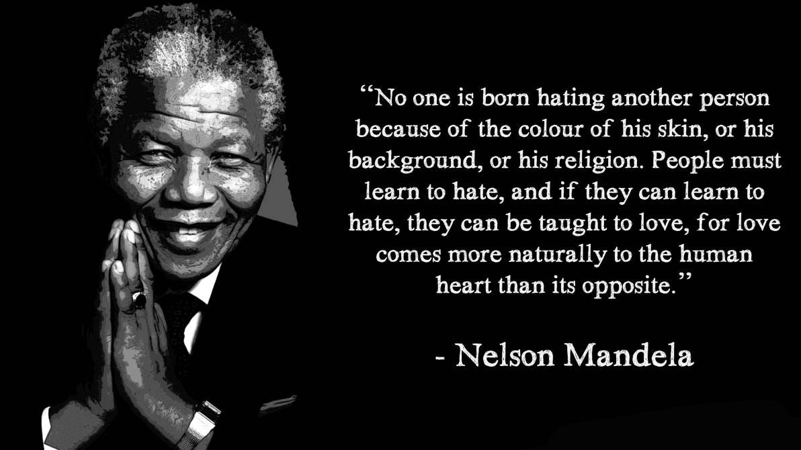

_Before we can achieve a world without rulers we need to see that people are capable of cooperating_

As the classic essay by David Graeber, ‘[Are You An Anarchist](https://peacefulrevolutionary.substack.com/p/are-you-an-anarchist-the-answer-may)’ shows us, most of us most of the time in our day-to-day lives are already acting like Anarchists, without needing to be compelled to do good. Any time we: Wait our turn when we’re in a line, even if we might get away with pushing past others; Take part in teams, clubs or organisations which work together, don’t require rulers, and come up with expectations together; Believe two wrongs don’t make a right and you should do unto others as you would like them to do unto you; In other words, if we put fairness above selfishness, and put doing good freely above being forced to do so, then we are an Anarchist.

However, realising you might be an Anarchist, and thinking Anarchism is possible for the rest of the world is a whole other question. We know that we can be nice, that we can co-operate, that we don’t want to rule over our neighbours, but what about others? Isn’t that asking too much of them? Is that even possible? Well - believe it or not - you might already believe in some of the ways in which Anarchism can work at a larger scale.

## Two Views Of History

People come to the question of what is possible for society often based on what they think society has usually been like. If we presume that humanity has been naturally or commonly violent, we may expect humanity to always be inevitably violent. If we presume that humanity is inherently - or has usually been - co-operative, we may expect humanity to have the capacity for positive change.

You can discover a lot about the assumptions a person starts with by asking simple questions such as, ‘Do you consider babies to be born inherently evil?’

Many people will be horrified at the question at all, at the idea that a child could be held responsible for anything bad, let alone be anything but innocent of evil. However, for a substantial part of Western history, and still for a significant number of people, the idea that babies are born evil and remain evil throughout life is an essential principle of their religious beliefs.

Although Christianity has long had a complicated issue with the concept of ‘original sin’1 and how it affects us, we have a theologian named John Calvin2 to thank for the idea that people are incapable of doing any good from the moment they come into the world. We might think that this belief has had no impact on us if we don’t share that belief, but for the last almost 500 years it has had a profound influence on monarchies and parliaments, universities and children’s schools, and philosophers and scientists.

Hardly an aspect of our culture has remained untouched by this basic assumption of humanity’s natural evil and selfishness. This has led to a legacy of laws and punishments based on this idea about people which exist to the present day, and still affect government policies and peoples assumptions about each other.

### The State Of Nature

This idea of people being inherently evil made its way into popular philosophy, even sometimes among those who were only nominally or not at all religious. It was presumed to be a fact and this ‘fact’ led to all sorts of conclusions. One of the most influential proponents of the idea that people were naturally bad and had to be controlled was Thomas Hobbes.3

He viewed humanity’s ‘state of nature’ as a war of all against all, and believed that strong authority was necessary to restrain humanity's worst impulses. He presumed that this must have always been the case since the beginning of humanity, and that before the advent on monarchies our lives must have been ‘Solitary, poor, nasty, brutish, and short’. This became the prevailing view of history, and still is for many to the present day. Without evidence, he used this presumption to justify rulers sometimes having to be ‘nasty’ and ‘brutish’ too in order to keep order and keep in line their subjects worst impulses.

This view had its wholehearted supporters, as well as those who accepted his assumption of selfishness and people needing to be controlled, but responded to it with a slightly softer view, such as John Locke, who argued for the necessity of a government of those with property to regulate society. Despite their differences they both believed humans needed to be controlled by their betters, with their betters being those who have managed to obtain and maintain power (whether that was by crown or capital).4

These assumptions, considered ‘common sense’ during Victorian times in British intellectual circles, even found their way into science, or at least the conclusions drawn from scientific theories and discoveries. One famous example of this is, Thomas Huxley's5 famous ‘gladiatorial theory of existence’ which mirrored both Hobbesian and Calvinist views, with his ideal of human’s ‘natural savage impulses’ cemented the idea of ‘survival of the fittest’ as meaning the competitive survival of those strongest or most ruthless.6

In believing and teaching this Huxley inadvertently smuggled Protestant theology into evolutionary theory by assuming competition rather than mutual aid as the primary natural force, and taking competitive social relations for scarce resources as ‘natural’ rather than constructed. Darwin himself, in his Theory of Evolution, never offered such a conclusion, but this idea came to be associated with it, and even make its way into the most egregious form of pseudo-science: eugenics, which led to horrific atrocities such as those committed by the Nazis.7

### Co-Operative Evolution

This view, however, didn’t go unchallenged by other biologists and philosophers. One example of both was the evolutionary biologist and revolutionary, Peter Kropotkin, who rejected his princely upbringing to study science and ultimately oppose hierarchy in all its forms. In his influential study, ‘Mutual Aid, A Factor Of Evolution’8, he found that his observation showed a natural world in which co-operative species succeeded more often and more effectively than competitive ones.

A century later, notable biologist Stephen Jay Gould vindicated Kropotkin’s conclusions9, and it is now generally accepted that co-operation is indeed a factor in evolution, and that empathy plays a part in the social life of different species.

However, it has only been in the last few decades that Anthropologists and Archeologists, such as David Graeber, James C. Scott, David Wingrow, and others have re-examined the remains of ancient humans, and the history of human behaviour, have reached very different conclusions from Hobbes from the evidence they have found: That co-operation and altruism was a primary factor in early human behaviour, and continued for tens of thousands of years across different long lasting civilisations. This led one biologist to label the findings as ‘Survival of the Nicest’.10

## Causes Of Violence

 _What role does Capitalism play?_

Nevertheless people are still human, and there are always a few people who are violent and hurt other people. That is inevitable right? Maybe it is, but in some places less people are violent, so those places must be doing something different. While other places where many more violent people are either doing something wrong, or failing to do what they could be to stop such violence.

 **Homicide Rates**11

Is it more reasonable to believe that Americans are born thirty times more violent than babies in Singapore, or does that seem likely that it is the American culture, systems, influences, and incentives which make an America child grow up to be more violent?12 Surely, if it is possible to reduce violence in one culture, then it is possible to change the culture of another place to reduce that violence.

What makes some of the Nordic and developed Eastern Asian countries so less prone to violence? How are they different from America?13 Here are some things the less violent countries all have in common:

  * Robust social welfare support systems

  * Universal healthcare access

  * Low levels of homelessness, high levels of state housing

  * Extensive public transport

  * A strong cultural emphasis on collective wellbeing

Most of these countries also have relatively low income inequality, except Singapore, but it still has very high social welfare (including 80%+ living in government-built homes).14

Is it any wonder that when people grow up well fed, living in a secure home, and don’t face insecurity and fears in these areas as adults, that they have better mental health and are less likely to act violently? Could it be that being part of a culture in which people are more concerned about each-other’s welfare, rather than focused on their own survival or success, also contributes to better outcomes? That seems the most likely explanation to me.

A world with some violence may be inevitable, but most violence is largely predictable. Preventable violence makes up the largest majority, its causes can be mitigated, and it can be reduced substantially.

### Inherently Violent?

This raises the old nature verses nurture questions of: 'Are we all inherently violent?' and 'Is it only society which quells or exacerbates our violent urges?' But it isn’t certain that we are all born with a predisposition to violence, even if that has been a principle of doctrine for some of the worlds religions and philosophies.

Perhaps some people have a tendency to violence from birth, a 'neurological' handicap. There are those who show violent tendencies despite loving, caring, supportive surroundings, and sometimes this has been traced to innate brain differences or disorders.15

This rare cause of violent inclinations may be inescapable, although even this can be identified and addressed early, and thereby pose far less of a risk to others. With most of those who show early violent tendencies being able to be taught better ways of managing these impulses, enabling them to function within society.

But some believe we are all inclined to violence, and that it is only society quelling that natural impulse which keeps us in line, whether by use of the carrot of good incentives or the stick of harsh punishments. Without society, law, and the fear of being jailed they argue we would all be savages. Is this true? Are we defying our inherent violent instincts, or are we (most of us) naturally peaceful?

### Lord Of The Flies vs Reality

The presumption of the famous novel, 'Lord Of The Flies', assumes that inside every little boy there is a killer waiting to get out.16 In William Golding's 1954 story, a group of British schoolboys stranded on an uninhabited island quickly descend into savagery, forming violent tribal factions, hunting each other, and ultimately committing murder – suggesting that without the constraints of adult civilisation, children will naturally revert to brutal violence.

It is understandable that Golding, who fought in the Second World War and had seen the worst of humanity from the Nazis,17 may have assumed that not only was everyone was capable of such evil, but - as he admitted he feared in himself18 \- would be prone to carry out evil acts if fear didn’t prevent them.

It must be remembered that the book is a work of fiction, and is successful in its story because it plays on our fears. The true test of whether such a situation inevitably leads to savagery could be found if children were actually stranded on an isolated island. As it happens, this exact scenario did occur a few years after Golding's book, although the story took much longer to come to light.

When six Tongan schoolboys were stranded on an uninhabited island for 15 months in 1965 they showed the opposite inclinations to the savage children of the novel – they cooperated, set up a small commune, created duties rotas, built a garden, constructed a gymnasium, and maintained a signal fire, all working together until they were rescued.19

## Social Animals

Anthropologist Rutger Bregman’s book, ‘Humankind: A Hopeful History’20 gives dozens of examples of small groups and large societies reacting kindly in the midst of catastrophes and atrocities. Among some of the larger examples are:

  * Christmas Truce 1914: Soldiers spontaneously stopped fighting at Christmas (and most couldn’t be convinced to take up arms again)21

  * The London Blitz (1940-41): Despite predictions of mass panic, communities strengthened and crime dropped.

  * 9/11 New York: Orderly evacuations, thousands helped strangers, boats spontaneously rescued people

  * Mexico City Earthquake (1985): Massive civilian rescue effort

  * 2004 Indian Ocean Tsunami: Local communities organised aid before official help arrived

So people may be animals, but we are social animals, and not all animals are violent. Our genetically nearest simian cousins, the Bonobos, are the least violent of all the apes.22 They resolve conflicts through social bonding, share food freely, show remarkable empathy, use sex rather than violence to reduce tension, and are a largely matriarchal, cooperative society. On the occasions when there is violence it is usually the females getting together to teach a violent male a lesson that his violence wont be tolerated.

If we believe evolutionists like Kropotkin and Gould, or Anthropologists like Graeber and Bregman, then we humans are predisposed by evolution to cooperate, we do it instinctively in emergencies, and seek to do it in the face of unfairness. The average person finds it easy to avoid becoming a dictator or king, let alone a task master for slaves, they have no desire to threaten others with death unless they obey us.

### The Invention Of Competition

All of us have the capacity for good and bad, and perhaps some will have the inclination for evil, but together those of us who choose good could choose to create a culture in which the temptations and opportunities to commit evil are less. But as long as there are predominant forces creating artificial scarcity, gross inequality, and pushing competition to live over co-operation we will not be able to have as peaceful a world as we could.

The idea to compete has to be forced into us from when we are young. Our ancestors didn’t compete with food, if they had they never would have lasted long enough for humanity to be alive today. They knew it took a community to supply their needs, and that they were indebted to everyone else for their survival.

When we moved to a competitive wage system we also moved to a competitive school and workplace system around the same time. Even competitive sports in the way we see them today, with leagues, set teams, and formal scoring were also invented around this time.23

We moved to a Capitalist ownership system which rewards and empowers those who show the worst traits, such as greed, selfishness, ruthlessness, and aggression. In short, we made narcissism and sociopathy the most valuable characteristics in our society.

These features of modern society are artificial and require constant reinforcement. It takes complex systems - schools, media, police, and military - working together to normalise, encourage, excuse, and protect these destructive behaviours. The entire apparatus of state and corporate power exists justify, reward, and profit from humanity's worst traits.

### Co-Operating To Make A Change

But such an edifice has to be constantly reinforced, and is far more precariously built and defended than they would have you believe. It relies on our fear, on us believing them, and going along, doing our part to keep it standing. Lately the system seems to have been working hard toward its own destruction, and it wouldn’t take many of us to stop propping it up and let it fall, or ideally set up something better in its stead ready to offer something better.` `

When it does all fall the default state we return to is one in which the worst features of this system are far less of a problem. It is the process of getting from here to there that we need to prepare for and work on, fortunately that is pretty easy too, as we’ll find out in our next few articles, which will give us many real world examples to follow.

 **A few evil people are co-operating to keep their power - What if enough of us just co-operated to do something better?** _Find out in the next planned article is Anarchy Is Easy (part 2) -[A Better World Is Possible Now](https://peacefulrevolutionary.substack.com/p/a-better-world-is-possible)_

### Entitlement Series

If you liked this consider reading more of the [The Universal Entitlement Series](https://peacefulrevolutionary.substack.com/about#§entitlement-series)

Subscribe

[Share](https://peacefulrevolutionary.substack.com/p/were-we-born-evil-or-did-capitalism?utm_source=substack&utm_medium=email&utm_content=share&action=share)

1

https://en.wikipedia.org/wiki/Original_sin

2

https://en.wikipedia.org/wiki/Total_depravity

3

https://en.wikipedia.org/wiki/Thomas_Hobbes#Political_theory

4

Others influenced by Hobbes assumption of selfishness - despite taking exception to his prescriptions - include:

  * David Hume (1711-1776), emphasized social conventions rather than strict authority.

  * Edmund Burke (1729-1797), advocated for traditional institutions as gentle restraints.

  * Jeremy Bentham (1748-1832), proposed utilitarian calculations could channel self-interest.

  * John Stuart Mill (1806-1873), despite his liberalism, still assumed basic human selfishness.

5

https://en.wikipedia.org/wiki/Thomas_Henry_Huxley#Support_of_Darwin

6

As opposed to Darwin’s original idea that it was fitness to reproduce succesfully - https://en.wikipedia.org/wiki/Survival_of_the_fittest

7

Pioneered by American and British scientists - https://www.genome.gov/about-genomics/fact-sheets/Eugenics-and-Scientific-Racism

8

https://en.wikipedia.org/wiki/Mutual_Aid:_A_Factor_of_Evolution

9

https://academic.oup.com/ije/article/43/6/1686/710813 - The full text can be [found here](https://www.marxists.org/subject/science/essays/kropotkin.htm).

10

Survival of the Nicest: How Altruism Made Us Human and Why It Pays to Get Along, Stefan Klein, 2014.

11

For those who always inevitably argue that the U.K. has knife crime instead of gun crime please realise that America also has more knife crime than the U.K.

12

Or that America does less to intervene before it gets that far?

13

It isn’t because all the violent people have been put in prison in these other countries, because America has a higher prison population than any other country by a large margin, so if that reduced violence then America would be the most peaceful place on earth.

14

All of these countries are much less religious, but addressing the relevance of that might mean bringing up other subjects.

15

Famously in the case of Charles Whitman - https://en.wikipedia.org/wiki/Charles_Whitman#Death_and_inquest

16

The author presumed better of women - “Girls say to me, very reasonably, 'why isn't it a bunch of girls? Why did you write this about a bunch of boys?' Well, my reply is … I think women are foolish to pretend they are equal to men, they are far superior and always have been. But one thing you can't do with them is take a bunch of them and boil them down, so to speak, into a set of little girls who would then become a kind of image of civilisation, of society.”

17

https://en.wikipedia.org/wiki/William_Golding#War_service

18

‘I have always understood the Nazis,’ Golding once said, ‘because I am of that sort by nature.’

19

A year later during the Aberfan Disaster, in which Welsh children were trapped in school collapse, the older children helped younger ones, shared limited air and space, kept each other calm, and cooperated to signal rescuers. There are similar stories about children in Nazi concentration camps helping each other under horrific circumstances.

20

Published 2019. Also see Bregman’s Article relating to Kropotkin - https://thecorrespondent.com/443/brace-yourself-for-the-most-dangerous-idea-yet-most-people-are-pretty-decent/

21

https://en.wikipedia.org/wiki/Christmas_truce

22

https://en.wikipedia.org/wiki/Bonobo#Peacefulness

23

Beginning in the 1850s, the decade Capitalism began. See [What Is Capitalism](https://peacefulrevolutionary.substack.com/p/what-is-capitalism).
