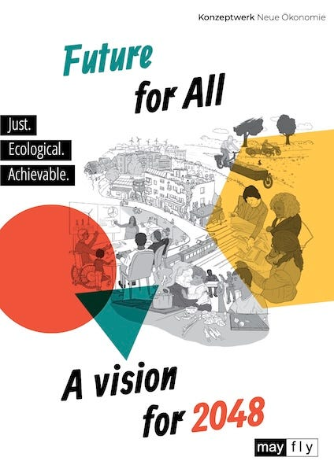
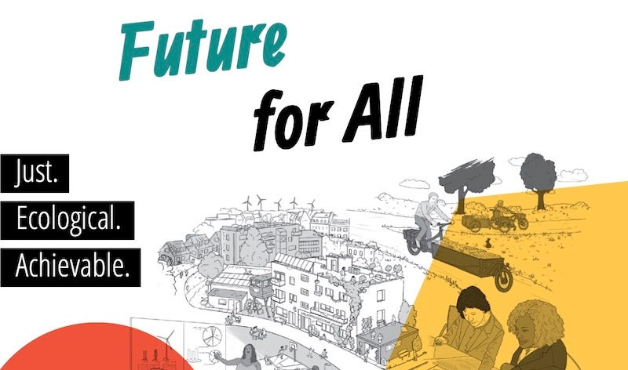

## Achieving A Future For All

Yesterday I came upon a forward thinking, positive future scenario for the world, titled ‘[Future For All - A Vision For 2048](https://owgf.org/2024/11/05/future-for-all-a-vision-for-2048/)’, and started reading it straight away. It is a one hundred page book detailing the possible practical changes that would make the world much better, and eliminate most its major problems. It’s an encouraging and accessible book to read, with good colourful illustrations that help put its message into perspective.

I was very impressed with how it introduces and updates many of the same concepts I’ve been interested in seeing happen. The authors cite some of the same influences that have inspired me too, and so we have a lot in common in our outlook and hopes for the future.

Despite the Marxist criticisms about ‘Utopian Socialism’1 I believe that imaginary better futures can make it easier to see the steps to achieving them, and inspire more people to work towards that goal. So I’m glad for another sincere attempt to do this.

Among the most radical of the proposals of ‘Future For All’ are:

 **Global Justice and Redistribution:** A world where colonial inequalities have been levelled out through material, financial, technological, environmental, and ideological redistribution. 

**Decentralised Democracy and Citizen Participation:** A world which prioritises direct citizen participation through a network of councils at various levels and which would engage citizens in decision-making processes across diverse areas. 

**Transformation of the Economy Beyond Market Dominance:** A world which prioritises meeting people's needs within ecological limits. This involves a significant reduction in working hours, and an expansion of the commons and public services. 

**Universal Social Security and Basic Income:** A world with a system of universal social security that guarantees access to essential infrastructure and services, including healthcare, education, and housing, along with an unconditional basic income.2

 **Focus on Sustainability and Regeneration:** A world which has transitioned to renewable energy sources, ecological farming methods, and a circular economy that prioritises resource conservation and reuse.

This fits the basic requirements for most people’s ideal of Utopia - the presence of positives such as: All essential needs met, relatively peaceful life, free access to lifelong education, a sustainable environment, and supportive communities; As well as the absence of negatives, so that there is: no hunger, no homelessness, no preventable suffering, no prejudices, no serious anti-social problems, no unnecessary work, no dictators, and no financial barriers to enjoying all this.

It also fits many of the other (more left-wing) ideals people have for a utopia: Personal access to and involvement in the way society is organised and operates, freedom from hierarchies, no borders, no wealth or power inequalities, and good ecological stewardship of the world.

## Undermining Utopia

What’s not to like? Yet, despite all these positive I still have some reservations about some of the solutions in the book, which I worry - despite its radical proposals - doesn’t go far enough, and that it’s world still maintains some of the elements which might undermine the future it proposes.

For all of the non-hierarchical, decentralised, decommodified changes the authors recommend, their 2048 system still contains political parties and representatives, nation states, money - albeit in a lesser role (but still with banks), companies and markets - although managed by workers and in service to society. All these elements prevent it from fulfilling the ultimate stateless, moneyless, and classless goal which philosophers and revolutionaries like Kropotkin and Marx had in common. It seems to get so close to that point, but doesn’t quite get there.

I wonder if these remnants of the old world’s ways of doing things are concessions by the authors to practicality, and seen as just part of a transition in which they may disappear entirely. However, I think as long as these aspects of our current civilisation - as minimised as they are - still exist and are not completely eliminated, that these high ideals would remain in danger.

One of the major explanations for the risk of government systems to tend toward corruption is the ‘Iron Law Of Oligarchy’. Formulated by sociologist Robert Michels, it states that all organisations, regardless of initial democratic intentions, inevitably develop oligarchic tendencies as they grow larger and more complex.3

As this law gives specific examples of the risk of the concentrations of wealth and power inherent in capitalist states it might not seem to apply to the utopia of 2048, but I fear that their society still maintains some of the same aspects that could make such a downfall possible.

## The Road To Dystopia

Here's how such a sad situation might play out, despite some otherwise good safeguards against this happening:

 **Erosion of Democratic Principles and Participation**

  *  **Apathy and Disengagement:** If citizens become apathetic or disengaged from the processes of this intricate council-based governance system, it could create a power vacuum, allowing individuals or groups with vested interests to gain control.

  *  **Complexity and Bureaucracy:** If the multitude of councils and decision-making procedures became overly complex and bureaucratic, this could discourage participation and hinder effective organisation. Such a situation could lead to a concentration of power among those who can navigate these complexities, effectively creating a new class of technocratic elites.

  *  **Weakening of Global Institutions:** If institutions like the ‘Global Food Council’ and the ‘Global Clearing Union’ weaken and fail to maintain global justice or prevent exploitation, then they could become susceptible to undue influence from powerful actors, it could lead to a resurgence of global inequalities and power imbalances.

 **Economic Pressures and the Re-emergence of Market Dominance**

  *  **Limited Scope of Market Regulation:** Although markets are envisioned as regulated and aligned with the common good, If market mechanisms persistence even in a limited form, they could create opportunities for wealth accumulation and economic inequalities.

  *  **Challenges of a Needs-Based Economy:** If defining and meeting everyone's needs isn’t carried out in a sufficiently fair and sustainable manner it could prove difficult to meet such practical challenges, potentially leading to disputes and the re-emergence of scarcity-based competition for resources.

  *  **Erosion of the Commons:** If individuals prioritise personal gain over collective well-being, and there isn’t sufficient continued commitment of communities to its principles, the commons could become vulnerable to exploitation and privatisation, leading to a re-concentration of ownership and control.

 **Social Divisions and the Rise of Exclusionary Politics**

  *  **Re-emergence of Discrimination:** If social divisions along lines of race, gender, class, or other identities re-emerge - despite the progress envisioned, they could erode social cohesion and create conditions for the rise of exclusionary politics.

  *  **Weakening of Solidarity:** If the strong solidarity this future relies upon weakens, it could undermine collective action and create opportunities for divisive forces to exploit social anxieties and promote policies that benefit select groups at the expense of others.

  *  **Backlash Against Global Justice:** If nationalist or protectionist movements react badly and resist the seeming loss of some of their privilege to elevate others (and their regions) then they may reject the process, and seek to maintain existing power structures and economic advantages.

My hope is, of course, that none of this would happen, but all of it would need to be guarded against and resolved rapidly when it began.

## The Systemic Imperatives

 _(Or twelve ways to avoid dystopia)_

To avoid these kinds of outcomes I have put together ten tests of the vulnerability of the existence of any positive future being undermined. These come from the history of where ‘utopian’ communities intentions and ideals have been thwarted by (so-called) practical concessions which ultimately led to their downfall.4

 **The Hierarchy Trap:** Does hierarchy exist? Any system of ranked authority or arbitrary power of one person over another inevitably becomes a tool for self-perpetuation through coercion. If there is hierarchy it will be used to maintain and extend power, ultimately by threat of force and violence. Therefore there can be no nation state and no central government.5

 _I personally think that[everyone is an Anarchist](https://peacefulrevolutionary.substack.com/p/are-you-an-anarchist-the-answer-may), an anti-hierarchist, at least when they understand what the term implies, that no-one wants someone else ruling over them, and everyone wants the choice to live freely. But, of course there are some who think people must be ruled over or there would chaos._

 **The Capital Cascade:** Does money (or debt) exist? Economic power concentrates and corrupts through institutional capture (when special interests take control). If there is a currency system of money or debt it will be accumulated and eventually used to corrupt organisations. Therefore capitalism cannot exist.6

 _Thinking about this has led me to make up a new rule on the spot: Whatever ideal can be achieved by money can be ruined by money. Maybe someone else will put it more poetically, or prove to me why it is wrong, but everything I’ve read and seen suggests to me that it’s true._

 **The Enclosure Effect:** Does (private) property exist? Private ownership of essential resources creates leverage for exploitation. If there is (privatised) property it will be used as capital or tollgates to restrict access to something valuable or to exploit labour from others. Therefore sellable property, or property from which a profit is made cannot exist.7 Nor can there be patents or exclusive intellectual rights.

 _This principle is a sticking point for many people who worry that others are coming for their home, or the contents of it; who imagine that the term ‘property is theft’ somehow allows others to take their property. But it just means you are entitled to what you need, but not at the expense of depriving someone else of what they need. Personal property is not the same as privatised property. No-one cares if you claim ownership of your house or toothbrush!_

 **The Necessity Noose:** Does coercion (for survival) exist? Conditioning survival needs on compliance creates inescapable power relationships. If food or housing is dependent on qualifying by any means this will lead to the power of some to enforce the expectation of conformity from others or deny them essential needs if they don't comply. Therefore food and housing cannot be commodified (sold in markets or profited from).

This is a good litmus test of the freedom of the individual under any system: Can someone live outside of the system (or any community) and still have access to the essentials needed to live? (Not that such a way of living is the ideal, but it shows whether compliance is required to exist).8

I would add several other tests to these three:

  *  **The (Closed) Information Loop:** Do official channels of communication exist? If so, those with power will control and manipulate information flows to maintain their position. Therefore there can be no state or for-profit news media.

  *  **The Security Spiral:** Does compliance enforcement exist and confinement for those who don’t conform? If so, security forces meant to protect will inevitably expand their scope and become tools of oppression. Therefore there can be no police or prisons.

  *  **The Bureaucratic Creep:** Are there managers with the ability to hire and fire employees? If so, administrative systems will tend toward self-preservation and expansion of control. Therefore there can be no office hierarchy. _(This does not mean that there won’t be expertise or skills and that these wont be respected, just that no-one will have final say because of their managerial position.)_

  *  **The Identity Lever:** Are there accepted / assigned / prohibited ways to identify people and groups? If so, power structures may exploit social divisions and create artificial ones to prevent unified resistance. Therefore you cannot have enforced definitions - whether for language or gender etc. _(This doesn’t mean people can’t self-identify, or that there aren’t cultural or affinity groups, or that people are obliged to accept others they disagree with, just that people can’t be excluded from society because of them.)_

  *  **The Technology Trap:** Are there exclusive maker or approvers of technology or scientific knowledge. If so, new technologies may be co-opted to enhance control (and perhaps surveillance) over others. Therefore you must allow multilateral provision of services if wanted.

  *  **The Patriarchal Tendency:** Is there an involuntary societal order of domination and subservience, or of relationship forms? When gender and sexuality are hierarchically ordered, they become tools for enforcing broader social control through both intimate and institutional domains. Therefore people must be allowed to be non-monogamous, queer, and engage in adult consent relationships.

  *  **The Religious Division:** Are there exclusive interpreters of morality, worthiness, or spirituality? If so, religious or moral frameworks will be used to create in/out groups and justify oppression of the ‘unworthy’ or ‘impure’. Therefore you cannot have centralised moral authority or enforced belief systems.

And this is the last test, and a good test of the ability of people to association / disassociate with and or even as groups:

  *  **The Unity Constraint:** Are there restrictions on forming alternative decision-making bodies? If so, existing power structures will monopolise legitimate organisation and force dissenting voices into prescribed channels. Therefore you must allow freedom to form new assemblies and working groups when existing ones fail to serve (or even if they don’t).

A conformist utopia or one that enforces one particular vision of utopia is no utopia at all!

But, I have not come to bury ‘A Vision For 2048’, but to praise it. It is a lot more radical, detailed and vibrant than many other such attempts I have seen. Its world of 2048 it is still in the process of transitioning towards a better world, and on that journey it may ultimately reach and achieve these other ideals I’ve mentioned. In the meantime I believe it could inspire many people to dream bigger and reach further in order to bring about it’s goals, and if these challenges are addressed it could be a major leap toward a peaceful world without hierarchy, capitalism, scarcity and insecurity.

### 12 Pillars Of A Free Society

 _Prerequisites For Freedom & Safeguards Against Dystopia_

 **The Hierarchy Trap**

 _A free society …_

  * Must not have: Ranked authority, power hierarchies, nation states, central government

  * Must have: Horizontal organisation, voluntary association

  * Why: Because hierarchical power structures inevitably become self-perpetuating through coercion, leading to oppression and violence to maintain control

 **The Capital Cascade**

  * Must not have: Money systems, debt, currency, capitalism

  * Must have: Alternative means of resource distribution

  * Why: Because wealth accumulation leads to the wealthy gaining control of organisations and corrupt them to serve their interests rather than the common good

 **The Enclosure Effect**

  * Must not have: Private ownership of essential resources, patents, intellectual property rights, profit-making property

  * Must have: Personal property for basic needs, shared access to essential resources

  * Why: Because privatisation of essential resources creates leverage points for exploitation, allowing owners to extract labor or compliance from others by controlling access to necessities

 **The Necessity Noose**

  * Must not have: Conditional access to survival needs, commodified food/housing

  * Must have: Unconditional access to basic necessities, ability to live independently

  * Why: Because when survival needs become unreliable or contingent, people live in constant precarity - one illness, job loss, or crisis away from losing access to what they need to survive, creating a perpetual state of insecurity and fear

 **The Information Loop**

  * Must not have: State-controlled media, for-profit news organisations

  * Must have: Open, decentralised communication channels

  * Why: Because centralised control of information allows power holders to manipulate narratives and suppress dissent, maintaining their position through controlled messaging

 **The Security Spiral**

  * Must not have: Police forces, prisons, compliance enforcement

  * Must have: Alternative community safety approaches

  * Why: Because security forces inevitably expand their scope beyond protection into oppression, becoming tools for enforcing compliance rather than serving community needs

 **The Bureaucratic Creep**

  * Must not have: Managerial hierarchies, hire/fire authority

  * Must have: Respect for expertise without power dynamics, collaborative decision-making

  * Why: Because bureaucratic systems reduce people to statistics and metrics, making human suffering into acceptable percentages and ‘expected losses,’ distancing decision-makers from the real human impact of their policies

 **The Identity Lever**

  * Must not have: Enforced identities, mandatory classifications, exclusionary definitions

  * Must have: Self-identification rights, voluntary cultural associations

  * Why: Because imposed identity categories become tools for creating artificial divisions, preventing unified resistance against power structures

 **The Technology Trap**

  * Must not have: Exclusive control over technology/scientific knowledge

  * Must have: Multilateral service provision, shared technological development

  * Why: Because centralised control of technology creates gatekeepers who can deny access to essential tools and knowledge, forcing people to conform to approved behaviours and beliefs to maintain access to increasingly necessary technological resources

 **The Patriarchal Tendency**

  * Must not have: Enforced relationship structures, gender hierarchies

  * Must have: Freedom of consensual adult relationships, gender equality

  * Why: Because hierarchical ordering of gender and sexuality becomes a tool for broader social control, extending from intimate relationships to institutional domains

 **The Religious Division**

  * Must not have: Centralized moral authority, enforced belief systems

  * Must have: Freedom of belief, personal spiritual autonomy

  * Why: Because exclusive moral interpretation creates in/out groups and justifies oppression of those deemed ‘unworthy’ or ‘impure’

 **The Unity Constraint**

  * Must not have: Restrictions on forming new groups/assemblies

  * Must have: Freedom to create alternative decision-making bodies, right to dissent

  * Why: Because restricting new organisation formation allows existing power structures to monopolise legitimate assembly, forcing dissent into controlled channels that neutralise its effectiveness

Subscribe

[Share](https://peacefulrevolutionary.substack.com/p/utopian-dreams-and-realities?utm_source=substack&utm_medium=email&utm_content=share&action=share)

I have previously written several articles on possible Utopias which you might like:

  * [Antillia’s Utopia](https://peacefulrevolutionary.substack.com/p/antillias-utopia)

  * [The Last Of Us Town Of Jackson](https://peacefulrevolutionary.substack.com/p/the-last-of-us-town-of-jackson)

  * [A Better Future](https://peacefulrevolutionary.substack.com/p/a-better-future)

This book is available [freely online](https://mayflybooks.org/wp-content/uploads/2024/08/Future_for_all_Final.pdf):

1

<https://en.wikipedia.org/wiki/Utopian_socialism>

2

My upcoming article on UBI covers the potential benefits and challenges of this system, and proposes a more fundamental change in how we meet peoples needs.

3

<https://en.wikipedia.org/wiki/Iron_law_of_oligarchy>

4

The first three of these requirements might be called the classic ‘Communist’ test, as they are broadly accepted by most Communists as the conditions for testing if communism has been achieved.

5

See my [Hierarchy article series](https://peacefulrevolutionary.substack.com/i/136794607/hierarchy-article-series).

6

See my [Capitalism article series](https://peacefulrevolutionary.substack.com/i/149107761/capitalism-series).

7

See [Property Is Despotism](https://judgesabo.substack.com/p/property-is-despotism) & [Property And Poverty](https://audiopervert.substack.com/p/property-and-poverty)

8

As to whether people who don’t work ‘deserve’ to live, see my articles ‘[The Moral Question](https://peacefulrevolutionary.substack.com/p/the-moral-question)’ and ‘[The Myth Of Merit](https://peacefulrevolutionary.substack.com/p/the-myth-of-merit)’.
