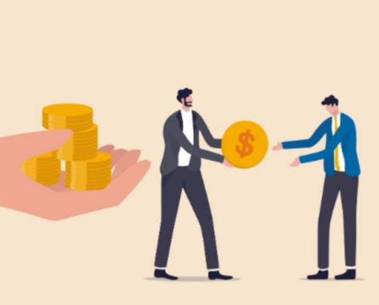
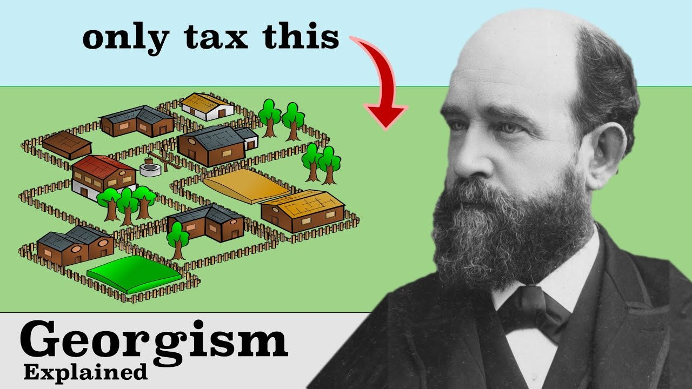
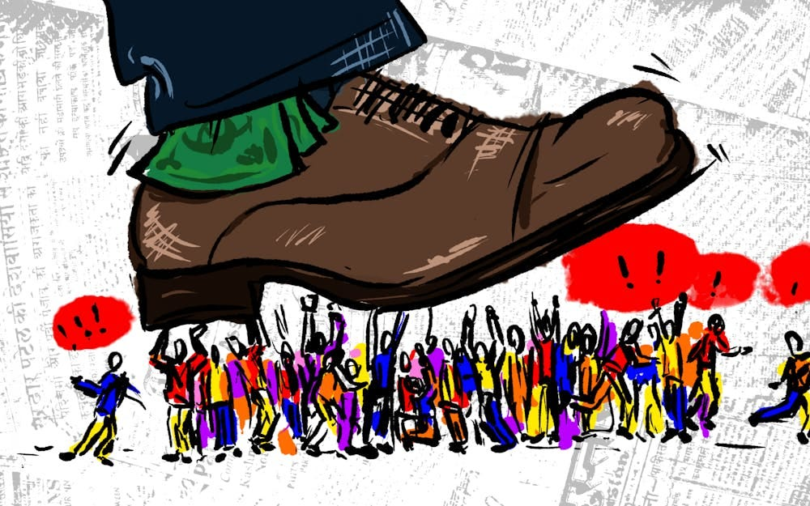

## Universal Basic Income

Wouldn’t it be wonderful if we all received a substantial amount of money every month no matter what? Money we could use to meet our needs, that we could put aside for a rainy day, or that we could use to enhance our life.

Universal Basic Income (UBI) is a system where everyone receives a regular, unconditional payment from the state, regardless of their employment status or wealth. Unlike traditional welfare, it's not means-tested and continues even if the recipient finds work. The amount is intended to be sufficient to meet basic needs, and when someone is working would give them extra money to socialise and spend on what they want.

It is an old proposal which has become popular among CEOs and tech bros over the last couple decades. Among it’s influential supporters are Bill Gates (Microsoft), Elon Musk (Tesla), Tim Cook (Apple), Jack Dorsey (Twitter/BlueSky), Larry Page (Google), Sam Altman (OpenAI), Mark Zuckerberg (Facebook), Richard Branson (Virgin), and Jeff Bezos (Amazon).

And before you become suspicious as to why all of these wealthy Capitalists support it, it also has its supporters on the left such as: Jeremy Corbyn, Thomas Piketty, Yanis Varoufakis and Edward Snowden. Hell, even Pope Francis did, as did Stephen Hawking when he was alive.1

It’s most ardent proponents say it would ultimately save more money than it would cost through stimulating the economy and reducing welfare reliance. Others, including some of its wealthy advocates, argue it would be worth taxing the rich to finance it as the benefits to individuals and society would benefit everyone (through avoiding the negative outcomes of extreme poverty).

It is an idea which has been piloted many times, and it’s supporters point to the many positive outcomes it has led to under such human trials:

  *  **Mental Health:** Significant reduction in stress, anxiety, and depression, with less hospital visits.

  *  **Work Choices:** People didn't stop working but gained power to refuse exploitative conditions and pursue better opportunities.

  *  **Education:** Improved school attendance and academic performance, with more adults pursuing training.

  *  **Domestic Life:** Reduced domestic violence and improved family relationships, with more time for care work.

  *  **Financial Security:** Reduced household debt and better ability to make long-term decisions.

However, its detractors point out that these trials are short term and are conducted on a small scale, and so don’t impact macro-economics or wider societal changes.

As with all such ideas the devil is always in the detail, and the most important detail in this case is that (for it to be an ongoing viable and useful proposal) it would have to be linked to and rise with costs for essential items, or some prices - including rent and healthcare costs (if for profit) - would have to be controlled.2

## Neo-Feudalism vs State Capitalism

Why are the rich promoting the idea of UBI, you might ask yourself? Is it possibly out of the goodness of their hearts and concern for their fellow citizens? I doubt it.

What UBI does for them is address the widening gap between wages and affording the products the wealthy sell, which a guaranteed income supplement would allow more of the poor to buy. This lifeline for consumerism is a win for the corporations and their shareholders, despite all of the toxic waste and environmental damage that would come with this.

The government is already supplementing poor wages to subsidise corporate profits, with Walmart being the most egregious example of this, with half a billion dollars going toward their employees from the government so they can afford to work for the retailer and not starve or become homeless.3 Worst of all, if UBI ever became dependent upon working it could lead to a sort of neo-indentured servitude. As basic costs rise above the UBI level, people might be forced to accept exploitative work conditions just to top up their basic income.

It is also being championed by billionaires who see the potential for technology to leave tens of millions unemployed due to advances in automation and so called 'AI'. For example the most popular job in most states is transport, and would disappear if self driving trucks cars become reliable enough.4 But those who still sell things and services need customers, and UBI will guarantee that.

Ultimately Universal Basic Income preserves the position and power of the wealthy, and avoids a potential revolution against the rich when the poor become hungry enough to fight back against them. In other words it saves Capitalism from itself.

### Democratic / State Socialist Support

However, this critique sits uncomfortably alongside support for UBI from parts of the socialist movement.

For many of those who believe that people are entitled to equal dignity, and that ability to live shouldn’t be dependent upon financial circumstances, UBI seems to be either a solution or at least a very positive step in that direction. If the amount given individuals was enough to ensure no-one went hungry or lacked shelter than this would be an outcome that aligns with the values who believe that the economy should be organised socially.

For those who are trying to establish a Socialist state and to have that state own or control capital, then UBI could also be seen as a gateway to a centralised economy. If the state can supply all the basic needs then they can argue that they can control the the property and political processes too, and that they can look after you in all areas.

That is one possible outcome, and one that isn’t desirable to those on the Left who are against hierarchies and concentration of power, because of the losses of freedom that have historically come with such a state. However, UBI could just as likely lead to the opposite effects, as it could justify a Capitalist state privatising some essential services, as it could be argued that now everyone can afford them without the government providing or subsidising such services.

Either way with UBI the state becomes a god who can give and take away, who can add qualifications or limits that ultimately make this benefit cease to be universal, to only be available to those it approves of, and then the state becomes a religion that rewards you on your faithfulness, or punishes you when you don’t comply with it’s rules.

## Georgism Reborn

We’ve been here before. There was a time when those on the left and right thought something called Georgism would save the poor and stop extreme inequalities.

Georgism, developed by economist Henry George (1839-1897)5, proposed that because all land value comes from society rather than individual effort, a single tax should be placed on land values (but not on buildings or improvements), eliminating all other taxes. This tax revenue would be redistributed through public services or direct payments, making land speculation unprofitable while making housing affordable and forcing unused land into productive use. It was similar to UBI in several significant ways:

  * Georgism emerged during an industrial / automation crisis.

  * Georgism was presented as single-policy solutions to poverty.

  * Georgism attracted support from across political spectrum.

  * Georgism promised to fix capitalism's problems without changing it.

Like UBI, if it had succeed it still would have failed to change many fundamental issues:

  * Both attempt to address distribution without challenging production.

  * Both maintain basic capitalist property relations.

  * Both try to humanise rather than replace capitalism.

  * Neither addresses productive relations.

  * Neither challenges market dynamics.

  * Neither resolves environmental contradictions.

The prospect of Georgism being implement was always just on the horizon, and many other substantial changes were kept back waiting for this solution that was going to implemented any time soon, but never was.

## Why UBI Isn’t Enough

Universal Basic Income fills a similar position to Georgism, which was supposed to be a panacea, but was never broadly implemented, and even if it ever is will leave many of the causes of the problems it tries to remedy in place.

UBI is a temporary solution to a permanent problem, at least if we leave the bigger problems in place. Even if we get rid of the bigger problems then UBI may not even be relevant (because there are better systems).

UBI papers over (with money) the power and wealth inequalities that exist in society, and leaves those unequal power relationships in place.

UBI is a diversionary tactic (at least when used by those on the Right of the political spectrum). The promise of change is a carrot always being held out in front of us by our masters, and UBI is just a bigger carrot, while the rich keep owning fields full of carrots that should be ours to share.

As long as we keep expecting a dysfunctional system designed to serve the wealthy to somehow serve us by making relatively small and precarious concessions then we will keep serving our masters and never rid ourselves of them. It reminds me of the old religious saying -

> ‘How can Babylon fall if we are upholding it?   
> How can Zion rise if we do not build it?’6

UBI puts off building Zion in favour of upholding Babylon.

We need to skip UBI and go straight to Universal Entitlement, not just to the basics, not decided by others, no even granted by the government. Because what the government gives the government can take. We need to separate the systems fulfilling our needs from commodity markets, to separate value from currency, and separate corporations and states from the power to control either or us. _This will be the subject of my next article in this series._

Subscribe

[Share](https://peacefulrevolutionary.substack.com/p/universal-basic-illusion?utm_source=substack&utm_medium=email&utm_content=share&action=share)

### Entitlement Series

If you liked this consider reading more of the [The Universal Entitlement Series](https://peacefulrevolutionary.substack.com/about#§entitlement-series)

1

<https://en.wikipedia.org/wiki/List_of_advocates_of_universal_basic_income>

2

[See ‘Livable Basic Income’ (LBI) - https://www.jacobinmag.com/2016/01/universal-basic-income-switzerland-finland-milton-friedman-kathi-weeks/](http://See ‘Livable Basic Income’ \(LBI\) - https://www.jacobinmag.com/2016/01/universal-basic-income-switzerland-finland-milton-friedman-kathi-weeks/)

3

<https://www.msnbc.com/msnbc/walmart-government-subsidies-study-msna307306>

4

<https://www.npr.org/sections/money/2015/02/05/382664837/map-the-most-common-job-in-every-state>

5

<https://en.wikipedia.org/wiki/Georgism>

6

Babylon in this context is the sinful nation, while Zion is the heavenly one.
