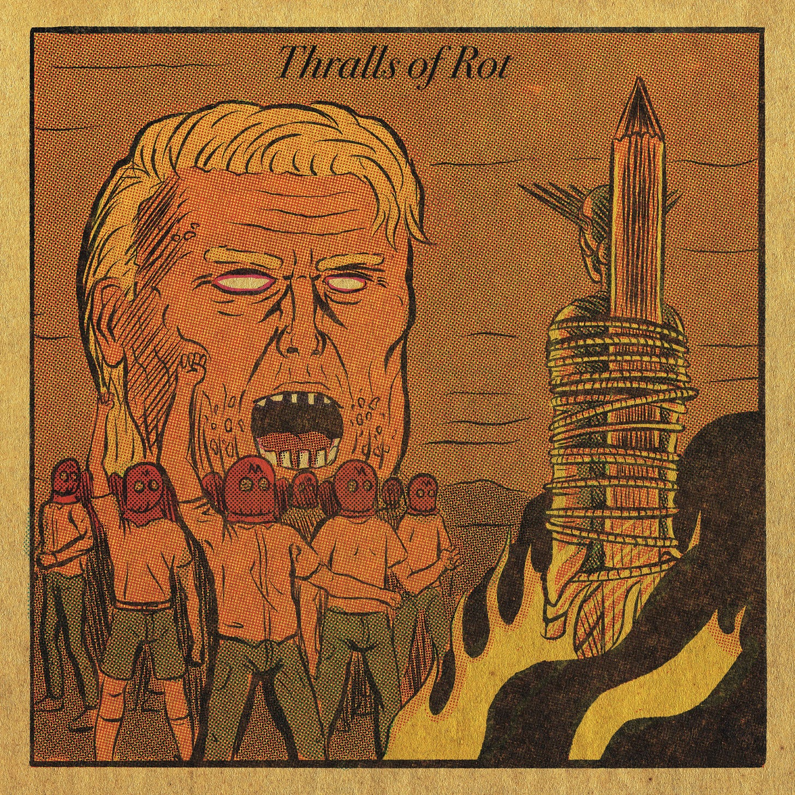
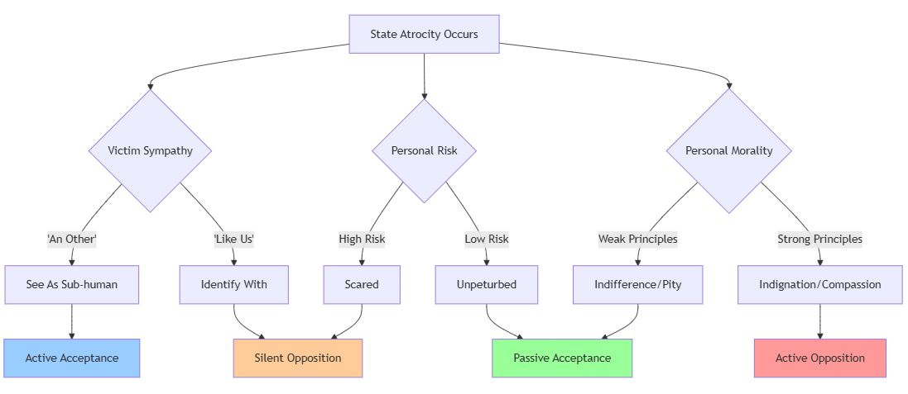
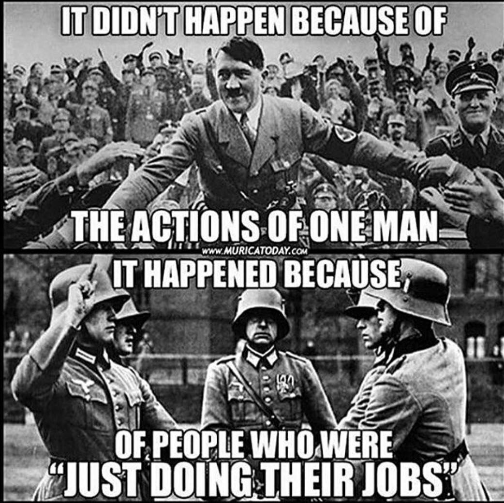
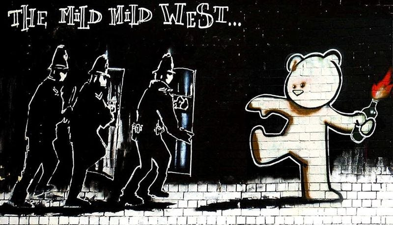

This is a fictional survival guide for people living under the oppressive reign of a future galactic emperor, any similarities to any similar situations on earth are purely coincidental, as on this planet you are expected to obey all laws no matter how repressive, express no doubts in your faith no matter how unfounded its claims, and serve your masters obediently no matter how despotic.

Let’s imagine for a moment that your country or planet just voted into the highest office someone who intent on being an evil dictator for life, and setting up a repressive dictatorship that will potentially outlive them. We have seen such situations happen on Coruscant (Palpatine, Star Wars) and in Panem (Coriolanus Snow, Hunger Games), as well as in alternative timeline America (The Sons Of Jacob from Handmaid’s Tale)1 and England (Norsefire from V For Vendetta)2.

But for the sake of this example I'll stick with the alternative America of Octavia Butler's 1998 ‘Parable of Talents’3, which featured a presidential candidate named Andrew Steele Jarret who won the election running on a ‘Make America Great Again’4 platform before establishing a Christian fundamentalist authoritarian state. It is such a far fetched fictional idea that there is no danger for it being mistaken for any real world scenario.

## Life Under Dystopia

Image by [@sabretooth1100](https://www.instagram.com/sabretooth1100/)

Now when authoritarian changes begin, maybe nothing seems to personally affect you at first. You might even start to relax, even if you hear troubling reports about new regulations or administrative detentions, but they affect other communities. You sympathise but it's hard to verify information now that independent media outlets are being muzzled.

So you keep your head down and try to fit in. This won't be so hard if you're part of the demographic majority, if you have the right background and connections, and if maybe you work in a position where you don't have to make difficult choices, just process the paperwork that crosses your desk. Lucky you.

But suppose the situation intensifies. The history books show us what can follow. Maybe you're required to attend mandatory civic education sessions or party rallies. You learn to participate enough to avoid attention, memorising the expected responses and songs.

You may not like having to display the approved symbols to avoid harassment, or being volunteered for community surveillance duties, but maybe you'll be lucky and avoid being asked to report on your neighbours or colleagues for suspicious behaviours.

You'll hate having to attend the public trials and sentencings, naturally applauding at the right moments, but it won't mean anything you tell yourself. At least until your children's youth group leader asks them to write essays about their parents' daily activities and private conversations. But is this really how you want to live, and could you live with yourself if you did live this way?

I was once told by a stage hypnotist that the most important part of his job was figuring out who to avoid calling on, as most people were either easy influenced or go along with his suggestions, but picking people who were already determined to not give an inch, not to join in, and not to do anything silly or funny that contravened their values, would spoil a show by not playing the part or taking part.

I asked him if he avoided religious people for this reason, and as someone who was pretty religious at the time I was surprised at his answer, ‘No, religious people can be easy. If they are the sort who follow their leaders, and do what they are told.’

He did say that there were exceptions, if someone was so committed to their beliefs and prepared to defend them, even to the point of disobeying their leaders or losing their friends for sticking by their principles, then those people weren’t susceptible to suggestion. Their beliefs could of course be wrong, but they had become such an integral part of that person - intellectually and morally - that they wouldn’t contravene them without great pressure, and might even die for them. This was true of people very committed to political ideals too, to the point they would oppose their political party if that party opposed their ideals.

In the Octavia Butler’s story many of those who would have considered themselves Christians ultimately accepted very unchristian acts, because their loyalty to their culturally Christian group or it’s leader was greater than their own understanding of and commitment to their beliefs. In her story some of his followers do have a limit, and there is a point at which they no longer accept his hypocrisy. But it is fiction, in reality many would still go along with it, until it hurts them or those they love personally, rather than risk standing out.

## Who Goes Nazi

People's acceptance of or opposition to state violence and atrocities typically operates along two key axes:

 **Dehumanisation Distance:**

  1. The more ‘othered’ or dehumanised the victims are, the more likely people are to accept violence against them.

  2. This operates through social, cultural, and ideological mechanisms that create psychological distance.

  3. For example, how colonial powers justified violence against indigenous peoples, or how fascist regimes frame minority groups.

 **Personal Risk Assessment:**

  1. People's willingness to oppose atrocities is inversely proportional to their perceived risk of becoming victims themselves.

  2. When people feel personally threatened by state repression, they're more likely to remain silent.

  3. Conversely, those who feel insulated from consequences are more likely to voice opposition.

This creates a dynamic where:

  * Atrocities against those seen as ‘like us’ or within our circle of moral concern generate stronger opposition.

  * People are more likely to speak out when they feel protected from retaliation.

  * Dictatorial state power often deliberately exploits both axes - dehumanising targets whilst simultaneously creating fear of becoming a target.

Where these tendencies of dehumanisation and fear are subverted is when people have strong moral integrity - a deeply held commitment to human dignity and solidarity that transcends both social distance and personal risk. This moral axis operates through several key mechanisms:

 **Weak Principles** (Leading to Indifference/Pity):

  1. Superficial moral framework easily overwhelmed by social pressure or fear.

  2. Often reflects liberal ‘thoughts and prayers’ responses.

  3. May acknowledge wrongness but avoid meaningful action.

  4. Can manifest as performative concern without material support.

 **Strong Principles** (Leading to Indignation/Compassion):

  1. Overrides the ‘othering’ process through recognition of universal human dignity.

  2. Generates moral courage that can overcome personal fear.

  3. Often rooted in class consciousness or internationalist principles.

  4. Manifests as both emotional response (moral outrage) and practical solidarity.

The crucial distinction is that strong moral principles don't just generate feeling but drive action - transforming sympathy into solidarity, and concern into concrete resistance. This is why revolutionary movements emphasise moral education alongside political consciousness.

Of course there are exceptions all along these lines, people whose conscience is pricked, because the repression or violence passes a certain level, or through personal experiences that break through their psychological defences - a friend becoming a victim, witnessing violence first hand, encountering horrific stories, recognising parallels with past historical atrocities, or simply reaching a breaking point where they can no longer maintain the cognitive dissonance required to ignore state violence. Sometimes it's as simple as a powerful image or story that manages to bypass their usual rationalisations, and forces them to confront the humanity of those they've previously othered or overlooked.

## Just Following Orders

In Stanley Milgram's original 1961-1962 experiments at Yale, volunteers were told they were participating in a learning experiment where they had to administer increasingly powerful electric shocks to a ‘learner’ when they gave wrong answers. The experiment was prompted by the trial of Nazi war criminal Adolf Eichmann in Jerusalem in 1961, whose primary defence was that he was ‘just following orders’.

The fact that two-thirds of participants carried out such a contrived punishment has been seen as proof of our moral malleability, but it was really an experiment of how far people will follow authority. The test was given to people who had been brought up to respect authority figures, and many of the participants would have been used to obeying orders as soldiers in the war less than a couple decades before.

It was only when the authority figure (the experimenter) was physically present and giving direct commands, that compliance remained high at around 65%. When the experimenter was replaced by a non-authority figure compliance plummeted to around 20%.

A few people (1.5%) refused to participate at all, and around 35% refused to continue at various points when hearing the victim's distress. The closer the ‘victim’ was physically, the more likely participants were to refuse. When participants saw other people refuse to comply, their own resistance rose to around 90%

## Personal Strategies For Survival

Some lessons we can take from this if we want to be among the 35% who refuse to cooperate when we realise how harmful the situation or system is to others are:

 **Question Everything and Build Critical Awareness**

  * Train yourself to critically examine orders and authority

  * Practise recognizing propaganda and manipulation

  * Learn to spot when fear is being manufactured

 **Trust Your Moral Compass**

  * Listen to your discomfort - it's signalling something

  * Maintain connection to your core values

  * Build tolerance for uncertainty without losing principles

 **Create Distance and Boundaries**

  * Maintain physical distance from authority figures

  * Master showing just enough compliance

  * Challenge institutional power while staying safe

 **Build Direct Connections and Community**

  * Create solidarity networks across social divisions

  * Build strong support networks early

  * Develop subtle communication methods

 **Make Resistance Visible and Viable**

  * Help make others' resistance visible

  * Build support networks for those who refuse compliance &

  * Develop skills in collective action

 **Maintain Joy and Human Connection**

  * Cultivate genuine connections

  * Create safe spaces for authentic expression

  * Find beauty in small acts of defiance

  * Celebrate small victories together

I have purposely focused on the mental preparations and haven’t gone into detail regarding the practical ones, because it is within you that rebellion and radicalness starts, and that is where survival under difficult circumstances is determined, more than physical preparations.

A few years ago I attended a talk given by a well known survivalist. He was a smart fellow, who knew how to live in nature and survive disasters, and had created his own line of products that could protect you from dangers natural and man made. I had been dragged along, and although I found his stories interesting, thought that the idea of society collapsing or becoming dystopian was highly unlikely.

When it came to packing up his wares into his van I offered to help, and we got into a conversation about what sort of emergencies he thought might be coming in the near future, and what he told me seems very relevant right now: ‘You can have all the equipment you need and then some, and someone else can have none, but I’d place my bet on the person with nothing who is mentally prepared, who doesn’t give in to panic and hopelessness, who is adaptable and resourceful. They’ll be the one to survive, while someone who has everything they need will fear and flounder and not survive what’s coming.’

Now imagine you are one of several people working together to survive an authoritarian regime, to maybe even undermine it, perhaps even fight against it, or give the support that helps make that possible. (Maybe you lack the strength, are too young or too old, you can still be someone who spreads the word, or offer a safe place, or do any number of other things that don’t involve physically defending others).

## How To Make Friends And Overthrow Regimes

Either way long term survival will require close friends (and hopefully family - those you are born into or those you choose), it will require access to and involvement in networks of support, and it will require allies.

If you can see a dictatorship coming in the distance don’t wait until you are in the middle of it’s dystopia to do something, by then it will be more difficult and risky to do something. If you are still in a period in which you can speak freely, associate freely, travel freely, then this is the best time to build up your skills and connections, while you can do so safely.

Ultimately a dictator is unlikely to stand down peacefully, at least not unless surrounded by intimidating numbers at their gates. So change will require being radical, making radical friends, and radicalising the friends and family you already have. It will require knowing how to be secret and knowing who to trust, and knowing when to act and what will be effective.

I believe in the capacity of people to wake up, see the the severity of their situation, and to rebel. But all revolts start small before they turn into revolutions and succeed. There have been countries where there were no resistance movements at all at first, where such movements were outlawed, and yet such movements have grown from nothing to millions of people in a year or two.

History shows that strength and advanced resources alone don't determine outcomes. Gandhi led a successful nonviolent independence movement against far militarily superior British colonial rule. The Vietnamese people's determination and guerrilla tactics proved effective against a technologically superior American military force. Even the Bay of Pigs invasion was thwarted by factors including challenging terrain and local resistance.

On the subject of Cuba, Fidel overthrew the American backed state with 82 men. Yes, a very large resistance can do more than a very small one, but it only took one person sitting on the forbidden seat on a bus to start the Civil Rights movement5, and may have only took one person deciding to stop to get a sandwich that started World War One.6

When it comes to internal revolutions - the successful Arab Spring rising in Tunisia took 28 days following the death of one man, Ceaușescu's regime fell from protests to ousting him in two weeks, and Ferdinand Marcos was kicked out in 4 days.

But maybe it will take 20 years, maybe it will take inconveniencing our oppressors enough for long enough will eventually lead to similar results, or maybe we’ll make their power irrelevant when we build ours up enough to the point that they would rather run than challenge it.

Maybe you’ll find it hard to maintain hope, but you can use that too. Nihilism can help some people to see the extent of the horror and leave them feeling they might as well act radically. Whereas others will gain hope from people acting against the odds, and this will motive them to rebel. Whereas others are already involved with an insurgency, and have been waiting for you to join and step up their actions strategically.

There was a time when every nation was ruled by kings and multiple countries by emperors, in which most people were slaves or feudal serfs. It had been that way so long few could imagine it changing, and some even argued it was an inevitable law of nature. As Ursual K. Le Guin said, speaking of our system now, ‘Its power seems inescapable. So did the divine right of kings. Any human power can be resisted and changed by human beings.’7 That’s what I'll keep hoping (and working) toward, and I hope you’ll join me.

But of course this is all purely fictional. Think of it as an elaborate role playing game, but one in which the stakes are a bit higher, and some of us are playing to win again the dark lord. There’s always room for more players, and if you want to play I’ll be posting more from the rulebook soon.

Subscribe

[Share](https://peacefulrevolutionary.substack.com/p/so-you-are-living-in-a-dystopia-what?utm_source=substack&utm_medium=email&utm_content=share&action=share)

The next article in the series is here -

* * *

I’ve been sharing these links with some friends in America, and am posting them here in case you might find them interesting -

What went wrong / what might yet happen - [CrimeThinc Response](https://crimethinc.com/2024/11/06/history-repeats-itself-first-as-farce-then-as-tragedy-why-the-democrats-are-responsible-for-donald-trumps-return-to-power)

What you can do to fight back - [BlackRose Federation Guide](https://blackrosefed.org/dont-panic-organize-trump-election/)

Another couple guides - less radical than the other links, but some good info -

[Things To Do If Trump Wins](https://wagingnonviolence.org/2024/11/10-things-to-do-if-trump-wins/)

[The Answer To Trump’s Victory Is Radical Action](https://theintercept.com/2024/11/06/trump-harris-election-results-action/)

[The Authoritarian Regime Survival Guide](https://verfassungsblog.de/the-authoritarian-regime-survival-guide/)

& Here is a group of American Anarchist reacting & reflecting on the election and future too - [Our Hope is Outside of the System](https://www.youtube.com/live/cJft1U1H1aw?feature=shared)

1

Or Charles Lindbergh from The Plot Against America.

2

Or Harold Saxon from Doctor Who.

3

https://en.wikipedia.org/wiki/Parable_of_the_Talents_(novel)

4

Originally used by Ronald Reagan as a campaign slogan in his 1980 presidential campaign (Let's Make America Great Again).

5

https://en.wikipedia.org/wiki/Montgomery_bus_boycott

6

The story claims that Gavrilo Princip went to buy a sandwich at Moritz Schiller's Delicatessen in Sarajevo after the first assassination attempt on Archduke Franz Ferdinand failed. He then saw the Archduke's motorcade and came out to shoot. It’s probably not true, but it is true that the assassination of one man was the domino that started World War 1. See https://www.smithsonianmag.com/history/gavrilo-princips-sandwich-79480741/

7

Acceptance speech for the National Book Foundation’s 2014 Medal for Distinguished Contribution to American Letters.
