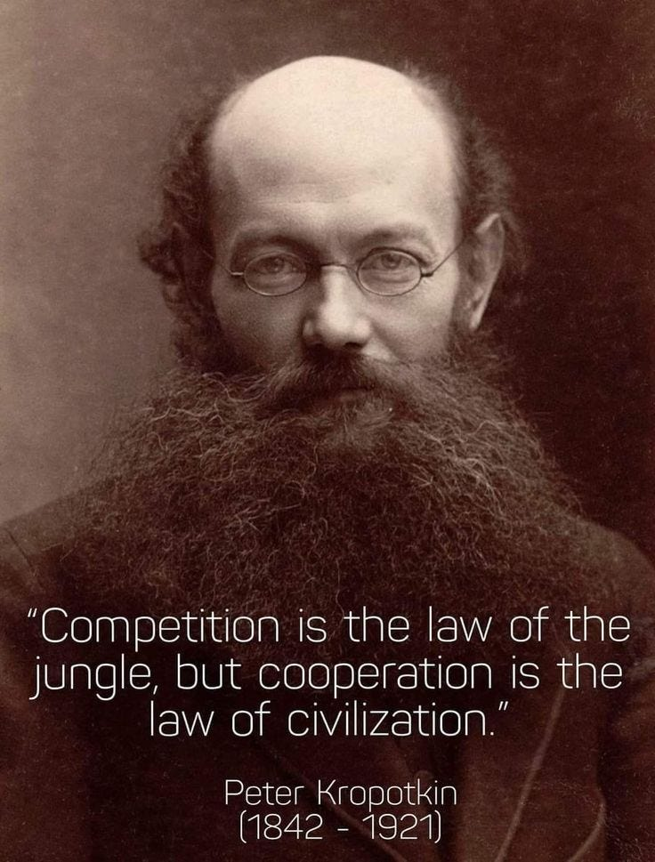
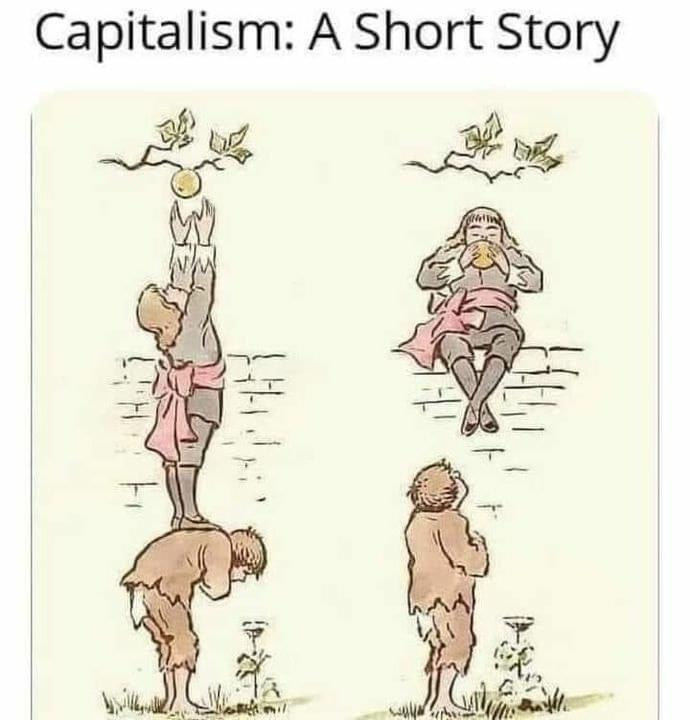

A while ago I came up with the idea of writing a book titled, ‘The invention of competition: How the upper class met together in 1850 and invented competition in sports, education, and business, but only for everyone else except them, and how it has ruined the world ever since.’ But the title pretty much says it all by itself.1

My article ‘[Are We Born Evil?](https://peacefulrevolutionary.substack.com/p/were-we-born-evil-or-did-capitalism)’ touches on the philosophical origins of competition, but there is a lot of debate about which is whether co-operation or competition is more natural, historical or ideal. The work of recent biologists, anthropologists, and archaeologists has challenged some of our old assumptions on the subject.2

Last week I watched a video on the recent election in which Anark stated - ‘Competition is a luxury of a society that has already been built by cooperation. The only reason why we have this Society where competition can ever be carried out is because we've created the foundations, the basis that allows competition to safely take place.’3

I hadn’t considered it that way before, that competition was trading off of the gains of cooperation and off the backs of those who cooperated in the past. Just like capitalists today benefit from primitive accumulation, the cultivation of common land in times past.

Then in the last few days I saw that someone had commented on something I’d shared about hierarchy in society with the claim that, ‘Competition is what drives Humanity to excel. Without it humans would still be living in caves and eating berries.’ I’m always surprised when I see that anyone still believes in that narrative uncritically, given all the evidence challenging that assumption that has come out the last few decades, but maybe I’m a little sheltered from such dog-eat-dog thinking and those who subscribe to it.

This commentator went on to give medicine and farming as areas that he felt supported his position and criticised anyone who didn’t want to complete as lazy. I’m never sure how much good it does to write long replies that those replying to me might not read, but here’s how I answered his claim:4

Like you, I enjoy the comforts of scientific progress and benefit personally through humanity excelling. However, I believe that cooperation, not competition, has been the primary driver of human advancement, with scientists making their greatest discoveries when they had the space and time to wonder, study, experiment and discover. Genuine creativity is stifled when we're constantly competing for resources.

Our ancestors didn't survive by competing with each other for berries, but by sharing knowledge about which ones were safe to eat, working together to gather food, and collectively raising children. The most significant human achievements—language, agriculture, architecture, science—all stem from collaboration and mutual aid. Isn't the evidence suggesting that cooperation is our default state, with competition mainly appearing when artificially enforced by hierarchical power structures?

Maybe I just think that cooperation is healthier for society, whatever it’s past history. However, from what I read the archaeological record suggests that pre-agricultural societies often maintained peaceful trading networks spanning thousands of miles, without ever having to compete. The notion of constant tribal warfare seems to be largely a colonial-era myth. Do you know any recent scholarship that supports your view?

It is true that since the mid-17th century the idea of competition as a motivator in evolutionary survival has been promoted heavily by the upper class, while they themselves have done everything they can to avoid competition for themselves. Even back then there were those like Kropotkin who showed that the science didn’t support that view, as most biologists and anthropologists accept today. The narrative of those who promoted competition fitted a certain philosophical view of the world that they wanted to promote because it increased our insecurity and made us more reliant on them.

Even in more modern times most breakthrough discoveries come from publicly-funded research shared freely amongst scientists - even when ultimately taken credit for and marketed by pharmaceutical or tech corporations. The polio vaccine wasn't developed through market competition—Jonas Salk deliberately didn't patent it, likewise the Internet began as a public project. When healthcare is driven by competition for profit rather than human need, we end up with artificial scarcity and exploitative pricing. That's not competition driving innovation - it's actually stifling it. It seems to me that if you want accurate, evidence based medicine then you wouldn’t want competition or profit anywhere near the medical field. Those two elements will always corrupt the process of research and testing. 

Most progress happens despite competition, not because of it. Even in the private sector, companies often make more progress when they collaborate on open-source projects than when they compete. Most of the internet runs on the open source Linux operating system, most people check their facts on the collaborative Wikipedia, and most Scientists give peer review for free to ensure the validity of the science, people will form mutual aid networks during disasters, because they care more about compassion and cooperation than competition.

I’m not convinced that either open source or co-operation differs from most other areas of human activity throughout history. Like open source, traditional craftspeople freely shared techniques and innovations through guilds. Indigenous peoples exchanged agricultural knowledge across continents. What's actually unusual historically is the modern idea of intellectual property and enforced competition.

Farming was done with free labour for nearly all of its existence, except the last three hundred years. My feudal peasant ancestors worked 3 days a week with others to grow their food for no monetary reward, although they were forced to work 1 day a week for their feudal Lord. I’d argue that the community was more productive and natural than the one day of forced labour for the lord - which was essentially an early form of artificial competition and exploitation.

Maybe people who choose cooperation are not ‘too lazy to win’ or ‘lack the talent’, they just don’t want to waste their lives spending most of them making profit for others, or supporting a system that very often doesn’t reward hard work very well, or don’t think being talented enough should be necessary to live in a world which produces more than enough. Was Einstein not talented enough? Yet he championed this kind of cooperation.5

Are you really driven by the desire to beat others, or is it the satisfaction of mastering something challenging and contributing something meaningful? People who love competition can always play sports to compete. Failing that they can always compete against themselves. It is when they try to introduce competition into areas that decide life or death that it becomes dangerous.

Unfortunately after this reply he began spouting all sorts of conspiracy theories including racists ones and so I didn’t engage any further, as I worried if I did I might be giving him a platform for his bigoted views. This has happened several times now, and it is as if those who believe the worst in others also happen to often believe they are superior to others.

Although I can’t write a whole article each time I respond to someone I tend to pick an example or two and direct them to where they can find more information, usually to others books. After replying I wondered if anyone had done any videos on this subject, and was pleasantly pleased to find a few:

 **Cooperation and Competition ( & Property) - George Carlin**

[Competition vs Cooperation - Re-education](https://youtu.be/JTbPn2YnDE4)

[Why Cooperation beats Competition - Alfie Kohn](https://youtu.be/Jqcw_0v8ooE)

[Competition vs Cooperation- Workers Solidarity](https://youtu.be/uiNYWJK5BCk)

[From Competition to Cooperation - Primavera De Filippi](https://youtu.be/aYOPcHRO3tc)

Subscribe

[Share](https://peacefulrevolutionary.substack.com/p/co-operation-vs-competition?utm_source=substack&utm_medium=email&utm_content=share&action=share)

 _If you liked this article you might also enjoy this one:_

### Entitlement Series

If you liked this consider reading more of the [The Universal Entitlement Series](https://peacefulrevolutionary.substack.com/about#§entitlement-series)

1

See <https://www.bbc.co.uk/history/british/victorians/sport_01.shtml> for an article relating to the sports side of this story

2

And some debate about the world itself - <https://www.csmonitor.com/The-Culture/In-a-Word/2021/0809/The-history-of-competition-won-t-cooperate>

3

[Our Hope is Outside of the System](https://www.youtube.com/live/cJft1U1H1aw)

4

I have combined several replies into one.

5

See his article, ‘Why Socialism?’ - <https://monthlyreview.org/2009/05/01/why-socialism/>
