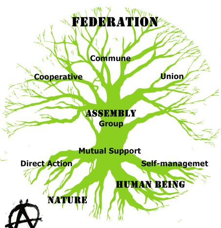
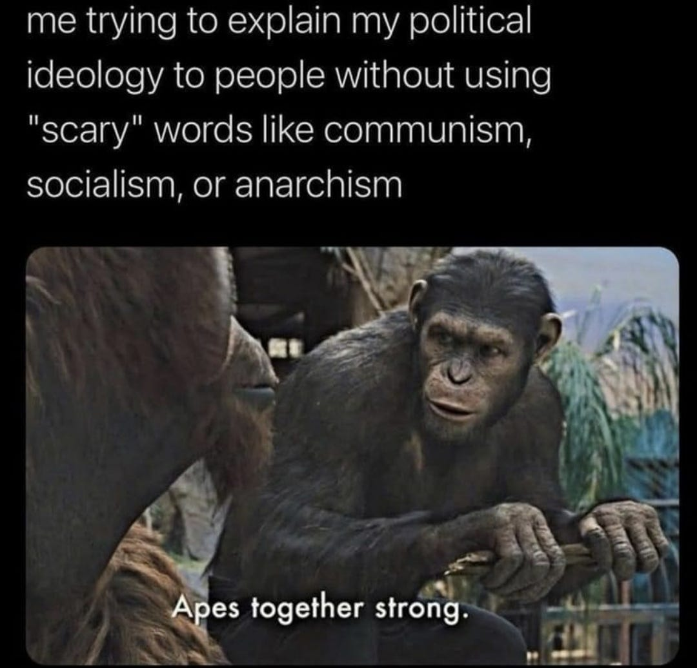
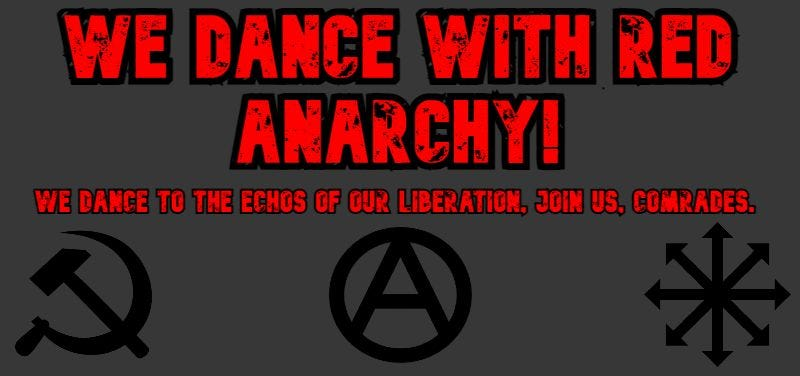

In [our last article](https://peacefulrevolutionary.substack.com/p/so-you-are-living-in-a-dystopia-what) we looked at the imaginary dystopian situation of a wannabe dictator taking power. Maybe something like that couldn’t happen here, but it has happened elsewhere in the past, so it might be worth considering this fictional scenario.

It is easy and understandable to feel powerless in the face of systems of power that look like they are becoming increasingly dystopian (or at least threatening to become so).

Luckily would-be dictatorial regimes often fail early on - especially in the face of a populous that doesn’t want them there and when led by the braggadocious but incompetent. They may turn out to just be a balloon that will pop when it becomes too big, pierced by the reality of trying to run a country or please its backers or infighting. It may just come undone and fizzle out and float away, when it finds it doesn’t have the support it expected, or lacks the means to carry out its plans, or finds people unwilling to support it enough.

Of course they may end up becoming a repressive authoritarian regime too, so it’s best to be prepared and be on the safe side. To this end we should be prepared by: doing a little something, doing some of everything, and being seen by some to do nothing. In other words there are things you should do to resist, normal life things you should be or stay involved in, and things you shouldn't do or should avoid if you can.

Not everyone will be a Luke Skywalker or Leia Organa, Katniss Everdeen or Peeta (or Gale), Neo or Trinity, Sarah or John Connor, Tank Girl or Booga, V or Evey, Cassian Andor or Jyn Erso, Frodo or Éowyn. Some of us will be a Samwise Gamgee (or Pippin Took), R2-D2, Xander Harris, or like one of Doctor Who’s less annoying companions.1 The important thing is to be on the right side. When empires rise in these movies and T.V. shows whose side do you imagine being on? What part do you imagine playing?

Below are six areas in which you can make a difference for yourself and for others, many of which you can do right now, without having to wait for anything worse to happen, and if nothing bad ever does you might gain some useful skills and make some good friends, and maybe realise the potential to make a better world in the near future.2

These are not in order - you shouldn’t try to learn everything before you do anything, because there are many things you learn by doing, you shouldn’t wait to help someone until you are fully secure and prepared, because they may help you to do this etc. These may seem like a lot of things to work on, but don’t think you need to consider or do everything at once. Pick one area at a time to work on, and there is no shame in it being the easiest or quickest, the point is to not feel powerless, and to build your power (where possible with the help of others).

If you’re worried realise you are not alone, if you feel unprepared realise you aren’t meant to do it all by yourself, if you aren’t sure what to do next there are lots of things you can do with others or by yourself.

## Learn something, learn everything, learn nothing

Knowledge is both power and protection, but it must be balanced with practical experience and critical thinking. Understanding history, theory, and skills helps us avoid repeating mistakes and recognise patterns as they emerge. However, we must remain flexible in our thinking and learn through direct experience rather than just books.

 **Learn Something:**

  * Study core resistance theory and successful movements

  * Master essential practical skills (first aid, encryption, growing food)

  * Learn your local area (resources, community needs)

 **Learn Everything:**

  * Read widely across movements, history, and even speculative fiction

  * Develop diverse practical skills and organizational approaches

  * Build understanding of interconnected struggles and systems

 **Learn Nothing:**

  * Question propaganda and official narratives

  * Learn through direct experience rather than just theory

  * Stay flexible and avoid dogmatic thinking

 **Learning Suggestion:** **Join / start a radical book / movie club**

  * Find if one already exists and support it - in person or online

  * Start one - Find a local radical venue, a library or community centre, a café, or just use your home

  * Advertise your group online and IRL - meetup, Facebook, flyers, posters, convincing friends to come along

  * Pick books to read / movies to watch between you

 **Suggestions For Book / Movie / Study Groups**

 _Note: most of these links are to Anarchist resources, presuming that in a dystopia legal political parties will either eventually be illegal or ineffective, and so a hierarchyless decentralised insurgency would be necessary, but if you are introducing less political people to these ideas then more mainstream books and films with themes of rebellion might be better to begin with._

  * Fiction list - [A Brief History of Anarchist Fiction](https://libcom.org/library/brief-history-anarchist-fiction-margaret-killjoy) & [Utopian Recommendations](https://www.uncannymagazine.com/article/breaking-out-of-capitalist-realism/) & [Wikipedia’s Anarchist Fiction List](https://en.wikipedia.org/wiki/Category:Anarchist_fiction)

  * Movie list - [Wikipedia’s List Of Anarchist Films](https://en.wikipedia.org/wiki/List_of_films_dealing_with_anarchism) _(most made in the last 30 years are relatively positive)_

  * Non-Fiction - [Anarchy 101’s Anarchist Booklist](https://www.reddit.com/r/Anarchy101/wiki/canon/) / [Anarchist FAQ](https://www.anarchistfaq.org/afaq/index.html)

  * Book publishers - [AK Press U.S.](https://www.akpress.org/) or [U.K.](https://www.akuk.com/) / [PM Press U.S.](https://www.pmpress.org/) or [U.K.](https://pmpress.org.uk/)

  * Online libraries - [The Anarchist Library](https://theanarchistlibrary.org/) & [LibCom](https://libcom.org) & [Audio Anarchist](https://www.youtube.com/@AudibleAnarchist1/videos)

 **Personal study / media / news**

  * Podcasts - [Srsly Wrong](https://srslywrong.com) / [Final Straw](https://thefinalstrawradio.noblogs.org) / [It's Going Down](https://itsgoingdown.org/category/podcast/) (news) / [The Ex-Worker](https://crimethinc.com/podcasts/the-ex-worker)

  * News - [Anarchist Federation newsfeed](https://www.anarchistfederation.net/2024/11/) & [Positive Leftists News](https://www.youtube.com/channel/UC2jXeGiElzyMmW8NJt2ajfg)

  * Video Channels - [Anark](https://www.youtube.com/watch?v=sb2TIFrEjVw&list=PLvwoHdNGq9wWl9c_UWFCOhv5crR-tEJji) / [Andrewism](https://www.youtube.com/watch?v=zZSLFlAbycE&list=PL8V0LbSKRwxqBt2Odrl_Yp_SlEVrv-w9G) / [Zoe Baker](https://www.youtube.com/watch?v=6PCRDgamZSw&list=PL-ASw3fKJNgXg2afdXWzrhQFM36uVNccZ) / [Re-education](https://www.youtube.com/watch?v=S3nxK-0CTY0&list=PLVlCbf75cne_jbxwHwSaPdT65npiGhQrr) / [Thought Slime](https://www.youtube.com/watch?v=b9_wxEzA41o&list=PL2NllTmgLDPs10puhaUTwbgVdy7q-QjAB) / [Veritas et Caritas](https://www.youtube.com/watch?v=Xqtmvluqk6U&list=PLaIlT40doR9CpEh5YPdm2iDlaannBsCbR)

## Do something, do everything, do nothing

Action gives meaning to knowledge and builds real-world capability. Getting involved in community projects and dual power / prefiguration initiatives creates networks of support and resistance before they're desperately needed. However, strategic inaction is sometimes as important as action - knowing when to step back, when to rest, and - if already in a dystopia - when to remain invisible.

 **Do Something:**

  * Join focused local groups (mutual aid projects, community gardens)

  * Take direct action on specific causes you care about

  * Join a syndicalist union or similar worker organization

 **Do Everything:**

  * Be active in multiple community groups, especially neighbourhood ones

  * Support various strikes and protests

  * Participate in different mutual aid initiatives

 **Do Nothing:**

  * Avoid groups that might morally compromise you

  * Know when to step back to prevent burnout

  * Stay under the radar when the situation requires it

 **Doing Suggestion 1:** **Start / Join An Assembly**

  * Find or create a regular neighbourhood meeting space

  * Start with small issues that affect local people

  * Practice consensus decision making

  * Build connections between different local groups and issues

  * Create working groups for specific projects

Here is [Crimethinc’s in depth guide to Assemblies](https://crimethinc.com/2024/11/10/how-to-organize-an-assembly-preparing-to-respond-to-an-era-of-disasters-and-despotism)   
& [Extinction Rebellion’s one](https://extinctionrebellion.uk/act-now/resources/peoples-assemblies/)

 **Doing Suggestion 2:** **Community Garden Project**

  * Find unused land or join existing garden / food co-op

  * Learn growing skills and share produce

  * Build food independence while creating community bonds

  * Network with other local gardens and food projects

[Community Farden & Food Coops (U.S.](https://fci.coop/what-we-do/))   
[Food Co-ops Toolkit (U.K.)](https://www.sustainweb.org/foodcoopstoolkit/) & [Farm Garden (U.K.)](https://www.farmgarden.org.uk/)

Realise that not everyone is as politically aware as you and may be scared by certain labels and so adapt your interactions to account for this.

 **General Proactive Group Links:**

  * Syndicalist Unions - [IWW (U.S.](https://www.iww.org/)) & [IWW (U.K.](https://iww.org.uk/))

  * Tenants unions - [Tenants Together (U.S.)](https://www.tenantstogether.org/resources/form-tenants-union) & [Acorn (U.K.)](https://www.acorntheunion.org.uk/) & [Living Rent (U.K)](https://www.livingrent.org/)

  * Intentional Communities - [Directory](https://www.ic.org/directory/)

  * Anarchist Federations - [Black Rose (U.S.)](https://blackrosefed.org/) & U.S. [CrimeThinc (U.S.)](https://crimethinc.com/) & [Anarchist Fed (U.K.)](https://afed.org.uk/) & [Cyber Commune (Online)](https://af2c.org/)

  * Antifacist groups - [Antifa](https://files.libcom.org/files/Antifa,%20The%20Anti-Fascist%20Handbook.pdf) & [Iron Front](https://www.ironfrontusa.org/)

  * Insurrectionary guides - [CIA Sabotage Manual](https://www.cia.gov/static/5c875f3ec660e092cf893f60b4a288df/SimpleSabotage.pdf) & [Civil Disobedience Index](https://actupny.org/documents/CDdocuments/CDindex.html)

## Say something, say everything, say nothing

Communication builds solidarity and breaks isolation, helping others realize they're not alone in their concerns. Creating secure channels for sharing information and documenting events is crucial for both current organizing and future reference. Yet - if living under a dystopia - knowing when to remain silent is equally important for protecting yourself and others.

 **Say Something:**

  * Speak up about specific issues while you safely can (to help others feel less isolated)

  * Share useful information and resources with trusted people

  * Document what you witness for future reference

 **Say Everything:**

  * Be vocal about issues in safe spaces and trusted circles

  * Share stories that need to be heard to build solidarity

  * Teach others what you've learned when you can

 **Say Nothing:**

  * Know when strategic silence is necessary

  * Protect sensitive information about yourself and others

  * Avoid oversharing on social media

 **Speaking Up Suggestion 1:** **Start a Private Comms Group for Concerned Friends / Family**

  * Choose secure platforms (Signal, Matrix, etc.)

  * Start with trusted friends who share concerns

  * Share resources and organize meetups safely

  * Create guidelines for security and privacy

  * Build trust before expanding membership

 **Speaking Up Suggestion 2:** **Start a Local Newsletter/Zine**

  * Share local news and resources

  * Build connections between different groups

  * Keep it low-tech (printable) for wider access

  * Include practical tips and upcoming events

  * Leave it in cafes, libraries, bookstores, arts & radical spaces  
Example Zines - [Sprout](https://www.sproutdistro.com/) & [Neighbourhood Anarchists](https://neighborhoodanarchists.org/zines)

 **Forums** \- [Reddit Anarchism](https://www.reddit.com/r/Anarchism/) / [Anarchism101](https://www.reddit.com/r/Anarchy101/) / [Raddle](https://raddle.me) / [Kolektiva](https://kolektiva.social/) (Mastodon)

## Prepare something, prepare everything, prepare nothing

Preparation provides confidence and capability, but must be balanced against the risks of obvious stockpiling or rigid plans. Building basic readiness through skills and supplies helps weather difficulties, while maintaining flexibility allows adaptation to unexpected challenges.

 **Prepare Something:**

  * Protect essential information (encryption, secure devices, safe communications)

  * Create basic emergency plans (go-bag, evacuation routes, emergency contacts)

  * Stock fundamental supplies and master basic skills

 **Prepare Everything:**

  * Build comprehensive security systems (digital security, safe houses, backup systems)

  * Establish multiple support networks and communication methods

  * Store diverse resources and develop various skills

 **Prepare Nothing:**

  * Maintain unpredictable routines and patterns

  * Keep some plans deliberately vague and flexible

  * Practice strategic insecurity (avoid obvious preparation patterns)

 **Preparations Suggestion 1:** **Digital security steps**

  * Move email to secure providers outside your country

  * Use VPNs and encrypted messaging

  * Join federated social networks like Mastodon

  * Learn about data privacy and security

  * Help others make the switch safely  
See EFF’s [Surveillance Self-Defence](https://ssd.eff.org/)

**Preparations Suggestion 2:** **Camping trips as emergency prep**

[Emergency prep simple kit (U.S.)](https://www.ready.gov/kit) \- [General survival readiness (U.K.)](https://www.ready.gov/publications)

  * Practice essential skills in a fun context

  * Learn about navigation and foraging

  * Test out emergency equipment

  * Build group cohesion and trust

  * Make preparation feel like an adventure  
See - [Prepping Basics](https://theprepared.com/prepping-basics/) & [Urban Survival](https://urbansurvivalsite.com/)

 **Example 3:** **Skill-sharing Workshops**

  * Organize workshops teaching practical skills

  * Rotate teachers to share different expertise

  * Build community while building capability

  * Focus on useful everyday skills that could be vital later

## Help something, prepare everything, prepare nothing

Mutual aid and solidarity create resilient communities that can better resist oppression and support each other through difficulties. Building networks of support and sharing resources helps create alternative systems outside official control. However, maintaining boundaries and avoiding burnout ensures sustainable long-term assistance.

 **Help Someone:**

  * Support specific causes with targeted skills and resources

  * Create safe spaces and share growing spaces/land

  * Provide concrete assistance where needed

 **Help Everyone:**

  * Build wide support networks and mutual aid systems

  * Develop alternative economies and sustainable systems

  * Share diverse resources and energy across communities

 **Help No-one:**

  * Be selective about assistance (avoid supporting harmful systems)

  * Maintain personal boundaries and know your limits

  * Keep some resources in reserve for sustainability

 **Helping Suggestion 1:** **Food bank/co-op participation**

  * Volunteer regularly to learn systems

  * Build relationships with other volunteers

  * Understand local food security issues

  * Learn about food distribution and storage

  * Connect with other mutual aid projects  
See - [Food Not Bombs](https://foodnotbombs.net/new_site/)

 **Helping Suggestion 2:** **Tool Library**

  * Collect and share useful tools

  * Teach maintenance and repair skills

  * Build community self-reliance

  * Reduce individual costs while increasing collective resources  
See [Library Of Things](https://www.libraryofthings.co.uk/) example

 **Other Relevant Links**

  * [Anarchist Black Cross](https://www.abcf.net/) \- Anarchist Prisoners & Aid to others

  * Consider supporting radical bloggers, podcasters etc. on Subtack, patreon etc.

## Enjoy something, enjoy everything, enjoy nothing

Joy and celebration are forms of resistance themselves, building community bonds and maintaining morale through difficult times. Creating spaces for genuine connection and happiness helps sustain long-term struggle and reminds us what we're fighting for. Finding internal peace while staying engaged in resistance helps maintain long-term commitment.

 **Cultivate personal joys**

  * Personal hobbies and creative outlets - for fun not money

  * Shared good times with friends

 **Find joy in resistance**

  * Celebrate small victories

  * Build joyful communities

 **Practice detachment**

  * Don't depend on external happiness

  * Find peace in uncertainty

It’s okay not to be okay, sadness is part of life too. Hope encourages some people to action, lack of hope encourages others to action instead. Just know that you’re not alone and that people care.

 **Fun Suggestion 1:** **Dance/Party organizing**

  * Create safe spaces for community joy

  * Use events to build connections

  * Raise funds for local causes

  * Practice security culture in a fun way

  * Build collective joy and resistance

> ‘If I can’t dance, I don’t want to be part of your revolution’ (Emma Goldman, attributed)3

Music Playlists - [Dance](https://www.youtube.com/playlist?list=PLDqseiO953i_APKplUUhW7-WkmRVIHyqT), [Folk](https://www.youtube.com/playlist?list=PLa1aldmF4z68jOPM8MG3KFgzgKtvzByTo), [Folk Punk](https://www.youtube.com/playlist?list=PLpEtsF00J5XOiEpr1I_2tuh0IjqqQBrxE), [Punk](https://www.youtube.com/playlist?list=PLUpIWHnoHbGxcJ-24zRUifJJIyauwAirj), [Hip Hop](https://www.youtube.com/playlist?list=PLnqEXHEAS6_RIrlegG-bKe06lEwr0WjGM), [Anthems](https://www.youtube.com/playlist?list=PLT2DefcWcpA5YjV-1NnJ5sLSp5a_XJxOI)

The International (Socialist Anthem) - [Croon](https://youtu.be/hq3gvTnkyK0), [Ballad 1](https://youtu.be/icvmvSS6qxo) & [2](https://youtu.be/mIdTHKywdrk), [Folk](https://youtu.be/PtAfIjRKUak), [Reggae](https://youtu.be/D0uBuO4mXz0), [Choir](https://youtu.be/YJQe0w20saE), [Punk](https://youtu.be/bCNRF86WjRo)

 **Fun Suggestion 2:** **Community Games**

  * Organize regular games or sports meets - maybe nothing to aggressive

  * Build physical fitness and team skills - go to the gym with others

  * Practice working together under pressure - outdoors hikes, climbs etc.

  * Or if you don’t want something so competitive, consider co-operative board games, there are even rebellion and revolution based ones!

[Resistance Based Board Games](https://wagingnonviolence.org/2018/03/7-resistance-themed-board-games/)  
[Anarchist Dungeons & Dragons](https://www.dmsguild.com/product/296231/Eat-the-Rich--Volume-1)  
[BGG’s Radical Board Games List](https://boardgamegeek.com/geeklist/169754/socially-or-politically-radical-boardgames)

## Things to watch out for

  * People wanting to establish another dictatorship to combat the one you are increasingly living under.

  * People who want to distract you with woo - I’m all for inner peace, but it won’t save the world.

  * People who want you to join their cult, give them all your money.

  * People who want to blow everything up right now - they are usually cops.

  * People who tell you the answer to all your problems is sleeping with them - I hate that there are still some sleazy individuals amongst radicals, but be aware in case you meet one. Otherwise form as many joyful consensual relationships as you want, realising that the rebellion often outlasts the relationship.

Maybe nothing bad will happen, or peace and harmony will break out tomorrow with the return of King Arthur. But if things don’t get worse then you may have made some good friends and learnt some interesting things, and maybe you’ll conclude that the world could be a lot better and helped started the process of making it so.

 _My next article on this series will be on what to do if society collapses, but many of the steps mentioned in this article would be good preparation for that._

Subscribe

[Share](https://peacefulrevolutionary.substack.com/p/resisting-oppression-and-making-friends?utm_source=substack&utm_medium=email&utm_content=share&action=share)

You might also find interesting my article series on Star Wars’ Anarchist Rebels:

1

Add your favourite literary or film rebel, or even their sidekick here.

2

There is some overlap with some of the principles from my last post, but I’ve tried to focus more on the practical actions you can take this time.

3

‘At the dances I was one of the most untiring and gayest. One evening a cousin of Sasha, a young boy, took me aside. With a grave face, as if he were about to announce the death of a dear comrade, he whispered to me that it did not behove an agitator to dance. Certainly not with such reckless abandon, anyway. It was undignified for one who was on the way to become a force in the anarchist movement. My frivolity would only hurt the Cause. I grew furious at the impudent interference of the boy. I told him to mind his own business. I was tired of having the Cause constantly thrown into my face. I did not believe that a Cause which stood for a beautiful ideal, for anarchism, for release and freedom from convention and prejudice, should demand the denial of life and joy. I insisted that our Cause could not expect me to become a nun and that the movement would not be turned into a cloister. If it meant that, I did not want it.’ _(From ‘Living My Life’, Emma Goldman, 1931. Paraphrased in the ‘V For Vendetta’ film as ‘A revolution without dancing is a revolution not worth having’.)_
