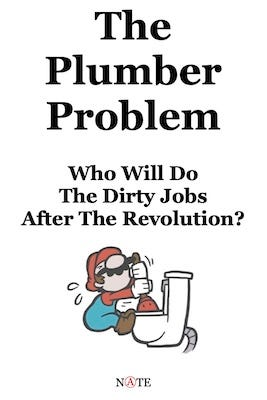

I’ve created zine (booklet) versions of some of my article series below for anyone who wants to read them on your eBook reader or print them out and share them with others.

## eBooks / Booklets

### Radical Star Wars

[Read eBook](https://drive.google.com/file/d/1vM96viiVyjRA4CeU-gXvoJ4ArHM_cI5n/view?usp=share_link) (40 pages) | Print Booklets - [U.S. Letter](https://drive.google.com/file/d/1aD5yhxpEMymR_PcReQ_WgPw0VSAt7EcT/view?usp=share_link) | [A4](https://drive.google.com/file/d/1PTbfs_rrtRIO4_2VRxLj1Hlg5QCkZp51/view?usp=share_link) | [Original Articles](https://peacefulrevolutionary.substack.com/p/star-wars-radical-origins)

Ever wondered how radical Star Wars really is? This zine dives deep into the revolutionary politics of the original ‘Star Wars’ movies and the ‘Andor’ TV series, exploring how these stories portray resistance against an authoritarian empire, even without space wizards and laser swords.

### Who Will Do The Dirty Jobs After The Revolution?

[Read eBook](https://drive.google.com/file/d/1-H2ZEL7q1_Jch3tvzLpqNo87FW4KgTQz/view?usp=share_link) (30 pages) | Print Booklets - [U.S. Letter](https://drive.google.com/file/d/11Q18DK04y1dJuSgsoWkWR4pM9yAr7jdg/view?usp=share_link) | [A4](https://drive.google.com/file/d/1sIC9fFs16580LON38k6cN0owe_7BRHJO/view?usp=share_link) | [Original Articles](https://peacefulrevolutionary.substack.com/p/who-will-do-the-dirty-jobs-after)

This tackles the common argument used against anarchism: ‘Who would do the plumbing without capitalism?’ It systematically dismantles this critique by showing how plumbing and other ‘dirty jobs’ have historically been done without monetary incentives, from ancient civilisations to modern communes, and explains how capitalism has actually made plumbing and other dirty jobs worse.

### Dystopian World Survival Guide _(draft)_

[Read eBook](https://drive.google.com/file/d/1CsWmrmlfaXR3JpaXXSD16guJwMOg59xF/view?usp=share_link) (26 pages) | Print Booklets - [U.S. Letter](https://drive.google.com/file/d/1kvEwQs7kX6lVW7bXGfeHwuD1ZMiy02T5/view?usp=share_link) | [A4](https://drive.google.com/file/d/1qACB14Hqb3mewY0WqXnKnTM-O6M-nwPb/view?usp=share_link) | [Original Articles](https://peacefulrevolutionary.substack.com/p/so-you-are-living-in-a-dystopia-what)

An ultimately hopeful and practical guide for resisting authoritarianism, firstly exploring how people respond to oppressive regimes, and then providing concrete steps for building community resistance. Beginning with fostering individual moral courage, extending to strong community networks, and organising the people and skills that’ll be needed to resist or overthrow a fictional dystopian authoritarian state.

 _Note: This is (probably) an ongoing work in progress, and may be revised as new sections are written, but should be enough for now to give a basic overview that might be worth sharing._

### Travelling Tea Monk Guide

[Read eBook](https://drive.google.com/file/d/1PD42LWiMDWqlXDny0mpQiiX670-v4IlM/view?usp=share_link) (24 pages) | Print Booklets - [U.S. Letter](https://drive.google.com/file/d/1xckFs0IgXKMF67qSOcXzAKcAEQSzA6r-/view?usp=share_link) | [A4](https://drive.google.com/file/d/1mn1zhZ-lXv_n-vA_D0LATR_U5jP8ECLb/view?usp=share_link) | [Original Articles](https://open.substack.com/pub/peacefulrevolutionary/p/so-you-are-living-in-a-dystopia-what)

This guide draws inspiration from Becky Chambers’ ‘Monk & Robot’ series to propose how the fictional role of ‘Tea Monk’ - someone who travels around offering free tea and compassionate listening to strangers - could work in our real world. It's both a practical handbook and a meditation on how small acts of generosity and connection could help build a more compassionate society.

## Printing and stapling the booklets

Pick, print, and fold the relevant version for your country   
(A4 for the world, Letter for North America)

 _Note: The Radical Star Wars, Dystopia & Tea Monk booklets may not print well in black & white yet. If you want them with alternative artwork let me know._

Staple the booklet along the fold with a long-armed or right-angled stapler.

Zines can be left in some independent bookstores, little libraries, cafes, bars, student accommodation, waiting rooms, record stores, flyer racks, radical spaces.

## Future Additions

When I’ve written a few more articles in the [Hierarchy](https://peacefulrevolutionary.substack.com/p/five-questions-of-power) and [Capitalism](https://peacefulrevolutionary.substack.com/i/149107761/capitalism-series) series I will post zine versions of them too. Some longer ongoing series may be released into book form, but the article versions will always be free.

## Disclaimer

Some of the images used within the zines are temporary ones with uncertain copyright status. If you are the creator of any of these images and would like to be credited or to have them removed please let me know.

Subscribe

[Share](https://peacefulrevolutionary.substack.com/p/radical-zines?utm_source=substack&utm_medium=email&utm_content=share&action=share)
