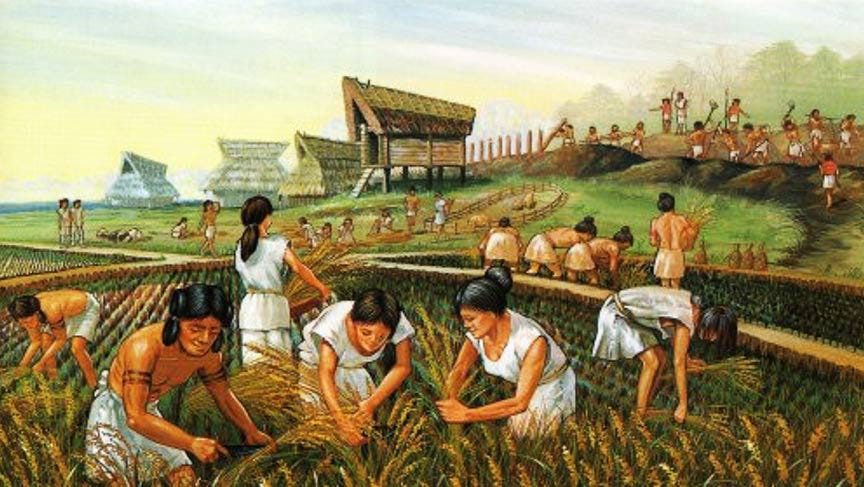
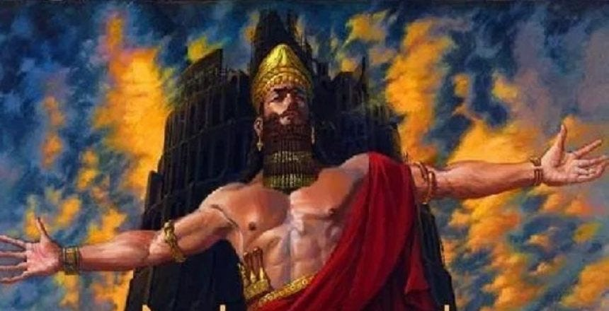

_There was a time when people were taught that our ancestors lived ‘Solitary, poor, nasty, brutish, and short’ lives. The man who came up with this idea, Hobbes, didn’t have any evidence for this, he just believed people were inherently evil because this was what his Calvinist religion taught him. Even when religion gave way to science early Darwinists such as Huxley still accepted this dog-eat-dog idea of ‘nature, red in tooth and claw’.1 However, others such as biologist and revolutionary, Kropotkin, believed nature was co-operative and that people could be too. Over time as biologists and anthropologists studied the past more closely they found this idea to be true, but it has been hard for society to shake the idea of a ruthless past and a selfish human nature._

## Early Humanity

Now we know that humanity once lived in small groups of ten to two-hundred. Those groups had no rulers, and lived as extended families.2 Sometimes men were hunters and women were gatherers, but often women hunted too and some men gathered. A nursing mother might stay home from hunting, or she might leave the child with another mother. A child was not just her child, it was the child of the community.

Women often held positions of significant social and spiritual importance having equal or - in some cases - greater social standing than men3, becoming highly respected knowledge-keepers, skilled in medicine, crafting, and food preservation. Their consistent presence in settlements allowed them to build strong social networks and alliances, potentially giving them considerable influence in community decisions. This is similar to the way of life our closest simian cousins, the Bonobo apes, live now.4

People were still people and had to deal with human problems, even if some of them may have been rarer. Occasionally someone would be born who struggled with anger, with regulating their own behaviour, who - despite multiple attempts at kind encouragement or even direct intervention - still proved to be a danger. When it reached this point, they might have to be exiled for the safety of others. But, sometimes would find another home among a different group that was better at dealing with or helping them.

What was more unusual during such times were people who sought to rule over others. A child might try this and find quickly that others didn’t follow, a particularly selfish teen might demand it, but he’d be ignored, an adult might want his way, but fail to convince other adults. That is until the day came someone succeeded.

##  **Property & The First Ruler**

 _As some groups began settling near rivers and lakes, they developed new ways of living. They learned to grow crops, tend animals, and store food for lean times._5 _These settlements didn't immediately change how people related to each other - they still shared resources and made decisions together. But settling down meant that, for the first time, some resources like water sources and fertile land became fixed points that everyone depended on. This created new possibilities for someone to control access to these vital resources._6

So the story of the first ruler was something like this: One group of people settled down next to a lake, where they would get their drinking water, water their animals, and irrigate their crops. One day a man who lived next to the watering hole decided he should be the one to look after it. Perhaps others thought he was being helpful or was just eccentric, but for whatever reason they went along with it. As we will see, this would become the origin of **hierarchy** , of a system in which one person potentially rules over another.

This was before the idea of money existed, before there was even trading or barter. People simply shared what they had - if someone caught a deer, everyone ate; if someone gathered berries, they were distributed among all. Everyone had access to what they needed, and if anyone took more than what they needed the rest would take it back. There was no need for exchange because the community worked together to ensure everyone's needs were met.7 There were no **commodities** , no-one sold or artificial restricted anything.

But the person who set themselves up as lord of the land on which the water hole was started asking people to give him extra grain in return for access to it. Maybe he convinced them he’d keep it in storage in case it was needed, maybe they had plenty to spare and just indulged his strange request. Maybe some objected, but didn’t think it worth removing him from his self-appointed position. This was the origin of ‘private’ (profit-producing) **property** (instead of personal property).

Then one day this ‘land lord’ started demanding more for people to access the water, he set up a little dam to the irrigation channels too, so others couldn’t have water downstream without him opening them up. Some definitely objected to this and went to give him a piece of their mind, only to find that this ‘lord’ now had protection. This lord had promised a very strong local man to guard the water in return for extra grain, and he would thump anyone who tried to access the water without his lords approval. This was the origin of the **police and laws**.

This new land lord isn't content just to rule by fear or force. He wants to be respected too, he wants others to know that he - or his guards on his behalf - are an essential part of the community. So he tells them he is also protecting the water hole from evil outside tribes who might try to take over or pollute the water hole without him there, so they should be thankful for him keeping it safe. Now he has created **racism and xenophobia** and is using it to his advantage.

This gives him the excuse he needs to invent a fence, like the kind others had begun using for chickens or goats, but this time for the waterhole, the grain, his house, and maybe eventually the whole community. Safe inside, dangerous outside. Protecting the people (supposedly) from the outsiders, and protecting this ‘owner’ from the people. He has invented **borders**.

Now the land hoarder sees himself as a businessman. He invented a water hole guarding system, a grain storehouse, gave young people employment, and believes he fulfils an important role in the community. Thus he has created the world’s first **company**.

Some people are still not happy with this arrangement so the lord of the land employs someone new to help him seem even more like a hero. In the village there was a local storyteller who everyone loved the tales of. The lord promises him a more leisurely life without having to work for grain if he can just come up with a new story, one in which the waterhole owner isn’t just a landlord, but was sent to protect the people by the lord of all landlords in the sky. Not only that, but if the people respected the landlord’s position, by paying, obeying, and serving him they would be guaranteeing themselves a chance at endless access to water holes and grain in heaven after they die. Thus **religion** **(and public relations)** was invented.

But this businessman, landlord, and religious leader is lonely, and he has no one he feels he can truly trust. Fortunately for him one man whose crop failed that year is unable to pay him, and this lets the lord ask for the man’s daughter as a wife in return for grain. By this time people have begun to to stop sharing as freely, following the landlord’s example of hoarding. So, regrettably the peasant hands her over rather than let the rest of his family starve.

His new wife bares him daughters and sons, but he favours the sons. They look like him, they won’t be traded like property as his wife was and daughters might be, and they can pack a punch to keep people in line a little more forcefully. As he gets older he passes responsibilities over to the eldest of his sons, the younger ones following his example and setting up similar lordships elsewhere in the region. This is the origin of **sexism and patriarchy**.

Those sons sometimes work together to take over other lands where people share more equally so they can have their resources, inventing armies in the process, and they mutually defend each others when it is in their interests, forming the first **nation state**.

##  **The Origin Of All The World's Problems**

We started with one man believing he had the right over land that once belonged to others - a land hoarder who charged people for access to what they could once use freely, who convinced a few others to do his bidding in return for some future reward. And what did this give us? What did we end up with?

The world's first landlord, who was the first employer, who paid the first policeman, established the first borders, and even introduced the idea of racism, religion and patriarchy and of nations and borders along the way.8

I don't think it would take much imagination to see how this ultimately leads to … armies, banks, corporations, and environmental destruction and disaster. None of them could exist without this idea of commercial property: Property that makes and is worth money just by someone claiming that they own it privately.’ This goes by another name: ‘Capital’, and ultimately becomes the origin of ‘ **Capitalism** ’.9

But it is important to remember that most of these problems come from just a few people. Most people don’t want to rule over others, don’t want to force others to do things. The way things are now is not the way they have been most of humanity’s history, and this gives us reason to believe they don’t always need to be this way.

This is why I don’t believe in hierarchy or in one person owning something others need. I consider it immoral for someone to claim they have a right to rule over someone else and to threaten force to maintain that power, or to exclude someone else who is hungry from what they need when they already have more than enough, just so that they can make a profit, and force others to be their workers or customers. 

But even in today's hierarchical, capitalist world, humans still haven't lost their fundamental capacity for cooperation and mutual aid. Every day, people still form deep friendships, fall in love, show compassion to strangers, and create communities of care. When disasters strike, most people's first instinct isn't to compete or profit, but to help each other. Workers still organise against exploitation, communities still share resources, and people still find ways to build meaningful lives outside the logic of profit and power.

These aren't just pleasant accidents - they're glimpses of our true nature breaking through the cracks in the system. The same cooperative spirit that shaped most of human history still lives in us today. This means that the ‘lords’ of our world, for all their power, are building their empires on unstable ground. They need us far more than we need them. And perhaps, just as humanity once lived without rulers, we might one day take our world back from those who claim to own it.

> ‘The first man who, having fenced off a plot of land, thought of saying, 'This is mine' and found people simple enough to believe him was the real founder of _civil_ society. How many crimes, wars, murders, how many miseries and horrors might the human race had been spared by the one who, upon pulling up the stakes or filling in the ditch, had shouted to his fellow men: “Beware of listening to this impostor; you are lost if you forget the fruits of the earth belong to all and that the earth belongs to no one.”’ _(Jean-Jacques Rousseau, ‘Discourse on Inequality’, The Social Contract and Discourses, p. 84.)_

Subscribe

[Share](https://peacefulrevolutionary.substack.com/p/how-the-world-became-this-way?utm_source=substack&utm_medium=email&utm_content=share&action=share)

So why do most people believe a completely different story now?

### Entitlement Series

If you liked this consider reading more of the [The Universal Entitlement Series](https://peacefulrevolutionary.substack.com/about#§entitlement-series)

& Here is another story linking property and hierarchy you might find interesting:

1

You can learn more of this history in my article, ‘[Were We Born Evil?](https://peacefulrevolutionary.substack.com/p/were-we-born-evil-or-did-capitalism)’

2

Christopher Boehm's ‘Hierarchy in the Forest: The Evolution of Egalitarian Behavior’ (1999) & Richard Lee's ‘The !Kung San: Men, Women and Work in a Foraging Society’ (1979)

3

Eleanor Burke Leacock's ‘Myths of Male Dominance: Collected Articles on Women Cross-Culturally.’ (1981) & Maria Gimbutas's ‘The Living Goddesses’ (2001) for archaeological evidence.

4

Frans de Waal's ‘Bonobo: The Forgotten Ape’ (1997) & ‘The Age of Empathy: Nature's Lessons for a Kinder Society’ (2009).

5

James C. Scott's ‘Against the Grain: A Deep History of the Earliest States’ (2017).

6

David Wengrow and David Graeber's ‘The Dawn of Everything: A New History of Humanity’ (2021)

7

Anthropologists have found many examples of such gift economies in indigenous societies, where giving and sharing built strong social bonds rather than creating debts. David Graeber's ‘Debt: The First 5000 Years’ (2011) & Marcel Mauss's ‘The Gift: Forms and Functions of Exchange in Archaic Societies’ (1925).

8

Peter Gelderloos's ‘Worshiping Power: An Anarchist View of Early State Formation’ (2017)

9

See my article, ‘[What Is Capitalism?](https://peacefulrevolutionary.substack.com/p/what-is-capitalism)’ for further context.
