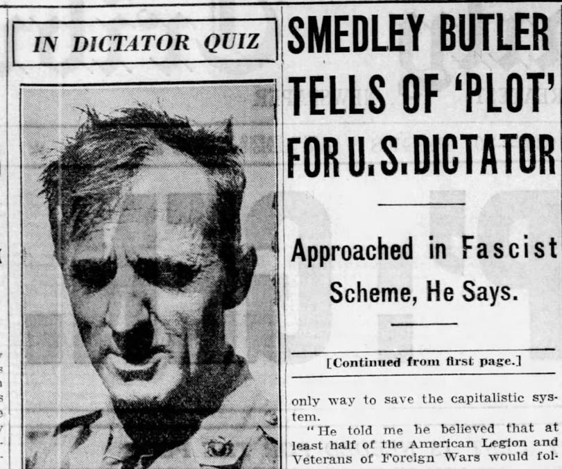
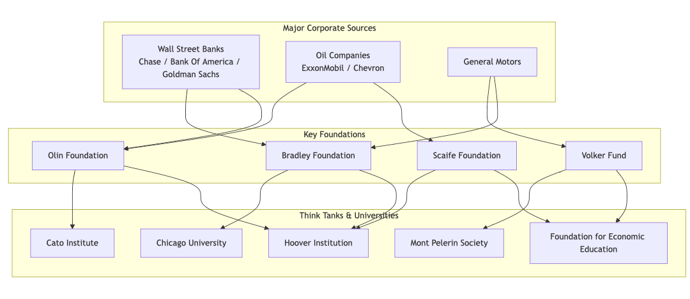
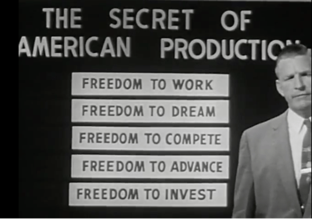
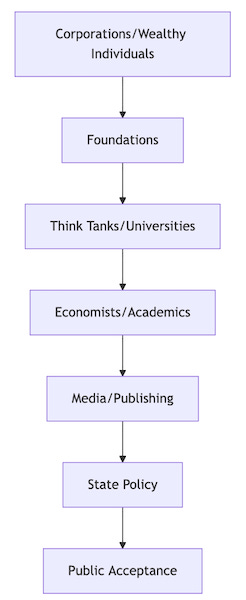

This is the story of the greatest con job in history1, a well–documented conspiracy still affects all of our lives negatively today, so buckle up because your in for quite an intellectual ride.

 _This is the shorter version of the article, you can read the longer one[here](https://medium.com/free-thinker/the-capitalist-empire-strikes-back-b2ec0d53f92d)._2

###  **The Birth of Corporate Propaganda**

 _ **Preface**_

 _In the bustling intellectual circles of the mid-19th century, socialists first gave name to their adversary: ‘capitalism.’_3 _These early critics, including the provocative Proudhon and the analytical Marx, didn't simply rail against this opponent; they studied it closely, even acknowledging its achievements. Marx, particularly, saw capitalism as a possible stepping stone towards his envisioned future, turning capitalists' own economic theories against them to expose what he saw as inherent exploitation. However, Anarchists warned that Capitalism was in danger of becoming yet another unjust hierarchy._

 _As the story of Capitalism unfolded, the early successors to Adam Smith maintained this spirit of critical inquiry. Men like David Ricardo, despite his success as a stockbroker, didn't shy away from acknowledging class conflicts. Malthus worried about economic crises, while economists Say and Marshall advocated for government's role in the economy. These weren't ideologues defending a system, but scholars trying to understand its complexities._

 _Then along came Maynard Keynes, who revolutionised economic thinking by rejecting the idea that markets naturally fix themselves. He argued for government intervention to maintain employment and social stability, helping shape the New Deal and post-war economic order. Understanding the outsized influence economists wielded over society, he insisted their power should serve public good rather than private profit. This approach awoke the Capitalists who could see their power being undermined if this was allowed to continue, and they began plotting their revenge._

 _ **Defending the Faith**_

When did capitalism transform from a system to be studied into a faith to be defended? The answer lies in the 1930s, when corporate America faced its first real challenge to its power. The transformation of economics from analytical study to ideological defence wasn't driven by new evidence or improved understanding, but rather by concentrated corporate efforts to reshape public opinion. The catalyst was the New Deal era, which corporate leaders saw as an existential threat to their dominance. Their response was swift and coordinated - in 1934, the American Liberty League was formed by prominent businessmen including leaders from DuPont, General Motors, and Standard Oil, explicitly to combat Roosevelt's policies and promote pro-business ideology.

The extent of corporate opposition to the New Deal went beyond mere propaganda. In the same year, retired Marine Corps Major General Smedley Butler exposed what became known as ‘The Business Plot’ - a conspiracy by wealthy businessmen to overthrow Roosevelt in a military coup. While the plot never materialised, congressional investigations confirmed that prominent business figures had indeed approached Butler about leading such an effort, demonstrating the lengths to which some corporate leaders would go to counter New Deal reforms.

This period saw the deliberate construction of an intellectual infrastructure to promote pro-business ideas. The National Association of Manufacturers launched an extensive propaganda campaign in the 1930s, spending millions on media, educational materials, and economist funding. They explicitly aimed to associate capitalism with ‘freedom’ and government regulation with ‘tyranny’ - rhetorical frameworks that would later become central to neoliberal thought.

The post-war period saw corporate efforts expand into an unprecedented campaign of ideological influence. As documented in Kim Phillips-Fein's ‘Invisible Hands’ and Nancy MacLean's ‘Democracy in Chains,’ corporate leaders developed a sophisticated network that touched every aspect of American intellectual and political life. They established and funded think tanks like the Foundation for Economic Education (1946), the Mont Pelerin Society (1947), and the American Enterprise Institute (expanded 1943), while simultaneously building influence through corporate foundations, media ownership, and political lobbying organisations.

The U.S. Chamber of Commerce launched an aggressive political program, coordinating these various elements into a coherent force for change. This network had an explicit mission: to counter socialist and Keynesian economic ideas, promote free-market ideology, influence policy makers and public opinion, reshape economic education, and build political opposition to regulation. The success of this coordinated effort was reflected in internal documents, particularly in a telling 1950 National Association of Manufacturers memo which stated: ‘The only way to compete with the emotional appeal of the welfare state is to invest in the creation of free market ideology that can capture the public imagination.’

### Engineering Consent

 _ **How Business Reshaped Economic Education**_

The industrialists' strategy to reshape American economic thought was systematic and long-term, realising that direct confrontation with an organised, class-conscious workforce would be counter-productive. As internal documents from the National Association of Manufacturers later revealed, they explicitly chose to focus on ‘capturing the minds of the next generation’ through education and cultural influence. The Foundation for Economic Education clearly stated this strategy in their 1947 report: ‘If we can train teachers in the fundamentals of free enterprise, they will naturally pass these ideas on to thousands of students.’

At the university level, corporate interests pursued a complete transformation of economic education. They systematically established funded chairs and research centres dedicated to free-market economics across major universities. These weren't merely donations - they came with explicit expectations about the type of economic theory that would be taught and researched. As William Volker Fund director Harold Luhnow noted in 1950: ‘We need to create a new generation of economists who understand the superiority of free markets.’ Graduate students received fellowships to study market-friendly approaches, creating a pipeline of economists such as Milton Friedman who would go on to spread these ideas throughout academia. Business schools, heavily funded by corporate money, became bastions of free-market ideology, training future business leaders in the ‘science’ of unregulated capitalism.

The high school strategy was equally comprehensive but more subtle. By providing free educational materials to cash-strapped schools, corporate interests could shape how economics was taught to teenagers. A 1952 memo from General Electric's education committee stated: ‘We must create emotional attachment to free enterprise among young people before they encounter union and leftist influences.’ Teacher training programs offered professional development opportunities that subtly indoctrinated educators in free-market principles. Student competitions and economics clubs, generously funded by business groups, made learning about ‘free enterprise’ seem exciting and rewarding. The textbooks, carefully crafted to present corporate-friendly perspectives, became the standard resources for teaching economics in American high schools.

Cultural programming represented perhaps the most sophisticated aspect of this strategy. Understanding that young people's values are shaped by their culture, corporate interests invested heavily in creating media that would promote capitalist values. They produced radio shows and television programs that celebrated business success stories, published children's books that normalized market principles, and even created comic books that portrayed free enterprise as exciting and heroic. Sports sponsorships associated capitalism with popular athletes and teams, creating positive associations that bypassed critical thinking.

The institutional infrastructure supporting this effort was impressive. Junior Achievement, founded in 1919, got corporate executives directly involved in schools, mentoring young people and shaping their understanding of business and economics. The American Economic Foundation specialized in producing educational materials that made complex economic concepts accessible while subtly promoting pro-business perspectives. The Foundation for Economic Education served as a crucial link between academic economics and public education, translating free-market theory into practical educational resources.

This approach succeeded largely because it didn't appear to be propaganda. By working through trusted institutions like schools and youth organizations, by providing genuinely useful resources and professional development opportunities, and by creating clear career pathways for those who embraced these ideas, the program appeared to be simply providing valuable educational services. The political nature of this education was carefully obscured, making it seem like objective truth rather than ideological instruction. As one Chamber of Commerce document from 1960 noted: ‘We are seeing the fruits of our educational investments as young people emerge from universities with a proper appreciation for the American business system.’

### Making the World Safe for Business

 _ **How Capitalism Was Imposed Abroad**_

The ideological battle for capitalism wasn't confined to domestic propaganda - it manifested in direct international intervention, often with devastating humanitarian consequences. As General Smedley Butler (mentioned earlier) later admitted: ‘I spent 33 years and four months in active military service... I was a racketeer, a gangster for capitalism... I helped make Mexico safe for American oil interests in 1914. I helped make Haiti and Cuba a decent place for the National City Bank boys.’ This global counter-revolutionary strategy operated through multiple channels, combining economic pressure, political subversion, and military force.

The overthrow of democratically elected governments during the Cold War wasn't merely ideological - it represented a complex partnership between corporate interests and state power. ITT's involvement in Chile exemplified this relationship, with CEO Harold Geneen unironically stating in a 1970 memo to CIA contacts: ‘I don't care what you have to do, but get rid of that bastard [President Allende]... spend what you have to spend, but don't let that son of a bitch stay there.’ This corporate-state alliance was openly acknowledged by CIA Director Allen Dulles, who testified to Congress in 1953: ‘In any country where there are American business interests, their protection becomes a matter of national security.’

> US Ambassador to Chile Edward Korry: ‘Not a nut or bolt shall reach Chile under Allende. Once Allende comes to power we shall do all within our power to condemn Chile and all Chileans to utmost deprivation and poverty.’

This corporate-state alliance operated through sophisticated networks of influence and control. Companies would identify threats to their interests - usually in the form of nationalist governments considering resource nationalization or labour rights - and activate multiple pressure points simultaneously. Financial warfare came first: manufacturing financial panic, manipulating local currency markets, and restricting credit access. Political destabilization followed, with corporations funding opposition groups, controlling media narratives, and lobbying for international isolation.

The World Bank and International Monetary Fund served as powerful tools in this process. Their ‘structural adjustment programs’ typically demanded privatization of national resources, removal of labour protections, and opening markets to foreign corporations - all presented under the neutral-sounding language of ‘market reforms’ and ‘economic freedom.’ As Henry Kissinger cynically observed about Chile in 1970: ‘I don't see why we need to stand by and watch a country go communist due to the irresponsibility of its own people. The issues are much too important for the Chilean voters to be left to decide for themselves.’

The human cost of these interventions was staggering. In Indonesia, over a million suspected communists were killed in a U.S.-backed purge that cleared the way for corporate resource extraction. Chile's ‘economic miracle’ under Pinochet was built on the torture and disappearance of tens of thousands of union activists and leftist intellectuals. The Congo's resource wealth became a curse, as mining interests supported military forces that killed millions.

The economic transformation was equally profound. Previously independent economies were restructured to serve foreign corporate interests. David Rockefeller's 1976 assessment of Pinochet's Chile revealed this mindset: ‘What we are seeing here is a free market economy... The Chilean economy has done remarkably well under very difficult conditions.’ National industries were privatized at fire-sale prices. Labour unions were crushed, wages suppressed, and environmental protections eliminated. The result was a new form of economic colonialism, where formal political independence masked deep economic submission to foreign corporations and capitalist nations.

## The Triumph of Neoliberalism

 _ **How Market Fundamentalism Won**_

The rise of neoliberalism marked a radical shift in capitalist ideology, moving from traditional conservative nationalism to a globalist free-market fundamentalism. What began as an extremist economic philosophy in the post-war period would eventually become the dominant global ideology by the century's end.

This transformation occurred through deliberate intellectual and political engineering. The Mont Pelerin Society, founded in 1947, initially seemed a fringe group of economists and philosophers advocating for an almost unlimited free market. Their ideas - complete deregulation, unlimited global trade, massive privatisation, and the reduction of all human activity to market transactions - would have appeared dangerous to most 1950s conservatives, who still believed in national sovereignty and some degree of social responsibility.

Yet through patient institutional building and massive corporate funding, these ideas gradually gained academic respectability, particularly at the University of Chicago. The economic crises of the 1970s provided their opportunity. As Keynesian economics struggled to explain stagflation, neoliberal thinkers presented their radical free-market ideas as the only alternative. When Thatcher and Reagan came to power, these previously marginal ideas suddenly had powerful political champions.

The transformation was remarkably successful. Thatcher's declaration that ‘there is no alternative’ to market fundamentalism was proven true not by economic success, but by the conversion of nominal opposition parties to the neoliberal cause. Her infamous assertion that ‘There is no such thing as society... There are individual men and women and there are families’ perfectly encapsulated neoliberalism's radical individualism. Labour under Blair, Democrats under Clinton, and Social Democrats across Europe abandoned traditional left-wing policies in favour of what was dubbed the ‘Third Way’ - essentially neoliberalism with a human face. Clinton's proclamation that ‘The era of big government is over’ showed how completely the opposition had embraced these ideas.

The consequences were profound. Union membership collapsed, wages stagnated while productivity soared, and inequality reached levels not seen since the 1920s. Public services were privatised, social housing sold off, and education increasingly leading to indebtedness. Even language changed - citizens became ‘customers,’ patients became ‘clients,’ and human worth became measured purely in market terms.

The 2008 financial crisis, rather than ending neoliberalism, showed its remarkable durability. Under Obama, whose statement ‘I believe in the free market... I believe in a light touch when it comes to regulations’ demonstrated the continued dominance of neoliberal thinking, the response was to rescue banks while imposing austerity on working people. The influence of the University of Chicago (where Obama taught for 12 years) was evident in his administration's preference for market-based solutions like the Heritage Foundation inspired Affordable Care Act over public alternatives like Medicare for All. Even when neoliberal policies failed, neoliberal assumptions remained unchallenged in corridors of power.

The result has been a world where economic logic dominates all aspects of life, where every human interaction is seen as a market transaction, and where concepts of public good or collective welfare are dismissed as outdated. The rise of neoliberalism represented not just a change in economic policy, but a fundamental reordering of society and human values, transforming citizens into consumers and communities into markets.

### Beyond the End of History

 _ **Capitalism's Final Stage**_

The fall of the Soviet Union in 1991 led to triumphalist declarations about capitalism's final victory. Francis Fukuyama famously proclaimed ‘the end of history,’ suggesting liberal democratic capitalism represented humanity's highest political and economic achievement. Corporate leaders and neoliberal economists predicted an era of unprecedented prosperity as markets opened globally and capitalism spread uncontested, but their predictions only came true for a few and not for long.

The ‘triumph of capitalism’ in the 1990s masked how globalisation was fundamentally restructuring both work and society. Manufacturing regions that had sustained communities for generations saw their factories relocate to countries where labour costs were fraction of Western wages. Cities like Detroit, Manchester, and Turin - once proud symbols of industrial might - became monuments to corporate abandonment. This wasn't a natural evolution, but a deliberate strategy: corporations could now threaten to relocate anytime workers demanded better conditions or communities sought environmental protections.

The roots of this transformation lay in the 1970s, when the historic connection between worker productivity and wages was deliberately broken. While productivity continued to rise, real wages stagnated – a shift that coincided with the systematic weakening of unions and the rise of shareholder power. CEO compensation, increasingly tied to stock performance rather than worker welfare, skyrocketed from roughly 20 times the average worker's salary in 1970 to over 300 times by the 2000s. This wasn't just an economic shift but a power shift: as economist Thomas Piketty noted, ‘The history of inequality is shaped by the way economic, social, and political actors view what is just and what is not, as well as by the relative power of those actors.’

The impact on labour was profound. Workers who had expected to follow their parents into stable factory jobs found themselves in precarious service work instead. Those who kept their manufacturing jobs faced constant pressure to accept worse conditions or see their jobs moved overseas. Professional and office workers, initially feeling immune, soon discovered their jobs could also be outsourced or automated. The message was clear: no worker, regardless of skill level or education, was secure in this new global economy.

When the 2008 crisis hit, it revealed how thoroughly finance had invaded every corner of ordinary life. What began as a subprime mortgage crisis quickly cascaded through the entire financial system, exposing how major banks had built a house of cards on predatory lending and high-risk trading schemes. Ordinary people discovered their pensions, homes, and savings were all entangled in this web of speculation. The crisis wiped out $19.2 trillion in household wealth in the US alone - wealth that represented decades of work for many families.

The public response to the crisis marked a turning point in how people viewed capitalism. As economist Mark Blyth observed, ‘The 2008 crisis didn't just destroy wealth; it destroyed the legitimacy of the system that created it.’ The contrast was stark: while millions lost their homes and savings, the banks responsible received trillion-dollar bailouts. ‘Too big to fail’ became a bitter phrase among the public. When Occupy Wall Street emerged in 2011, its slogan ‘We are the 99%’ resonated globally because it captured a fundamental truth: the system was working exactly as designed, but it was designed to benefit a tiny minority at the expense of everyone else.

 _ **Time to Choose: Waiting for Collapse or Building Change**_

This realisation has had lasting effects. Young people, facing student debt, unaffordable housing, and precarious work, began questioning capitalism itself. Labour militancy returned, with strikes reaching levels not seen in decades. Socialist ideas, long considered dead, re-emerged in mainstream discourse. Even business publications like the Financial Times began running articles asking if capitalism needed fundamental reform. As economist Wolfgang Streeck observed, capitalism now faced a crisis of democracy itself: having promised prosperity through globalization and deregulation, it delivered insecurity and inequality instead.

We stand at a crucial point in history and have a critical decision to make: we can either hope and wait for this system to collapse under its own contradictions, potentially leading to a long painful process back to recovery which will come at huge human cost, or we can actively work to shape what comes next, replacing this dysfunctional economic system with a more fair world in which everyone’s needs are met. The human cost of waiting to do something is too high, we have already been paying far too deadly a price for Capitalism already, and if we let it go on as it has been we wont have much of a world left to save.

 _This article can be seen as both a sequel to my last article on ‘[How The World Became This Way](https://peacefulrevolutionary.substack.com/p/how-the-world-became-this-way)’ and ‘[The Real Conspiracy](https://peacefulrevolutionary.substack.com/p/the-real-conspiracy-capitalism)’. The next article in this series. ‘The Cult Of Capitalism’ will look into what specific false ideas Capitalists wanted the public to accept and who they got to promote them._

### Capitalism Series

If you liked this consider reading more of my [series on Capitalism](https://peacefulrevolutionary.substack.com/about#§capitalism-series)

Subscribe

[Share](https://peacefulrevolutionary.substack.com/p/the-capitalist-empire-strikes-back-284?utm_source=substack&utm_medium=email&utm_content=share&action=share)

1

At least since some monkeys convinced the rest of us to leave the trees.

2

The other version of this article is about two thousand words longer in the form of two introductory sections, summaries throughout, and about sixty footnotes. It was too long to send in an email newsletter.

3

See ‘[What Is Capitalism?](https://peacefulrevolutionary.substack.com/p/what-is-capitalism)’.
