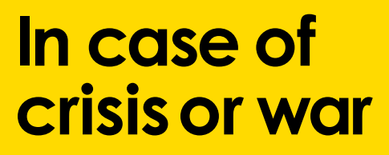
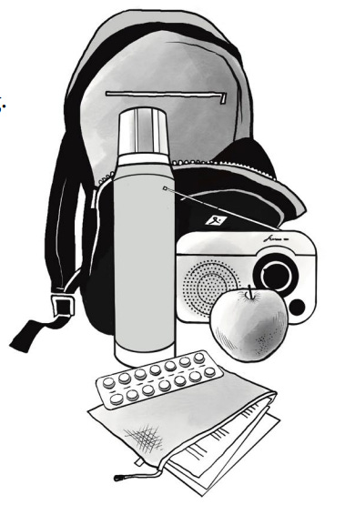
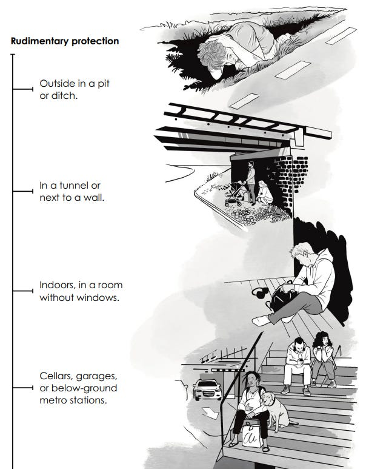

_This is different from my usual political and social commentary, but I thought might be of interest to some here, even some not in the U.K._

I grew up watching apocalyptic films like ‘Threads’1 and ‘When The Wind Blows’2 about the aftermath of a nuclear war with Russia. At the time such an outcome seemed very likely, but with the collapse of the U.S.S.R. the world breathed a sign of relief, as the fear was finally over, or so we thought. 

With the recent escalating tensions between Europe and Russia, Germany, Denmark, Finland, Norway, and Sweden have all recently produced (or updated) guides for the public about the potential of war in response to the prospect of Russia attacking beyond the borders of Ukraine into mainland Europe.

Although the U.K. updated its dealing with radiation guide for local authorities3 in September4, it says this is just coincidence, and either way it doesn’t cover many of the other kinds of preparations for war other European guides do. The government has [general preparedness and emergency guides](https://prepare.campaign.gov.uk/get-prepared-for-emergencies/), but they are primarily focused on weather emergencies. These still have some useful information, but not as comprehensive or relevant to times of war.

Interestingly the [U.K. Red Cross emergency guide](https://www.redcross.org.uk/get-help/prepare-for-emergencies) also deals with terrorist attacks (run for your lives!) I didn’t think these were that likely but who knew that the current U.K. threat level is ‘substantial’?5 This is perhaps - in part - due to the recent suspected Russian sabotage incidents in Britain.6

But when it comes to war we might think that in the U.K. we don’t need to worry, but that’s not what the military is telling the government publicly.7 The need for such a war guide does seem to be on their radar, but they haven’t produced a guide as yet.8 So, having found copies of the Swedish and Finnish guides online I’ve reviewed them and produced an overview of the advice that seems to apply in the U.K. too.9

 **Why is this happening?**

The U.K. government (as part of NATO) has been sending military weapons to Ukraine to be used against Russia, and is talking of sending soldiers, at least in a support capacity. This doesn’t make Putin happy. Fortunately he often doesn’t follow through with his threats, but when he does sometimes it really commits, so it pays to be prepared.

 **How will I know if anything happens?**

‘Watch the skies!’10 Just kidding, if you see something in the sky things have gone really wrong, so watch the news instead. Not the talk news (GB News or Talk TV), or YouTube or TikTok opinion pieces, but the BBC and Channel 4 TV news, or The Guardian and Independent newspapers.11 The government will probably err on the side of only giving out sparse information, so also look around you at the conditions and the reality of what you are seeing where you are.

It is quite likely that nothing will escalate beyond words and worries, and that concessions will be made that let Putin claim some victory and Ukraine some reprieve. But just in case that doesn’t happen it pays to be prepared like those in other European countries are urging their citizens to be.

 **Military Response**

If this conflict does escalate Russia will probably initially go for easier closer targets than the U.K., and they may want to avoid taking on the British military (which is the largest in Europe), but an attack against a nearby fellow NATO member could lead to troops being deployed to the Russian border.

 _Note: England does not have mandatory conscription at the moment, so unless you are part of the Territorial Army it is unlikely you’d get called up. But in a prolonged conflict this could change, firstly with recruitment drives and then a possible draft. Exceptions for contentious objectors are not clear nor guaranteed,_12 _so you may wish to consider what role you’d want to play in such a conflict if any._

 **Personal and Family Preparation ( & Pets too)**

When the Scottish government tried to encourage people to have an emergency bag they were made fun of13 \- some people won’t believe they should do any preparation until bombs are falling and by then it will be too late. What’s the worst that would happen from having a bag in a closet or under the bed that never gets used? Now imagine how much worse the first three days after losing power or losing your home might be if you didn’t have that bag.

 **A 72 Hour Pack (Bug Out Bag)**

If you need to leave your home and travel then a large backpack filled with essentials for each adult could make a major difference in making that process more bearable and in extreme cases may save your life. With a waterproof bag you should pack:

  * Food and water to last for 3 days, along with cutlery and a tin opener.

  * Medicines and plasters.

  * Toiletries and hygiene products.

  * Prepacked extra set of clothing and waterproof poncho.

  * Radio powered by batteries, solar panels or crank.

  * A torch and / or lamp or headlamp with batteries.

  * Mobile phone and pre-charged power bank.

  * A local map and compass.

  * Photo ID, debit or credit card, and cash.

  * Water filters, water carrying jugs or bottles.

  * Matches, lighter and / or fire starter.

  * A notebook with important info in it and pens.

  * If possible - a small tents and sleeping bags or tarps. 

  * The pocket version of the SAS Survival Handbook (or one of several similar guides).

You can of course buy pre-made kits, which are usually more expensive than you can assemble yourself, but save time if you have the money to buy them. Personally I’d encourage you to build your own, if only so you’ll be aware of what goes into it, can build it up as you can afford it, and play with some of it as it comes through to familiarise yourself with it in case you need it.14

That covers if you have to venture out of the house but you may be stuck or have good reason to stay in the house instead, at least initially.

 **Home Preparations**

The temperature may drop rapidly without electricity or gas working have warm and waterproof clothing and good walking shoes that you could sleep outside wearing if you needed to, along with extra blankets in the house to keep out the cold.

I’d advise another house radio that uses batteries that you have an extra supply of batteries for, this will help maintain a connection with outside information and make you feel less isolated if the electricity goes out.

Among the food and other items you may want to store in the house:

  * Non-perishables: Grains, cereal, pasta, rice, couscous, instant mashed potatoes, milk powder, tortillas, and crackers,

  * Salt, pepper and other herbs and spices.

  * Tinned goods: Tomatoes, vegetables, soup, fruit, and ready-to-eat meals.

  * High-protein: Dried or tinned meat and fish, chickpeas, beans, and lentils.

  * High-fat: Cooking oil, pesto, sun-dried tomatoes in oil, peanut butter, nuts and seeds.

  * Energy boosts: Fruit jam, chocolate, honey, protein bars, and dried fruit.

  * Drinks: Coffee, tea, hot chocolate mix, squash, juice, or milk.

  * Food for children: Infant formula, oatmeal, and baby food.

  * Camping stove, gas burner, fuel. 

  * 2-3 Torches (flashlights) in easy to reach places throughout the house, and long life candles (with matches).

  * Toiletries such as: toilet paper, hand sanitiser, menstrual products, and garbage bags. Note: If you cant flush the toilet don’t use the toilet - use a bag!

Our little British houses rarely have much storage space and not everyone has a garage or storage shed, but you can easily fit a weeks worth of food for a family of four under a single bed if you want to. But water is the most important thing for you to store, in containers or bottles in a cool dark place if possible. If you have a garden of balcony consider getting a container large enough to collect rainwater if needed. Either way filters are cheapish, and you are never far from fresh water in the U.K. 

**Those Who Need Extra Help**

If you have children you may want to quickly bring a favourite toy for them if you have time to, and maybe something to draw with. The best thing you can sometimes do is distract them when they don’t need their attention on the difficult things happening, but also prepare them beforehand in case you need their attention and help. Make it an adventure or a game if you can, as long as if you need them to take it seriously they can do that too (depending on age and capacity).

If you have elderly parents or you or your partner have mobility problems you will want to make preparations to get by if you can’t rely on a lift, a disability vehicle, or anything that requires electricity. 

You may need to keep extra food and water for your pets too. It would be good to also invest in a feeder so that if you have to leave them at home they are able to eat. If they are not too big you should have a carrier for them, and ideally a collar that will give information to help identify them and you.

 **Medical & Mental Health**

Those who are reliant on regular medical care would benefit from storing extra medication if possible, and seek extra help where they may need assistance. Let any groups which are helping know about them early on.

If the internet is still available people may spread rumours, very often of the worst possible case scenarios, they may suggest dubious ways to protect or medicate yourself. Take it all with a pinch of salt, maybe even two pinches just to be sure. You might want to moderate your negative news intake, if there are ongoing developments perhaps you can take turns with others to listen in.

Keep a favourite book with you to read (and to read to others), card games that you can play solitaire or rummy with, and if someone has a musical talent (and silence isn’t necessary) some tunes or songs can lift spirits. (But be aware if you feel like making music that maybe not everyone will appreciate your ukulele renditions of Streisand ballads).

 **Emergency warning systems**

You aren’t going to hear any sirens, at least unless you live on a military base or there is a flood. The U.K.-wide early warning system was largely dismantled in the early 1990s (except on some military bases, or some still used in flood areas). Instead you will receive emergency alerts on your cell phone:15 Undoubtedly will be television and radio reports too giving updates as they receive them. But by the time you hear such a warning you probably won’t have a chance to go shopping for anything you might need, which leads us to …

 **Knowing Where To Go**

If Britain were attacked it would most likely be military targets first, then possibly large population centres, focusing on airports, power stations, and major roads. So if you are out in the middle of the country and far from any military bases you are less likely to be affected, but also may find it difficult to get supplies. In most cases wherever you are staying in and close to home may be your best option, until it isn’t.

I was pleasantly surprised to discover that local councils should have emergency shelters available in the event of catastrophes, they are called [community places of safety](https://www.gov.uk/local-planning-emergency-major-incident) and include 24 hour access, disabled access, toilets, heating, and basic kitchen facilities. 

However, these are not underground shelters and are primarily meant for responding to natural disasters. So you will want to scope out where might be safer in the event of your area being bombed or other kinds of attack. England has very few bunkers that are still intended for quick occupancy, and they are mostly for politicians or royals. But there are lots of abandoned ones if you can get in them.16

Otherwise you are probably better off staying inside: Cellars, garages, rooms without windows, and underground car parks for inside options; Under bridges, in tunnels, ditches, and next to walls if outside.

If you have a car you will want a full fuel tank is possible or a charged battery. However, without lots of warning getting out by car might prove impractical if not impossible, but a bicycle might come in handy to get somewhere locally more quickly than on foot. Have a plan to put up your nearby friends or family, or to stay with them if needs be. But if there is a fear of radiation or chemical warfare you won’t want to venture out for a while.

 **Mutual Aid**

Now is the time to get to know your neighbours, to know their names, needs, and pet peeves, as they may yet need your help or you theirs, and you may come to rely on each other.

Maybe one of them knows first aid or has even more medical skills, maybe another is a keen camper and knows how to get by in the outdoors and has equipment to share, maybe another will just be the friend you need when you are discouraged or scared.

Consider kindness as an approach in the first instance with anyone you encounter. In the very worst case scenarios those part of a community cooperating together are far more likely to survive.

Consider starting or becoming part of a local Mutual Aid group, food pantry or coop, or community garden. Even being in a local meetup book or game group will help you make connections with likeminded people, and introduce you to new friends.

In conclusion if nothing happens and you felt more empowered through being better prepared or even gained some new friends then you’ve come out better than you started, with some new camping equipment that might come in use too. 

_Have I missed anything out? I’m happy to update this guide, if you have any ideas to add._

This doesn’t cover the possibility of us losing any war or an ongoing war on our home soil. I’ve written a couple of guides for Americans worried about the prospect of (the entirely fictional scenario of) being ruled over by a dictator or an authoritarian government that may have some ideas of interest for preparing for the worst:

[So You Are Living In A Dystopia, What Next?](https://peacefulrevolutionary.substack.com/p/so-you-are-living-in-a-dystopia-what)

[Resisting Oppression & Making Friends](https://peacefulrevolutionary.substack.com/p/resisting-oppression-and-making-friends)

But surely that could never happen here, could it?

Subscribe

[Share](https://peacefulrevolutionary.substack.com/p/if-war-comes-to-the-uk?utm_source=substack&utm_medium=email&utm_content=share&action=share)

1

[Threads trailer](https://youtu.be/vgT4Y30DkaA) / https://en.wikipedia.org/wiki/Threads_(1984_film)

2

[When The Wind Blows trailer](https://youtu.be/9pJKdTqYijY) / https://en.wikipedia.org/wiki/When_the_Wind_Blows_(1986_film)

3

https://www.gov.uk/government/publications/uk-recovery-handbook-for-radiation-incidents-2024 - I’ve chosen not to focus on the possibility of nuclear war because by that point there may be little point in doing anything.

4

https://inews.co.uk/news/world/uk-europe-preparing-threat-nuclear-war-3391174?srsltid=AfmBOoqPnHhBo4P-VfVrj08W6c0mLPwaAD7ThKPTP4PldFW-Ze4A1E4T

5

https://www.gov.uk/terrorism-national-emergency

6

https://www.theguardian.com/uk-news/2024/oct/16/russia-suspected-of-planting-device-on-plane-that-caused-uk-warehouse-fire

7

https://www.forcesnews.com/news/britain-should-follow-european-allies-example-and-prepare-war-says-defence-staff-chief

8

https://nationalpreparednesscommission.uk/publications/if-crisis-or-war-comes/

9

https://www.suomi.fi/guides/preparedness/how-do-i-prepare-for-incidents-and-crises/military-conflict & https://www.msb.se/en/

10

From ‘[The Thing From Outer Space](https://youtu.be/PKBCvo-qGnk)’

11

The non-corporate news.

12

https://assets.publishing.service.gov.uk/media/62e39b0ad3bf7f75b2826b66/Military_Service_and_Conscientious_Objection.pdf

13

https://www.bbc.co.uk/news/uk-scotland-49631455

14

I know someone who never smoked who had cigarettes in their emergency bag just for the purpose of trading them.

15

https://www.gov.uk/alerts

16

https://www.subbrit.org.uk/categories/nuclear-bunkers/
