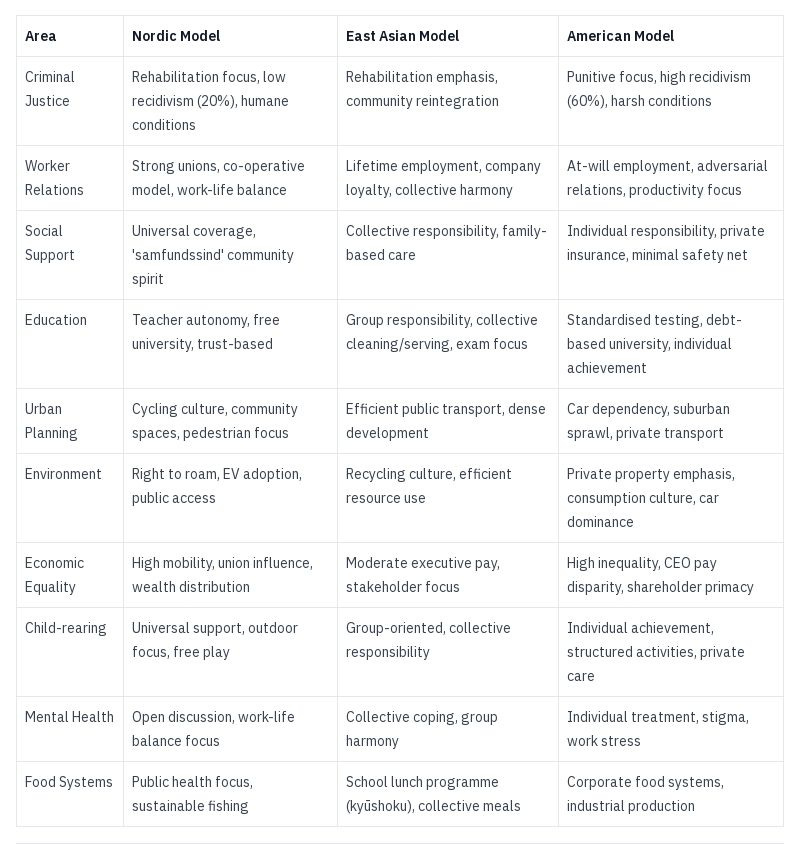
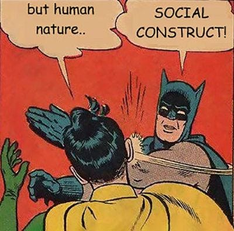
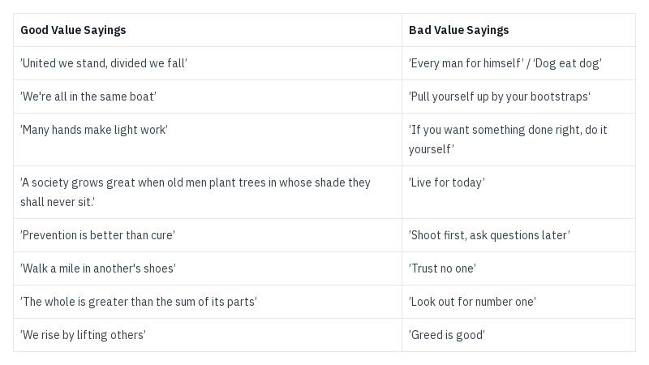
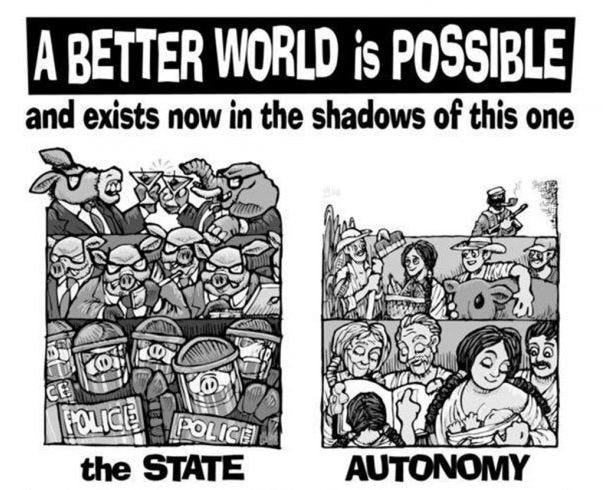
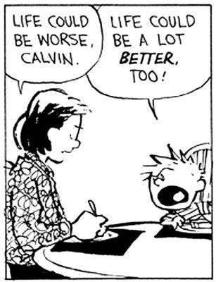

Every country thinks it’s better at something, the Olympics and other international contests show countries trying to prove they are stronger, faster or more talented. Some countries are known for what they seem best at: Canada at Ice Hockey, Japan at Electronics, and Denmark at Furniture Design if Ikea is to be believed. Even if some of these are not always true, as the old joke goes:

> Heaven is where the police are British, the chefs are French, the mechanics German, the lovers Italian and it's all organised by the Swiss. 
> 
> Hell is where the cooks are British, the mechanics French, the lovers Swiss, the police German and it's all organised by the Italians.

I take offence at the slight against British cuisine, especially as London has the most Michelin star restaurants of any city, although — as the U.K. police don’t typically carry guns — even hell might be safer with British coppers.

Many a true word is spoken in jest, and this joke makes a very true point: Some countries and cultures have a reputation for being better at certain things, or a stereotype of being worse at others.

## Human Nature

When I propose to people the idea that the world could be a substantially better one, and that certain negative aspects of society need not be that way, people often reply saying that people being bad is just ‘human nature’ and it’s inevitable. But is it really? What explains the culinary talents of the French or the engineering talents of the Germans if that is true?

When it comes to human nature, even the people who are most negative about it often think that they are the exception. They believe they can be nice, can avoid making bad decisions or hurting others, but that it is expecting too much for most other people to do so. This leads to the popular defeatist argument of ‘this is as good as it gets’ and ‘it won’t ever get any better’. It excuses not ‘wasting time’ on trying to make reforms, and taken to the extreme justifies some people following the philosophy of ‘do it to them before they can do it to you’.

But if human nature was the same for everyone, if we all were inevitably selfish animals prone to violence, then how would this explain the fact that different countries can have starkly different levels of violent crime, or even far less financial inequality, if everyone is born just as greedy?

## Better Worlds

The reality is that there are countries which are substantially better in some areas by whichever way you measure it: More safe, less violent; More financially security, less homelessness; Better health, less sickness; More happiness, less depression.

In Michael Moore's 2015 documentary ‘Where To Invade Next’, the American filmmaker explores how various European nations achieve superior social outcomes compared to America. In Italy, he examines generous labour rights, including two-hour lunch breaks and double pay at Christmas. France reveals chef-prepared school meals and progressive sex education, while Finland demonstrates world-leading educational results despite no homework, minimal testing, and shorter school days. In Germany, he finds employee-filled company boards and strong work-life balance policies.

The documentary's most striking revelations come from smaller nations. Portugal's compassionate approach to drug policy, treating addiction as a health issue rather than a crime, has successfully reduced drug use. Norway's dignified treatment of prisoners, even those convicted of murder, achieves one of the world's lowest reoffending rates. Finally, Iceland showcases the power of collective action, where a nationwide women's strike led to improved conditions and the election of the world's first female head of state. Moore concludes his documentary by pointing out that some of the positive ideas implemented in these countries were previous suggested and sometimes tried successfully in parts of America, but faced too much opposition from moneyed interests to succeed there.1

If the documentary had also gone to Japan, Singapore, South Korea and Taiwan he would have found some of the same positive results too, likewise if he had visited Denmark and Sweden. Yet there couldn’t be two regions historically more different than the Nordic and East Asian ones.

 **Nordic & East Asian Countries vs America**

Are the people in those countries with such positive outcomes a fundamentally different type of species? If a baby was born in a violent country and adopted and brought up in a more peaceful one would it be just as likely that they would be nicer and kinder too?

The data suggests so. If human nature was natural and inherent, we would expect to see similar rates of violence, depression and other social issues across different countries. Instead, these figures vary dramatically based on cultural factors, education systems, and social policies.

A previous article, [Were We Born Evil?](https://peacefulrevolutionary.substack.com/p/were-we-born-evil-or-did-capitalism) covered the origins of where the idea that we were born selfish came from, and looked at the starkly different rates of murder between places like America and Singapore. It also looked at some of the different policies governments in lower homicide countries had implemented to achieve these outcomes. That article focused on what successful states do when they see signs of violence and how they react to it, but are there other, more cultural factors, that determine these different results as well?

## Values

Different societies can develop radically different approaches to community, responsibility, and care for others. These cultural values, passed down through generations, shape how people relate to each other and solve problems collectively.

For instance, while many nations emphasise individual achievement and competition, Norwegian culture has developed strong traditions of community co-operation that persist into modern times. **Dugnad** is a Norwegian cultural tradition of communal voluntary work. It literally means ‘help’ or ‘support’ and involves members of a community coming together to maintain shared spaces or help others with big tasks. For example:

  * Apartment buildings having seasonal dugnad days where residents clean common areas, do gardening, or maintenance

  * Sports clubs and schools organising dugnad where parents and community members help with repairs or improvements

  * Communities coming together to help someone build or repair their house

This spirit of collective responsibility manifests differently across cultures. In Japan, the custom of gift-giving ( **omiyage** ) strengthens social bonds and maintains community harmony. The Japanese concept of **mottainai** \- expressing regret over waste - has created a culture of resource conservation and environmental responsibility. Meanwhile, Nordic societies have developed unique approaches to social harmony and wellbeing. Norway's **konfliktråd** system uses community mediation boards to resolve disputes through dialogue rather than punishment. The Danish concept of **samfundssind** (community spirit) underlies their comprehensive welfare state and universal healthcare.

These values extend to how societies approach childhood and nature. Nordic countries practice ‘free-range’ parenting, allowing children significant independence to build confidence and responsibility. Finland's **neuvola** system provides comprehensive family support from pregnancy through early childhood. Sweden's **allemansrätten** (right to roam) ensures everyone has access to nature regardless of land ownership, fostering environmental stewardship and community connection to shared spaces.

These practices reflect deeper cultural values about collective responsibility and mutual aid. Interestingly, similar communal traditions once existed in American culture, though many have faded with time:

  *  **Thanksgiving** \- originally a community celebration based on the British harvest festival rather than just a family one (and with the ideal of sharing it with the indigenous peoples).

  *  **Barn Raising** \- farmers and nearby townspeople working together to raise a barn for a neighbour within a day, usually followed by a communal meal and dance.

  *  **Quilting Bees** \- women gathering to make quilts together, often for new couples or those in need.

However, these co-operative traditions faced increasing pressure from competing values that emphasised individualism, competition, and exclusion. The tension between these opposing approaches to community and society continues to shape American culture today, which have largely replaced them with other ideals such as:

  *  **Manly Men** \- An idealised wild-West time when ‘men were men’ and indigenous peoples were killed and their land stolen indiscriminately.

  *  **Make America Great Again** \- Which means going back to a time when women and black people had few rights (but ignoring how in the 40’s-60’s union membership was high and the rich were taxed at 90%).

  *  **Not In My Backyard** \- Such as Homeowners Associations enforcing rules through fines and liens rather than fostering community.

These contrasting approaches to society and community are reflected in the popular sayings and proverbs each culture celebrates and passes down.

These sayings reveal more than just different attitudes - they point to fundamentally different ways of organizing society and solving problems. Communities that embrace collective responsibility and mutual aid tend to have lower crime rates, better mental health outcomes, and higher reported life satisfaction. Meanwhile, societies that promote extreme individualism often struggle with higher inequality, social isolation, and community breakdown. The choice between these values isn't just philosophical - it has real consequences for how people live and relate to each other.

## Choices

These are decisions - they show that people, both as individuals and in groups, are capable of making such choices, but it also shows that these choices are influenced by culture and what a society deems as acceptable, unacceptable, rewards or discourages. The success of different approaches in various countries demonstrates that human behaviour is malleable and shaped by social context, not fixed by ‘human nature.’

Another misunderstanding is that things are this way in a country because people want them this way - but wouldn't everyone want happiness, safer streets or a secured pension in retirement? The current system persists not through popular choice but through concentrated power and deliberate social engineering.

 _(As detailed in the article, ‘[The Capitalist Empire Strikes Back](https://peacefulrevolutionary.substack.com/p/the-capitalist-empire-strikes-back-284%E2%80%99))_ We now know It was a deliberate choice by certain powerful groups in America to promote more selfish, fearful, individualistic values over other others, to discourage co-operation, collaboration and criticism of their powerful systems, so that they could profit from this dysfunctional situation. This manipulation of culture and values serves to maintain existing power structures and prevent collective action for change.

This mirrors broader patterns in global power politics, where dominant systems justify any cost to maintain control. To the US, any amount of deaths are acceptable for capitalism to win (through overthrowing or defeating nations with different ideals).2 Similarly, the USSR & China accepted any amount of deaths for Leninist ‘state capitalism’ to win.3 The human cost is considered secondary to system preservation.

This form of system maintenance occurs through various mechanisms. In America, lobbying groups promoting harsher sentences receive funding from private prisons. Foreign interests like Saudi Arabia, Dubai, and Israel fund lobbying groups to shape US policy. This leads to many people not being aware that it is possible to have:

  * Universal healthcare without spending a large proportion of your income on insurance, deductibles and other costs (Brits pay a third of what Americans do).4

  * Safe communities without mass incarceration (America has 5% of the world’s population with 25% of its prisoners - higher than the USSR’s gulag’s at their worst).5

  * Economic security without exploitation without needing corporate control and social alienation.

Those who tell you it can't be done are either unaware, have been fooled, or profit from the status quo. The examples from other societies prove that alternatives exist and work better for most people.

When it comes to countries doing substantially better this has rarely been because politicians have decided out of the goodness of their hearts to implement these policies, but most often have come from pressure from the public. These benefits are under constant danger from outside forces such as the International Monetary Fund, which pressures such countries to privatise national utilities and transport, to remove social welfare guarantees, and to set up competitive markets to supply essential services instead.

Half the battle to a better world is believing it is possible, the other half is removing (or making irrelevant) the power system ruled over by a few who stand in the way of it. This requires both cultural and structural change - shifting values while dismantling oppressive institutions.

## Challenging Power

The path forward requires multiple approaches: we need to associate with others who share our co-operative and progressive values; we need to teach and inspire our families, friends and others through words and good examples that a better way is possible. But this alone will not be enough - we need to challenge or undermine the power of the systems which keep things the way they are. This means:

 **Building Alternatives Now (Prefiguration)**

  * Building mutual aid networks that demonstrate co-operation works better than competition.

  * Creating worker co-operatives that prove we don't need bosses.

  * Establishing community gardens and food distribution showing alternatives to corporate agriculture.

  * Developing community childcare collectives that make private care unnecessary.

  * Setting up tenant unions and housing co-operatives that challenge landlord power.

  * Creating free education projects that bypass institutional propaganda.

  * Building community clinics with the necessary expertise to offer healthcare provision free of for-profit insurance.

  * Establishing community mediation that makes police obsolete.

We need alternative social and cultural environments which share and encourage better values, as well as alternative economies based on need rather than greed that support our communities. We need to stop feeding the beasts sustained by our money, attention and fears. These alternative structures serve multiple purposes:

  1. Meeting immediate community needs.

  2. Building skills in self-organisation.

  3. Demonstrating viable alternatives.

  4. Creating connections and solidarity.

  5. Reducing dependence on oppressive systems.

At the same time, we must directly challenge existing power through:

 **Economic and Material Liberation**

  * Strategic workplace organising working toward taking back the means of production, coupled with consumer boycotts and direct action targeting corporate power and establishing co-operative alternatives.

  * Rent strikes and tenant action aiming to decommodify housing and establish community control, alongside debt strikes working toward ending financialisation of basic needs.

  * Healthcare campaigns aiming to decommodify medicine and care, integrated with food sovereignty actions establishing community-controlled agriculture.

  * Tech resistance building toward shared control of digital infrastructure.

 **Social and Environmental Justice**

  * Environmental defence protecting and recapturing commons and establishing community stewardship, combined with transport actions pushing for free public transit and car-free cities.

  * Anti-militarist resistance working toward dismantling the war machine and imperial control, while supporting indigenous sovereignty to restore traditional land relationships and governance.

  * International solidarity building toward global co-operation without states or capital, alongside education initiatives working toward free, democratic learning.

The goal isn't just to imagine a better world, but to build it here and now through concrete action and example. When enough people see these alternatives working, believe change is possible, and have the organisational skills to make it happen, the old system becomes increasingly irrelevant. The new world can be built in the shell of the old.

Throughout history and today, we see diverse economic systems challenging the notion that capitalism is the only way. Indigenous societies worldwide have operated on gift economies, where goods and services flow through social relationships rather than market exchange.:

 **Historical Examples:**

  * Medieval Iceland's Commonwealth (930-1262) - decentralised law without state.

  * Pre-colonial Indigenous American societies (Haudenosaunee Confederacy, 1142-1450) - consensus democracy.

  * The Hutterites (1528-present) have maintained successful communal living with shared property and technological adaptation across five centuries and multiple countries, with hundreds of colonies still thriving today.

  * Revolutionary Catalonia (1936-1939) - worker self-management.

  * Free Territory of Ukraine (1918-1921) - anarchist society.

 **Current Examples:**

  * Zapatista communities (Chiapas, Mexico, 1994-present) - autonomous self-governance.

  * Rojava (Northern Syria, 2012-present) - democratic confederalism.

  * Marinaleda (Spain, 1979-present) - co-operative village economy.

  * Twin Oaks (USA, 1967-present) - income-sharing commune.

Likewise modern experiments like time banking networks allow people to exchange services based on time rather than money, while Local Exchange Trading Systems (LETS) create community currencies independent of national money. Worker co-operatives like Mondragon in Spain, with over 80,000 worker-owners, demonstrate that large-scale production can operate without traditional corporate hierarchy.

Mutual aid networks show how communities can meet needs without state or market intervention. Food Not Bombs chapters worldwide recover and share free food, while Really Really Free Markets create temporary gift economies in public spaces. During crises like Hurricane Katrina and COVID-19, mutual aid networks often provided more effective and immediate support than official channels. Community gardens and food forests demonstrate food sovereignty in action, while the open source movement shows how knowledge and technology can be co-operatively developed and freely shared.

 **Imaging The Future Into Being**

These initiatives, though often small-scale, provide working models of alternative social and economic relationships. These examples demonstrate that hierarchical state capitalism is not the only way to organise society - alternatives can and do work effectively at various scales. Yet for many, the challenge isn't just seeing existing alternatives, but imagining how they could expand and evolve into something even better. This is where storytellers and visionaries play a crucial role, and many authors have been playing their part in doing this through giving us new narratives of better future possibilities:

  * Ursula Le Guin's ‘ **The Dispossessed** ’ and ‘ **Always Coming Home** ’ shows us anarchist societies that, while imperfect, demonstrates how people can live without hierarchy and private property.

  * Kim Stanley Robinson's **Mars trilogy** and ‘ **Pacific Edge** ’ explore detailed paths to ecological sustainability and democratic control of technology.

  * Iain M. Banks' **Culture series** imagines a post-scarcity anarchist utopia where automation serves human flourishing rather than profit.

  * Becky Chambers' **Monk & Robot series** depicts diverse societies with different approaches to gender, family, and social organization.

  * Aldous Huxley's ‘ **Island** ’ combines Eastern wisdom with Western science to create sustainable community.

  * William Morris' ‘ **News from Nowhere** ’ depicts a world where work becomes art and scarcity disappears.

  * [Margaret Killjoy](https://margaretkilljoy.substack.com/)'s ‘ **A Country of Ghosts** ’ shows an anarchist society defending itself while maintaining its principles.

These writers help us see: If we can imagine it, we can build it - and they've given us the tools to imagine it. Their stories reveal not just different social arrangements, but different ways of being human. This brings us back to our original question: does human nature truly exist?

## Does human nature exist at all?

If it does, then human nature is what we make it, what we nurture and foster as a society. It is the cultural values we choose and efforts we make together. It is decided by whether we choose co-operation or competition, individualism or collective responsibility, compassion and generosity or self-centredness and greed.

This raises crucial questions: If people are truly born bad or become so, should we give them more power over others or less? Should we reward positive behaviours or negative ones? Should we create incentives for doing good or doing harm?

Even if we accept human nature exists – that we're all born with an inclination toward selfishness and self-interest – the examples from countries with better outcomes show we can transcend these tendencies. We can create systems and cultures that channel our nature toward outcomes benefiting everyone (except those who profit from society's ills).

The answer is clear. If we want a better world, we need to make better choices – and crucially, make those better choices more accessible to everyone. It's not about expecting perfect people; it's about giving people the tools and systems to be their best selves. Because a better world is possible.

Subscribe

[Share](https://peacefulrevolutionary.substack.com/p/a-better-world-is-possible?utm_source=substack&utm_medium=email&utm_content=share&action=share)

### Entitlement Series

If you liked this consider reading more of the [The Universal Entitlement Series](https://peacefulrevolutionary.substack.com/about#§entitlement-series)

1

For those saying that the reasons smaller nations can achieve this and America can’t is because of their size there is a simple answer to this: America could be split into smaller states.

2

Iran 1953 (Mossadegh), Guatemala 1954 (Arbenz), Congo 1961 (Lumumba), Brazil 1964 (Goulart), Indonesia 1965 (Sukarno), Chile 1973 (Allende) to mention a few.

3

Tibet & North Korea 1950, Hungary 1956, Czechoslovakia 1968, Afghanistan & Vietnam 1979.

4

According to 2023 OECD data, the UK spends approximately $4,500 per capita on healthcare annually, while the US spends around $12,300 per capita. Despite this nearly threefold difference in cost, the UK achieves comparable or better health outcomes across most metrics.

5

As of 2024, the US has approximately 2 million people incarcerated, representing about 25% of the world's prison population despite having only 5% of the global population. At their peak in the early 1950s, Soviet gulags held approximately 1.7 million prisoners, which represented about 0.8% of the USSR's population.
