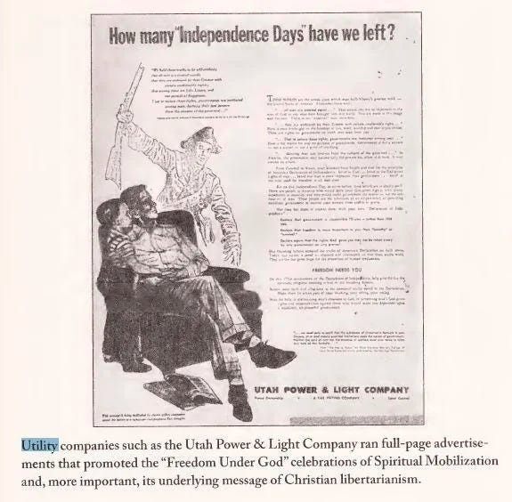
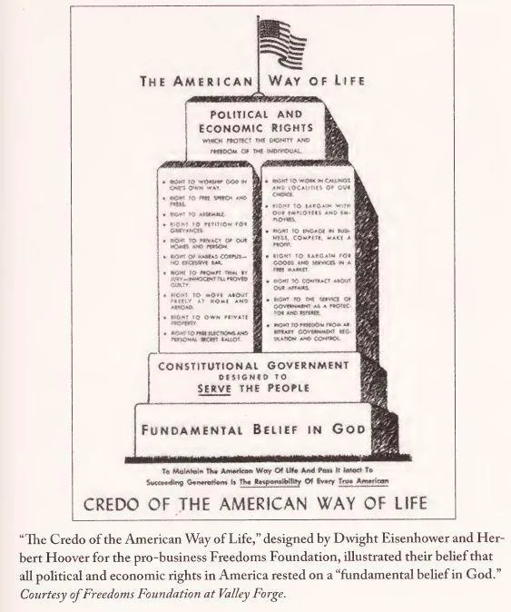
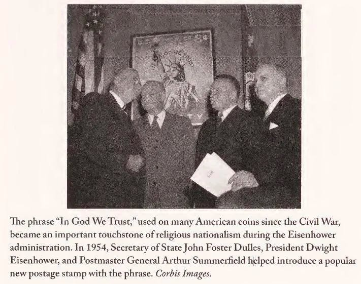
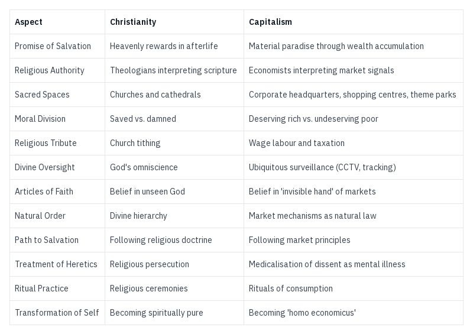

_The long version of this article series is available[on my Medium blog](https://medium.com/free-thinker/the-cult-of-capitalism-36e737add061) or to paid Substack subscribers._

## Feudalism & Religion

Aren’t you glad we no longer live under feudalism?

Not only was the economic exploitation severe (with peasants giving a third to half of what they produced to the lords), but those lords held legal power over the peasants lives, making any resistance illegal and abuses common. Then there was the church, which was in league with the lords, expected another 10% from the peasants, preached that the lower status of the workers was God’s will, and that it was sinful to expect more.

Back then whatever education was available came through the church, which taught every Sunday that the church was the only way to salvation, and the sole hope of heaven at the end of a feudal slaves life, while challenging this was heresy and could cost someone their life.

> The rich man in his castle,  
> The poor man at his gate,  
> God made them, high or lowly,  
> And ordered their estate.   
> _(‘All things bright and beautiful’, Cecil Frances Alexander, 1848.)_1

Aren’t you happy you don’t live in such a situation today? But has that much really changed?

Sure, you can join any number of churches, but most still claim that you have to attend and donate to them to get to heaven.

Sure, you can pick between different employers, but just like the lords of old they can dismiss you, and leave you homeless and hungry if you aren’t lucky enough to get help from elsewhere.

Sure, your rulers are no longer appointed by kings, but they still expect loyalty, and should they ever consider you a threat to their systems they still have the power to imprison you or worse.

Perhaps not much has changed after all.

Feudalism was an economic system where a small ownership class profited from the labour of the many who must work for them. Its proponents considered it a matter of nature, and a divinely approved way of organising society. Through religious doctrine and force, they maintained that peasants were destined to serve, nobles to rule, and clergy to pray – each in their supposedly God-given station. This naturalisation of economic exploitation helped maintain feudal power relations for centuries.

Today Capitalism is our economic system. Where those who own capital extract wealth from those who must labour to survive. Its proponents consider it a matter of nature, and a divinely ordained triumph of the ‘invisible hand’ of the free market. Through economic theory and state power, they maintain that workers are free to sell their labour, owners are free to profit, and the market is free to determine value – each in their supposedly natural station. This way of making exploitation seem natural helps keep Capitalism in power, much as religious doctrine once justified feudal hierarchies. Like feudalism in the Middle Ages there are churches and priests who today still preach that Capitalism is the only system that God approves of.

But it wasn’t always so. Capitalism wasn’t always treated as an inescapable and inevitable and even natural part of life. It’s early economists specialised in observing and describing it, not in promoting it. In fact many of them focused on how to temper some of the results of its inequalities. They never made existential claims about it being good or kind, or even a blessing. They strenuously avoided any cross-over with ideological or religious language or association at all.

## The Corporate Takeover of Religion

### Anti-Capitalist Christians

A Hundred years ago religion was generally hostile to Capitalism. Priests criticised wealth and interest (usury as they called it)2, and they elevated the values of selflessness, charity and service as ideals.3 This manifested itself at that time in the then popular Social Gospel movement that sought to alleviate suffering in practical ways.

When Capitalists began to feel they were unappreciated and sought to fight back (as covered in the previous article, ‘[The Capitalists Strike Back](https://peacefulrevolutionary.substack.com/p/the-capitalist-empire-strikes-back-284)’) they found not only resistance among academia and workers, but also among religion and preachers, and realised that if they were going to win the hearts and minds of people in the pews they would need to find a way to influence them too.

The corporate effort to reshape Christianity's relationship with Capitalism was a calculated strategy to overcome what they saw as a significant cultural obstacle. But how could devout Christians be convinced to reconcile Capitalism with their Christian beliefs? This was the challenge the corporations faced.

### Apostle To Millionaires

By the 1940s, financial interests had begun a sophisticated campaign to reshape American Christianity's relationship with Capitalism. The effort was spearheaded by the Reverend James W. Fifield Jr., whose ‘Spiritual Mobilization’ movement emerged as a powerful force for merging Christian doctrine with free-market ideology. Fifield, sometimes called ‘the Apostle to Millionaires’, launched an explicit crusade to counter the Social Gospel movement with what he termed a new ‘Gospel of free enterprise.’

The movement's success was no accident. As historian Kevin M. Kruse reveals in his groundbreaking work ‘One Nation Under God’ (2015), Spiritual Mobilization received substantial financial backing from America's corporate elite. Fifield's financial records tell a revealing story: by 1947, his organisation commanded a budget of $400,000—equivalent to over fity million in today's money—largely furnished by business donations. Major industrialists including Sun Oil Company's J. Howard Pew, General Motors' chairman Alfred P. Sloan, and executives from Chrysler and US Steel all opened their chequebooks to support this fusion of Christianity and Capitalism.

The corporate backing went beyond mere funding. Prominent businessmen, including Chrysler's B.E. Hutchinson and Sun Oil's Pew, took seats on Spiritual Mobilization's advisory committee, helping to guide its message and mission. Their involvement helped reshape a religious movement into a sophisticated propaganda machine, recruiting thousands of ministers nationwide to preach the gospel of free enterprise from their pulpits. The movement's central message was carefully crafted: it portrayed Roosevelt’s New Deal not merely as misguided economic policy, but as an assault on religious freedom itself.

This financially-funded reinterpretation of Christianity marked a crucial turning point in American religious and political history. By explicitly linking Christian values with unfettered Capitalism and portraying government intervention as godless Socialism, Spiritual Mobilization helped establish the theological foundation for modern conservative economics. The movement's success in portraying free-market Capitalism as divinely ordained would reshape the American political landscape for decades to come.

### The Power Of Positive Persuasion

Norman Vincent Peale rose to prominence as another crucial figure in this corporate-religious alliance, reaching millions through his 1952 bestseller ‘The Power of Positive Thinking’ and various media outlets. Where Fifield worked primarily with clergy, Peale's books, radio programmes, and his magazine ‘Guideposts’ spoke directly to the American public. His Manhattan church, known as ‘The Cathedral of Capitalism’4, attracted wealthy businessmen, including a young Donald Trump, who appreciated his blend of Christianity and commerce.

Peale's message received substantial backing from the same financial interests that supported Fifield. Major industrialists including J. Howard Pew, Alfred Sloan, and IBM founder Thomas Watson provided funding through his foundation and magazine. His ‘positive thinking’ philosophy effectively individualised success and failure, suggesting that poverty resulted from negative thinking rather than systemic economic conditions, a message that proved incredibly useful to businesses opposing New Deal reforms and labour unions.

The theological reframing of Christianity's stance on Capitalism was methodical and far-reaching. Corporate-backed religious leaders developed ‘Christian libertarianism,’ which reinterpreted biblical teachings about wealth and poverty in ways that supported free-market ideology. Where Jesus had preached about the dangers of wealth and the virtue of sharing, new interpretations emphasised individual responsibility and portrayed material success as divine blessing. The rise of prosperity theology wasn't accidental - it provided religious legitimacy to the pursuit of wealth and recast poverty as a sign of moral failure rather than systemic injustice.

Institutional partnerships formed the backbone of this transformation. Business interests methodically funded religious organisations, sponsored Christian publications, and supported conservative seminaries that would train the next generation of clergy in free-market principles. The National Association of Manufacturers' 1952 campaign ‘How to Combat Socialism in America's Churches’ exemplified this approach, providing detailed strategies for business leaders to influence religious institutions. These partnerships created a network of religious institutions dependent on business support and therefore receptive to the pro-Capitalist message.

### Freedom Under The Market

Billy Graham established himself as perhaps the most influential figure in cementing the alliance between evangelical Christianity and corporate interests during the Cold War era. His crusades and media presence made him the most visible religious figure in America, and he used this platform to frame the ideological struggle with communism in stark spiritual terms. Graham didn't merely present communism as an alternative economic system, he portrayed it as a satanic force threatening Christianity itself.

Graham's influence was particularly powerful in linking business, religion, and Cold War politics into a coherent worldview. By promoting ‘freedom under God’ as the Christian alternative to communism, he provided crucial religious legitimacy to free-market ideology. His messaging transformed economic policy debates into spiritual warfare, where support for Capitalism became a matter of religious faith rather than rational debate. Through his work, evangelical Christianity became inextricably linked with free-market principles, creating a theological framework where criticism of Capitalism could be interpreted as an attack on religious freedom itself.

### In Eisenhower We Trust

This combination of religious anti-communism with free market ideology manifested itself most dramatically during the Eisenhower administration, significantly reshaping America's civil identity. The period saw Capitalism frequently portrayed as God's chosen economic system, whilst Soviet Leninism—mischaracterised broadly as ‘communism’—replaced the oligarchs as the primary antagonist in the working man's story. Christian critics of Capitalism found themselves effectively silenced, risking being branded as Godless communist sympathisers.

This ideological shift was implemented through formal changes to American civil religion. The Eisenhower era saw the addition of ‘under God’ to the Pledge of Allegiance in 1954 and the adoption of ‘In God We Trust’ as the national motto in 1956. The institution of the National Prayer Breakfast created regular opportunities for religious and business leaders to mingle with political power brokers, whilst a new form of civil religion emerged that bound together American patriotism, Christian faith, and free market Capitalism. These weren't merely symbolic changes, they represented the successful culmination of corporate America's campaign to reshape Christianity's relationship with Capitalism, creating a powerful fusion of religious, patriotic, and economic orthodoxy that would dominate American cultural life for until the present.

Organizations like the Christian Freedom Foundation and Spiritual Mobilization served as crucial bridges between business interests and religious communities. Their publications reached tens of thousands of ministers, providing them with ready-made sermons that married free-market principles with Christian theology. These materials presented Capitalism not just as economically efficient but as morally righteous, while Socialism was portrayed as both practically and spiritually bankrupt. Through conferences, seminars, and educational materials, they created a generation of clergy who saw defending Capitalism as part of their religious duty. As one National Association of Manufacturers document from 1965 noted: ‘We have succeeded in making free enterprise a moral cause and Socialism a sin in the eyes of many religious Americans.’

The results of this campaign fundamentally altered American Christianity. The Social Gospel movement, which had emphasized collective responsibility and economic justice, was largely replaced by an individualistic theology that focused on personal salvation and individual responsibility. Churches that had once been bases for labour organising became strongholds of anti-union sentiment. The rise of the Religious Right in the 1970s, with its fusion of conservative Christianity and free-market ideology, represented the culmination of this transformation. What began as a corporate project to neutralise religious opposition to Capitalism ended up creating one of its most powerful allies.

## Parallels Between Religion and Capitalism

Yet society was still becoming more secular, particularly among the educated classes, so Capitalist propaganda had to evolve beyond merely co-opting Christian institutions. Instead, it developed its own quasi-religious characteristics, filling the spiritual void left by declining traditional religious adherence. This evolution was perhaps inevitable, as Max Weber had noted in ‘The Protestant Ethic and the Spirit of Capitalism’, Capitalism had always possessed a ‘religious character’, emerging as it did from Calvinist and Puritan traditions.

Indeed, what started as an effort to align Christianity with Capitalism ultimately resulted in Capitalism itself adopting the structure and function of a religion. In an increasingly secular world, Capitalism didn't simply partner with religion, it became one, complete with its own system of beliefs, rituals, and moral codes.

### Religious Structural Similarities

Just as Christianity once permeated every aspect of medieval life, Capitalism has evolved beyond a mere economic system to become a quasi-religious structure that governs our modern existence. In our less religious world, Capitalism has not eliminated religious thinking but rather adopted and transformed it, creating its own system of beliefs, rituals, and hierarchies that mirror those of traditional faiths.

The structural parallels between medieval Christianity and modern Capitalism when it comes to their hierarchical organisation are remarkable. At the top sits a new form of divine royalty: billionaires, owners and wealthy celebrities, who are portrayed as possessing almost mythical qualities of exceptional talent or genius. Below them exists a priestly class of CEOs, major shareholders and economists who interpret the sacred texts of the market, whilst politicians and advisors function as a contemporary royal court, maintaining and legitimising the system through policy and rhetoric.

Below this ruling elite, society stratifies into distinct castes that mirror medieval social structures. The self-employed represent a kind of minor nobility or merchant class, nominally independent but still beholden to the system's broader power structures. Managers serve as the modern equivalent of bailiffs and overseers, enforcing the will of the ownership class whilst themselves remaining subordinate to it. Professionals—doctors, lawyers, engineers—parallel the educated scribes and craftsmen of old, essential to the functioning of society yet firmly controlled by the institutional framework above them.

Manual workers, much like their medieval peasant counterparts, form the backbone of productive labour upon which the entire structure rests, whilst menial workers occupy a position similar to that of servants in feudal households, essential yet rendered nearly invisible by the system. At the very bottom, the disabled, homeless, and otherwise disenfranchised exist as modern-day outcasts, much like the lepers and beggars of medieval times, their very existence used as a cautionary tale to keep others compliant through fear of falling into what the system frames as a moral failing rather than a structural inevitability.

### Religious Principles

Central to Capitalism's religious character is its promise of salvation through wealth accumulation, not dissimilar to Christianity's promise of heavenly rewards. This doctrine operates on multiple levels: it offers the tantalising possibility that anyone might achieve material paradise through hard work and dedication (much like spiritual salvation), whilst simultaneously fostering a desperate longing for acceptance through conformity to consumer culture. The system maintains its power through this dual promise of individual spirituality and collective belonging.

The economic priesthood of modern Capitalism manifests through its class of professional economists and financial experts who, like medieval theologians, claim exclusive authority to interpret market signals and economic doctrine. These modern-day monastics produce complex theoretical justifications for the existing order, whilst corporate headquarters, shopping centres and theme parks serve as contemporary cathedrals, spaces of worship where the faithful perform the rituals of consumption.

Capitalism has reproduced religion's moral divide between the saved and damned through its distinction between the 'deserving rich' and 'undeserving poor'. Those who fail to achieve wealth are often demonised as morally deficient, lazy, or rebellious against the natural order, modern heretics who threaten the system's legitimacy. Meanwhile, wage labour and taxation function as a form of secular tithing, whilst ubiquitous surveillance—from CCTV to consumer and employee tracking—creates an almost omniscient system of observation reminiscent of divine oversight.

Capitalism, like traditional faiths, demands acceptance of certain unquestionable articles of faith that often defy reasonable investigation. Chief among these is belief in 'the invisible hand', a mystical force akin to divine providence that supposedly guides markets toward the best outcomes. This parallels religious faith in an unseen deity ordering the universe, requiring believers to trust in forces they cannot directly observe or verify.

The system presents itself as both natural and inevitable, a cosmic order rather than a human construction. Just as medieval Christianity positioned its hierarchies as divinely ordained, Capitalism portrays its mechanisms of exploitation as immutable laws of nature. This naturalisation of the system serves to discourage questioning of its fundamental premises or imagining alternatives, much as medieval heresy was positioned as a rebellion against natural order.

The promise of salvation through material success forms another core tenet. Like religious promises of heavenly rewards for the faithful, Capitalism offers the prospect of wealth and status to those who follow its prescripts faithfully enough. This creates a powerful mechanism of control: those who fail to achieve success are seen not as victims of a systemic failure but as personally deficient in their faith and devotion to market principles.

Capitalism demands belief in several profound contradictions. It requires faith in a 'free market' that is actually heavily controlled by powerful interests. It insists that abstract currency represents real value, it is a form of transubstantiation5 where symbolic money becomes more 'real' than the tangible goods and services it supposedly represents. It preaches that financial decisions exist in a moral vacuum, while simultaneously making profound moral judgments about worth and deservingness.

This belief system demands we reshape ourselves in its image, becoming ‘homo economicus’6, rational profit-maximising agents stripped of human complexity and community bonds. This evolution is unnatural and harmful to human wellbeing, yet resistance to it is seen as crazy. Those who question these doctrines or fail to conform are labelled as irrational, mentally ill, or in need of medication, as modern versions of heretics in need of correction or cure. The parallels to religious persecution are striking: just as medieval church authorities might diagnose spiritual ailments in those who questioned doctrine, modern Capitalism frames resistance to its principles as mental illness requiring treatment.

In this way, Capitalism successfully co-opted not just Christianity's institutions and language, but the deep human need that religion traditionally served - the desire to find meaning and to serve something greater than ourselves. Where Christianity once provided community, purpose, and a moral framework that challenged material greed, moneyed interests systematically reshaped it into a belief system that sanctified their power.

For the religious, this allowed them to maintain their Christian identity and some principles while redirecting their primary devotion towards consumer behaviour and market participation. For the secular, it offered an alternative faith complete with its own rituals, moral codes, and promises of salvation through wealth and consumption. The transformation was so complete that by the late 20th century, many found it difficult to imagine any system of meaning - religious or not - that existed outside Capitalist values.

In the next article we’ll look briefly into the tensions between Capitalism and Christianity's original teachings and early practice, which stood in stark contrast to Capitalist values. From Jesus's teachings about wealth and community to the early church's communal living - Christianity has a long history of challenging the very market principles it would later be enlisted to defend. Understanding this history helps us recognise how remarkable - and how deliberate - Capitalism's co-option of Christianity truly was.

Subscribe

[Share](https://peacefulrevolutionary.substack.com/p/how-capitalism-co-opted-christianity?utm_source=substack&utm_medium=email&utm_content=share&action=share)

### Capitalism Series

If you liked this consider reading more of my [series on Capitalism](https://peacefulrevolutionary.substack.com/about#§capitalism-series)

1

This verse was omitted from the 1906 edition of The English Hymnal, by its editor, Percy Dearmer, a Christian Socialist editor who took offence to it.

2

The practice of lending money with added interest rates which is condemned by the Bible.

3

This will be detailed in the next article, ‘Christianity Vs Capitalism’.

4

Marble Collegiate Church in Manhattan.

5

The Catholic doctrine that during the Eucharist, the bread and wine literally transform into the body and blood of Christ.

6

Latin for 'economic human'.
