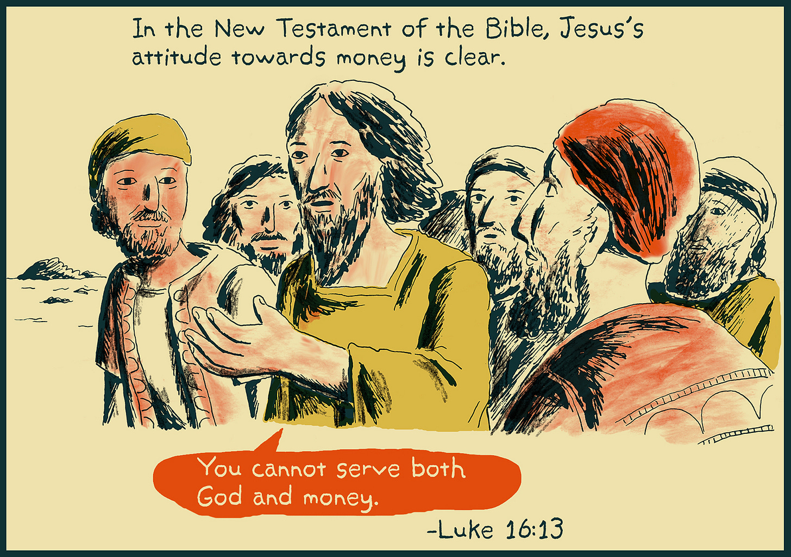
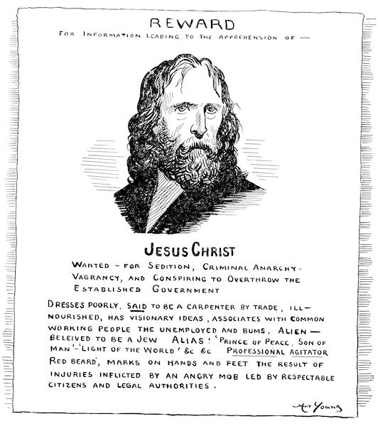
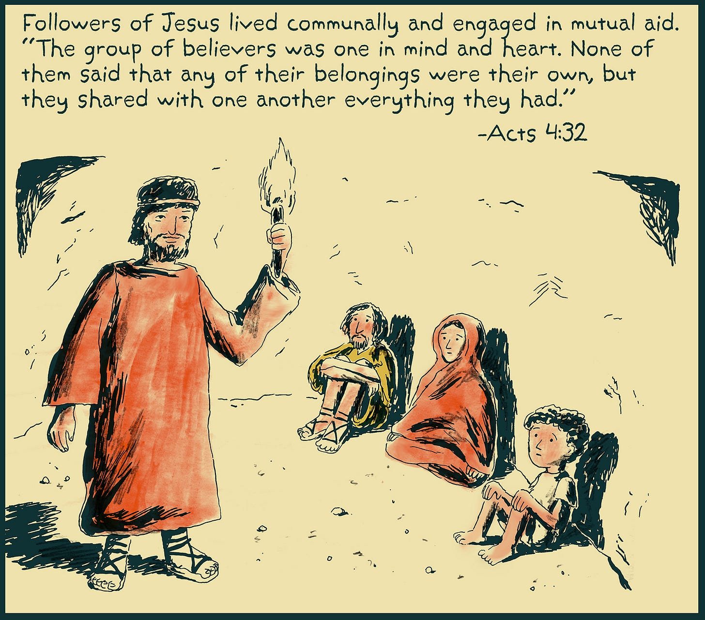

_Following on from[the previous article](https://peacefulrevolutionary.substack.com/p/how-capitalism-co-opted-christianity), this is the second article in the sub-series, The Cult Of Capitalism. A [full version is available](https://peacefulrevolutionary.substack.com/p/the-cult-of-capitalism) to paid subscribers, or on [my Medium blog](https://medium.com/free-thinker/the-cult-of-capitalism-36e737add061)._

It is hard to imagine any major religious figure more anti-Capitalist than Jesus, that homeless beggar who would fall afoul of vagrancy laws in many Capitalist states today. His explicit teachings on wealth and poverty stand in direct opposition to Capitalist accumulation and today’s prosperity gospel.

## Camels and Needles

Jesus's statement that ‘You cannot serve both God and Mammon’1 is absolute in its rejection of idolising wealth. Yet modern Capitalism attempts to reconcile these irreconcilable positions, often through elaborate theological gymnastics. No example better illustrates this than when Jesus stated, ‘Again I tell you, it is easier for a camel to go through the eye of a needle than for someone who is rich to enter the kingdom of God.’2

Some have proposed that the original Greek word we have translated ‘camel’ (kamelos) was actually ‘rope’ (kamilos) in the original language. The idea is that a rope may have been very difficult to thread into a rug knitting needle, but not impossible. It is an interesting theory, but it didn’t actually appear until around the 12th century - when the Catholic church started having a problem with this passage and they changed their Greek manuscripts to reflect the word ‘rope’ instead of the original word.3 As far as the idea of the needle being very large goes, Luke's account leaves no room for this interpretation as he uses the Greek word ‘belonh’4 which means a small surgeons needle. As Luke was a physician it is unlikely he used this specific word accidentally.

You’d think from such a simple straightforward teaching that no-one would be in any doubt as to the view of Jesus toward the rich and their unheavenly ways, but it wasn’t long after the creation of Capitalism that priests with wealthy congregants found imaginative ways to reconcile their followers riches with their Christian faith. One of the ways they did this was through inventing an apocryphal tale in which, ‘In Jerusalem there is a gate called “the eye of the needle” through which a camel could not pass until it stooped down to make it through the entrance.’ In other versions of the story the ‘needle’ was a narrow pass through the mountains.5 Of course these are just fabrications, invented almost two thousand years after the Bible account, but that did not stop some eager to find a religious justification for their riches from accepting it as true.

But one need only look at what prompted Jesus’ famous remark about the camel and the needle to see that his teachings don’t support such an interpretation. A few verses earlier a rich young man approaches Jesus asking what he must do to gain eternal life and Jesus tells him to keep the commandments, to which the man replies he has done so since his youth. Then comes the crucial moment: Jesus looks at him and says ‘If you want to be perfect, go, sell your possessions and give to the poor, and you will have treasure in heaven. Then come, follow me.’ When the young man hears this, he goes away grieving, ‘for he had great wealth’.6

It's immediately after this interaction that Jesus turns to his disciples and delivers his famous pronouncement about the camel and the needle. Some try to soften this by pointing to Jesus' subsequent statement that ‘with God all things are possible’7, but the context makes clear what this ‘possibility’ requires - the voluntary relinquishment of wealth, something the rich young man found himself unable to do.

## Good News To The Poor

Jesus's message about poverty and wealth was radical and definitive, beginning with his declaration of purpose in Luke, where he quotes Isaiah: ‘The Spirit of the Lord is on me, because he has anointed me to proclaim good news to the poor.’8 This wasn't mere rhetoric - he consistently centred on the poor in his teaching, most famously in the Beatitudes where he declares, ‘Blessed are you who are poor, for yours is the kingdom of God. Blessed are you who hunger now, for you will be satisfied.’9 Likewise he does not spare the rich from condemnation, ‘But woe to you who are rich, for you have already received your comfort.’10

His instructions to the wealthy in the Sermon on the Mount were equally direct and challenging, as he commands them to, ‘Give to the one who asks you, and do not turn away from the one who wants to borrow from you’.11 Even in social matters, Jesus instructs his followers to ‘invite the poor, the crippled, the lame, the blind’ to their banquets rather than the wealthy who could repay them, because ‘you will be repaid at the resurrection of the righteous’.12 Most powerfully, Jesus identifies himself directly with the poor and suffering, stating ‘whatever you did for one of the least of these brothers and sisters of mine, you did for me’13 \- making it clear that refusing aid to a beggar is equivalent to refusing Jesus himself. These teachings present a comprehensive critique of wealth accumulation and a radical call for economic redistribution that clashes with modern interpretations that attempt to reconcile Christianity with Capitalism.

## Old Testament, Old Sins

The Old Testament prophets are equally damning in their critique of economic exploitation. In the book of the same name, Amos chastises the children of Israel for not caring for the poor and oppressed:

> ‘For three sins of Israel, even for four, I will not relent. [1] They sell the innocent for silver, and [2] the needy for a pair of sandals. [3] They trample on the heads of the poor as on the dust of the ground and [4] deny justice to the oppressed.’ _(Amos 2:6)_

Amos's condemnation of those who ‘sell the innocent for silver, and the needy for a pair of sandals’ could be directly applied to modern wage slavery and exploitative labour practices. His accusation that they ‘trample on the heads of the poor as on the dust of the ground and deny justice to the oppressed’ resonates powerfully with modern billionaires using their wealth to pervert justice and influence political systems.

These biblical critiques of wealth and exploitation are so fundamental to both Old and New Testament teachings that the modern alignment of Christianity with Capitalism represents a profound perversion of the religion's core message. Modern prosperity gospel preachers and wealthy Christians who attempt to justify their accumulation of wealth while others suffer essentially practice a different religion entirely from the one preached by Jesus, one that worships Mammon while paying lip service to God.14

## Early Christians Communists

Yet, the radical economic message of early Christianity persisted well beyond Jesus's death, as evidenced by the powerful anti-wealth rhetoric of early church figures. None is more striking than the words of James, Jesus's brother, who warning to the rich oppressors reads like a anti-Capitalist prophecy.

> ‘Now listen, you rich people, weep and wail because of the misery that is coming on you. Your wealth has rotted, and moths have eaten your clothes. Your gold and silver are corroded. Their corrosion will testify against you and eat your flesh like fire. You have hoarded wealth in the last days. Look! The wages you failed to pay the workers who mowed your fields are crying out against you. The cries of the harvesters have reached the ears of the Lord Almighty. You have lived on earth in luxury and self-indulgence. You have fattened yourselves in the day of slaughter. You have condemned and murdered the innocent one, who was not opposing you.’ _(James 5:1-6)_

His condemnation is absolute and prophetic—the rich are warned not merely of spiritual consequences, but of material retribution for their exploitation. The imagery is visceral: corroded wealth eating flesh like fire, hoarded riches rotting away, and most pointedly, the wages of workers ‘crying out’ against their oppressors.

The earliest Christians took these teachings literally, establishing communal living arrangements as described in Acts 2:44-45: ‘All the believers were together and had everything in common. They sold property and possessions to give to anyone who had need.’ This wasn't merely symbolic, as Acts 4:32-35 elaborates: ‘All the believers were one in heart and mind. No one claimed that any of their possessions was their own, but they shared everything they had... There were no needy persons among them. For from time to time those who owned land or houses sold them, brought the money from the sales and put it at the apostles' feet, and it was distributed to anyone who had need.’15

Even C.S. Lewis, writing in the mid-20th century from a relatively conservative Christian perspective, acknowledged the radical economic implications of early Christian practice:

> ‘The New Testament, without going into details, gives us a pretty clear hint of what a fully Christian society would be like ... a Christian society would be what we now call Leftist ... If there were such a society in existence and you or I visited it, I think we should come away with a curious impression. We should feel that its economic life was very socialistic and, in that sense, ‘advanced,’ but that its family life and its code of manners were rather old fashioned. … That is just what one would expect if Christianity is the total plan for the human machine. We have all departed from that total plan in different ways, and each of us wants to make out those bits and pieces and leave the rest. That is why we do not get much further; and that is why people who are fighting for quite opposite things can both say they are fighting for Christianity.’ _(Mere Christianity (1952), Book 3, Chapter 3: ‘Social Morality’.)_

These anti-wealth teachings remained potent within Christianity for a few hundred years after its inception as shown by early church father’s views on wealth, property and poverty. St Basil the Great's (329-379 AD) teachings demonstrate how early church fathers viewed private property and wealth accumulation as entirely incompatible with Christian values:

> ‘When some one strips a man of his clothes we call him a thief. And one who might clothe the naked and does not—should not he be given the same name? The bread in your hoard belongs to the hungry; the cloak in your wardrobe belongs to the naked; the shoes you let rot belong to the barefoot; the money in your vaults belongs to the destitute. All you might help and do not—to all these you are doing wrong’ _(Homily Against the Rich, 368 AD)_

Of course if enough people followed this teaching then there would be no Capitalism. His assertion that ‘The bread in your hoard belongs to the hungry’ directly challenges modern concepts of private property rights. Indeed, Proudhon wasn’t the first to call property theft, comrade Basil was doing this sixteen hundred years ago, as also evidenced in his sermon during the 368 CE famine in Caesarea

> ‘You are like one occupying a place in a theatre, who should prohibit others from entering, treating that as his own which was designed for the common use of all. Such are the rich. Because they preoccupy common goods, they take these goods as their own. If each one would take that which is sufficient for his needs, leaving what is superfluous to those in distress, no one would be rich, no one poor.… The rich man is a thief.’ _(Ibid)_

When he declares ‘The rich man is a thief’, he's not speaking metaphorically. He's making a precise theological argument that the very act of accumulating excess wealth while others lack necessities constitutes theft from the common inheritance of humanity. Basil's comparison of the wealthy to someone claiming private ownership of theatre seats meant for public use is particularly relevant to Capitalism's enclosure and privatisation of common resources. His argument that ‘If each one would take that which is sufficient for his needs, leaving what is superfluous to those in distress, no one would be rich, no one poor’ presents a direct theological argument for what we might today call resource redistribution.

## Christian Socialism

Some Christian communities have maintained these early anti-wealth and communal teachings throughout the centuries, often aligning themselves with leftist causes. **The Mennonites** , emerging from the radical wing of the Protestant Reformation in the 16th century, have consistently practiced mutual aid and communal living, rejecting private property accumulation and military service.

 **The Quakers (Society of Friends)** played a crucial role in the abolitionist movement, with figures like John Woolman calling slavery fundamentally incompatible with Christian teachings. Their commitment to equality and social justice extended beyond abolition, and they were early advocates for prison reform, women's rights, and peace activism.

 **The Catholic Worker Movement** , founded by Dorothy Day in 1933, represents another strand of this tradition, combining direct aid to the poor with radical critique of Capitalism. Their houses of hospitality practice voluntary poverty and mutual aid while engaging in anti-war activism and workers' rights campaigns. These traditions demonstrate how Christian anti-Capitalism has persisted despite the mainstream church's general accommodation with wealth and power.

Although Marxism and Leninism were avowedly anti-Christian, there has been a very long tradition of Christian Socialists over the last five hundred years up to the present day. Even the author of America's Pledge of Allegiance, minister Francis Bellamy, was a Christian Socialist, while his cousin Edward Bellamy wrote the famous Socialist utopia, ‘Looking Backward’ (1888), which was also influenced by Christian Socialist ideals.

Some of these Socialist Christians, like Day, were also Anarchists, such as Leo Tolstoy, who outlined his beliefs in ‘The Kingdom of God Is Within You,’ (1894) which influenced both Gandhi and Martin Luther King Jr. Poet William Blake, famous for the Christian Socialist anthem, ‘Jerusalem’ (1804), combined religious mysticism with radical politics and anti-authoritarianism. Ishikawa Sanshirō blended Christian Anarchism with Eastern philosophy in Japan, while Simone Weil combined mystical Christianity with radical politics. Ammon Hennacy was particularly notable for his complete rejection of state authority and practice of Christian pacifist Anarchism.

## Modern Theologians

Modern theologians and social theorists have been no less critical about Capitalism's relationship with Christianity. Max Weber, the influential German sociologist writing in the early 1900s, was among the first to analyse how Capitalism functioned as a quasi-religion. In ‘The Protestant Ethic and the Spirit of Capitalism’ (1905), he identified Capitalism's ‘religious character,’ arguing that it emerged from Protestant Christianity but then developed its own spiritual dynamics that ultimately undermined Christian values. This opened the door for deeper analysis of how market systems function as faith systems.

Building on this tradition, contemporary religious historian Eugene McCarraher's ‘The Enchantments of Mammon: How Capitalism Became the Religion of Modernity’ (2019) develops this analysis further. His concept of ‘the enchantments of Mammon’ reveals how Capitalism didn't simply secularise society as is commonly believed, but rather redirected religious devotion toward market worship. He argues that Capitalism didn't eliminate religious thinking but rather transformed it, promising transcendence through consumption and accumulation rather than through spiritual practice.

This inherent tension between Christianity's teachings and Capitalism's demands led many influential economists to explicitly reject Christian economic ethics. Figures like Mises, Hayek, and Friedman, along with atheist promoters of Capitalism such as Ayn Rand and Murray Rothbard, condemned Christianity's teachings about wealth and poverty as incompatible with their economic vision. Ironically, these men—though themselves non-believers—have become the subject of quasi-religious veneration by their followers, who treat their economic theories as gospel and their words as prophecy.

Yet this transformation reveals a crucial distinction: while a religion may be either beneficial or harmful to human wellbeing, a cult is characterised by specific harmful traits: personality worship, demands for absolute obedience, and promises to solve all problems, even those it creates itself. In the next part of this series, we will explore how Capitalism evolved from merely adopting religious concepts to becoming a full-fledged cult, with its new prophets abandoning supernatural religion entirely as well as concepts of reason which came with the enlightenment, while making even more fantastic claims about miraculous market outcomes and heavenly rewards through their idealistic version of Capitalism.

 _Disclaimer: I am not religious, but I respect values that align with building a good and kind world, and that world cannot be built by the cult of Capitalism._

For those with an interesting in learning more on this subject here are some websites that may be of interest:

  * <https://www.christiansocialism.com/>

  * <https://www.jesusradicals.com/>

  * <https://sojo.net/>

  * <http://www.catholicworker.org/>

  * [https://quakersocialists.org.uk/](http://www.catholicworker.org/)

  * <https://www.reddit.com/r/RadicalChristianity/>

  * <https://www.reddit.com/r/christiananarchism/>

For a very different Christian vision see Heathcoate William’s ‘Jesus The Anarchist’:

<https://peacefulrevolutionary.substack.com/p/the-anarchist-jesus>

Subscribe

[Share](https://peacefulrevolutionary.substack.com/p/christianity-vs-capitalism?utm_source=substack&utm_medium=email&utm_content=share&action=share)

1

Matthew 6:24.

2

Matthew 19:24; Mark 10:25; Luke 18:25. This is one of the very few passages rendered exactly the same in several gospels - they render it exactly the same, without variation.

3

See Sinaiticus, Vaticanus & Washington Freer - 4th century, Ephraemi, Bezae Cantabrigiensis & Dublinensis - 5th century & Regius - 8th century.

4

Luke 18:25.

5

Popularised a couple hundred years ago in books such as the ‘Companion Bible,’ by E.W. Bullinger, or ‘the Manners and Customs of the Bible’ by James Freeman.

6

Matthew 19:16-22.

7

Matthew 19:26.

8

Luke 4:18, Isaiah 61:1.

9

Luke 6:20-21.

10

Luke 6:24.

11

Matthew 5:42.

12

Luke 14:13-14.

13

Matthew 25:40.

14

‘These people honour me with their lips, but their hearts are far from me.’ says Jesus in Matthew 15:8, quoting Isaiah 29:13. Whereas Jesus taught ‘Where your treasure is, there will be your heart also.’ in Matthew 6:21.

15

This practice was taken so seriously that in Acts 5:1-11, Ananias and Sapphira were struck dead by God for withholding some of their property's sale proceeds from the common fund.
