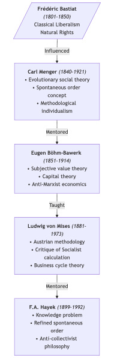
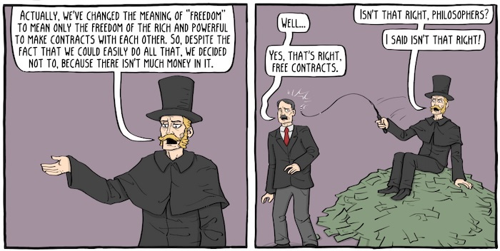
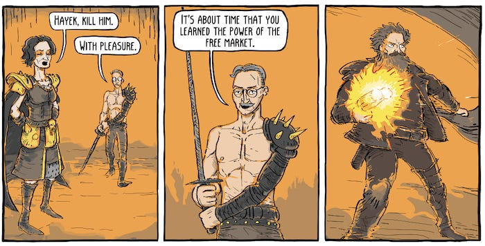
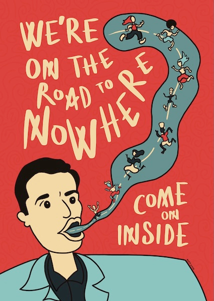

_Following on from[the previous article](https://peacefulrevolutionary.substack.com/p/christianity-vs-capitalism), this is the second article in the sub-series, The Cult Of Capitalism. A [full version is available](https://peacefulrevolutionary.substack.com/p/the-cult-of-capitalism) to paid subscribers, or on [my Medium blog](https://medium.com/free-thinker/the-cult-of-capitalism-36e737add061)._

### The Early Apostles Of Capitalism

As we've explored in our previous articles1, by the middle of the 20th century Capitalism had developed a sophisticated network of paid advocates across academia, government, and religious institutions, creating what amounted to the largest peacetime propaganda exercise in history. Yet for the tycoons and their supporters, these institutional successes weren't enough. They also wanted to create something more powerful: a secular cult with its own paid prophets to preach to the secular world too.

The intellectual foundations of this movement can be traced back to **Frederick Bastiat** (1801-1850), a wealthy French merchant's son who saw his family's wine trade affected by protectionist policies. This experience shaped his passionate defence of free trade and property rights, culminating in his influential work ‘The Law’ (1850), which presented one of the first comprehensive moral defences of classical economic liberalism. His ideas would later influence Carl Menger's work on natural rights and spontaneous market order.

 **Carl Menger** (1840-1921) built upon Bastiat's ideas while founding the Austrian School of Economics. His evolutionary approach to social theory and economics emphasised how economic institutions emerge naturally rather than through central planning. His work on subjective value theory - the idea that the worth of goods comes from individual valuation rather than inherent properties - profoundly influenced his student Eugen von Böhm-Bawerk.

 **Eugen von Böhm-Bawerk** (1851-1914) developed Menger's theories into a comprehensive critique of Marxist economics, particularly focusing on capital theory. As Austrian Minister of Finance, he uniquely combined theoretical work with practical policy experience. His seminar at the University of Vienna proved crucial in developing Ludwig von Mises' economic thinking.

 **Ludwig von Mises** (1881-1973) expanded upon Böhm-Bawerk's theories while adding his own critique of Socialist economic calculation. His argument that rational economic planning was impossible under Socialism became a cornerstone of free-market advocacy. Among his students at his private Vienna seminar was Friedrich Hayek, who would further develop these ideas.

 **Friedrich Hayek** (1899-1992) took Mises' theories about economic calculation and developed them into a broader critique of collective planning through his ‘knowledge problem’ - the idea that central planners can never have enough information to coordinate an economy effectively. His refinement of the spontaneous order concept and anti-collectivist philosophy provided intellectual foundations for neoliberal policies in the 1980s.

 **The Capitalist Apostolic Line Of Authority**

This succession of free-market economic theories evolved from Bastiat's practical observations about trade through increasingly sophisticated theoretical frameworks, ultimately influencing global economic policy through Hayek's work with Thatcher and the neoliberal movement.

In the New World, corporate funding would prove crucial in selecting and promoting those willing to preach this gospel of Capitalism. Soon joining these Capitalist prophets were men like Milton Friedman and even non-economists like Ayn Rand. Their work would inspire a new generation of disciples who would follow in their expensive leather footsteps, including Henry Hazlitt, Murray Rothbard, Alan Greenspan, and Thomas Sowell. Each of these figures would receive substantial backing from corporate interests, think tanks, and wealthy patrons, ensuring their ideas reached far beyond academia into the broader public consciousness.

## A New Creation Story For Money

These economic prophets relied on a relatively new theory about the creation of money - the Genesis story of their economic theology. Though there was no ancient evidence for their account, it became central to justifying their views on the nature of markets and money.

In ‘The Wealth of Nations’ (1776), Adam Smith laid the groundwork for what would become the standard neoclassical account. He speculated that money emerged naturally from the inefficiencies of barter. Smith's account emphasised the division of labour as creating the necessity for exchange, with money emerging as a practical solution to trade difficulties.

Carl Menger developed this theory further in his 1892 work ‘On the Origin of Money’, presenting money's emergence as an entirely spontaneous process arising from rational individual choices. He explicitly rejected state-centric theories of money's origins, thus laying the ground work for later right-wing ‘Libertarian’ claims. According to Menger, the initial inefficiency of direct barter (the ‘double coincidence of wants’ problem) led individuals to accept more widely tradeable goods as exchange intermediaries. Through this process, certain commodities (particularly precious metals) emerged naturally as money due to their inherent characteristics of durability, divisibility, and scarcity.

While Smith saw money primarily as a practical tool facilitating the division of labour, Menger presented it as the inevitable outcome of rational individual choices in a market setting. His more rigorous theoretical treatment became an article of faith for what was initially called the Austrian School of Economics and later evolved into the Chicago School. This creation myth, despite lacking historical evidence, provided the theological foundation for their free-market beliefs, and influenced neoclassical monetary theory more broadly.

## Economists Vs Reality

However, this orthodox narrative faced a significant challenge with David Graeber's 2011 work ‘Debt: The First 5,000 Years’. Drawing on anthropological evidence, Graeber inverted the conventional story entirely. Rather than money emerging from barter, he argued that credit and debt relationships preceded both. Early human societies, he demonstrated, operated through complex systems of social obligations and credit arrangements, with formal currency emerging much later, often imposed by state violence for tax collection.2

Graeber's anthropological critique carries profound implications for economic theory. By showing that credit and social obligations preceded market exchange, it challenges fundamental assumptions about human nature and economic behaviour in classical and neoclassical economics. Where Menger saw money as emerging spontaneously from individual rational choices, Graeber revealed its deeply social and political character.

This alternative history suggests that economic relations are not natural developments but social and political constructions, often embedded in power relationships. Markets and money, rather than being spontaneous orders, emerge through complex social processes often involving state power and violence. This understanding provides theoretical ammunition for critiquing modern debt systems and market fundamentalism, suggesting that our current economic arrangements are neither inevitable nor natural, but rather the product of specific historical and political choices.

The contrast between these narratives reflects a deeper tension in economic thought between individualistic and social understandings of human behaviour. While the Mengerian account sees economic institutions emerging from individual rational choices, the anthropological view emphasises the fundamentally social nature of human economic relations, with significant implications for how we understand both markets and money in contemporary society.

The influence of Menger's individualistic approach cannot be underestimated, particularly through his intellectual successors Ludwig von Mises and Friedrich Hayek, who would transform these ideas into a comprehensive ideology of market fundamentalism. Mises, especially, would take Menger's theories about the spontaneous emergence of money and economic institutions and develop them into a quasi-religious defence of unfettered Capitalism.

## Ludwig von Mises & Friederich Hayek

> ’The issue is always the same: the government or the market. There is no third solution.’ _(‘Human Action’, 1949)_

Ludwig von Mises emerged as one of the most influential economists of the 20th century, though his path was shaped by the turbulent history of his era. Born into a wealthy Jewish family in what is now Ukraine, he established himself as a prominent economist in Vienna3 before the rise of Nazism forced him to flee first to Geneva and then to the United States. At New York University, where he spent the final decades of his career, he refined and promoted his theories of classical liberalism and free-market economics, influencing generations of economists and political thinkers through works like ‘Human Action’ and his critique of Socialist economic planning.

The alignment between Mises's economic theories and his funding sources raises interesting questions about the development and promotion of free-market ideology. His position at New York University was not a traditional academic appointment but rather was funded by business interests who supported his anti-Socialist, pro-market stance. His work received substantial backing from corporate sources through organisations like the Foundation for Economic Education and the William Volker Fund. This corporate support helped establish and promote the American Austrian School of Economics, while providing Mises with speaking engagements and platforms to advance his ideas about laissez-faire Capitalism and opposition to government intervention—views that aligned perfectly with the interests of his corporate backers. This symbiotic relationship between his economic theories and his funding sources highlights how corporate interests helped shape and promote free-market economic thought in post-war America.

 **Friedrich Hayek**

Among those who would benefit from similar corporate backing was Mises' most influential student, Friedrich Hayek, who would take his mentor's ideas to an even broader audience. Like Mises, Hayek would find his career shaped by both the tumultuous politics of Europe and the generous support of business interests.

Friedrich Hayek's journey from Vienna to global influence traces the rise of neoliberal economics in the 20th century. Beginning his career in post-WWI Austria, where he served in the military and earned doctorates in law and political science, Hayek's economic thinking was shaped by his mentor Ludwig von Mises and the turbulent interwar period. After moving to the London School of Economics and later the University of Chicago, he became one of the most influential economists of his era. His ideas would later shape the policies of leaders like Margaret Thatcher and Ronald Reagan, fundamentally altering the economic landscape of the 1980s.

The promotion and funding of Hayek's work reveals how corporate interests helped shape modern economic thought. His position at the University of Chicago was supported by private wealth, while organisations like the William Volker Fund and corporate-backed think tanks actively promoted his ideas. The Mont Pelerin Society, which he helped establish, served as a corporate-funded network for spreading free-market ideology. His theories about spontaneous market order and opposition to government intervention aligned perfectly with corporate interests seeking deregulation and reduced state oversight. This alignment was particularly evident in how institutions like the Bank of England and Federal Reserve promoted his work, while corporate-funded think tanks like the Institute of Economic Affairs helped transform his academic theories into practical political policies under Thatcher. The extensive corporate backing for promoting ‘The Road to Serfdom’ helped establish his ideas as mainstream economic thought, despite their radical departure from post-war consensus about the role of government in managing the economy.

## The Road To Nowhere

But Hayek understood that a creation story of money's origins alone wasn't enough to build a new economic faith. What was needed was a complete gospel—one that not only explained the past but offered a path to economic salvation while warning of the damnation that would befall those who strayed from market principles. This gospel would take form in his most influential work, ‘The Road to Serfdom.’

Published in 1944, ‘The Road to Serfdom’ stands as perhaps the most influential piece of anti-Socialist literature of the 20th century. The text presents itself as a warning about the dangers of economic planning, but in many ways it functions more as an economic gospel, a foundational text that would later be treated as almost sacred writ by advocates of free-market fundamentalism.

The core of Hayek's argument is deceptively simple: any move toward economic planning inevitably leads to totalitarianism. He constructs an elaborate domino theory where even modest steps toward democratic Socialism or welfare programmes inexorably set nations upon the ‘road to serfdom’. This argument rests upon a series of sweeping assertions: that Socialism requires centralised control which necessarily destroys individual freedom, that markets preserve freedom through decentralised decision-making, and perhaps most crucially, that democratic Socialism is fundamentally impossible, doomed to devolve into authoritarianism.

However, Hayek's argument relies heavily on what might be termed the first comprehensive ‘straw man’ version of Socialism. By focusing exclusively on state-centric forms of Socialist planning whilst ignoring the rich tradition of Anarchist and non-state Socialist thought, Hayek creates a convenient but fundamentally inaccurate target. Like a scarecrow fashioned of straw, this version of Socialism proves remarkably easy to set ablaze, but the smoke obscures more than it illuminates.

The flaws in Hayek's argument become apparent when confronted with historical evidence. The Nordic social democracies never descended into totalitarianism; indeed, the greatest expansion of democratic rights coincided with the rise of welfare states. Conversely, it was often unregulated Capitalism that created conditions conducive to fascism.

Theoretical critiques of Hayek's work reveal deeper problems. There is false dichotomy at the heart of the book: Hayek presents only two options: complete laissez-faire or total state control. This ignores the reality of successful mixed economies and democratic planning. Hayek was so focused on state power that he ignored how private concentrations of power can be equally tyrannical. While participatory planning demonstrates how democratic planning doesn't require centralised control of all decisions - it can be participatory and decentralised. Most importantly, Hayek's ‘freedom’ is the freedom of property owners to exploit others. He ignores how markets restrict freedom for the majority.

The practical contradictions in Hayek's position proved equally telling. His support for Pinochet's dictatorship in Chile revealed a troubling willingness to sacrifice democratic freedom for market freedom.4 His ideal system requires strong state enforcement of property rights, creating a paradox for his anti-state rhetoric. Modern corporations, like Walmart and Amazon, extensively use internal planning, demonstrating that planning itself isn't the issue Hayek claimed. The real road to serfdom has been the one Hayek advocated - unrestricted corporate power, weakened democracy, and increased inequality.

In the end, ‘The Road to Serfdom’ fails as a serious economic analysis. It reveals more about the political anxieties of its time and the intellectual foundations of neoliberalism than it does about the actual relationship between economic planning and freedom. Its enduring influence speaks not to the strength of its arguments, but to its usefulness as a theoretical justification for opposition to social democratic policies and collective economic action.

The disciples of Mises and Hayek went on to write their own influential works, each functioning as epistles of market fundamentalism. Henry Hazlitt's ‘Economics in One Lesson’ (1946) offered a simplified version of Austrian economic theory for mass consumption. Ayn Rand's ‘Capitalism: The Unknown Ideal’ (1966) transformed these economic arguments into a moral philosophy celebrating selfishness. Milton Friedman's ‘Free to Choose’ (1980), complete with a PBS television series, brought market fundamentalism into American living rooms. Murray Rothbard's ‘Man, Economy, and State’ (1962) pushed these ideas to their logical extreme in advocating complete so-called anarcho-Capitalism. Thomas Sowell's ‘Basic Economics’ (1994) repackaged these ideas for a new generation, presenting contested economic theories as simple common sense.

However, there were always voices crying out in the wilderness, challenging these market prophecies. Early critics included John Maynard Keynes, whose ‘General Theory’ (1936) systematically dismantled many of their core assumptions, and John Kenneth Galbraith, whose ‘The Affluent Society’ (1958) exposed the myths of consumer Capitalism. Later critics emerged with even more fundamental challenges: Noam Chomsky revealed the anti-democratic implications of neoliberal doctrine, while Elinor Ostrom's Nobel Prize-winning work refuting the theory of The Tragedy Of The Commons, demonstrated how communities can manage resources without either state control or private markets. Economist Joan Robinson exposed the circular logic in neoclassical theory, showing how its claims about wages and prices relied on assuming what they claimed to prove5, while Ha-Joon Chang revealed how developed nations achieved their wealth through methods they now forbid others from using.6

## False Prophets

The parallels between these market prophets and the false prophets the Bible warns of provide a lens through which to examine the role of Capitalism's most prominent advocates, particularly Ludwig von Mises and Friedrich Hayek. As paid intellectuals of the Mont Pelerin Society7 and various industrial interests, their position bears an uncanny resemblance to the false prophets denounced in Biblical texts. The warning from Timothy seems especially prescient:

> ‘For the time will come when people will not put up with sound doctrine. Instead, to suit their own desires, they will gather around them a great number of teachers to say what their itching ears want to hear.’ _(2nd Timothy 4:3-4, See Jeremiah 23:16-17.)_

One could hardly find a better description of how wealthy industrialists and financial interests gathered sympathetic economists around them, funding think tanks and academic positions to produce justifications for unfettered Capitalism, promising that the free market would solve all social ills if only it were left completely unrestrained. Perhaps most damning is the parallel with this epistle of Peter in which he warns, ‘In their greed these teachers will exploit you with fabricated stories.’8 Just as modern economists who, while receiving substantial funding from interested parties, claim the mantle of scientific objectivity and market efficiency for their pronouncements.

Philosopher Walter Benjamin's observation that ‘Capitalism is a purely cultic religion, perhaps the most extreme that ever existed’ provides a crucial framework for understanding these parallels. The market fundamentalism preached by these economic prophets does indeed function as a kind of religion, complete with its own dogmas, rituals, and demands for sacrifice. Like the religious cults it resembles, it demands endless devotion and sacrifice, particularly from the poor and working classes, while offering little hope of real redemption.

The sanctity of the market, the invisible hand, the efficiency of price signals become articles of faith, defended with religious zeal rather than empirical evidence. If anything is truly holy, it is human wellbeing and truth itself. By this measure, economic theories that disregard human suffering or depart from observable reality in favour of elegant but false models are profoundly unholy, regardless of how mathematically sophisticated their presentations might be.

This religious lens reveals something profound about the nature of modern economic discourse: many of its most influential theories function less as scientific descriptions of reality and more as a kind of secular theology, complete with its own priesthood of economists, sacred texts of economic theory, and rituals of market worship. The parallels with biblical warnings about false prophets suggest that perhaps we should approach these economic prophets with the same scepticism that scripture advocates for religious ones.

Just as religious cults isolate their followers from contradicting information and alternative viewpoints, Capitalism's prophets created an intellectual edifice that claims to explain all economic phenomena while dismissing or demonizing any contradicting evidence or alternative systems. Their success in this endeavour has been remarkable - billions now accept as natural and inevitable an economic system that is both historically recent and demonstrably harmful to human wellbeing and planetary survival.

The process of deprogramming people from this cult may ultimately come not through reason or argument, but through Capitalism's own contradictions and catastrophic failures. As climate change accelerates, inequality reaches breaking points, and economic crises become more frequent and severe, the gap between market fundamentalist prophecies and lived reality grows ever wider. Perhaps what centuries of theoretical criticism couldn't achieve, the material conditions of Capitalism's collapse will - forcing humanity to finally imagine and create economic systems that serve human needs rather than abstract market principles. The question isn't whether this cult will fall, but how much damage it will do before its followers finally lose faith.

Subscribe

[Share](https://peacefulrevolutionary.substack.com/p/the-capitalist-apostasy?utm_source=substack&utm_medium=email&utm_content=share&action=share)

### Capitalism Series

Part of my series on Capitalism: 

  * [What Is Capitalism](https://peacefulrevolutionary.substack.com/p/what-is-capitalism)

  * [The Father Of Capitalism](https://peacefulrevolutionary.substack.com/p/adam-smith-father-of-capitalism)

  * [The Real Conspiracy: Capitalism](https://peacefulrevolutionary.substack.com/p/the-real-conspiracy-capitalism)

  * [The Real Cost Of Capitalism](https://peacefulrevolutionary.substack.com/p/what-are-the-real-costs?r=25vj2b)

  * [The Capitalist Empire Strikes Back](https://peacefulrevolutionary.substack.com/p/the-capitalist-empire-strikes-back-284)

1

See [The Capitalist Empire Strikes Back](https://peacefulrevolutionary.substack.com/p/the-capitalist-empire-strikes-back-284) and other articles in the series.

2

Drawing on evidence from Mesopotamian clay tablets, showing complex credit systems predating coinage by thousands of years.

3

Hayek's early career was supported by Ludwig von Mises' private seminar, funded by the Vienna Chamber of Commerce.

4

Hayek visited Chile in 1981, praising Pinochet's economic policies while downplaying human rights abuses.

5

‘Economic Philosophy’ (1962), Chapter 3 ‘The Neo-Classical Theory’.

6

In ‘Kicking Away the Ladder’ (2002), Chang documented how developed nations used protectionist policies they now prohibit.

7

Founded in 1947 with funding from Swiss banks and American business interests. Notable early members included Milton Friedman, George Stigler, and Karl Popper.

8

2nd Peter 2:3. Also see Micah 3:11 & Titus 1:11.
