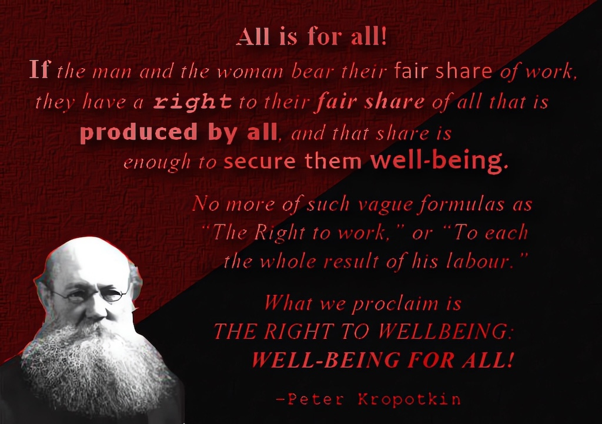

## The Abundance Paradox

We live in a world where there is enough for everyone. We produce more food than we need, we have enough homes for everyone to have shelter, and we have machines that allow one person to do the work that would have once taken ten people to accomplish. Yet the average person works just as long as their ancestors did.

Science and technology have enabled us to communicate instantly across great distances, to travel and ship goods farther and faster, to do far more in a fraction of the time, and to live longer and healthier lives. Yet in many areas, the benefits of this progress remain as unevenly distributed as when kings and lords ruled the land.

While we have refrigerators and microwaves, televisions and mobile phones, the average working person has less secure access to land and food than their predecessors did four hundred years ago. There was a brief golden age when one generation enjoyed many of these benefits: they could support a family on a single wage, afford to buy a house, and look forward to retirement.1 Now, although their children and grandchildren produce more wealth for their employers they receiving an ever-shrinking share in return than previous generations did.

The contradictions of our era are: mansions sitting empty most of the year, luxury cars gathering dust in garages, and private jets going unused most of the time. Meanwhile, homelessness rises, and workers spend more than half their wages on cramped rented rooms. Restaurants, concerts, and sporting events become exclusive activities of the wealthy, while many poor workers avoid going out to meet with their friends due to the cost. Even in the world's wealthiest nations, food banks multiply and malnutrition grows. This inequality manifests across every aspect of life:

In education, elite private schools and personal tutoring prepare wealthy children for prestigious universities and lucrative careers, while underfunded public schools struggle to provide basic resources. In leisure, the children of the wealthy enjoy abundant free time supported by their trust funds, while others work multiple jobs with minimal benefits and no time for rest. Financial security follows the same pattern, some have robust investment portfolios to weather any crisis, while most live precariously from payday to payday.

Yet we produce such excess that half our food is destroyed before reaching shops, and much of what remains rots unsold on shelves. The cost of producing almost everything has plummeted, yet prices for life's necessities (food, housing, education) continue to rise. Technology has multiplied our productive capacity many times over, but the fruits of this abundance remain as concentrated as ever.2

There is more wealth in the world than at any point in human history. The question we must ask is not just about its distribution, but about its origins. How did we create such plenty, and why do so many remain excluded from it?

## Increasing Production, Decreasing Benefits

In the past, some argued that scarcity and inequality were inevitable, that we were all subject to unpredictable elements and inefficiencies beyond human control. Even if this argument was dubious then, it holds no water now. We have reliable sources of production and generate substantial surpluses, yet we waste enough to meet everyone's needs many times over.3

The world existed long before humans did, producing vegetation, air, and water, filled with minerals and resources. All living things, including our species when we stood upright and become homo sapiens, shared in this natural abundance. This was a time before private land, before borders, and before nations. When we lived in smaller groups that made our interdependence on each other personal and obvious.

As we developed agriculture and gathered in larger communities, from villages to cities, our web of interdependence grew more complex. We still relied on farmers, orchard keepers, herders, tanners, millers, and bakers, but we might never meet them face to face. What changed wasn't our fundamental interconnectedness, but its visibility.

However, no one person then (or now) could survive without the collective efforts of countless others. Even when their work wasn't valued equally, it remained essential. No one could eat without farmers, millers, and bakers. No one could travel without road builders, or find shelter without construction workers. The fruits of their labour often outlasted them: roads continued serving travellers long after their builders passed, well-built homes sheltered generations, and mills ground wheat into flour decade after decade.

These systems of shared resources varied across societies. While some maintained relatively equal distribution among their members, others developed oppresive hierarchies. What's crucial to understand is that for millennia, even after the emergence of currency, access to life's essentials wasn't restricted by money.

The transformation of common resources into exclusive private property followed different paths in different places. Some scholars argue it began with the gradual hoarding and fencing off of previously shared community resources. Others suggest that would-be dominators, once kept in check by smaller communities, found new opportunities in larger agricultural societies to monopolise resources and gather enforcers, offering them special privileges in return.

These early appropriators began by demanding tributes and religious offerings, claiming divine authority and threatening non-compliance with supernatural or physical violence. This system of extraction persisted through feudalism, but around 300-400 years ago in Europe, a more profound transformation began: the wholesale claiming of ownership over fields they never ploughed, houses they never built, and minerals in the earth that had once belonged to everyone. This was the end of common land, and the beginning of making people homeless so that they had to work for wages to survive.

## The Appropriation Problem

Was this transformation inevitable? Was it necessary? What truly drives human progress?

Every modern convenience we enjoy rests upon centuries of human innovation and collective labour. We owe our agricultural abundance to countless unnamed inventors: to those who first crafted hand ploughs, who discovered grafting techniques, and who learned to domesticate animals. The industrial age brought us threshers and combine harvesters, mechanical looms, steam power, railways, and electricity, each innovation building upon what came before.

Today, we continue to benefit from infrastructure created by previous generations: roads that connect our communities, buildings that shelter us, scientific discoveries that underpin our technology, and breakthroughs that extend our lives. None of these achievements emerged from individual genius alone, they represent the culmination of countless contributors whose names history never recorded.

Even when we associate particular breakthroughs with individual inventors, these advances were only possible because of countless others who came before them, those who refined techniques, passed on knowledge, and created the conditions that made such discoveries possible, and armies of forgotten workers then and since who put the work behind bringing their ideas to fruition.

Yet our economic system increasingly concentrates the benefits of these collective achievements into private hands. The wealthy aren't ‘wealth creators’ (if they ever were), the majority simply accumulate and hoard capital, extracting rent from innovations and infrastructure built by generations of collective human effort, or putting access to it behind a paywall. This accumulation creates artificial scarcities: basic necessities like housing, healthcare, and education become commodities to be rationed by price rather than shared resources serving human needs.

Consider how many aspects of our common heritage have been privatised: public spaces become private property, shared knowledge becomes intellectual property, even the basic elements of life (water, seeds, genetics) become privately owned and controlled. This privatisation often traces back to original acts of theft: land enclosure, colonial appropriation, or simply taking what was once free or someone elses by force.4 That this stolen property has been legally bought and sold for generations doesn't make its concentrated ownership any more legitimate than its original theft.

The dynamics of this original capital5 create powerful feedback loops that amplify inequality. When wealth generates more wealth — through interest, rent, or privileged access to resources — it concentrates power in fewer hands. This concentration then enables further accumulation, as those with capital shape laws and institutions to protect their advantages.6

No one ever democratically granted others the right to exclusive access to more land than they could personally use, to the minerals beneath the earth, or to more resources than they could directly manage. These rights were taken, not given, and their modern legacy is a system where abundance for the few depends upon manufactured scarcity for the many.

## Inheritance & Entitlement

The question isn't just where wealth comes from, but who continues to create it. Where do the wealthy get their manpower? From us. Where do they source their materials? From lands and resources that should belong to all. What gave them the right to monopolise the earth's abundance and charge us for access to it?

The earth produces profit for property owners, but at catastrophic cost. This system of private ownership drives environmental destruction through wasteful replication, planned obsolescence, and the choice of less effective but more profitable methods.7 It overrides the will of communities in favour of shareholder returns.

Some say the world doesn't owe you a living. But they're wrong. The accumulated knowledge, infrastructure, and resources of human civilisation are our common inheritance. Value comes from all and is owed to all. We have collectively inherited the riches of generations past, and we all have rightful claim to it. There is such things as a free lunch, but most workers aren’t the ones getting it.

This isn't about demanding others labour for our benefit. History shows that communities — when freed from rent-seeking landlords and profit-hungry employers — naturally organise to meet everyone's needs.8 People understand that mutual aid benefits everyone. Food is a right. Housing is a right. You are entitled to what has been stolen from your ancestors and continues to be stolen from you.

No amount of concessions from the current system — whether welfare benefits or universal basic income — can return what is already ours by right.9 No one deserves to go hungry, fall ill from preventable illnesses, or sleep rough while houses stand empty. But recognising these rights isn't enough if we rely on governments and corporations to guarantee them.

We need to remove these artificial barriers between people and life's essentials. Why should countless middlemen profit along the way, with their gains subsidised by our taxes and protected by state power? The solution isn't more bureaucracy, it's direct community control.10

Yet securing basic necessities is just the beginning. The current system requires artificial scarcity to function, wealth accumulation depends on it.11 When wealth concentrates, power follows, and that power is invariably used to create new forms of dependency. Breaking this cycle requires more than reform, it requires transformation.

This transformation won't come from politicians. It requires people asserting their collective power through parallel, non-hierarchical, decentralised structures, through community assemblies and collectively organised co-ordination. We must decommodify not just basic needs, but everything that sustains and enriches human life.12

How we achieve this transformation is a subject for another discussion. But it begins with the recognition that the world's abundance already belongs to all of us. We are entitled not just to survival, but to everything that makes life worth living. All for all.13

Subscribe

[Share](https://peacefulrevolutionary.substack.com/p/universal-entitlement?utm_source=substack&utm_medium=email&utm_content=share&action=share)

 _This article is part of the …_

### Entitlement Series

If you liked this consider reading more of the [The Universal Entitlement Series](https://peacefulrevolutionary.substack.com/about#§entitlement-series)

1

This refers to the post-World War II period (roughly 1945-1975), often called the ‘Golden Age of Capitalism’

2

Current estimates suggest that worker productivity has increased by over 250% since 1948, but the bottom 50% own less than 1% of the wealth, while the richest 1% now own about 46%.

3

Enough to feed 3 billion extra people.] To understand how we arrived at this paradox of abundance and deprivation, we must look deeper into our history.

4

The enclosure movement in England (roughly 1500-1850) saw over 6.8 million acres of common land privatised through Acts of Parliament.

5

Called ‘primitive accumulation’.

6

With thanks to [The Counter-Intuitive](https://audiopervert.substack.com/) for this idea.

7

The richest 1% of the world's population are responsible for more than twice the carbon emissions of the poorest 50%.

8

Historical examples include the Paris Commune, Spanish collectives during the Civil War, and numerous indigenous societies. Modern examples include Rojava's democratic confederalism and Zapatista autonomous communities.

9

See [Universal Basic Entitlement](https://peacefulrevolutionary.substack.com/p/universal-basic-illusion)

10

Direct community control has taken various forms historically, from workers' councils to neighbourhood assemblies (asambleas barriales) to indigenous consensus-based governance systems.

11

Artificial scarcity occurs when abundance is artificially restricted to maintain prices and profits. Examples include destroying food to maintain prices, patent monopolies on medicines, and vacant houses kept empty to maintain property values.

12

Decommodification means removing something from the market system so it's distributed based on need rather than ability to pay. Public libraries are a familiar example.

13

This phrase is from Peter Kropotkin’s Conquest Of Bread, first chapter, [Our Riches](https://peacefulrevolutionary.substack.com/p/our-riches), which is the primary source of inspiration for this article.
