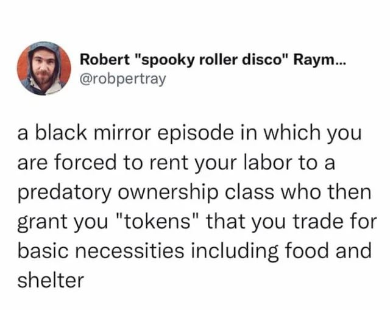
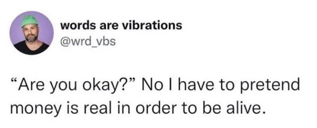
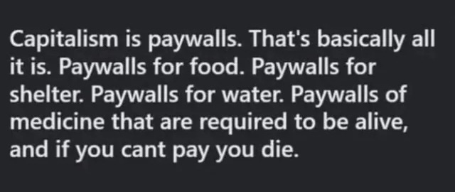
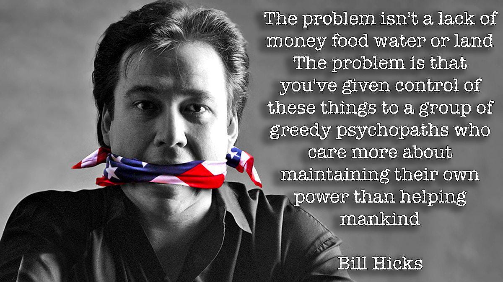
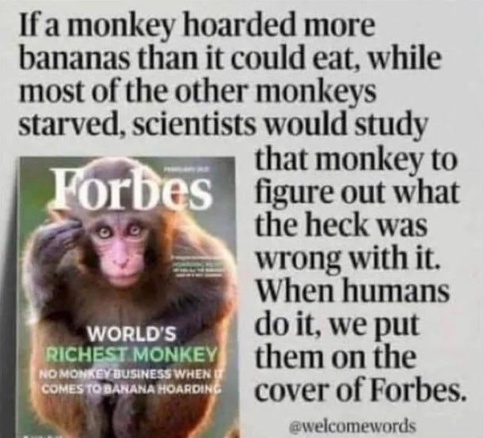
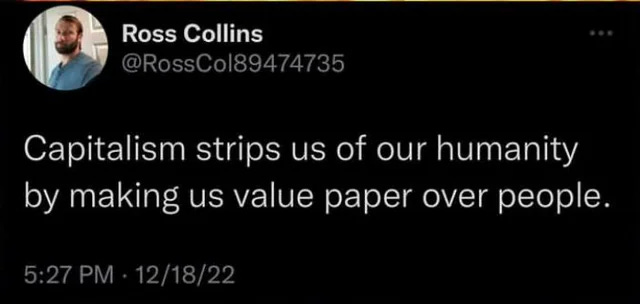
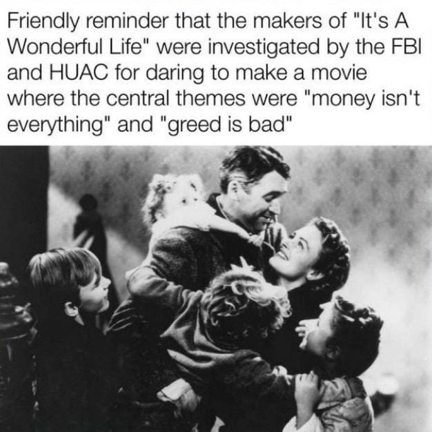
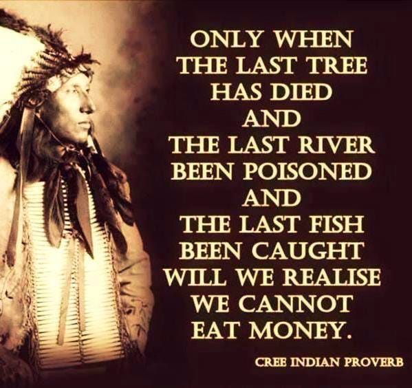
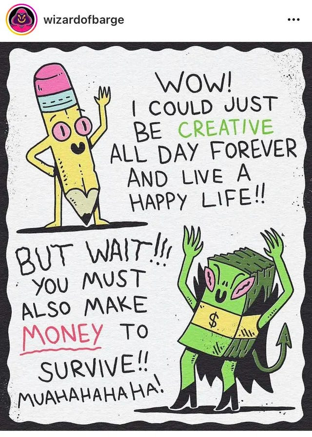

_In the absence of daily ‘Reasons To Hate Capitalism’ for the next month I’m sharing some themed meme and quotes collections I hope you enjoy below._

## Money Is Silly

It is a piece of paper (when its in printed form) that has no real value. You cannot eat it. It burns too quickly to use as fuel. It would take too much of the stuff to build anything useful with it.

Even when it is in numerical form, a sum on a balance sheet or computer screen, it doesn’t show how smart you are, strong you are, or how hard you work.

It doesn’t reveal how loved you may be, what potential you have - especially for caring, learning, or any kind of good.

It gets in the way of our needs. It subverts the good we may wish to do. It hurts far more than it helps.

No-one is entitled to more of it than anyone else, because it can’t be earnt in any fair and accurate way, any more than access to air can be.

Yet the existence of it, and our respect and use of it prevents the hungry from eating, the curious from learning, the ill from receiving treatment, and the homeless from shelter.

This festive season find and spread happiness - it is a radically anti-capitalist anti-money act - if enough of us did it we’d crash the economy which relies on misery and selfishness and greed. Although the rich monetise the lack of happiness through pills and purchases, true happiness is the one thing they can’t monetise yet.

## Money Is An Artificial Human Construct

 _Existential Comics_ <https://existentialcomics.com/comic/418>

## The Impact on Basic Human Needs

## Money Distorts Human Values & Priorities

## Money Impacts The Environment And Sustainability

# Money Negatively Affects Creative and Personal Fulfilment

# A Future Without Money

 _Star Trek, First Contact, 1996_

Subscribe

[Share](https://peacefulrevolutionary.substack.com/p/for-love-nor-money?utm_source=substack&utm_medium=email&utm_content=share&action=share)

And now for your 80s playlist -

Or I prefer the original -
