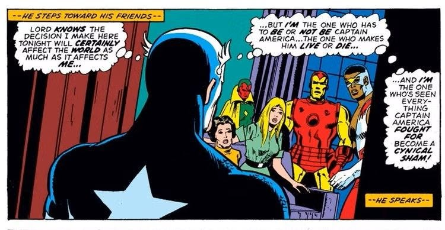
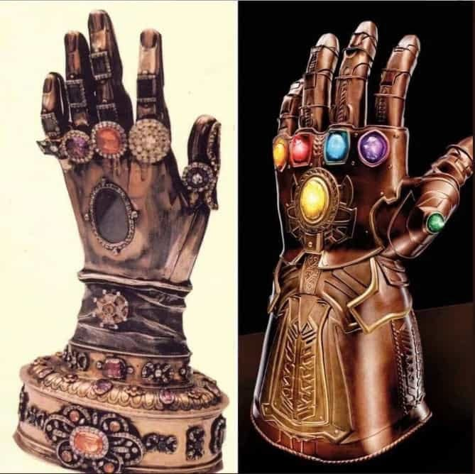
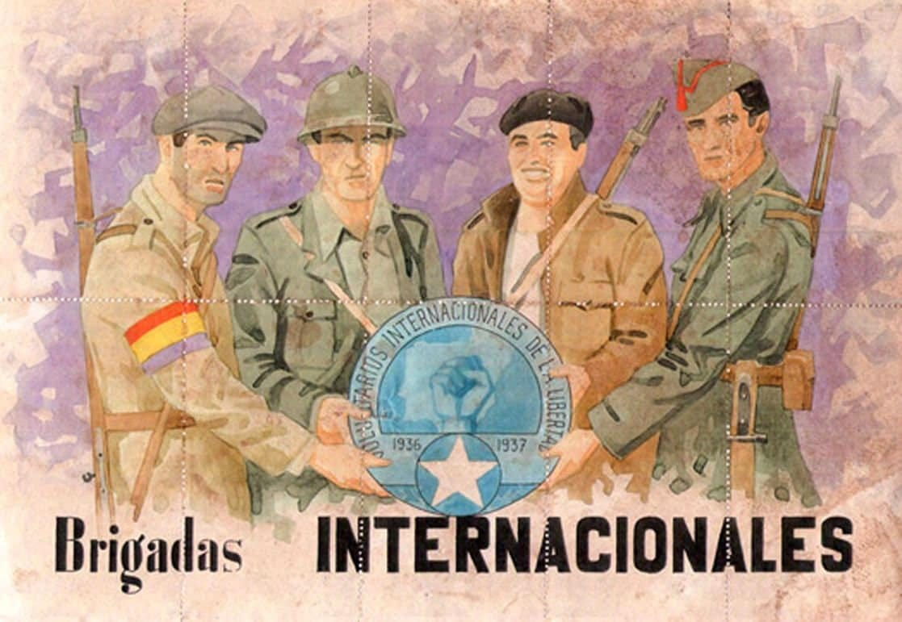
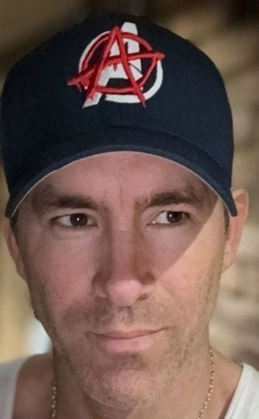
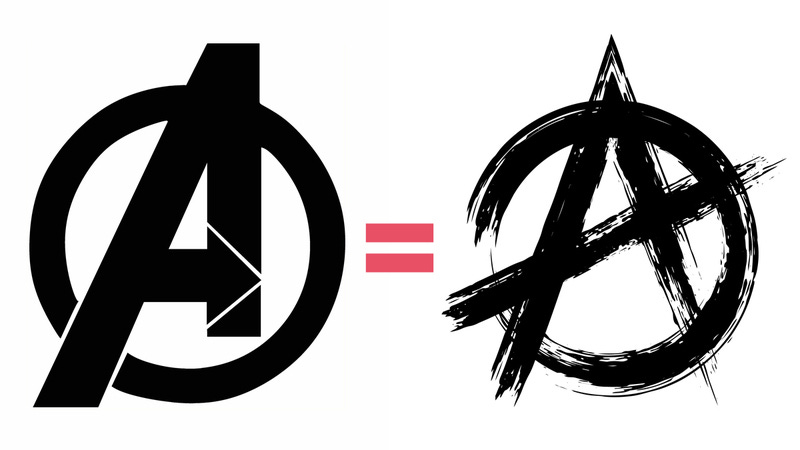

## The Spanish Civil War and Its Avengers

The Spanish Civil War and Marvel's Avengers: Infinity War (2018) might seem like an unlikely pairing for comparison. However, these two conflicts - one historical, one fictional - share remarkable parallels in their themes of resistance against authoritarian power, the role of international solidarity, and the persistence of rebellion even after devastating defeat.

The Spanish Civil War of 1936-1939 created one of history's largest experiments in worker self-management and libertarian socialism through the Anarchist collectives of Catalonia and Aragon.1 At the heart of this revolutionary moment was Buenaventura Durruti, who began his journey not as a military leader, but as a metalworker and trade union militant.2 Before leading his famous column, Durruti was part of an Anarchist militant group called Los Justicieros - literally ‘The Avengers’ - foreshadowing the role he and his comrades would play in the struggle against fascism.3

The CNT-FAI (National Confederation of Labour - Iberian Anarchist Federation) mobilised massive numbers of workers and peasants who not only fought against Franco's fascist forces but simultaneously transformed society - collectivising factories, farms, and public services.4 Through his involvement with the CNT and FAI, Durruti emerged as one of the most prominent Anarchist figures in Spain, known for both his tactical brilliance and his unwavering commitment to Anarchist principles.

When Franco launched his coup in July 1936, Durruti helped organise the initial resistance in Barcelona.5 The Durruti Column, formed in these early days of the Civil War, became one of the most effective Anarchist militias, with around 6,000 volunteers at its peak. They were particularly noted for their egalitarian structure - Durruti refused privileges of rank and maintained the Anarchist principle that officers were elected by their units.

The Column achieved significant early victories in Aragón, helping to establish and defend Anarchist collectives across the region. However, when Madrid was threatened in November 1936, Durruti and a portion of his column moved to defend the capital, where he was killed in controversial circumstances on November 20, 1936. His funeral in Barcelona drew hundreds of thousands of mourners, demonstrating his immense importance to the Anarchist movement. The Column continued fighting after his death, maintaining their commitment to both military resistance and social revolution, though they were eventually forced to militarise under pressure from the Republican government.

## From Historical to Fictional Avengers

Twenty-seven years after the end of the Spanish Civil War, another group called The Avengers emerged - this time in the pages of Marvel Comics, created by writer Stan Lee and artist Jack Kirby in 1963.6 While the connection to Durruti's fighters might be coincidental, both groups would come to embody similar themes of resistance against overwhelming odds and the fight against authoritarian power.

In Avengers: Infinity War, Earth's heroes face Thanos, a cosmic warlord convinced that the universe's resources are finite and that half of all life must be eliminated to ensure survival.7 Like Franco's fascists, Thanos commands overwhelming military force and believes his brutal mission serves a greater purpose. The conflict draws together scattered resistance forces in a desperate battle against authoritarian power - much like the Spanish Civil War united various anti-fascist groups against Franco.

In both conflicts, we see decentralised groups fighting against hierarchical forces. The CNT-FAI mobilised workers and peasants who not only fought Franco's fascists but simultaneously transformed society through collectivisation. Similarly, after the Sokovia Accords, the Avengers operated in a decentralised, non-hierarchical structure reminiscent of Anarchist militias - with autonomous groups making tactical decisions while sharing a common cause.

Following the Sokovia Accords, which attempted to place the Avengers under UN control, Steve Rogers and Tony Stark found themselves on opposite sides of a fundamental ideological divide. Rogers refused to accept government oversight, believing it would prevent them from helping people when necessary and could lead to the Avengers being used as tools of state control rather than protectors of the people. This split came to a head over the treatment of Steve’s friend Bucky Barnes, culminating in a violent confrontation that left the Avengers fractured. Like Anarchist resistance to state control and Durruti before him, Rogers chose to continue his mission outside official channels rather than submit to governmental authority. 

Captain America took on the renegade incarnation as Nomad - the black-clad rebel with the stars and stripes painted over - which provides another interesting parallel.8 Like Durruti, Rogers transitions from operating within existing systems to becoming an underground figure fighting for his principles outside state structures. After going underground, Rogers, along with fellow fugitives Black Widow, Falcon, and Scarlet Witch, operated a covert network helping people and stopping threats without government sanction. This decentralised, autonomous approach to heroism would prove crucial when Thanos arrived - though the fracturing of the Avengers' collective strength would also prove to be a significant vulnerability, much like how political divisions among anti-fascist forces had devastating consequences in Spain.

## The Power in Their Hands

Both Franco and Thanos positioned themselves as reluctant saviours who needed to commit atrocities for what they claimed was a greater good. Franco's chilling declaration that he would ‘shoot half of Spain if necessary to pacify the country’ eerily prefigures Thanos's plan to eliminate half of all life for ‘universal balance.’ While Franco's targeting was more specific - aimed at Anarchists, communists, and other opponents - both shared a coldly mathematical approach to mass death as a solution to social problems.

One of the most unlikely coincidences lies in the symbolism of power. Franco possessed Saint Teresa of Ávila's severed hand, housed in a silver glove adorned with precious stones. He kept this relic until his death, believing it provided spiritual power and legitimacy to his rule. This bears an uncanny resemblance to Thanos's Infinity Gauntlet, with its powerful stones mounted on each finger and the back of the hand.

Saint Teresa of Ávila’s hand & Thanos’ Infinity Gauntlet - A coincidence?

Saint Teresa of Ávila's hand and arm were separated from her body shortly after her death in 1582, as was common practice with significant religious figures at the time. The preservation of the hand was seen as evidence of her sainthood, as ‘incorruptibility’ was considered a sign of divine favour. The relic was particularly significant because Saint Teresa was seen as a quintessentially Spanish saint and became increasingly associated with Spanish nationalist identity.9

The journey of Saint Teresa's hand during the Spanish Civil War reflects the chaotic power struggles of the period. Initially housed in a convent in Ronda, the relic was first stolen by Republican forces, but was then captured by Franco's nationalist forces during the Battle of Malaga in 1937. From that point forward, Franco maintained personal possession of the hand until his death in 1975, reportedly keeping it by his bedside and even sleeping with it. The fact that he was found with the hand in his arms at death adds another layer to the parallel with Thanos's obsession with the Infinity Gauntlet.

This mirrors, in an eerily specific way, the struggle for powerful artefacts in Infinity War. The Infinity Gauntlet, crafted in Nidavellir from magical metal (Uru), was specifically designed to hold all six Infinity Stones - one stone mounted on each finger and one on the back of the hand. Just as Franco's possession of Teresa's hand-in-glove relic was meant to legitimise his authority and provide spiritual power, Thanos viewed the Gauntlet as both a tool and a symbol of his divine purpose.

## International and Interplanetary Solidarity

The internationalist nature of both conflicts provides a remarkable parallel. Franco's forces relied heavily on military support from Nazi Germany and Fascist Italy, who provided aircraft, tanks, troops, and technical expertise - most infamously in the form of the German Condor Legion.10 This external support proved crucial in overwhelming the Republican forces, much as Thanos's army of Chitauri and other alien forces provided him with the military might to overcome Earth's defenders. In both cases, these foreign forces brought advanced military technology that gave the aggressors a significant tactical advantage - the German aircraft that devastated Guernica find their parallel in Thanos's massive Q-ships and advanced weapons.

The defensive alliances mirror each other as well, though in both cases they faced significant handicaps. The Spanish Republic received support from international volunteers in the form of the International Brigades, but their effectiveness was severely limited by Western democracies' policy of ‘non-intervention’.11 This policy, while presented as neutral, effectively aided the fascists by denying legitimate weapons sales to the Republican government while Nazi Germany and Fascist Italy continued supplying Franco's forces. This betrayal by supposed democratic allies parallels how the Avengers faced fragmentation and lack of support from institutional powers before Thanos's arrival.

Wakanda's decision to open its borders and commit its advanced forces to the defence against Thanos parallels how various nations’ volunteers crossed borders to fight fascism in Spain, while the Guardians of the Galaxy's involvement mirrors how the International Brigades brought together fighters from diverse backgrounds united by a common cause. However, just as the International Brigades’ courage couldn't overcome the material advantage given to Franco by his fascist allies and Western democracies' complicity, the combined forces of Earth's heroes and their cosmic allies ultimately proved insufficient against Thanos's overwhelming military superiority.

## Resistance After Defeat

Despite Durruti's death in Madrid in November 1936, and even after Franco's victory in 1939, resistance to fascism continued through various forms. The Maquis - anti-fascist guerrilla fighters - continued armed resistance in Spain's mountains well into the 1960s, whilst underground networks maintained solidarity, helped people escape, and kept resistance alive in cities and villages.12

The international dimensions of these conflicts reveal more similarities. Just as Spanish Anarchists and other anti-fascists adapted to new forms of resistance - from direct action to mutual aid networks - the remaining heroes like Black Widow maintained global networks of resistance, Hawkeye pursued direct action as Ronin, and others like Captain America facilitated support groups for survivors. In both cases, the resistance continued not because victory seemed possible, but because the fighters believed in the necessity of opposition to authoritarian power.

Unlike the Avengers’ eventual time-travel solution in Endgame (2019), modern Anarchists focus on building power through interconnected local actions and international solidarity.13 This includes creating alternative economic structures, establishing autonomous zones, and developing international support networks. The goal isn't to ‘snap back’ to a previous state but to build something new through collective action and mutual support - much as the Spanish Anarchists did by managing collectivised farms and factories even during wartime.

The parallel between these struggles reminds us that resistance to authoritarian power takes many forms, and that defeat in one battle doesn't mean the end of the fight. Whether in historical Spain or the fictional Marvel Cinematic Universe, the will to resist and build alternatives to authoritarian power persists, adapting to new conditions while maintaining core principles of solidarity and collective action.

In the Anarchist tradition, victory isn't necessarily achieved through a single decisive battle, but through consistent organising, mutual aid networks, prefiguration, and building dual power structures that exist alongside and eventually aim to replace hierarchical systems. Where the Avengers could rely on extraordinary means to undo Thanos's actions, modern Anarchist movements focus on gradually building power through practical actions that demonstrate alternatives to hierarchical power structures - all while maintaining the historical Anarchist commitment to direct action and international solidarity.

> ‘You must not forget that we can also build. It is we the workers who built the cities and the palaces—here in Spain and America, and everywhere! We can do it again! Better than before! The bourgeoisie might blast its own world to ruin before it leaves the stage of history...We carry a new world, here, in our hearts. That world is growing in this minute.’ _\- Buenaventura Durruti (July 14, 1896 - November 20, 1936)_

 _Check out the[comics based on the life of Durruti](https://www.kickstarter.com/projects/autonomouscollective/durruti-shadow-of-the-people-1-3) which inspired this article._

Here is a different take on this same subject - [Why The Avengers Are All Anarchists](https://www.cracked.com/index.php/article_27330_why-avengers-are-all-anarchists.html) as unofficially confirmed by Deadpool himself -

Subscribe

[Share](https://peacefulrevolutionary.substack.com/p/the-anarchist-avengers?utm_source=substack&utm_medium=email&utm_content=share&action=share)

1

https://en.wikipedia.org/wiki/Spanish_Civil_War

2

https://en.wikipedia.org/wiki/Buenaventura_Durruti

3

https://en.wikipedia.org/wiki/Los_Justicieros

4

https://en.wikipedia.org/wiki/Iberian_Anarchist_Federation

5

https://en.wikipedia.org/wiki/Francisco_Franco

6

https://en.wikipedia.org/wiki/Avengers_(comics)

7

https://en.wikipedia.org/wiki/Avengers:_Infinity_War

8

https://en.wikipedia.org/wiki/Nomad_(Marvel_Comics)

9

https://en.wikipedia.org/wiki/Teresa_of_%C3%81vila

10

https://en.wikipedia.org/wiki/Condor_Legion

11

https://en.wikipedia.org/wiki/International_Brigades

12

Just another coincidence? https://en.wikipedia.org/wiki/Maquis_(Star_Trek)

13

https://en.wikipedia.org/wiki/Avengers:_Endgame

