## What is the Dispossessed?

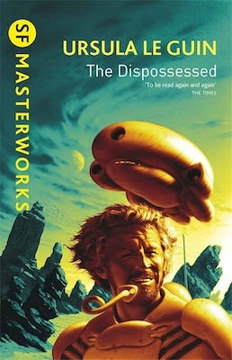

When I first discovered Ursula K. Le Guin’s The Dispossessed it felt like a revelatory experience. It’s protagonist, Shevek, was confronting the same questions I myself was asking at the time, and I was finding the answers on his fictional world of Anarres. It was a book that made me question my previous assumptions about the way the world works (and doesn’t), and how it could be different. It also made me reflect on my own life’s perspectives and purpose.

Many others have had similar experiences reading it’s pages in the fifty years since it was published. From the time it appeared on book shelves it quickly garnered glowing reviews, and was one of the rare books to receive the Hugo, Nebula, and Locus awards (after Le Guin being the first woman to win the Hugo and Nebula with a previous book).1

What made the Dispossessed so unique was that it was a modern revival of the utopian genre, and in this case was an Anarchist utopia, albeit an ambiguous and imperfect one.2 It’s world had no rulers, no private property, no money, and was peaceful. As Le Guin later recounted about the books origins:

> ‘I studied peace. I started by reading a whole mess of utopias and learning something about pacifism and Gandhi and nonviolent resistance. This led me to the nonviolent anarchist writers such as Peter Kropotkin and Paul Goodman. With them I felt a great, immediate affinity. They made sense to me in the way Lao Tzu did. They enabled me to think about war, peace, politics, how we govern one another and ourselves, the value of failure, and the strength of what is weak. So, when I realised that nobody had yet written an anarchist utopia, I finally began to see what my book might be.’3

Le Guin’s vision went on to inspire other authors such as Kim Stanley Robinson, Iain M. Banks, and Becky Chambers who all went on to create their own Anarchist science fiction utopias.4 However, like any ideal of a better world it hasn’t appealed to everyone, and has had some detractors amongst its many fans, and even some of its fans have reservations about aspects of it.

## You don’t have to like it

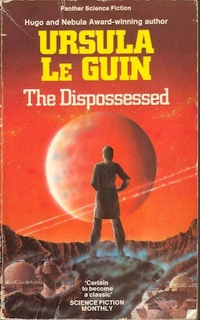

Whether you like a book or not is a matter of individual taste. Some of the ways in which a book can be objectively bad are: If it has frequent spelling and grammar mistakes, uses words incorrectly, portrays characters inconsistently, contains contradictory or unresolved plot lines. But leaving aside these sorts of major errors (which a good editor should’ve fixed), most novels may be degrees of good or bad, enjoyable or boring. We judge them according to how much we personally like them, even if others take the opposite opinion. We understand that our literary tastes are subjective and others views are just as valid.

I’m not going to criticise people who just felt _The Dispossessed_ just wasn’t of interest to them. It doesn’t have to be everybody’s ‘cup of tea’. For every ten who like the book, one or two others don’t like the main character, or feel the other characters are undeveloped, or that it is too slow, or that there is not enough action and too much conversation. Even LeGuin herself described it as ‘a heavy, argumentative book.’5

Some find the changing timeline of alternating chapters to be confusing, or the alien names to be off-putting. For others the themes are just ones they have no interest in, or they may come to the book with a starkly different outlook that prevents them from enjoying it.

Science Fiction itself, especially the kind that deals with concepts like this book does are a form of fiction that is not going to be to everyone’s liking. This genre has often focused on ideas more than characters, which is good if you are fascinated by the ideas, but may not appeal to those who aren’t. In the decades since this book was written there have also been changes in the expectations of readers about how much personality they want to see on the pages describing the characters, about how much action is used to move the story along, and far more insight into internal emotions is expected than once was. Even when the book first was considered by publishers one of them considered it boring and suggested cutting the text in half.6

### Why it is liked

 _The Dispossessed_ was quite a radical book from a groundbreaking feminist author when it arrived in bookstores, questioning as it does standard assumptions about society.

Yet many do like and even love the novel, for perhaps as many reasons as it has happy readers. They resonate with the protagonist struggling to fit in, they find the world of Anarres and it’s philosophic conflict with it’s neighbour Urras to be fascinating, they are intrigued as to where the dual timeline is leading and how Shevek’s past informs his future, or the share his values or frustrations on his home world or the continent he visits which is very much like our own world. For these and other reasons it has continued to be in print continually because of its popularity.

## Utopia vs Dystopia

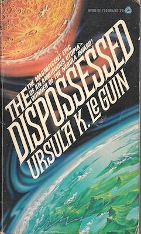

Yet I have been surprised by the reviews from some of those who have negatively reviewed the book, and even some of those who have liked it who have taken issue with parts of it, not because disliking it’s style or characters, but because of not liking its concepts.

Perhaps most surprising to me are those who take issue with the world of Anarres being called a Utopia - albeit an ambiguous one - and some even calling it a dystopia. Of course one persons utopia may very well be another’s dystopia and vice versa, but I think there are good reasons Anarres meets the definition of a utopia, even when compared to our own world.

In the context of the book a utopia is a better world, and a better way, but not a perfect one.7 It promises a baseline of the essentials of life being equally available to everyone, but not forcing anyone to pay for them, or comply with rules to receive them. However, it still has fallible humans, with all their foibles. Some of the criticism the book has received has come from this difference in definition, from those looking for an exact plan and a uniform world which has attained perfection.

Anarres is markedly different from past utopias because it allows for people people to pursue their own ideas and ideals, even to the point of opting out of society, without losing the ability to survive.8 It is a multilateral utopia, in which different groups can take different approaches to achieve similar goals, without one way being enforced. This doesn’t mean it is disorganised, however, as there are as many syndics, federations, committees and councils as there are practical and social needs, and aspects of society to help organise.9

Unlike past concepts of utopia it isn’t a finite, static, conformist one size fits all utopia. It is intended to be always progressing and refining itself, so that it is flexible and adaptable and expanding what is possible. Whereas many old utopian novels were highly prescriptive, having only one true way, which was heaven for those who like the ideal, and hell for those who don’t.

## Anarres Problems

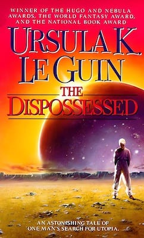

But Anarres is not a perfect planet on which to carry out some of its ideals, and this is where some of the tensions and conflicts in the story come from, as well as some of what people don’t like about it.

There are some aspects of Anarres that seem to have been designed to make it a more challenging place on which to achieve an ideal society. I believe that there are several things the author never intended for us to like about the world:

  * The arid conditions and lack of natural beauty, and land-based wildlife

  * The scarcity that results from this situation, and the emergencies that arise from this.10

  * The lack of some resources and some conveniences that might be supplied by them.

  * The resistance of some of it’s inhabitants to change and communication with other planets, especially it’s ideologically opposed neighbouring planet.

  * It’s language which treats common concepts like ownership and relationships very differently.

Let’s say you want to plant the seed of utopia, but then put it in the worst soil for it to survive in, and then ask the question of, ‘how might utopia still grow if tended and nurtured in such harsh conditions?’ You would give such a society good ideals and even ways to encourage people to live up to them, so it had a good start. But then you would fill this planet with characters who are challenged by their own bad habits, and the tendencies that tend to undermine their best values.

You could then create one particular character who wholeheartedly believes in the utopian concepts he has been taught, but still doesn’t quite fit in, as a way to show how he tries to adapt and finds it challenging to do so. You could introduce other antagonists he comes up against who have become lazy or bureaucratic, and give him practical challenges too, such as a famine which diverts him from his discoveries and separates him from the person he loves.

Then you could have him go to a very different world which opposes everything he holds dear, but which gives him privileges and comforts he could have only dreamt of before, so that he is eventually faced with the human cost of them, and the difficult decisions that brings.

If you were to do all this then you will end up with the story of Shevek in _The Dispossessed_. It won’t be a story to everyone’s liking, but it will find it’s fans, those who appreciate the writing, those who like the ideas, and those fascinated by the setting.

However, you will also get readers who dislike the desertous planet too much to focus on the benefits it’s society has; who dislike the sparsity that is unavoidable in such circumstances, and are unable to separate this from the other positives that are a result of the values it’s inhabitants live by; or who dislike the frustrations the character faces in the development of himself and his story, and are unable to find enough to compensate for this in the achievements and progress that is also made by him.

## Concept Dislikes

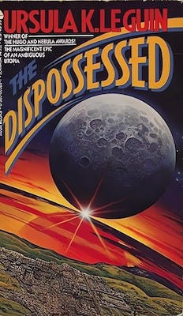

Then there are specific concepts that some readers take exception to. People often come to a story with a set of assumptions and beliefs that act as a lens through which they interpret the world, and even sometimes what they read. Many people can separate their own views from imaginary worlds they may encounter on the pages of science fiction, but others will find some worlds to be too different or too opposed to the beliefs they bring with them to enjoy such a novel.

In the case of _The Dispossessed_ there is no concept of a personal god (or even a pantheon), tthere is no ‘traditional’ marriage or family ideals, or laws enforcing ‘morality’ (beyond adult consent), there are almost no punishments, and there is no attachment to property, or special respect for authority (beyond recognising individual’s skills. This is diametrically opposed to many spiritual systems and cultural customs.

 **What’s In A Name**

To start off with what might seem like a small issue that some have with the book, I have been surprised by how many people seem to take exception to the fact that on Anarres a computer assigns names to children at birth, rather than the parents.11

There isn’t any back story given to how this came about, except that in the past the colonists adopted a new language, which included new personal names. Those names followed patterns which allow for millions of variations, so that no two inhabitants of the planet need share the same name. The early settlers also created a computer system to co-ordinating what work needed to be done, and what resources were needed where. The combination of this new language and technology somehow led to names being generated by the computer system when children were born. 

I imagine it started as a novelty to be the first to give your child such a unique name, then it became a tradition. However, like all other aspects of the society, there was no compulsion except tradition to encourage people to accept this, and nothing to stop anyone picking a different name at any time. Nevertheless, it became the norm to let the computer assign baby names despite this.

I understand that people in our world think carefully about what to call their child, and become very attached to the names they chose. What I find confusing about this idea being held up as being dystopian is that:

  1. a) Children don’t choose their names in our culture, and tend to be stuck with the name chosen for them already. So I don’t understand what the child would be missing out on.

  2. Using this system all children would have a unique personal name. There would never be the chance of two people sharing the same name, or any confusion as to who is being referred to - such as in a classroom or the workplace.

  3. There would be no distinction of family name, married surname, or being named after a parent, so there would be no special privilege or expectations that sometimes comes with such names.

  4. There is nothing to stop anyone changing their name later, and it would probably be easier as there would be no chance of upsetting parents who had picked your name and expected you to keep it.

 **Scarcity vs Plenty**

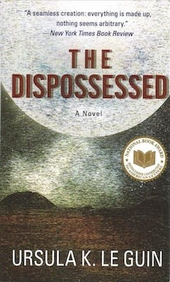

Another issue people have, which I’ve mentioned earlier, is the setting and the scarcity that comes with it. I agree that a world in which everything anyone could ever want was easily and readily available. It would be like my childhood dreams of living in Wonka’s chocolate factory, but I’ve grew up and now know that if I was an Oompa-Loompa I’d have rotten teeth and type two diabetes by now.

It would have been easy to have had Utopia set on the more abundant world of Urras, but it is because no-one but miners lived on Anarres that the Urrasti exiled the revolutionaries there. They were certain that it would be impossible for them to live up to their ideals in such un-ideal conditions, and that they’d soon be begging to come back and embrace Capitalism. A world of plenty would be more desirable to live in, even if it creates less dramatic tension for the benefit of the story. But this conflict confronts us with the question of whether we’d rather live in a peaceful and kind world (like Anarres) without some comforts, or one (like Urras) in which many go without to supply a few with those comforts?12

There is one other criticism that I think is directly related to the issue of scarcity and that is the assignments that separate Shevek from his partner Takver, and Shevek from his work at the Physics Institute in Abbenay: Work assignments. Such assignments come with higher expectations when they are needed more desperately - sort of like people of a town rushing to put out sandbags to stop a flood.

Shevek’s sacrifices at such times could can be seen as a story of practical necessity or altruism, of pursuing, achieving and maintaining good ideals against harsh conditions. But if a reader doesn’t sympathise with those ideals it would seem more of a chore than an accomplishment.

 **Individuality vs Social Pressure & Bureaucracy**

Individualism is another area in which people have reservations about Anarresti society. I’d argue that the inhabitants are individually more comfortable with themselves in some ways than we are in our society today. Many of the things that might make us feel inadequate are absent or irrelevant to them, especially as there are no school grades for them to judge their mental acumen, or hierarchy to indicate they are below anyone else. They are able to choose their profession, and how much time they spend on it, and they are able to form relationships without any regard to class, caste, race, or group approval. People are not judged by gender, sexuality, skin colour, position, fashion, strength, or any such superficial indicators of status, and there is no special reverence for people due to religion, wealth, or fame.

But for some who assess their place in society by personal accomplishments (or feel it is defined or enhanced by such indicators), or gauge their status by belonging to certain in-groups, then this difference would seem difficult to navigate using the social skills and customs we’re used to on earth.

 **Social Pressures**

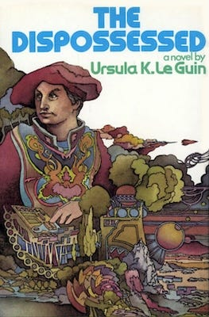

Even with Anarres being more accepting than our own planet there are still exceptions to complete acceptance: There are those who opt out of society almost entirely: the ‘nuchnibi’. Some do look down on them, although they still have access to food and shelter as needed. Then there are those artists who feel they are not supported or appreciated for their talents, whose art may even be rejected or harshly judged by those who don’t like it. Although this doesn’t stop them producing art it can still be discouraging as we find in the case of Shevek’s friend, Salas.

Although anyone can be or do whatever they want, they can't make others publish, take part in, or make them attend something they create or perform. So utopia doesn’t come with guaranteed attention or appreciate of your art, as Salas finds out.

Le Guin added such personality clashes to show people are still people on Anarres, and in order to create contrast, drama, and tension between characters to move the plot forward.

In such a utopia the fact that you have the freedom do anything doesn’t exempt people from hurting others feelings, being difficult to get along with, or from being judged by their peers because of it. There is freedom of association, but this also includes freedom of disassociation. You don’t have to be friends with those you don’t want to be, but a certain degree of politeness and courtesy exists as part of their culture, inspired by its underlying philosophy.

But it could be argued that - as Bedap does in the book - that some people will always be antagonistic toward society around them, unable to adapt to being in a community with others, or just have a perspective too unique for others to appreciate. Whether this is an issue of mental health or of artistic temperament or eccentricity is one not fully answered in the novel and one Shevek wonders about.

There is another element of social pressure the book speaks of and that is the positive kind: saying, ‘you will enjoy these benefits if you put in this effort’, or ‘you’ll feel more fulfilled if you devote yourself to helping where you have something to offer and are needed’, and ‘because you contribute to the running of society you are able to enjoy a society with greater freedom (rather than coercion others live under on Urras)’.13

Being brought up with a sense of duty, purpose or usefulness is a form of social influence, as is teaching a child skills that might be useful to society. In Anarres they teach children that they are part of a Social Organism in which they can play an important part, and that this organism relies on them to properly function. Whereas in our earthly society we are taught that we must be a valuable employee, in order to produce profit for a company. Which is more utopian?

 **Bureaucracy**

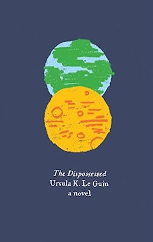

 _The Dispossessed_ doesn’t ignore that there are negative tendencies that exist within humanity14 and it addresses some of these and the problems they cause in Shevek’s life and broader society. That such imperfect beings exist may also not seem utopian, but the alternative would be a world populated by automatons instead of people. So people being occasionally annoying may always be the price of living in an otherwise ideal society.

Shevek studies and works in an academic field (when not occasionally helping out on manual work projects), and like academic departments here on earth there is a tendency toward resisting adopting new theories, especially from older colleagues resistant to change. In other areas of work, where it is clearer what is needed and what has to be done, there might not be the room for the bureaucracy Shevek encounters. But he finds himself having to push through layers of resistance to his ideas, from those invested in old more accepted ones. When this happens he complains that it is not in the spirit of the principles they share, and that some are opposing (or co-opting) his work due to trying to satisfy their own egos.

Yet there are no laws to stop him from continuing controversial research, and although there are publishing collectives which may not share his views, there is nothing to stop him working with a different one or setting up one of his own (which he ultimately does). Nor is he limited to being assigned classes and students, as he can organise his own classes and anyone is free to attend if they want. So the bureaucracy he encounters slows, but ultimately doesn’t stop his progress.

Yet, the disappointing lack of support he receives from some of his peers does end up being one of the major reasons he ends up going to the planet of Urras, where he thinks his work might be more appreciated. Although he finds they value his breakthrough less for its scientific advances, and far more for its potential financial rewards and strategic advantages. Whereas Shevek sees the potential of his discovery to break down communication barriers, so ends up giving his research away freely to everyone, and planning to return to Anarres.

This aspect of the story reinforces the idea in the book of revolution being a continual process or questioning expectations and resisting the tendency toward conformity. What makes Anarres different from Urras or earth in this regard is that there aren’t the same mechanisms to enforce those norms, and so there are always ways to challenge or go around them. This is why Anarres needs its Sheveks, and why he feels the need to return, to help that process.

 **First World Problems**

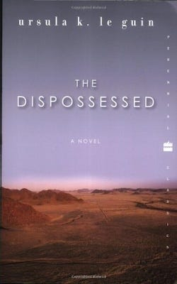

To a privileged person living on Urras - with servants to cook for them, clean up after them, and drive them around - Anarres might seem like a dystopia, and Urras like a utopia. For some of them it may be one: They may have everything material and convenient they could wish for, and be protected from every danger and inconvenience they hope to avoid. However, this privilege is afforded to a relatively few at the expense of a much worse situation for many more.

So too on earth there are some who experience little if anything unpleasant beyond accidents or bad luck. This too has always mostly come through the exploitation of others - although often behind the scenes where their sacrifices won’t disturb those in comfort having to see that the life they enjoy comes at the cost of a worse life for others.

The revolutionaries who went to Anarres were mostly from the group that worked to supply the luxuries of others that they themselves could not afford, so knew well the cost such conveniences came at. Perhaps there were others among their number who were better off, but had compassion toward those who laboured so hard for so little, or who believed in the same ideals as the revolutionaries for other reasons. 

If someone wasn’t concerned about those who suffer under their system, and doesn’t share the ideals of equality and personal freedom, then Anarres would hold little appeal and not seem very utopian to them. So it is with some readers of _The Dispossessed_ , who may not find anything that they consider anything relevant or attractive to them.

Even if this is the case, however, I’d encourage people to realise that the comforts they enjoy are made possible by others exploitation, that our paradise is made possible by their dystopia, and so there is a need for major changes which would alleviate others suffering, especially as the privileged class some of us belong to is rapidly shrinking, and we may find ourselves in the shoes of those less fortunate sooner than we imagine.

## Utopian Anarres

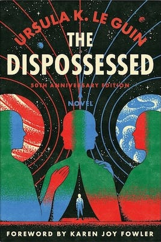

In visiting Urras, Shevek is initially impressed, but soon sees their problems outside of his campus, what most people lack, the value of the ideals Anarres can offer, and he is reminded of how his home planet is so much better in many respects, especially for the majority.

All of the problems Shevek encounters on Anarres where people fail to live up to ideals, but Shevek continues to believe in those ideals, and to believe that - although people fail them sometimes - Anarres is still closer to a utopia than Urras, the place most like our own world. These ideals give him a reason to encourage the people of Urras to revolt and to emulate Anarres, and the problems Anarres still has give him a reason to want to get back to his planet to help fix them.

This is despite the fact that Urras is more aesthetically beautiful, and has many more luxuries and conveniences. But Sheaves is horrified by its walls (real and economic)15 that keep people in some areas and out of others, of how those who produce its luxuries are unable to enjoy them, of how currency determines access to people’s needs, at the lower status of and respect for women, and the warlike nature of countries.

> ‘Because there is nothing here [on Urras] but states and their weapons, the rich and their lies, and the poor and their misery. There is no way to act rightly, with a clear heart, on Urras. There is nothing you can do that profit does not enter into, and fear of loss, and the wish for power. You cannot say good morning without knowing which of you is ‘superior’ to the other, or trying to prove it. You cannot act like a brother to other people, you must manipulate them, or command them, or obey them, or trick them.’

So what does Shevek think Anarres has that Urras doesn’t? what does he think it is worth risking his life to spark a revolution on the neighbouring planet to achieve?

 **Ways In Which Anarres Is Utopian & Urras (& Earth) Is Dystopian**

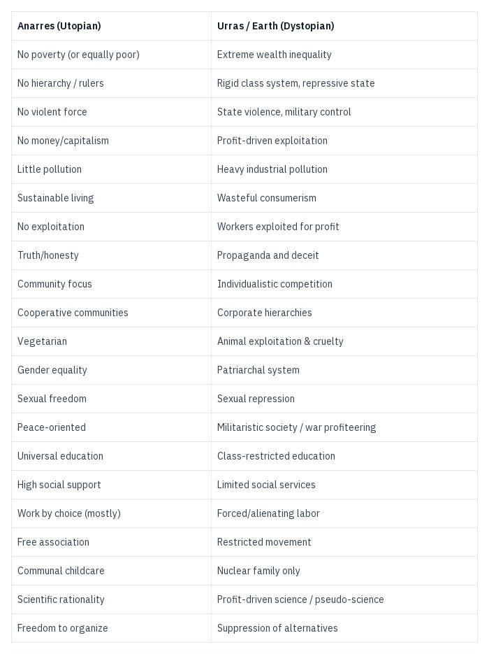

> ‘We have nothing but our freedom. We have nothing to give you but your own freedom. We have no law but the single principle of mutual aid between individuals. We have no government but the single principle of free association. We have no states, no nations, no presidents, no premiers, no chiefs, no generals, no bosses, no bankers, no landlords, no wages, no charity, no police, no soldiers, no wars. Nor do we have much else. We are sharers, not owners. We are not prosperous. None of us is rich. None of us is powerful.’

## Back To Earth

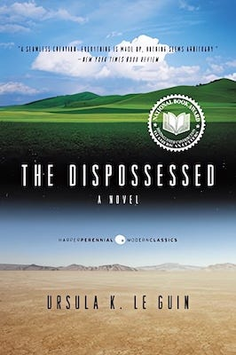

To bring this back down to earth, most of the dystopian aspects of Urras exist on earth. Some of the examples given for Urras are currently less extreme in some Western developed countries, but they have traditionally been as repressive as Urras, and still are in much of the rest of the world. In our corner of it there are large right-wing movements pushing to regress society to its previous inequalities.

Anarres is a better world than most on our planet experience. One need only go to the poorer areas of our first world cities to see that not everyone enjoys our luxuries equally, and if we were to go to many other countries, outside of their tourist areas, we’d soon see how most of the world lives so that our system can use their short hard lives for cheap labour to make our comforts possible. Ours is a more dystopian world than many people realise, although as the façade of our own neighbours becomes more tarnished an increasing number of people are more aware.

I’d argue that earth overall is worse in almost every respect than Anarres, the only exception being our ecological diversity, although we are quickly destroying it in the pursuit of profit. Earth is also structurally worse because our systems exist to maintain inequalities at the cost of human happiness and loss of potential. Anarres provides us a potential model, as if earth was more like it, then we might just escape the environmental destruction we seem determined to carry out and which _The Dispossessed_ warned about -

> ‘My world, my Earth, is a ruin. A planet spoiled by the human species. We multiplied and gobbled and fought until there was nothing left, and then we died. We controlled neither appetite nor violence; we did not adapt. We destroyed ourselves. But we destroyed the world first. There are no forests left on my Earth. The air is grey, the sky is grey, it is always hot. It is habitable, it is still habitable, but not as this world is. This is a living world, a harmony. Mine is a discord. You Odonians chose a desert; we Terrans made a desert. . . . We survive there as you do. People are tough! There are nearly a half billion of us now. Once there were nine billion. You can see the old cities still everywhere. The bones and bricks go to dust, but the little pieces of plastic never do—they never adapt either. We failed as a species, as a social species.’

So you don’t have to like _The Dispossessed_ or the world of Anarres, but I hope this helps you appreciate why others enjoy or are inspired by it, and may hopefully encourage you to consider its importance and influence.

Subscribe

[Share](https://peacefulrevolutionary.substack.com/p/in-defence-of-the-dispossessed?utm_source=substack&utm_medium=email&utm_content=share&action=share)

 **Dispossessed Article Series**

> \- [How Anarres Works](https://peacefulrevolutionary.substack.com/p/how-anarres-works)
> 
> \- [The Utopian Pravic Language](https://peacefulrevolutionary.substack.com/p/the-utopian-pravic-language)
> 
> \- [Odonian Hymn Of The Insurrection](https://peacefulrevolutionary.substack.com/p/hymn-of-the-insurrection)
> 
> \- [Antillia’s Utopia (Anarres On Earth)](https://peacefulrevolutionary.substack.com/p/antillias-utopia)

1

The Left Hand Of Darkness, 1970.

2

William Morris was the first (in 1890) to write such an Anarchist utopian novel, ‘News From Nowhere’

3

https://reactormag.com/introduction-from-ursula-k-le-guin-the-hainish-novels-stories-volume-one/

4

The Mars, Culture & Monk & Robot series.

5

Commenting on her own work in Ben Bova's The Best of the Nebulas collection.

6

‘Charles Scribner, who had published my previous book and had an option on The Dispossessed, didn’t like it because he didn’t like the anarchist theme; but I think he really just thought it was a huge boring meaningless clunker and didn’t understand it at all. He asked me to cut it by half. I said no thanks, and we broke contract amicably, and Harper and Row snapped it up’ (2007 Interview with Margaret Killjoy.)

7

‘Progress is the realisation of Utopias.’ Oscar Wilde, The Soul Of Man Under Socialism, 1891.

8

‘A person whose nature was genuinely unsociable had to get away from society and look after himself. He was completely free to do so. He could build himself a house wherever he liked … There were a good many solitaries and hermits on the fringes of the older Anarresti communities, pretending that they were not members of a social species.’

9

See How Anarres Works:

10

‘The drought that began in the summer of 163 met no relief in winter. By the summer of 164 there was hardship, and the threat of disaster if the drought went on. Rationing was strict; labor drafts were imperative. The struggle to grow enough food and to get the food distributed became conclusive, desperate.’

11

For the formula used see:

12

When I refer to Urras I’m speaking specifically of the continent of A-Io, as it is in the one Shevek visits.

13

These are not exact quotes, but intended to reflect the kind of thoughts Shevek has or his fellow Anarresti express in the book.

14

Although the Anarresti are not technically human, but they seem to be a similar species.

15

Although Shevek expresses his frustration about ‘laws of conventional behaviour’ which act as walls all around ourselves, and we can’t see them, because they’re part of our thinking.’
