_In the absence of my daily ‘Reasons To Hate Capitalism’ notes this week, below is a collection of quotes about Class War._

### Class War Isn't Just a Slogan

Ever notice how whenever workers demand basic rights or better conditions, they're accused of starting a ‘class war’? Here's the thing - the class war is already happening, and it's being waged from above. Don't take my word for it - even the wealthy and powerful themselves admit to this.

This isn't about individual rich people being ‘bad’ - it's about understanding how our system works. When corporations fight against unions, when landlords hike rents while wages stagnate, when public services get cut while billionaires receive tax breaks - these aren't separate issues. They're all part of the same pattern.

Look at what's happening with environmental issues. When corporations pollute neighbourhoods, it's usually working-class communities that suffer most. When climate disasters strike, it's not the wealthy in their secured compounds who bear the brunt.

The real question isn't whether there's a class war - it's happening whether we acknowledge it or not. The question is what we're going to do about it. While the media keeps us distracted with culture wars, the fundamental divide between those who must work to live and those who profit from others' work grows wider.

Understanding this doesn't mean you have to become a revolutionary. But it does mean recognising that when workers organise, when communities unite, when people stand up for their rights - they're not starting a class war. They're finally fighting back in one that's been raging all along.

Next time someone complains about workers ‘causing trouble’ by striking, or communities ‘making a fuss’ by protesting, remember: the class war didn't start with them. It started with a system built on keeping most people working for the benefit of a few - and it's maintained by those few every day. The only real choice is whether we face this reality or keep pretending it isn't happening.

### Capitalists Admit The Rich Are At War With The Poor

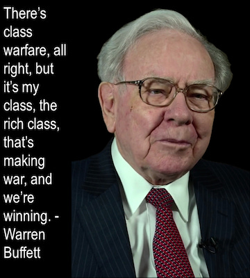 _Warren Buffett, Billionaire Investor_

 _Maurice Cowling, Conservative Historian_

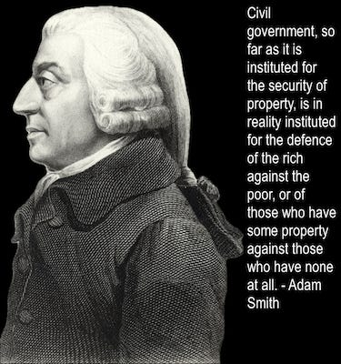 _Adam Smith, Father Of Capitalism_

### Academics Admit This Class War Is Real

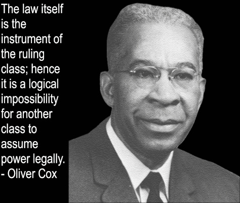 _Oliver Cox, Notable Sociologist_

 _Noam Chomsky, Pioneering Professor Of Linguists & Political Activist_

### Civil Rights Activists Believe There Is A Class War

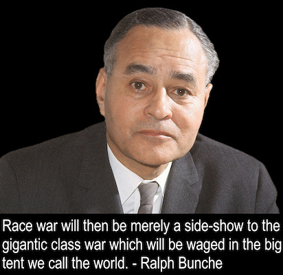 _Ralph Bunche, Political Scientist & Activist, Nobel Peace Prize_

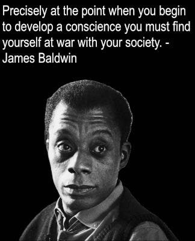 _James Baldwin, American Civil Rights Activist & Writer_

### Environmentalists Recognise There Is A Class War

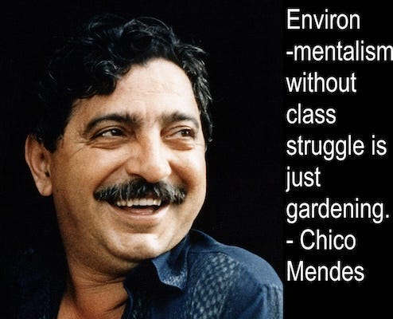 _Chico Mendes, Brazilian Environmentalist Martyr_

### Even Social Democrats Believe There Is A Class War

 _Bernie Sanders, U.S. Senator_

 _Alexandria Ocasio-Cortez, U.S. Congress Representative_

### & Socialists Have Been Speaking About A Class War Since The Beginning Of Capitalism

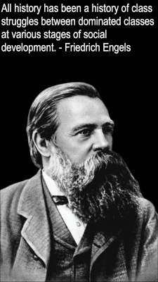 _Friedrich Engels, German Political Philosopher_

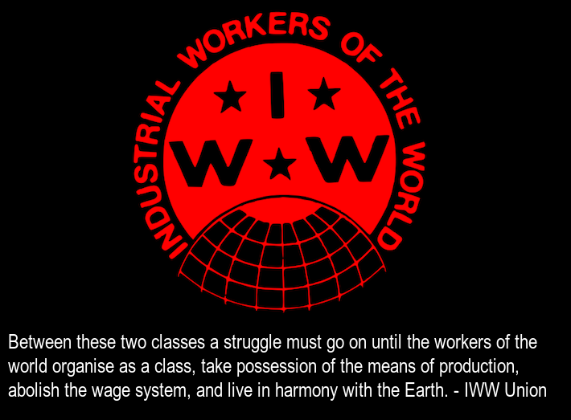 _[IWW](https://www.iww.org/) Constitution Preamble_

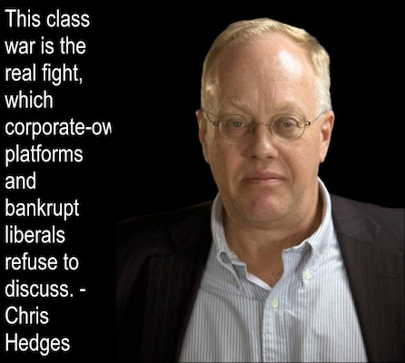 _Chris Hedges, Journalist & Presbyterian Minister_

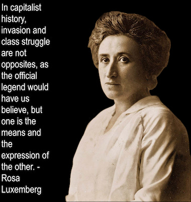 _Rosa Luxemberg, Anti-War Activist Martyr_

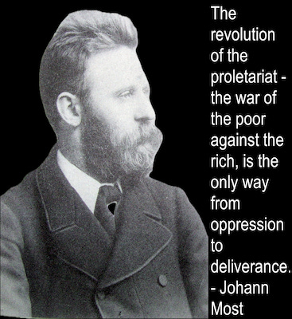 _Johann Most, Radical Politician_

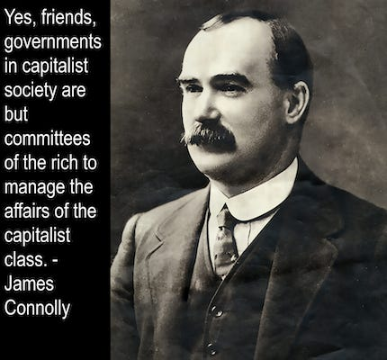 _James Connolly, Irish Independence Revolutionary_

### Which Side Are You On In The Class War?

The only question left is, ‘which side are you on?’

 _Tyler Durden, Fight Club by Chuck Palahniuk_

Subscribe

[Share](https://peacefulrevolutionary.substack.com/p/class-war?utm_source=substack&utm_medium=email&utm_content=share&action=share)

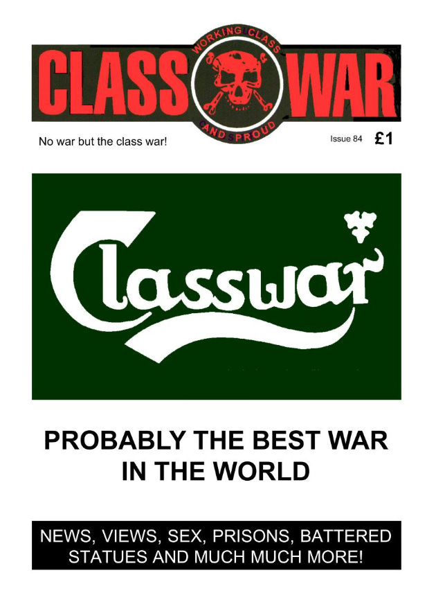

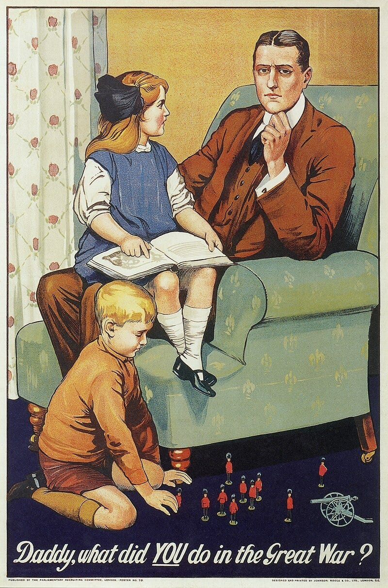‘Daddy, What Did You Do In The Class War?’

 **Or just focus on culture wars instead**

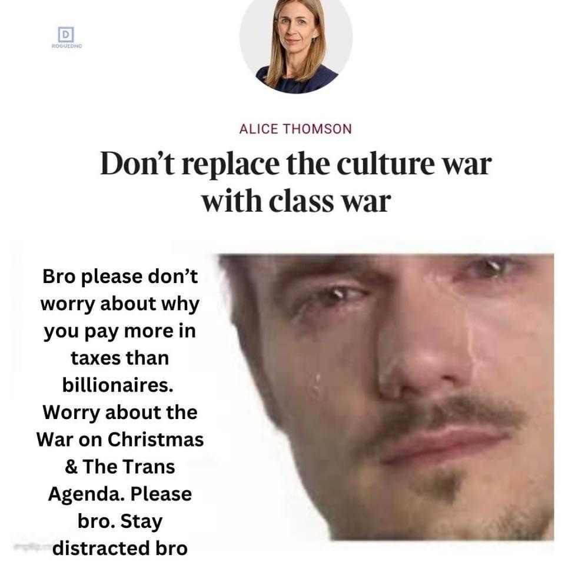
