## What Does ‘Liberal’ Mean?

Once upon a time the word liberal meant unprejudiced, or generous, especially when it came to giving charity. It was synonymous with kindness and broadmindedness, but also sometimes had the negative connotation of being free from restraint, reckless or even being licentious. But liberals have always come in many kinds.

I’m not here to criticise Liberals. I have many friends who consider themselves Liberals. I am socially ‘liberal’ on many, if not most, issues. However, at the risk of upsetting some of my Liberal readers I feel I have to make it clear that I am not a Liberal myself, I do not identify with that label, and I disagree with some fundamental Liberal beliefs.1 I am a Leftist.2

There are major differences between Leftists and Liberals, but to understand where those differences come from we need to go back to the origin of Liberalism. To give the classical definition Liberalism, it is a political and moral philosophy based on the principles of individual rights, civil liberties, democracy, and free enterprise. It emphasises:

  1. Individual freedom and personal autonomy.

  2. Equality before the law and equal opportunity.

  3. Limited government power and the rule of law.

  4. Protection of civil liberties such as freedom of speech, press, and religion (including secular government and separation of church and state.

  5. Private property rights and free market economics (to varying degrees).

  6. Democratic governance and popular sovereignty.

Of course no-one opposes freedom, and few oppose equality or the idea of rights, but there are many differences on what those words imply, and what these words have implied through history.

## Classic Liberalism

The history of Liberalism and republicanism (anti-monarchy) go hand in hand. Whereas some like Hobbes argued that individuals should surrender their natural rights to a sovereign power (the king) in exchange for security and order, liberals asserted that individuals possess inalienable rights that should be protected by a limited government, deriving its legitimate authority from the consent of the governed. Among the notable liberals who argued for this were:

  * John Locke (1632-1704): Often regarded as the ‘Father of Liberalism’. His ideas on natural rights, social contract theory, and limited government were foundational to political Liberalism.

  * Montesquieu (1689-1755): Advocated for the separation of powers in government, a key Liberal principle.

  * Edmund Burke (1729-1797): Often considered the father of modern conservatism, was considered a Liberal in his time because he supported Liberal ideas like representative government.

  * Thomas Jefferson (1743-1826): One of the American Founding Fathers who championed individual rights and limited government.

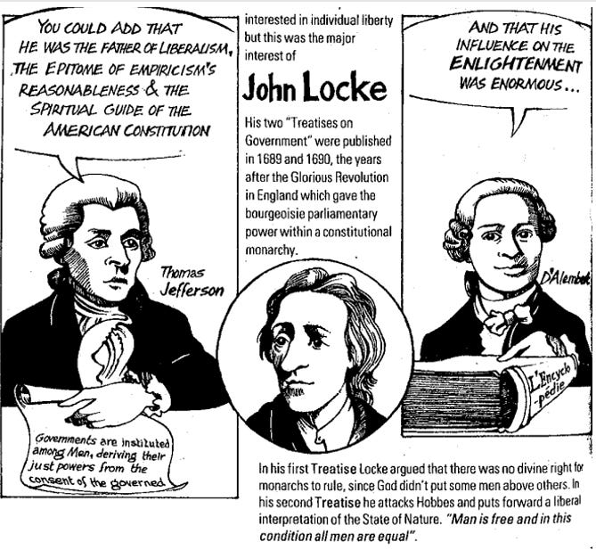

This is an over-simplified overview of their positions (in contrast with the anti-liberal Hobbes and Rousseau who held some liberal ideals):

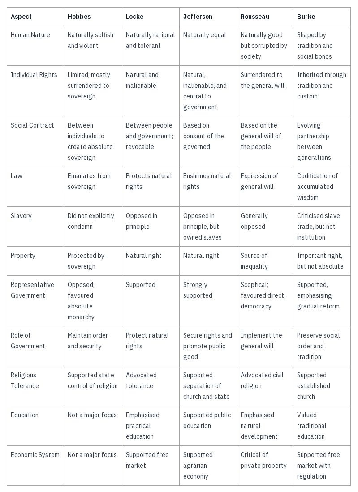

Although we don’t associate the word Liberalism as much with Conservatism now, classically speaking Liberals could be socially liberal or socially conservative, economically liberal or economically conservative. The word did not relate to views on personal morality, as much as it did national ethics. However, what these philosopher all had in common was a belief in these principles:

  *  **Social Contract Theory** : Though they interpreted it differently, all four engaged with the idea that legitimate government is based on some form of agreement or contract with the governed.3

  *  **Natural Rights** : To varying extents, they all acknowledged the existence of natural rights, though they differed on their specific nature and implications.4

  *  **Importance of Liberty** : All four emphasised the value of liberty, though they defined and prioritised it differently.

  *  **Representative Government** : With the exception of Rousseau, who favoured direct democracy, they generally supported some form of representative government.

  *  **Rule of Law** : All emphasised the importance of the rule of law, as opposed to arbitrary rule.

  *  **Scepticism of Centralized Power** : To different degrees, they were all wary of overly centralised political power, but all believe in political systems and processes.

  *  **Property Rights** : Though they had different views on its extent and justification, they all recognised some form of property rights.

Nevertheless, the Socialists did not agree with the liberals on some of these points. The problem those on the Left had with this were:

 **Law** : Those on the Left believe that obedience to law - especially bad laws - is not more important than what is morally right. In other words they don’t believe there it is inherently morally virtuous to obey the law. Whereas a Liberal says we must obey the law now for the sake of order and to respect the legal process, but vote to change it later.

 **Property** : Those on the Left believe that the ‘right’ of private property can and sometimes does interfere with other rights to life when that property produces what people need to live, or prevents people from accessing what they need in order to live. Whereas the Liberal says a person’s property rights are sacred and never to be interfered with, and are more important than the consequences that might arise from such exclusive ownership. This applies even when that land was stolen from indigenous people, as Liberals believe that stealing it back would be immoral. (There are some reservations to this concept among some liberals, but few exceptions in Liberal law systems).

 **Rights** : Those on the Left (if they are non-state Socialists) believe rights granted or protected by government can be taken or removed by government, and that human rights should exist and be respected and protected independently of government. (Anti-state Socialists don’t support representative government either.) Whereas a Liberal says that rights rely on government to protect them, and the power of government and it’s right to exist must be protected to ensure it can protect such rights, and that if governments fail to do this people must work through the system to fix it.

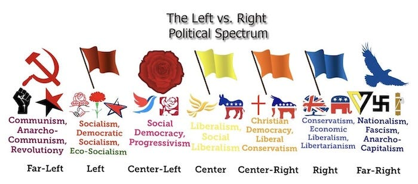

To cover and clarify this in yet another chart:

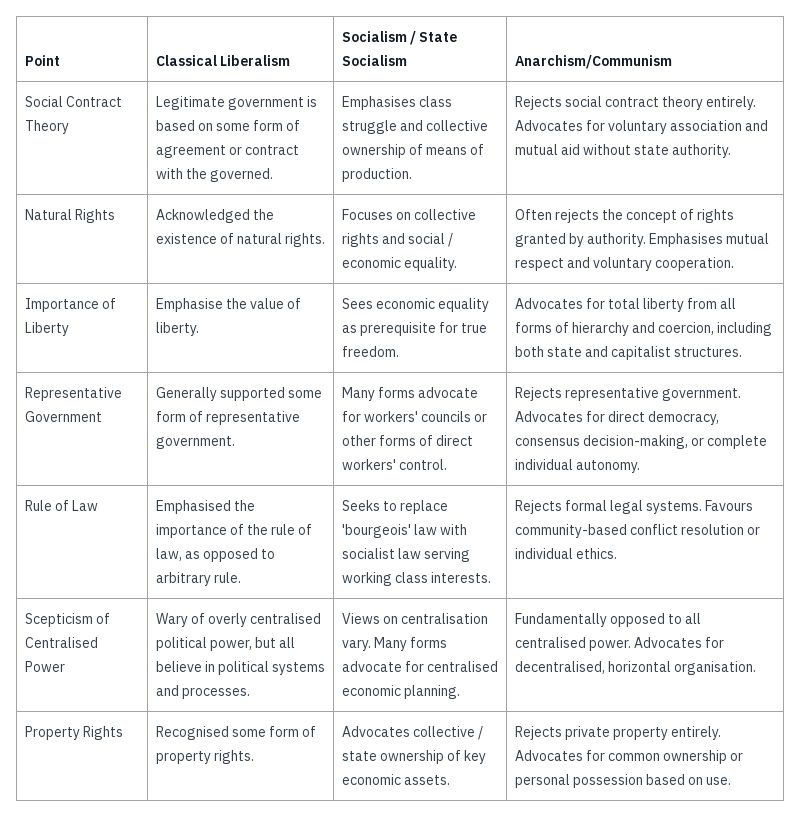

## New Liberalism

Beginning in the 1930s with FDR’s new deal the word liberal began to become associated with the Democratic party, and this was solidified by the time of LBJ’s civil rights era in the 1960s.

This led to the Democratic party being identified with more socially liberal policies and embracing the label. Whereas the Republican party disassociating itself from the label (except in the case of neo-liberalism). Both parties are pro-Capitalist, pro-Militaristic, anti-Socialist, pro-Corporate political parties. From a Leftists point of view they agree on more than they disagree on.

This is another reason why it is just silly to call Democrats, classical Liberals or socially liberal people Socialists, Marxists or Communists. I know someone has no idea what those words mean when they apply those words to those on the traditional Left.

The U.S. Democrats are not on the traditional Left, they are on the centre-right overall (on most issues), even if they are (slightly) to the left of the Republicans, who are even further right wing.5

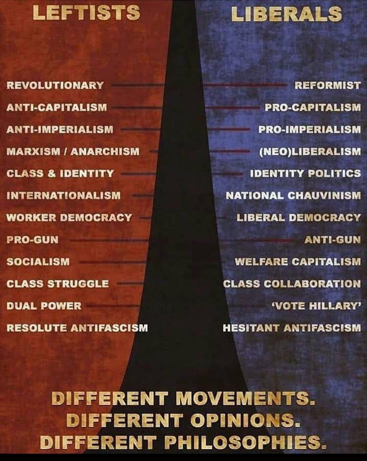

## Neo-Liberalism

If the new socially liberal definition changed the way the word liberal was used on one side of the political spectrum, the concept of neo-liberalism endorsed by Reagan and Thatcher swung it back the opposite way.

Neo-liberalism was a break from classic economic philosophers like Adam Smith, David, Ricardo, Frédéric Bastiat, to a newer approach to Capitalism as championed by Ludwig von Mises, Friedrich Hayek, and Milton Friedman.

It emerged in the mid-20th century as a response to Keynesian economics and the welfare state. While nominally supporting individual rights, it often prioritises corporate freedoms and accepts higher levels of inequality.

 **Neo-Liberalism vs Classical Liberalism**

  * Role of government and economic intervention:

    * Classical liberalism: Advocates for minimal government intervention in both social and economic spheres, focusing primarily on protecting individual rights and maintaining law and order.

    * Neoliberalism: Supports a more active government role in creating and maintaining markets, often through deregulation, privatisation, and policies to promote competition.

  * Globalisation and trade:

    * Classical liberalism: Supports free trade primarily within national contexts, with less emphasis on global economic integration.

    * Neoliberalism: Strongly advocates for globalisation, including free trade agreements, free movement of capital across borders, and global market integration.

  * Welfare and social policy:

    * Classical liberalism: Generally opposes extensive state welfare programmes, preferring charity and voluntary associations to address social issues.

    * Neoliberalism: Accepts some form of social safety net, but prefers market-based solutions and private sector involvement in social services. Often supports policies like school vouchers or privatised healthcare.

  * Monetary and fiscal policy:

    * Classical liberalism: Often supports 'hard money' policies like the gold standard and balanced budgets, with minimal government economic planning.

    * Neoliberalism: Accepts fiat currency and active monetary policy by central banks. More open to deficit spending and government economic management, particularly to support market functions.

This philosophy has come to be associated with right-wing Libertarians and Objectivists, although with some differences. From the era of Reagan onwards every U.S. President has follow at least some Neo-liberal economic policies:

 **Neo-Liberalist Presidents**

  * Jimmy Carter (1977-1981): While often overlooked, Carter began the trend towards deregulation, particularly in the airline and brewing industries.

  * Ronald Reagan (1981-1989): Strongly associated with neoliberalism. His administration implemented significant tax cuts, deregulation, and free-market policies often referred to as "Reaganomics".

  * George H.W. Bush (1989-1993): Continued many of Reagan's neoliberal policies, though with some moderation.

  * Bill Clinton (1993-2001): Despite being a Democrat, Clinton embraced many neoliberal ideas. He signed the North American Free Trade Agreement (NAFTA), reformed welfare, and deregulated the financial industry.

  * George W. Bush (2001-2009): Continued neoliberal economic policies with tax cuts and deregulation, particularly in the energy sector.

  * Barack Obama (2009-2017): While implementing some more traditionally liberal policies, Obama continued many neoliberal economic approaches, particularly in his handling of the 2008 financial crisis and trade policies.

  * Donald Trump (2017-2021): Despite his populist rhetoric, Trump implemented traditionally neoliberal policies such as tax cuts and deregulation, though he diverged from neoliberal orthodoxy on free trade.

  * Joseph Biden (2021-2025): Largely carried on neoliberalist policies, although re-implementing some regulation that had been removed under Trump.

Those on the Left do not support these economic policies (and take exception to many other policies they support). There may have been a few on the Left in the Democratic parties traditionally, and maybe a small number who still try to work within it, but it has been half a century at least since any of them have had any significant impact.

As of 2008 there are only 7 U.S. Democrats & 1 Independent Congressperson who considers themselves Socialists (1.5%), and 527 who consider themselves Capitalists. However, 36% of U.S. adult Americans say they view socialism somewhat or very positively and 38% saying they view Capitalism unfavourably (as of 2022). As late as the 1930s there were U.S. Republicans who considered themselves Socialists too.6

 **Policies U.S. Democrats & Republicans Agree On & That The Left Disagree On**7

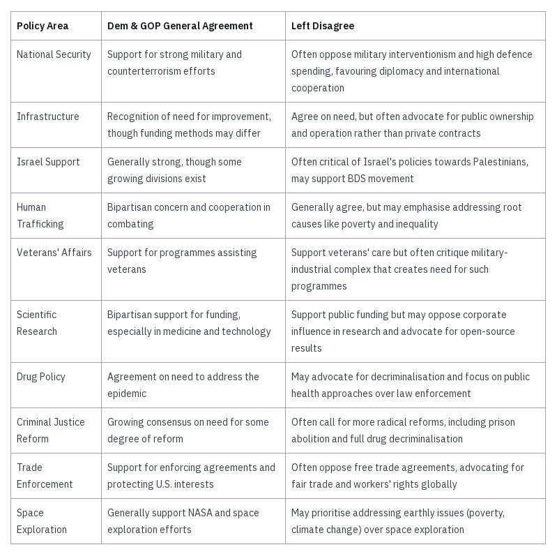

Both parties are corporate sponsored, taking their campaign contributions from corporations and meeting regularly with corporate lobbyists. Until Trump both parties have generally supported military expansion (NATO, overseas bases, support for Israel etc.), as well as the U.S. secret police (FBI, CIA, NSA).8

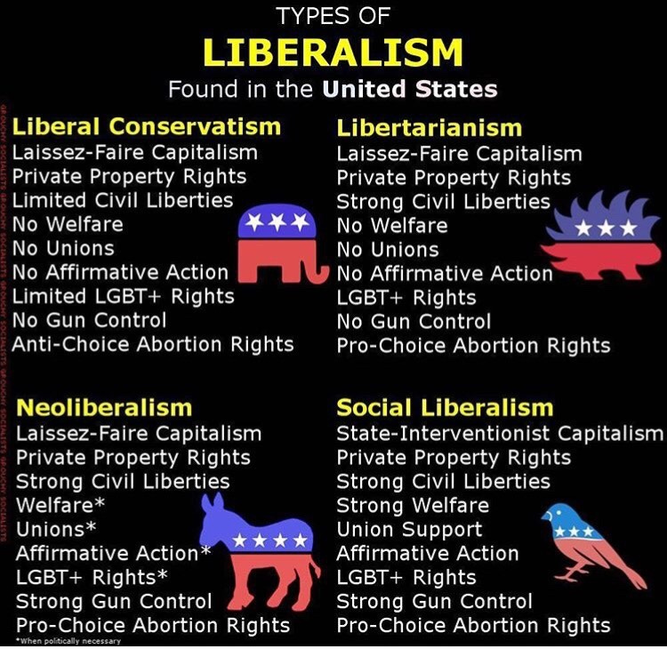

Many on the Left feel betrayed by Liberalism, because at time it has promised it wanted the same outcomes, but when it came to Liberal politicians choosing between extending it’s power or giving it back to people it has tended to choose the former rather than the later. In this way Liberalism has seemed to be a deal with the Devil, and many on the Left lost any hope of the Liberal Devil fulfilling their ideals.

 **To Liberals**

I’m happy that we agree on some socially liberal views, and hope you find my articles interesting and relevant to you.

However, unlike you I don’t believe the system can be reformed. I don’t believe voting for the lesser of two evils will fix the problems, as I believe the system is largely functioning as intended for those it most benefits, and that reforms will always ultimately be undermined as long as there is hierarchy or capital involved in the system.

If after reading (or any of my other articles) you come to realise you are more of a Leftist than a capital-L Liberal then welcome to the club, there is a lot of good you can do to help change the world.

 **To Conservatives**

I am not a liberal or a Neo-liberal. I am personally anti-government and for free association. If you are sincerely interested in understanding my views please read some of my other articles and if you take exception to the points I make please raise your objections with me politely and I’ll be happy to respond.

However, If you insist on using the term ‘liberal’ for me then you are only showing you don’t care about what words mean, just on applying labels and using them as insults. In that case we have nothing more to talk about, and I am likely to block you for not being serious about intelligent dialogue and for wasting my time.

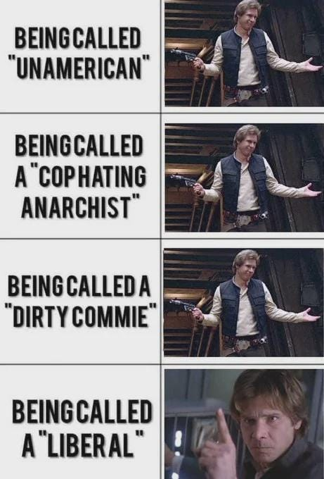

## Addendum - The U.K.

In the U.K. the word liberal hasn’t usually been used as pejoratively, although with the advent of American political discourse on social media it has begun to be used negatively here too, with conservatives beginning to use the term ‘loony liberals’ unaware that conservatism is a form of liberalism too, and that Neo-liberalism has been the dominant government economic approach since Margaret Thatcher:

 **Neo-Liberal Prime Ministers of the U.K.**

  * Margaret Thatcher (1979-1990): Often considered the archetypal neoliberal leader. Her policies of privatisation, deregulation, and reducing trade union power became known as "Thatcherism".

  * John Major (1990-1997): Continued many of Thatcher's neoliberal policies, though with a somewhat softer approach.

  * Tony Blair (1997-2007): Despite leading the Labour Party, Blair's ‘Third Way’ incorporated many neoliberal economic principles.

  * David Cameron (2010-2016): Implemented austerity measures and continued many neoliberal economic policies.

  * Theresa May, Boris Johnson, Liz Truss, Rishi Sunak (2016-2024): Carried on largely neoliberal policies.

  * Kier Starmer (2021+): While he hasn’t been in the office long it does look like he will be continuing the ‘New Labour’ neoliberalism of Tony Blair.

During this period the U.K. New Labour & Conservatives parties have come to share an increasing number of the same or similar policies:

 **U.K. New Labour & Conservative Similarities**

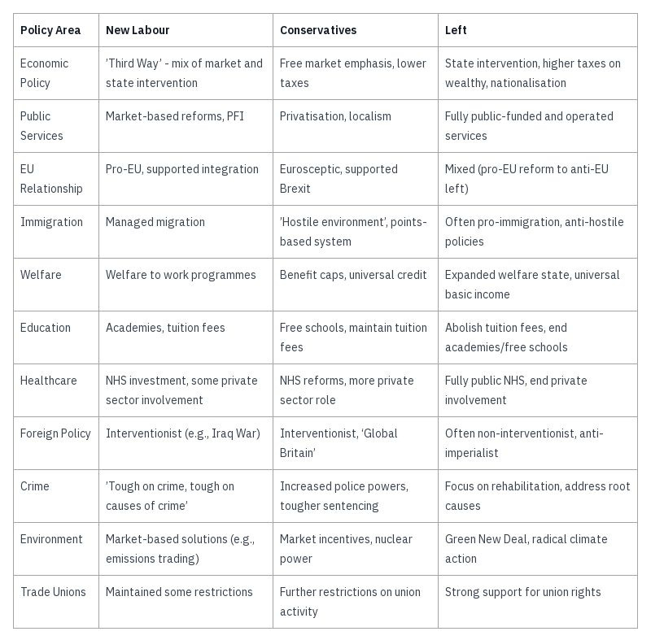

While there are some more traditional labour members of parliament who still express a belief in Socialist ideals, currently only 25 of the 650 members of parliament are part of the Socialist campaign group - just under 4%9, despite 36% of British people viewing Socialism positively and 39% of them viewing Capitalism unfavourably.10

The popular 60's folk singer Phil Och's summarised the problem many on the Left have with Liberals in his song, ‘Love me I'm a liberal’, in which he sung,

> Once I was young and impulsive  
> I wore every conceivable pin  
> Even went to the socialist meetings  
> Learned all the old union hymns  
> But I've grown older and wiser  
> And that's why I'm turning you in  
> So love me, love me, love me, I'm a liberal.

Subscribe

[Share](https://peacefulrevolutionary.substack.com/p/liberals-vs-leftists-vs-conservatives?utm_source=substack&utm_medium=email&utm_content=share&action=share)

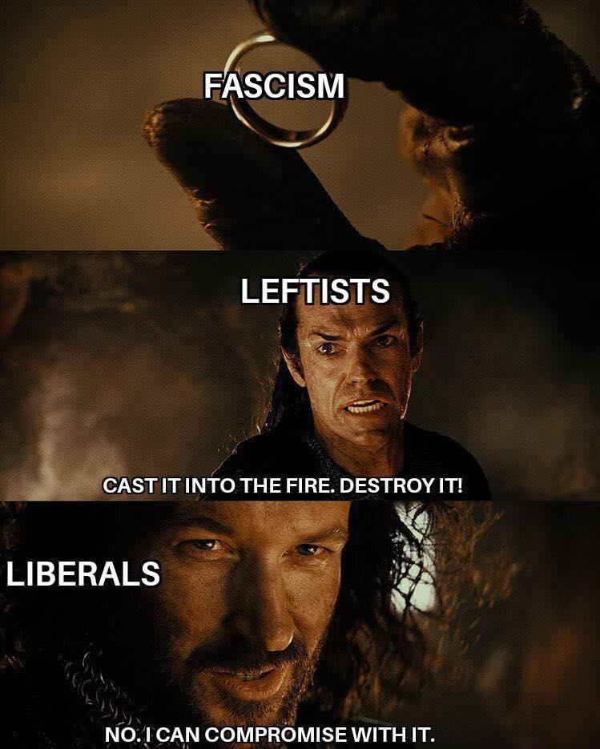

1

Throughout I have capitalised Liberal meaning the political philosophy, and put the word liberal as in being socially liberal in lower case, to distinguish the two.

2

Leftist isn’t my ideal term either, but for the purposes of this article it is a good catch-all for those on the Left of the political spectrum.

3

I don’t believe that people were born agreeing to a social contract, especially one that presumes the existence of a government I didn’t consent to.

4

I know the word ‘rights’ itself is a matter of debate, and I’m using it in the sense that there are certain shared values which, when honoured, protect certain groups and freedoms.

5

What muddies this spectrum are the Social Democrats (Democratic Socialists in America and Fabians in the U.K.) - who believe in gradual, voting based reforms leading ultimately to establishing Socialism.

6

Of course Socialism is not monolithic either. State-Socialists and Anti-State-Socialists have disagreements too.

7

According to one estimate they both agree on at least 100 of the same policies - <https://today.yougov.com/politics/articles/44463-policies-supported-by-democrats-and-republicans>

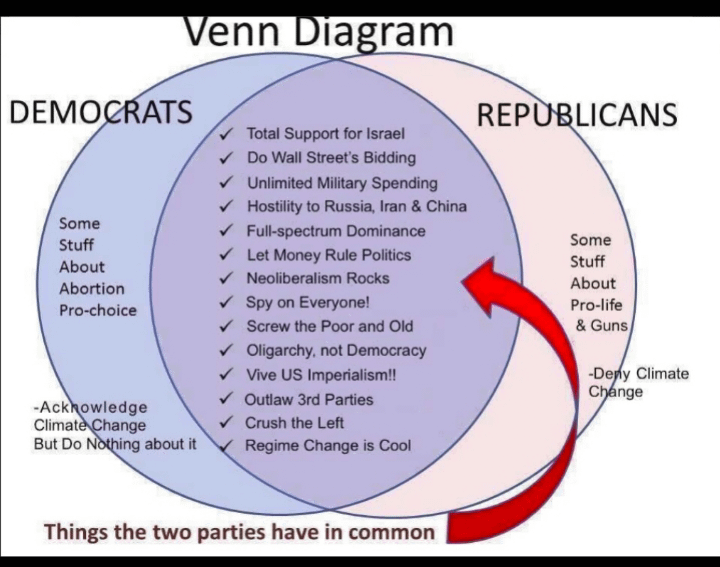

8

Even Trump kept all these organisations, so his objections may have had more to do with whether people sympathetic to him were in primary positions within them.

9

Although 21% (141 MPs) are members of the more moderate Fabian Society.

10

See https://en.wikipedia.org/wiki/Socialist_Campaign_Group
