_In the absence of my daily ‘Reasons To Hate Capitalism’ notes this week, here is a collection of quotes about Wage Slavery below:_

### The Freedom To Starve

When we talk about freedom in our society, what do we really mean? Our greatest ‘freedom’ is the ability to choose which workplace to be subservient in. Once we make that choice, we lose control over what we do, how we do it, and what happens to the results of our work. But is it really a choice when the alternative is starvation?

Many people bristle at the term ‘wage slavery’ - it seems excessive, maybe even disrespectful to historical slavery. Yet ex-slaves themselves considered wage labour to be a form of slavery.

Think about it: when your entire earnings go to food and shelter, when you're one missed paycheque away from homelessness, your work isn't an opportunity for advancement - it's an act of survival. The ‘choice’ to work becomes as meaningful as the choice to breathe.

Some argue this system is natural and necessary. ‘Without the threat of poverty,’ they say, ‘nobody would work!’ But in making this argument, they're accidentally admitting something crucial: our entire economic system relies on coercion. Work for us, or starve. How ‘voluntary’ can any choice be under those conditions? This isn't about comparing different forms of suffering - it's about understanding how control works in our society. 

When we talk about these issues, we're often offered minor adjustments: slightly better pay, slightly better conditions, slightly more benefits. It's like arguing about whether chains should be looser or tighter, rather than questioning why we're wearing chains at all.

Understanding this doesn't mean giving up hope. It means recognising that real freedom can't just be about choosing our masters - it has to be about questioning the entire system of mastery (and wage slavery) itself.

The next time someone tells you that you're ‘free’ to quit your job if you don't like it, ask yourself: free to go where? To another job with the same fundamental dynamic? To homelessness? To hunger? What kind of freedom is that? Real freedom has to mean more than the freedom to choose how we'll survive. It has to mean having genuine control over our work, our lives, and our futures.

### Modern Wage Labour Is A Continuation of Historical Slavery

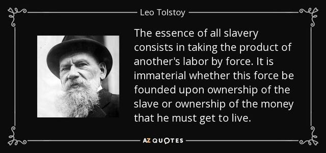

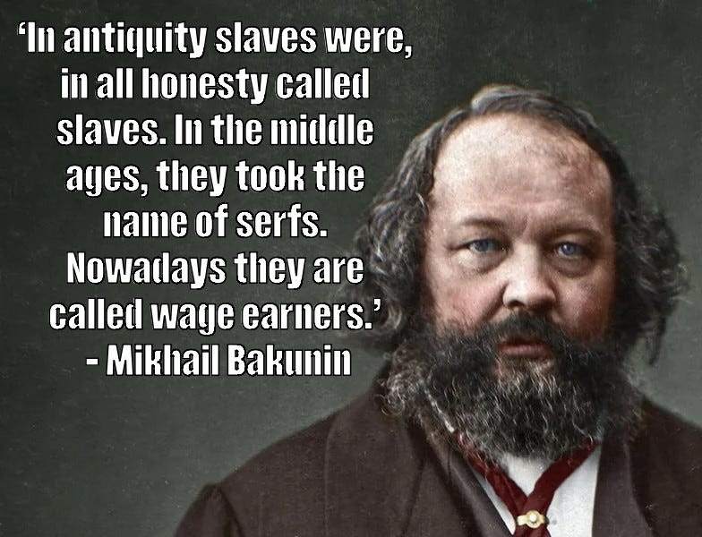

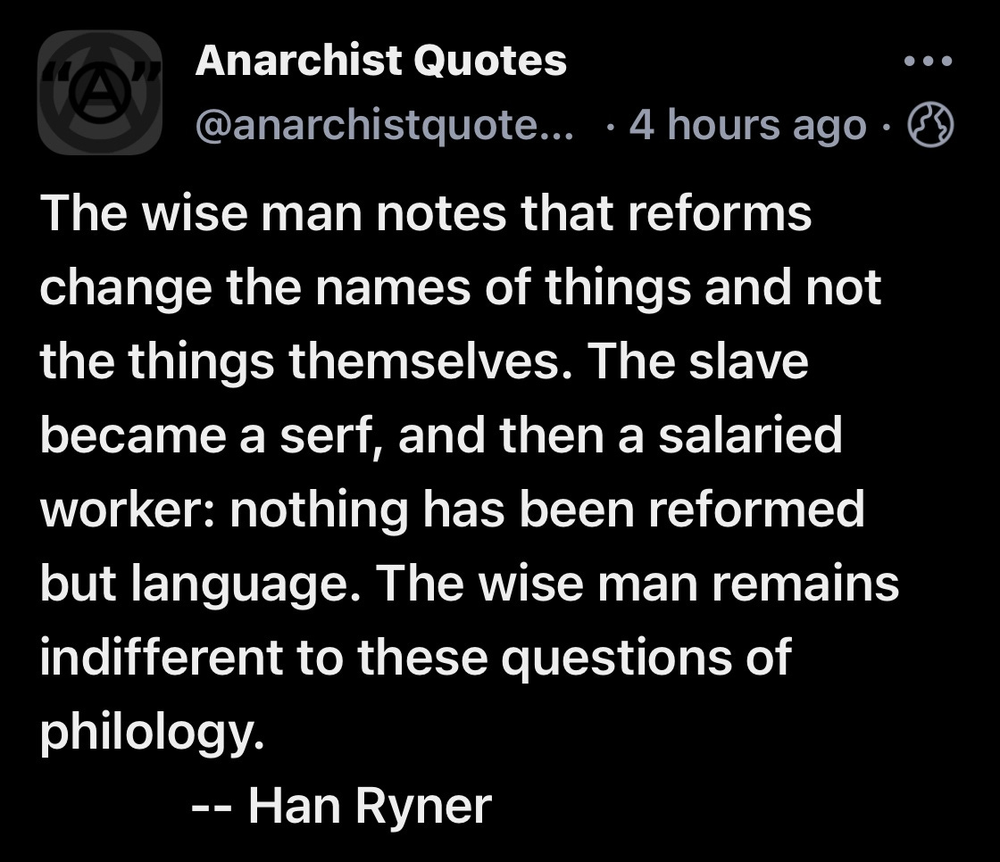

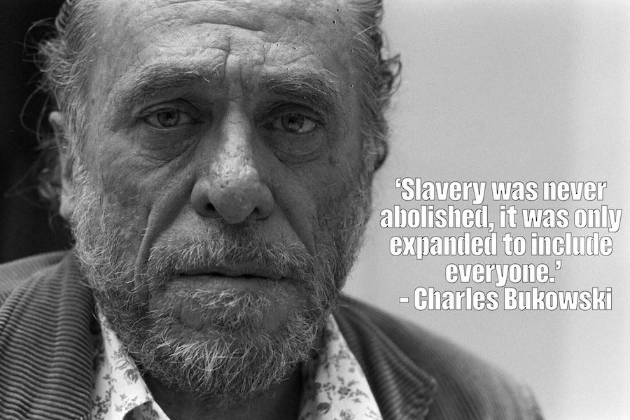

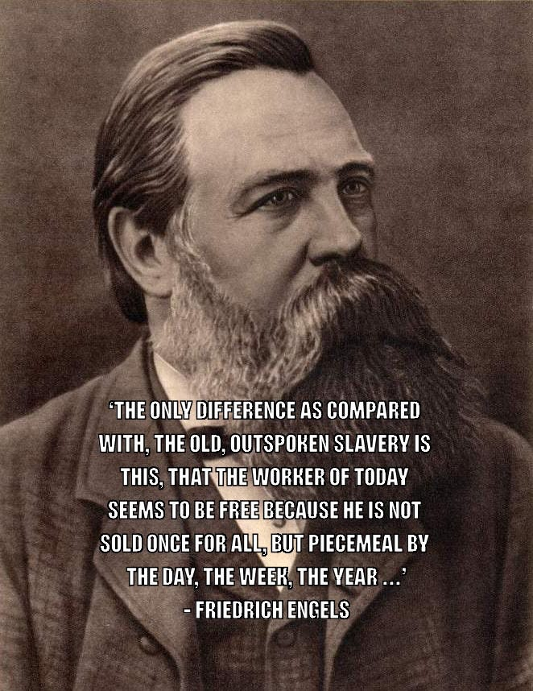

### Coercion Through Economic Necessity

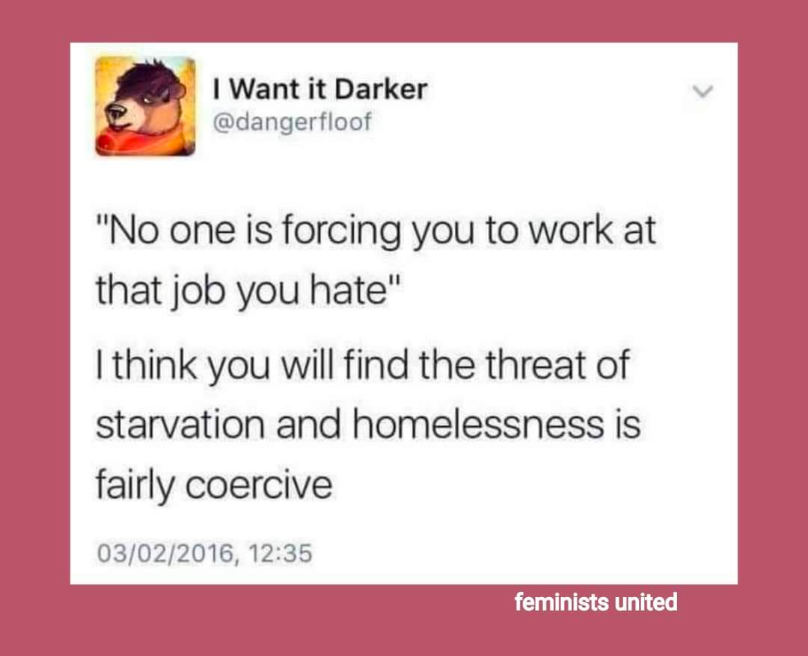

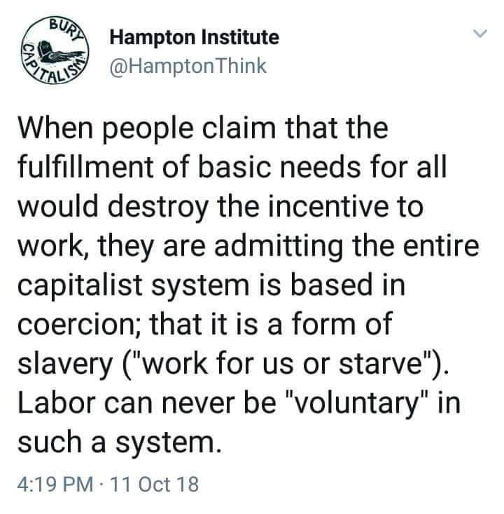

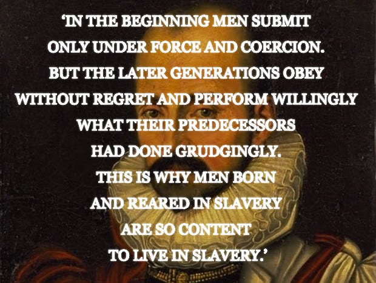

### Capitalist Coercion and Exploitation

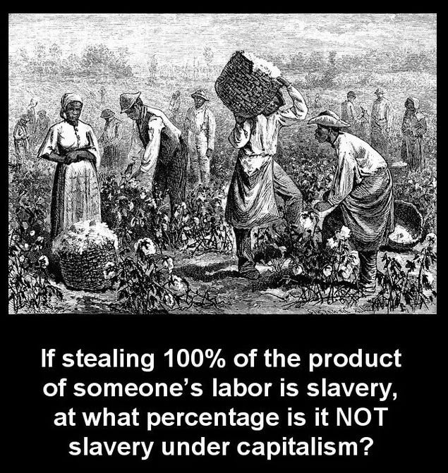

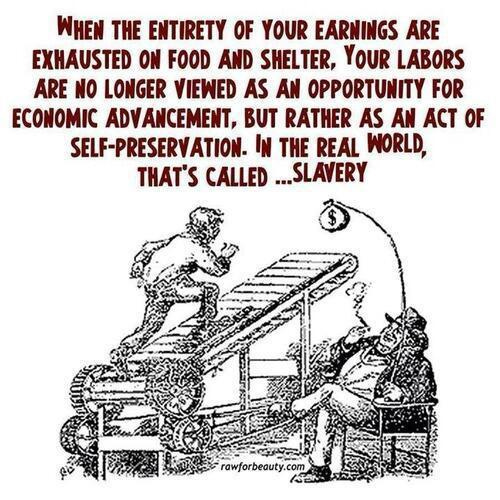

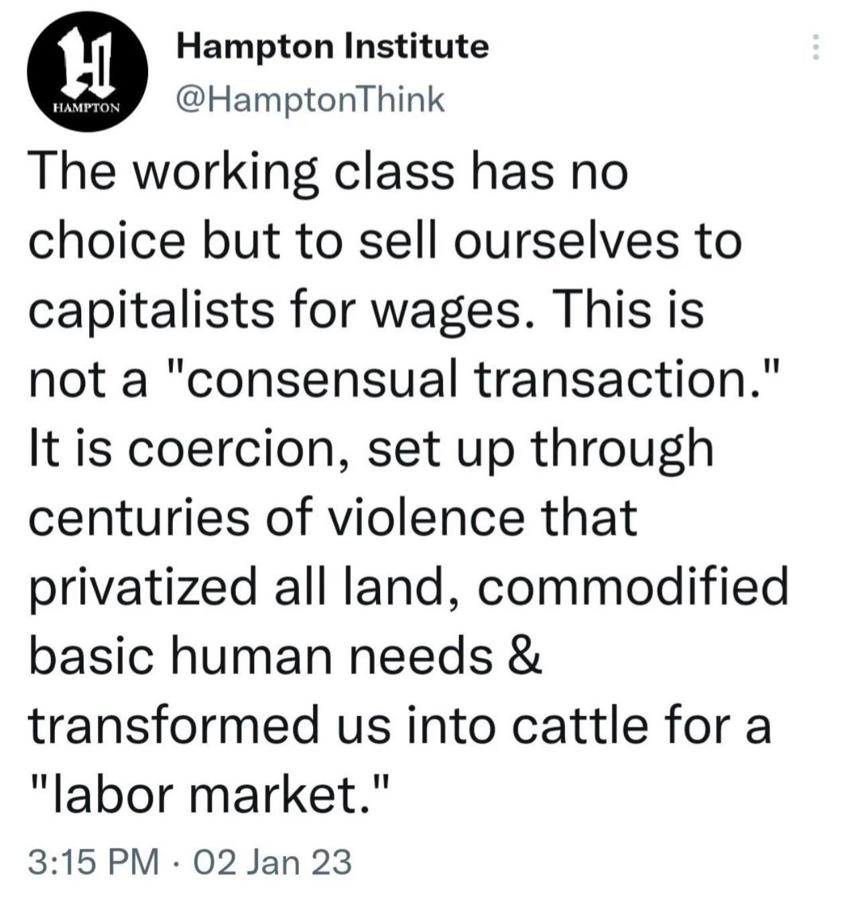

### False Freedom/Choice

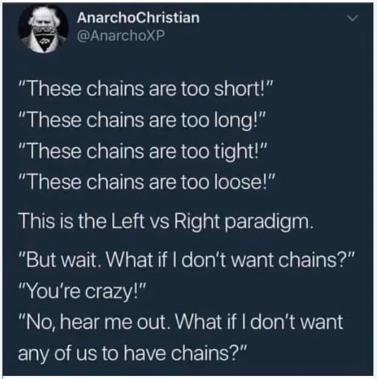

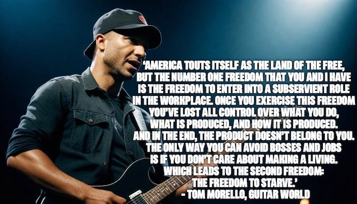

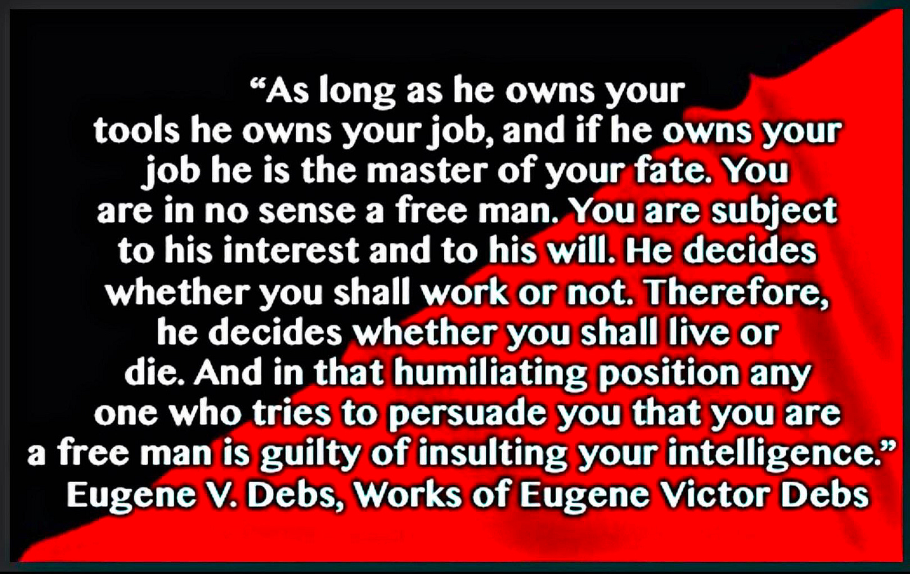

### It Is Slavery!

But isn’t it insulting to past African chattel slaves to call this wage slavery? Here is what two former chattel slaves had to say about that:

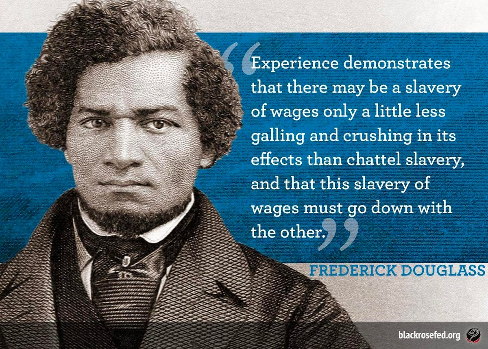

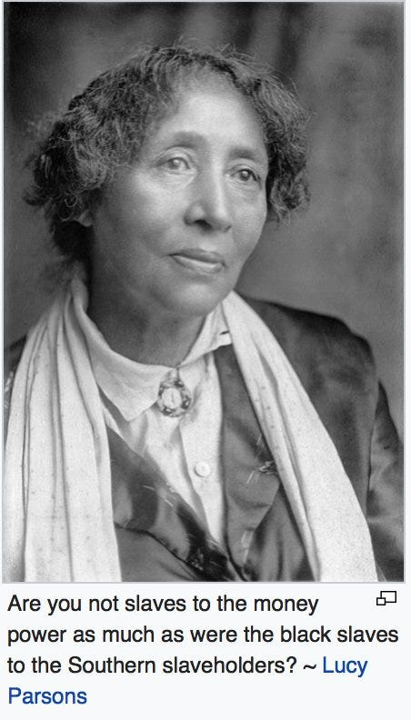

& What an Africa country’s president had to say about it -

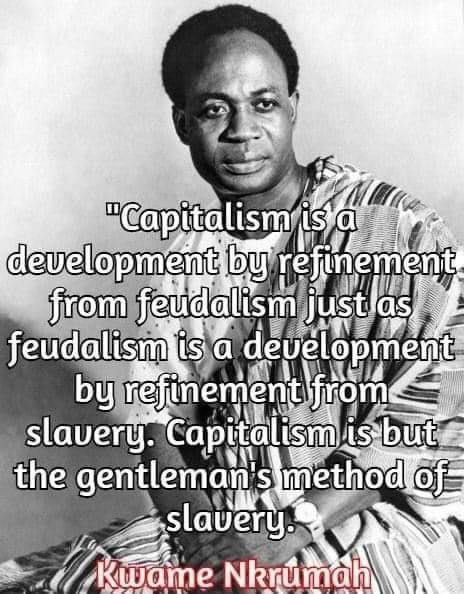

### Break The Chains

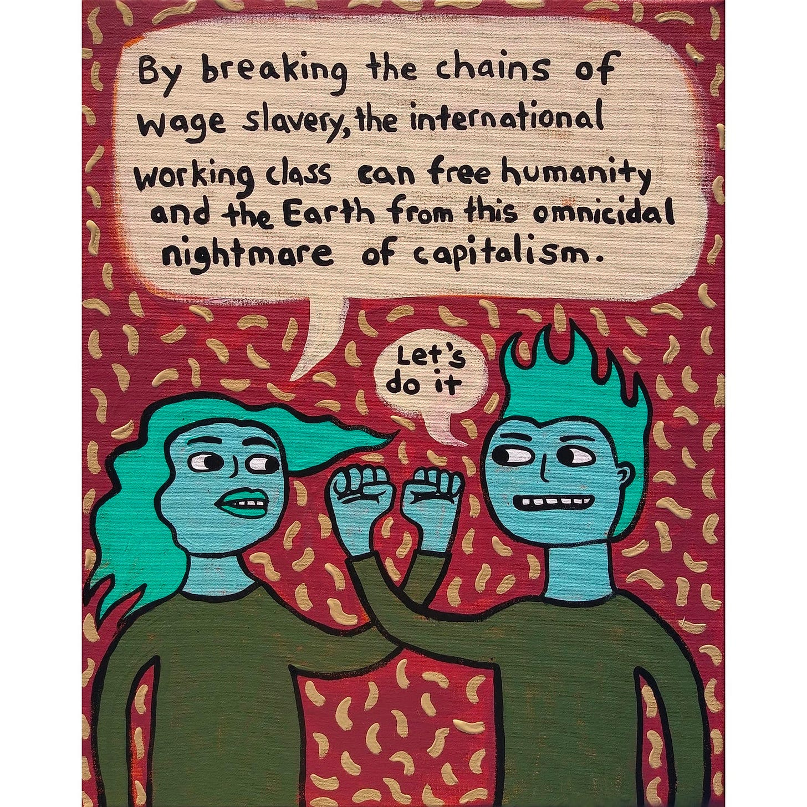

Subscribe

[Share](https://peacefulrevolutionary.substack.com/p/wage-slavery?utm_source=substack&utm_medium=email&utm_content=share&action=share)
