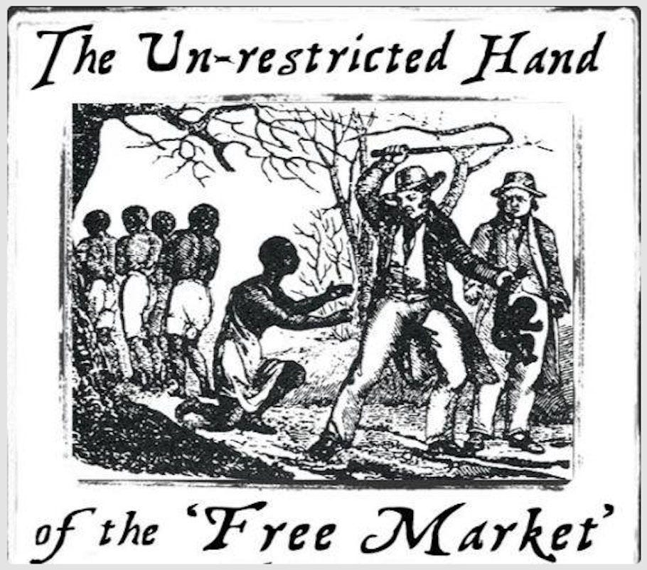

> ‘Said a capitalist, “Freedom's quite plain,  
> You own yourself - what's to explain?”  
> But when workers asked why  
> They must work or must die,  
> He said “That's just the market's domain!”’

The idea that we own ourselves, that we are our own property is an appealing concept. If we don’t belong to someone else, then of course we own ourselves, don’t we? This seems empowering, if I own nothing else, at least I own myself! For someone who already sees rights in terms of property it seems an obvious progression to apply it to humans. In some instances it may even seem a noble belief, because it would condemn people being stolen and enslaved against their will.

However, there are also dangers with reducing complex ethical questions to property rights, such as basing human dignity on the concept of property relations, and making freedom dependent on ownership rather than being inherent.

It also contradicts more traditional collective moral philosophies as self ownership is self-focused, self-centred, and elevates selfishness to a virtue; It individualises collective problems, ignores the contributions of others to our privileges and position, and exempts people from responsibilities toward others.

The concept of ‘self-ownership’ originates with John Locke’s ‘Second Treatise of Government’ (1689), where he argued that every person has a property in their own person. It was a new theory which emerged specifically during the rise of early capitalism and enclosure of commons, and was used to justify land being taken away from the peasants who previously lived freely on it.

Whereas the popularisation of ‘self-ownership’ since the 1960s primarily came through Murray Rothbard and Ayn Rand (who called it ‘ownership of one’s life’) in the mid-20th century US (though they approached it slightly differently). This concept of self-ownership stands as the central principle of self identified ‘Anarcho’-Capitalists and right-wing ‘Libertarians’ (hereafter Propertarians*), and has found particular popularity in Silicon Valley and tech culture.

 _*Note: The term ‘libertarian’ was deliberately changed from its original left-wing meaning by right-wing pseudo-philosophers like Rothbard, with the aim of undermining left-wing movements. The word was previously used to exclusively refer to Hierarchy-less forms of Socialism (such as Anarcho-Communism, which the inventor or the word was) , so I will use the term Propertarian instead throughout, for the sake of accuracy. See[Taking Back Libertarianism](https://peacefulrevolutionary.substack.com/p/taking-back-libertarianism)_

### 16 Problems With The Idea Of People Owning Themselves

#### Objectification (Thing-ification) of Human Beings

 **If humans are property, even self-owned property, doesn’t this logically justify slavery as long as it’s ‘voluntarily’ contracted? If not, why not? What makes some forms of selling human property legitimate but not others?**

The very premise of humans as property is fundamentally flawed. We can’t be property because our consciousness, relationships, and humanity are not commodities. _(If you truly own something, you can sell it. If you can’t sell something, in what meaningful sense do you ‘own’ it?)_

The fact that self-ownership theory logically leads to justifying ‘voluntary’ slavery exposes its inherent contradiction. Humans aren’t things to be owned , we’re living, conscious beings with inherent dignity that exists outside property relations. _See[Wage Slavery](https://peacefulrevolutionary.substack.com/p/wage-slavery)_

#### False Historical Premise

 **Can you name any pre-capitalist society that practiced your concept of self-ownership? If this is such a natural and universal right, why did it only emerge as a philosophical concept alongside early capitalism?**

Pre-capitalist societies often had complex systems of mutual aid, commons, and collective responsibility. The concept of self-ownership emerged specifically to justify primitive accumulation and the enclosure of commons. It’s no coincidence this philosophy appeared alongside early capitalism , it was necessary to justify the new system of wage labour and private property. Traditional societies often couldn’t even conceive of land or people as ‘property’ to be owned. _See[How The World Became This Way](https://peacefulrevolutionary.substack.com/p/how-the-world-became-this-way)_

#### Disconnected / Isolated Individualism

 **How do you explain the development of language, knowledge, and culture if humans are essentially isolated property-owners? Isn’t your ability to even conceptualise self-ownership dependent on collective social development?**

Everything that makes us human ( language, culture, knowledge, technology ) is inherently social and collective. Even the most basic human capabilities require years of social care and education. The ‘self-made man’ is a myth that ignores how all human development depends on collective social labour and shared knowledge built up over generations. _See[Our Riches](https://peacefulrevolutionary.substack.com/p/our-riches)_

#### Internal Contradiction

 **If you own yourself, who exactly is the ‘self’ that owns the ‘self’? Are you the owner or the owned? If both, how do you resolve this paradox?**

This contradiction exposes how self-ownership theory fails philosophically. You can’t divide the self into owner and owned without creating an impossible infinite regression. Human agency and freedom don’t come from ownership , they’re fundamental aspects of human existence that are either nurtured or suppressed by social conditions. _See[A Better World Is Possible](https://peacefulrevolutionary.substack.com/p/a-better-world-is-possible)_

#### Legitimises Exploitation

 **If someone ‘chooses’ to sell themselves into severely exploitative conditions because they’ll starve otherwise, is this really a free choice? How is this different from coercion?**

There’s nothing ‘voluntary’ about choosing between exploitation and starvation. That’s structural coercion. Real freedom requires having genuine alternatives. Under capitalism, most people must sell their labour to survive , this isn’t freedom, it’s economic coercion masked as voluntary exchange. _See[The Key Keeper](https://peacefulrevolutionary.substack.com/p/the-key-keeper)_

#### Obscures Power Relations

 **When a worker ‘voluntarily’ accepts a job from the only employer in town, while having no savings and children to feed, is this really a free contract between equals?**

The myth of equal exchange between worker and capitalist ignores real power relations. When one party owns the means of production and the other must work to survive, there’s no equality. Contract theory obscures these fundamental power imbalances and presents structural coercion as free choice. _See[Co-operation vs Competition](https://peacefulrevolutionary.substack.com/p/co-operation-vs-competition)_

#### Naturalises Inequality

 **If someone is born into poverty with poor education and healthcare, while another inherits millions, how can you claim their different outcomes simply reflect their choices as ‘self-owners’?**

Social outcomes primarily reflect systemic inequalities, not individual choices. Birth lottery largely determines access to education, healthcare, connections, and opportunities. Presenting these systemic inequalities as natural results of individual choices ignores history and structures of oppression. _See[The Cult Of Capitalism](https://peacefulrevolutionary.substack.com/p/the-capitalist-apostasy)_

#### Ignores Collective Production

 **Can you name a single product or service that doesn’t rely on collective knowledge, infrastructure, and social cooperation? Why should individuals privately own what’s collectively produced?**

All modern production is inherently social. Every product relies on centuries of collective human knowledge, social infrastructure, and cooperative labour. The idea that individuals should privately own the results of collective production is absurd — wealth is socially produced and should be socially owned. _See[Entitled To Everything](https://peacefulrevolutionary.substack.com/p/universal-entitlement)_

#### False Autonomy

 **How can you claim people make purely free choices when their options are constrained by their material conditions? Isn’t this like saying people are ‘free’ to sleep under bridges?**

Real freedom requires having genuine options and the material means to pursue them. Abstract rights without material means are meaningless. True autonomy can only exist when people have their basic needs met and access to the resources needed for human development. _See[Society And Shoulds](https://peacefulrevolutionary.substack.com/p/society-and-shoulds)_

#### Replicates Property Logic

 **Why does freedom require ownership? Can you conceive of human freedom and dignity without reference to property rights? If not, why are you applying market logic to human existence itself?**

Genuine freedom means moving beyond property relations entirely. Human dignity and liberty aren’t based on ownership but on our inherent worth as conscious beings. We need to imagine forms of freedom and social organisation that don’t reduce everything to property and market relations. _See[Property Is Despotism](https://judgesabo.substack.com/p/property-is-despotism) & [Property And Poverty](https://audiopervert.substack.com/p/property-and-poverty)_

#### Ignores Care Relations

 **How does self-ownership theory account for children, elderly care, or disability support? Should infants be considered self-owners? If not, when and how do they acquire this status?**

Care work exposes how limited market logic is. Much of what makes society function — raising children, caring for elderly or disabled people, emotional support — can’t be reduced to commodity exchange. These essential activities require different principles based on mutual aid and solidarity. _See[The Moral Question](https://peacefulrevolutionary.substack.com/p/the-moral-question)_

#### Anti-Ecological

 **If everyone is a sovereign self-owner, how do you address collective environmental problems? What happens when my ‘self-owned’ actions destroy the environment needed by others to survive?**

Environmental problems clearly show why individualistic property rights fail. Ecology demonstrates our fundamental interconnectedness. We need collective democratic control over our relationship with nature, not individual property rights that encourage exploitation and destruction. _See[The Real Costs Of Capitalism](https://peacefulrevolutionary.substack.com/p/what-are-the-real-costs)_

#### Inconsistent Restrictions

 **If self-ownership is absolute, why can’t I sell my vote or my organs? If these restrictions are acceptable, why are some limits on commodification valid but not others?**

The fact that even Propertarians accept some limits on commodification shows they recognise not everything should be treated as property. But once you accept this, their whole framework starts to crumble. _See[Playing Pretend](https://peacefulrevolutionary.substack.com/p/playing-pretend)_

#### Social Darwinism

 **Under your theory, if someone has no property and no one wants to ‘voluntarily’ help them, do they just deserve to die? How is this different from social Darwinism?**

Propertarianism is essentially re-branded social Darwinism. Both ideologies naturalise inequality and justify letting people die when helping them would ‘violate property rights’. This exposes the inherent brutality of their philosophy. _See[Were We Born Evil?](https://peacefulrevolutionary.substack.com/p/were-we-born-evil-or-did-capitalism)_

#### Differential Human Value

 **If human value is determined by what qualities we can sell, doesn’t this inevitably mean some humans are worth more than others?**

Human worth and dignity are inherent, not based on market value or productive capacity. A society that treats some humans as worth more than others is fundamentally oppressive. We need to move beyond market valuations of human life and recognise the equal dignity of all people regardless of their productive capacity or marketable skills. _See[The Myth Of Merit](https://peacefulrevolutionary.substack.com/p/the-myth-of-merit)_

#### Reducing Rights / Life

 **If humans are fundamentally property, even self-owned property, doesn’t this reduce all human rights to property rights? Is there nothing sacred or invaluable about human life?**

Reducing human rights to property rights ignores everything that makes us human. Our worth comes from being conscious, feeling beings capable of growth and creativity , not from being property owners. We need a philosophy based on human flourishing, not ownership.

### Conclusion

The concept of self-ownership serves several functions for its proponents: it seems empowering, appears logical, and provides simple answers to complex questions. However, as we’ve seen through these sixteen problems, it’s a deeply flawed framework that: Reduces human beings to commodities, ignores our fundamental social nature, justifies exploitation and inequality, masks real power relations, undermines collective responsibility, and makes human dignity contingent on property rights

The appeal of self-ownership theory lies partly in its simplicity , if we don’t belong to someone else, surely we must own ourselves? But this false dichotomy ignores other ways of understanding human freedom and dignity. We don’t need to be property — either of others or ourselves — to be free.

Instead of reducing human relations to property relations, we need frameworks that recognise: Our inherent worth as conscious beings, our fundamental interconnectedness, the importance of mutual aid and solidarity, the collective nature of human development, our responsibilities to each other, and the sacred and invaluable nature of human life.

The concept of self-ownership emerged historically to justify early capitalism and wage labour. Today, it continues to serve similar functions , naturalising market relations, justifying inequality, and undermining collective action. Understanding its flaws helps us move beyond property-based thinking toward genuine human liberation.

### Capitalism Series

If you liked this consider reading more of my [series on Capitalism](https://peacefulrevolutionary.substack.com/about#§capitalism-series)

Subscribe

[Share](https://peacefulrevolutionary.substack.com/p/are-we-property?utm_source=substack&utm_medium=email&utm_content=share&action=share)

