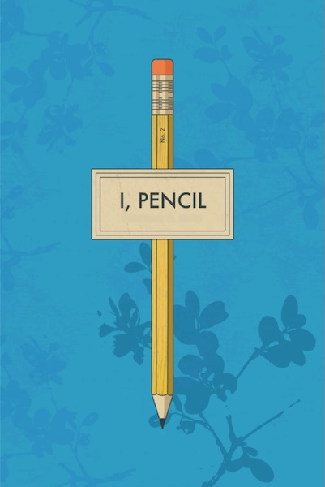
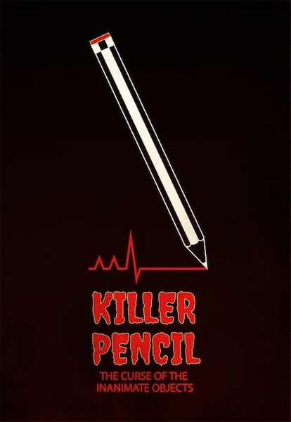
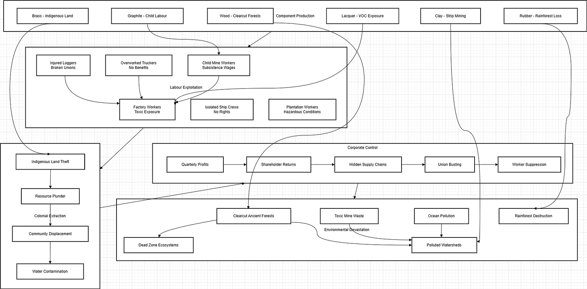
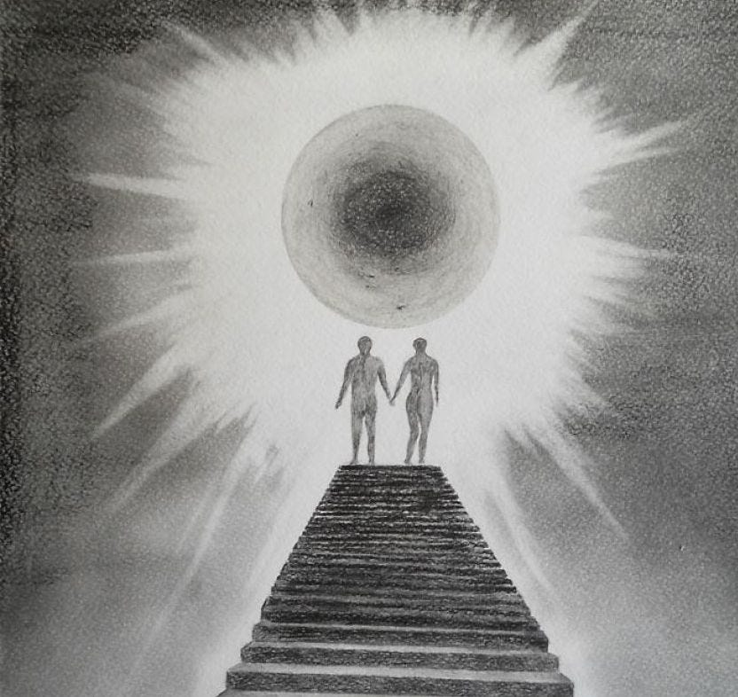
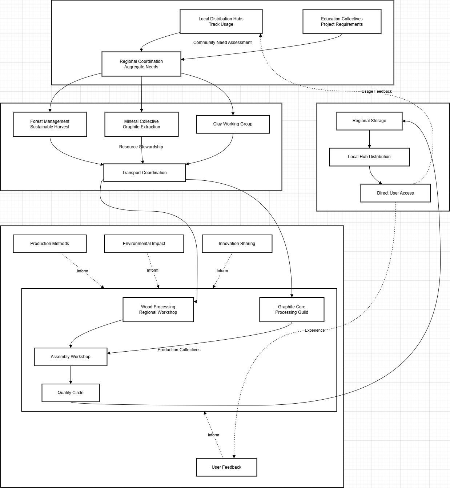
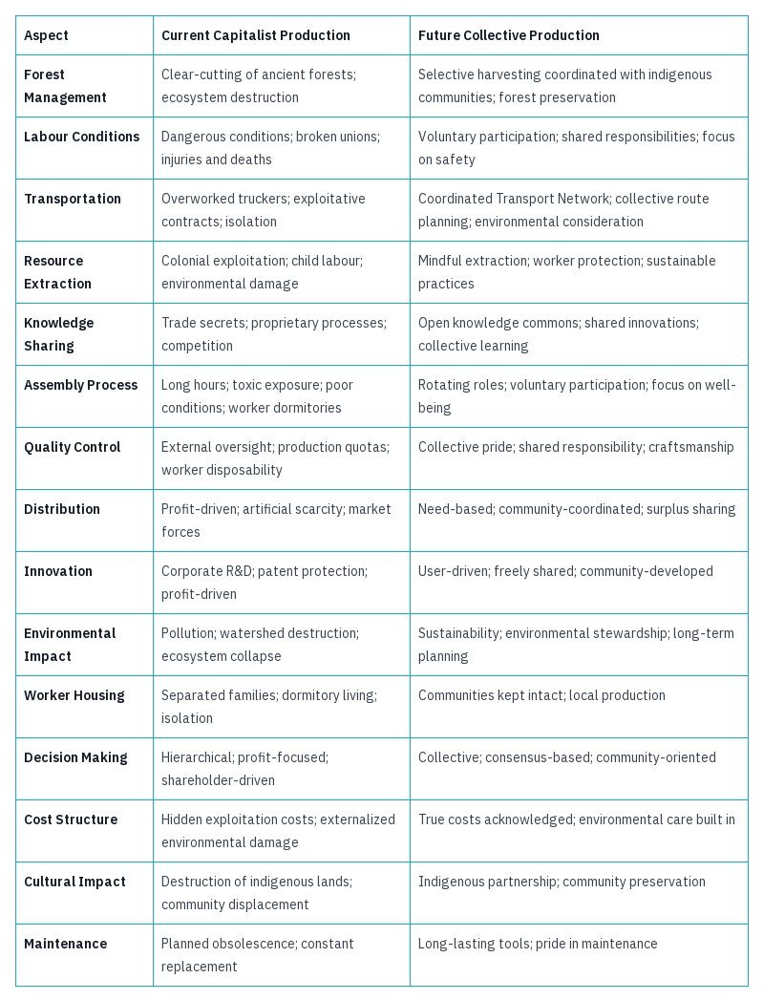

### Old Pencil Propaganda

There is a simple story about a pencil, famously promoted by economist Milton Friedman, though actually written by Leonard E. Read1, which is used it to promote the idea that under capitalism, all parts of a pencil production process work together harmoniously for everyone's benefit. _I[previous wrote an article](https://peacefulrevolutionary.substack.com/p/the-right-wing-myth-of-the-pencil) questioning many of the assumptions of the story._

This tall tale, known as ‘I, Pencil,’ presents itself as a first-person narrative explaining the complex manufacturing process behind a seemingly simple writing implement. It describes how countless people across the globe—from loggers in Oregon to graphite miners in Ceylon (now Sri Lanka)—each contribute their specific expertise, with no single person understanding the entire process.2

The piece argues for free-market capitalism by suggesting that the decentralised coordination of workers and resources happens naturally through market forces (what it calls ‘the Invisible Hand’). Read uses this to make a broader political argument against government intervention, claiming that just as no single entity could coordinate the creation of a pencil, no central authority can effectively coordinate complex economic activities.

It is a deceptively simple story—and more accurately, a deceptive story—which ignores the human misery woven into that process. So now, for the first time, we're giving the pencil a chance to speak for itself, without Read or Friedman presuming to speak on its behalf.

### The Real Pencil Story

I am a pencil, and while I appear simple, my creation carries a heavy burden of human suffering and environmental devastation that remains invisible to those who use me.

 _Sorry, this is not a fun kid’s fairy tale. You may have heard another story about me—but that was just propaganda from some economists claiming to speak on my behalf, although without my permission. This is the true story, you can say you heard it straight from me, because it's time I set the record straight._

My story begins in the clear-cut wastelands of what were once ancient forests. Here logging corporations, driven by quarterly profits, clear entire ecosystems, leaving behind dead zones where diverse forests once stood. The loggers who cut these trees work in dangerous conditions, many suffering injuries or death, their unions long since broken by corporate power.

A modern pencil based horror movie

In my most rudimentary form I travel first by trucks driven by underpaid workers forced to meet impossible schedules, their basic safety sacrificed for delivery speeds. They sleep in their cabs, away from families, while their employers evade responsibility by calling them ‘independent contractors.’3

My graphite comes from mines where workers, often including children, labour in dangerous conditions for subsistence wages. The colonial legacy lives on as foreign corporations extract resources, leaving behind poisoned water and devastated communities. The clay mixed with my graphite comes from strip mines that have left Mississippi watersheds polluted for generations.

In the Chinese factories where I'm assembled, workers endure long hours in poor conditions, exposed to toxic chemicals with inadequate protection. They live in dormitories separated from their children, who grow up in distant villages. Attempts to organise for better conditions are met with intimidation and dismissal.

My brass ferrule contains copper from mines that have destroyed indigenous lands, and zinc processed in facilities that leave behind toxic waste. The rubber in my eraser comes from plantations built on cleared rainforest, where workers face hazardous conditions and poverty wages.

The lacquer that coats me releases volatile organic compounds that factory workers breathe daily, many developing chronic respiratory conditions.4 The ‘efficiency’ of my production comes from treating workers as disposable, replacing them when they can no longer work at the demanded pace.

My journey across oceans happens on massive cargo ships run by skeleton crews working in isolation for months, their labour rights virtually non-existent. The ships themselves are major polluters, burning the dirtiest fuel allowed.

Then, I am sold for pennies, my low price possible only through this hidden exploitation. The profits flowing not to the workers who risk their health to create me, but to distant shareholders and executives who never see the true costs of their ‘efficiency.’

The corporate offices that calculate my profit margins never calculate the cost in human lives, destroyed ecosystems, polluted rivers, and shattered communities. The ‘miracle of the market’ that supposedly guides my production is really a web of exploitation, hidden behind supply chains deliberately made opaque.

I am a pencil, and my true story isn't about the wonder of the market, but about how capitalism hides its real costs - in human suffering, environmental destruction, and the theft of resources from communities who can't resist corporate power.

 **How Pencils Are Made Now**

### We, Pencils - The Ideal Pencil Story

 _But what if this story was told by a pencil from a better future, from a world in which making pencils for profit was no longer necessary, because there was no money, no exploitation, no hierarchy to force people to make pencils under terrible conditions, but to do so freely and voluntarily? How much different would that story be?_

I am one pencil among many, but the story I want to share isn't just mine. It's about how we're made now, in a time where profit and exploitation are memories from a darker past. Let me tell you about our world of voluntary cooperation – it's quite different from what you've just heard.

We are pencils, yes, but we're more than just tools – we're expressions of what communities can create when they work together freely. Each of us represents countless moments of care, skill, and genuine collaboration.

Our journey begins with our friends in the Forest Stewardship Collective in the Pacific Northwest. They work alongside indigenous communities who've known these forests for generations. Together, they tend the cedars with patience and wisdom, understanding that a healthy forest is a gift to the future. The Logging Collective works with tools kept running by the dedicated hands of the Tool Maintenance Guild – they can tell you the history of every machine they've lovingly maintained over decades.

A pencil drawn stairway to a better world

The Transport Network carries our cedar to Regional Wood Processing Centres, following routes designed to tread lightly on the land. In these centres, woodworkers share their knowledge voluntarily – there are no secrets here, just the joy of passing skills from one generation to the next.

Our ‘lead’ isn't actually lead (an old name that stuck with us), but graphite, thoughtfully extracted by Mining Collectives who've found ways to work in harmony with the earth. They collaborate with Clay Working Groups, blending ancient wisdom with new discoveries. The Materials Science Collectives – many of them former corporate chemists who found a better way – have developed alternatives that protect both people and planet.

Assembly happens in Writing Tools Workshops scattered across regions, where people contribute what they do best. Some have a gift for precise assembly, others for teaching newcomers – all sharing the work so it never becomes a burden. The quality in our making comes from pride in craft and care for those who will use us.

We find our way to those who need us through Distribution Hubs, guided by communities who understand their own needs best. Schools, libraries, and community centres work together, sharing surpluses when they arise, supporting each other when shortages appear.

New ideas flow as easily as water here. When children suggested ways to make us easier for small hands to hold, their insights became part of the Knowledge Commons, inspiring new designs.5 Different regions create their own versions of us – some prefer local woods, others different shapes – adding beautiful variety to our family.

We are proof of something remarkable: that people can work together by choice, can share knowledge openly, can create for genuine need rather than profit. We are pencils made not by markets but by communities who choose to collaborate.

I've shared our story, but remember – I speak as part of something larger. Every pencil you hold connects you to this web of cooperation. We may be simple tools, but we carry a profound truth: the real miracle isn't an invisible hand, but the visible care of free people working together for the good of all.

## Conclusion

These three stories - the propaganda of the ‘free market’, the reality of capitalist exploitation, and the possibility of genuine cooperation - show us something important about how we tell stories about the things we make. The original ‘I, Pencil’ used a simple object to naturalise and justify a system of exploitation. By telling the true story of that exploitation, and imagining how things could be different, we can begin to see beyond the mythology of the market to both the reality of our present and the possibility of our future. The next time you pick up a pencil, consider which story it's telling - and which story you want to help write.

 **Ideal Pencil Production (Without Capitalism)**

 **Capitalist And Possible Non-Capitalist Pencil Production Compared**

Subscribe

[Share](https://peacefulrevolutionary.substack.com/p/i-pencil-the-true-story?utm_source=substack&utm_medium=email&utm_content=share&action=share)

### Capitalism Series

If you liked this consider reading more of my [series on Capitalism](https://peacefulrevolutionary.substack.com/about#§capitalism-series)

1

I, Pencil, was first published By Leonard E. Read in 1958. Read was a follower of James Fifield's pro-Capitalist church - see [How Capitalism Co-Opted Christianity](https://peacefulrevolutionary.substack.com/p/how-capitalism-co-opted-christianity)

2

The British colony of Ceylon (renamed Sri Lanka after independence in 1948) was extensively exploited for its natural resources, including graphite mines that supplied the pencil industry. The colonial period established extraction patterns that continued after independence, with foreign corporations maintaining control of resources while local communities bore the environmental and social costs.

3

This employment classification, often called ‘misclassification’ by labour advocates, allows companies to avoid providing workers with benefits, minimum wage protections, overtime pay, or workers' compensation. Workers classified as independent contractors must pay their own expenses and employment taxes while lacking basic labour rights like the ability to unionise. This practice is particularly common in trucking and delivery services.

4

Volatile Organic Compounds are chemicals that easily become vapours or gases at room temperature. Common in industrial processes and materials like lacquers, paints, and adhesives, VOCs can cause both short-term health effects (eye/throat irritation, headaches, nausea) and long-term impacts including liver and kidney damage, central nervous system problems, and cancer. Factory workers face prolonged exposure to these compounds with often inadequate protection.

5

This refers to information, ideas, and innovations that are shared freely rather than being privately owned through patents or trade secrets. In a Knowledge Commons, improvements and discoveries are made available to all, allowing communities to build on each other's work rather than competing. This concept extends the traditional idea of commons (shared natural resources managed by communities) to intellectual and cultural resources.
