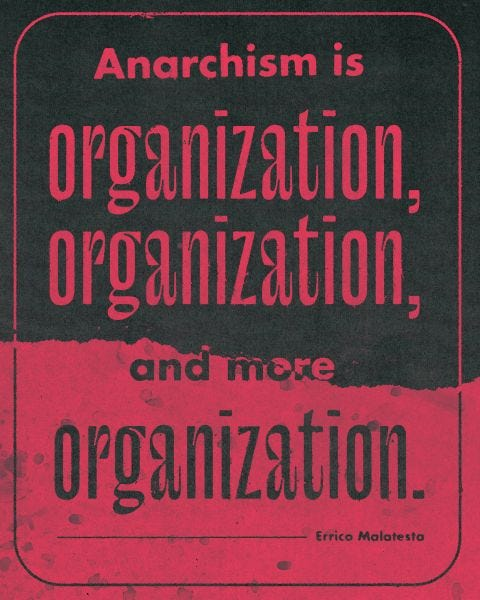
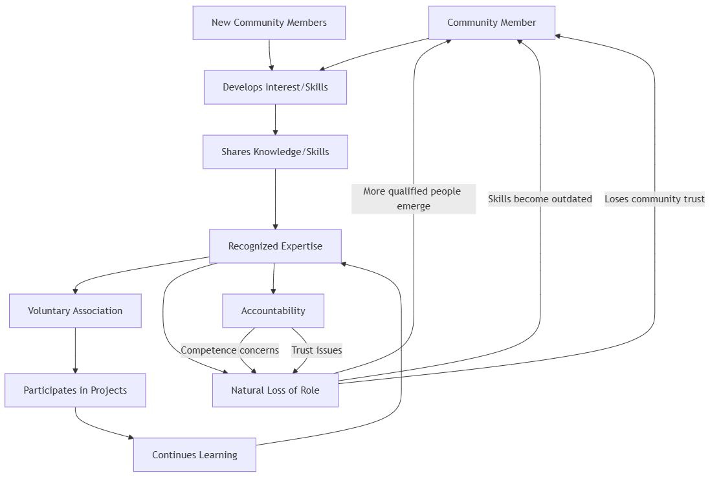

_This is one of my occasional mid-week less formal articles, often based on conversations or debates begun in comments / notes / toots. I often find others questions and objections show me what I haven’t adequately covered and lets me know what needs further explanation. I enjoy the challenge of responding to criticism, sometimes it’s humbling, sometimes reaffirming, but usually interesting, and if something is right it shouldn’t fear challenge, and if it is wrong we shouldn’t fear challenging it._

As an Anarchist - someone who is against hierarchy - I find that making the moral argument for why we shouldn’t have rulers is easier than helping people to imagine how that world might operate. Many people assume that such a world would be chaos, and indeed the word Anarchy has often been associated with that word, but Anarchists are not just focused on ridding the world of rulers, but on ways of organising that don’t require people ruling over others.

Despite there being many successful examples of such communities, and even whole civilisations that lived without hierarchy, it is hard for people to conceive of society working in such a different way than they are used to. But Anarchy isn’t chaos, the O surrounding the A in the famous Ⓐ symbol stands for Organisation. As notable Italian revolutionary Errico Anarchist Malatesta is credited as saying, ‘Anarchism is organisation, organisation, and more organisation.’1 Yet it can be a challenge in such a hierarchal world to think of organisation without rulers or representation.

## Beyond Representative Democracy

This situation made more difficult by the inadequacy of some words to convey such a situation. Sometimes, in trying to do this, Anarchists have described Anarchy as a ‘democracy’ without representatives, in which people represent themselves.2 But the problem with representative democracy is one person is making decisions that may potentially impact hundreds of thousands or even millions of people in the area they represent. This is something Anarchists reject as another form of hierarchical rule, simply distributing power among a smaller group rather than eliminating it.

To an Anarchist such a politician is a mini ruler. Their power may be divided somewhat with other representatives, but it is still greater than the large number they represent. Whatever the good intentions of some young politicians (or even the rare few who manage to keep their idealism after decades), most of their good intentions end up being co-opted, misdirected and subverted.

This is known as ‘The Iron Law Of Oligarchy’ because you cannot legislate indefinitely against political corruption as long as Capitalism exists, because the power of the wealthy to influence politicians will always lead to such laws being overlooked or ultimately changed to allow open bribery. This demonstrates another fundamental and fatal flaw in representative systems.

Given these problems with representative democracy, many assume the natural alternative would be direct democracy. After all, if the problem is representatives making decisions for others, wouldn't having everyone make decisions for themselves solve this issue?

### Direct Democracy? Inevitable Authority?

Someone recently tried to get me to choose between the alternatives of direct or representative democracy, but this is a trick question. ‘Direct democracy’ can mean people making decisions for themselves, but can also mean many people deciding on laws that affect everyone, not just those who consented to them, which is just another form of ‘mob rule’. This might make representative democracy look more reasonable in comparison, as if these were the only two choices (which they are not). In both cases it is people representing a majority having the power to impose their will on the minority, and no-one should have the right to deprive others of rights just because they are in a majority.

This is one of the challenges with using the word ‘democratic’ at all, but if we want to use it in a positive way then by democratic we might mean honouring individual rights or communal needs, then the key question becomes how we can best ensure both autonomy and effective coordination with groups of people. This isn't about choosing between direct or representative democracy - it's about developing systems of coordination that respect both individual and collective needs.

But what about experts and their authority? Don’t we need representatives for that? This was an objection that the same debater brought up. He was asking me from his Leninist perspective (Leninism was the political theory Soviet Russia operated under).3 Surely, he challenged, ‘we can’t have laypeople with no expertise making decisions over matters they have no knowledge of or training in? Can we?’4

Yet the fact that some decisions require expertise is not something Anarchists dispute, we just object to people claiming the right to rule because they claim greater expertise than others. Nor was his argument as reasonable as he they imagined it might be - because if we can vote in representatives we can potentially give people power over organisations and policies they have no expertise in.5

### Understanding Authority vs Hierarchy

The Leninist's challenge does raise an important question though: how do we respect and utilise expertise without creating new forms of hierarchy? After all, no one would deny that complex modern society requires specialised knowledge and skills. But does this mean that Anarchists don't accept and respect expertise? Far from it. This brings up another problem with words in English having several definitions, in this case the crucial distinction between authority and hierarchy.

One of the clearest explanations of this distinction between expertise and hierarchical authority comes from the anarchist philosopher Mikhail Bakunin, who wrote:

> Does it follow that I reject all authority? Far from me such a thought. In the matter of boots, I refer to the authority of the bootmaker; concerning houses, canals, or railroads, I consult that of the architect or the engineer. For such or such special knowledge I apply to such or such a savant. But I allow neither the bootmaker nor the architect nor savant to impose his authority upon me. I listen to them freely and with all the respect merited by their intelligence, their character, their knowledge, reserving always my incontestable right of criticism and censure. _(God and the State, 1916)_

Bakunin's insight helps us understand how authority and hierarchy are separate concepts, though the word authority is sometimes used in an authoritarian context. Authority and hierarchy in this sense are separate and distinct. This kind of authority mean expertise and specialised knowledge that doesn't need to translate into hierarchical power relationships. When we need someone with technical knowledge or specialised skills, we can work with them as equals rather than subordinates. We can accept their wisdom or reject it, but they are not bound to accept our ignorance either.

This distinction becomes particularly clear when we look at complex organisations that require high levels of expertise. Healthcare provides perhaps the most compelling example of this principle in action.

## An Expertise Example

One common argument for hierarchy comes from complex organisations requiring specialised knowledge. A hospital provides an excellent test case for this claim, as it's perhaps the clearest example of somewhere most people would agree needs specialised knowledge and training to operate effectively. But examining how hospitals could function without hierarchy actually reveals the flaws in this argument. Let's consider how medical expertise and collective decision-making might work together.

Doctors want to heal, patients want to be relieved of pain, and those who discover cures want them to be available to those who suffer. This is why hospitals and clinics exist. In our modern world medical insurance and / or costs can often get in the way of this process, and hospital owners may think in terms of profits, but we still see the basic purpose of medicine, clinics, and surgery as fulfilling their original Hippocratic function of helping the sick when they need it.

Currently there are two primary approaches to healthcare: universal (free at the point of use, paid for by taxation) or for-profit (paid for by patients / insurers, often subsidised by taxes). Both systems, however, still maintain hierarchical control over healthcare decisions.

Yet in whatever medical system we have access to we want to know that we are being treated by someone well trained and medicines well tested and safe. So should only people with medical degrees vote for qualified representatives to make decisions on medial matters. Is this a good argument for having specialised representatives? Lets consider for a moment the possible downsides of this arrangement

  1. It establishes medical professionals as a privileged class with exclusive political power over healthcare decisions that affect everyone.

  2. It creates a representative system where some make decisions on behalf of others, rather than direct democratic participation.

  3. It excludes patients, care workers, and community members from having input on medical policies that directly impact their lives.

Doctors don’t have anything to do without patients and their illnesses, so keeping patients out of decisions regarding their own care is a form of alienation and hierarchy that perpetuates medical authority at the expense of human autonomy and collective well-being. Medical knowledge should inform, not override, patient self-determination and community healthcare decisions.

### How Would Anarchists Organise This Differently?

History shows us there are alternatives to either the state or capitalist model of healthcare. Revolutionary Catalonia (1936-1939) developed a decentralised healthcare system run by worker collectives, demonstrating how medical care could be organised without state control or private profit. Likewise, the Welsh miners' medical aid societies had shown how communities could create their own healthcare systems through mutual aid. These examples later influenced more formal systems like Britain's NHS, though much of their non-hierarchical character was lost in the transition to state control. As an alternative an Anarcho-Communist approach would likely advocate for:

  * Collective decision-making that includes all stakeholders, especially those most impacted by medical policies.

  * Integration of medical knowledge and expertise without granting special political authority.

  * Horizontal organisation where medical professionals share their expertise as equals in the community rather than ruling over others.

  * Recognition that medical care intersects with broader social issues that affect the whole community.

The key distinction in what I'm describing is that consensus-based decision making is fundamentally different from voting-based systems, whether direct or representative.

In the hospital example, it's not just that ‘everyone gets a say’ - it's that solutions emerge through a process of discussion and mutual agreement rather than voting. People can opt out if they don't agree, rather than being bound by a majority decision.

In a consensus-based approach, we can absolutely have delegates who coordinate between groups or bring specialised knowledge - but crucially, these delegates don't have the power to make binding decisions for others. Their role is facilitative rather than representative in the traditional political sense.

So while I agree that we need ways to coordinate complex projects and share expertise across larger scales, I don't see this as requiring ‘representation’ in the sense of giving some people the authority to make decisions that bind others. We can have delegation and coordination without creating fixed power relationships.

### Practical Examples of Horizontal Organisation

Let's imagine how this might work in practice with a specific example: a town needing to expand its hospital with a new department.

The process would start with hospital workers and townspeople gathering to discuss expansion needs and potential approaches. Rather than electing official representatives to make decisions for everyone, they might form a voluntary working group of interested parties - including medical staff, construction experts, and community members.

This working group wouldn't have power over others - they would research options, develop proposals, and bring information back to the wider community. Anyone could join or leave the working group at any point. The actual decisions would be made through an ongoing consensus process where everyone affected can participate.

The specialised knowledge of doctors, architects, engineers etc. would inform the process, but these experts wouldn't be ‘representatives’ with decision-making authority over others. They would share their expertise while remaining equal participants in the consensus process. This differs from both direct democracy (where everyone votes on everything) and representative democracy (where elected officials make decisions for others). Instead, it's a flexible process of free association where people can participate as much or as little as they choose, while ensuring those with relevant knowledge and skills can contribute effectively without creating hierarchical power structures.

For accountability, we could have a system where groups maintain their autonomy but agree to respond to serious concerns raised by other groups or communities. If someone consistently fails to meet agreed-upon standards or behaves abusively, other groups could choose to stop coordinating with them - not as a punishment imposed from above, but as a natural consequence of breaking trust. This addresses how services can be fulfilled, and how to deal with people if they fail to fulfil their roles, without having formal representatives with power over others.

### Managing Expertise In Non-Hierarchical Systems

Does this mean we have to put up with incompetence or people claiming expertise who don't have it? No. Just as communities develop ways to recognise genuine expertise, they also naturally develop ways to protect themselves from false claims of competence. This happens not through top-down enforcement, but through networks of trust and mutual verification. Let's look at how this works in practice with Emergency Services (EMS) coordination, to see how expertise and responsibility can exist without hierarchy. _(This is called the Emergency Ambulance Service in the U.K.)_

Rather than having administrators with power over others, we could have a coordinating hub that operates through mutual agreement. EMS groups would voluntarily agree to certain protocols and standards they develop together - much like how internet protocols work: no central authority enforces them, but participants choose to follow them because they enable effective coordination.

The dispatcher's role inherently involves making quick decisions that affect others, but their ‘authority’ comes from the voluntary agreement of participating groups to work together through that coordination system. Just as a hospital wouldn't be obliged to schedule surgeries for an incompetent surgeon, a dispatcher network wouldn't be obliged to route calls to EMS providers who have shown themselves to be unreliable or dangerous. (And likewise, potential dispatchers wouldn't be in that position in the first place without having shown themselves competent.)

The power to affect others comes with natural accountability through the withdrawal of voluntary cooperation - a sort of individual defederation (the voluntary breaking of established cooperative relationships). If a group consistently fails to meet agreed-upon standards or behaves dangerously, other groups could choose to stop coordinating with them. This isn't punishment imposed from above, but rather a natural consequence of breaking trust and failing to maintain the standards the community needs to function effectively.

This example shows how even in time-critical situations requiring quick decisions and specialised knowledge, we can maintain both effectiveness and accountability without resorting to hierarchical power structures.

When medical staff work together, they naturally develop systems to maintain quality care and safety. A surgeon who consistently endangers patients wouldn't be forcibly stopped by representatives with political authority - rather, they would find that other medical staff refuse to assist them, the hospital stops providing operating room access, and insurance or mutual aid networks stop covering their work.

The key principle is that while these roles carry significant responsibility, the power must always flow from bottom-up agreements rather than top-down authority.

## Cultural Transformation

There's an important cultural dimension to this discussion that often gets overlooked. In our current capitalist/hierarchical culture, there are strong incentives for incompetent or power-hungry people to seek out positions of authority. The system actually rewards those who are skilled at accumulating and maintaining power rather than those who are most competent at the actual work. Additionally, hierarchical organisations often have structural incentives to overlook or protect incompetent people who maintain the right connections or serve the interests of those above them.

In contrast, a non-capitalist, non-hierarchical culture would fundamentally shift these incentives. When status and material rewards aren't tied to having power over others, and when organisation happens through voluntary association, the motivations change. People would be more likely to develop skills and offer their expertise because they genuinely want to contribute to their community, rather than seeking to climb a hierarchical ladder.

Over time, this creates a virtuous cycle: when contribution and competence are valued over domination and control, it naturally encourages people to focus on genuine skill development and collaborative problem-solving. The cultural shift away from hierarchical thinking means that attempts to accumulate power would be seen as antisocial rather than aspirational, while sharing knowledge and working cooperatively would be recognised and appreciated.

This doesn't happen overnight, but ultimately the structure and the culture reinforce each other - horizontal organisation encourages cooperative behaviour, which in turn makes horizontal organisation more effective. When we create spaces where expertise is shared freely and decisions emerge through genuine consensus among equals, we're not just building better systems - we're fostering a culture that makes such systems sustainable and effective.

### Consensus & Free Association

Genuine consensus differs fundamentally from both direct and representative democracy. Solutions emerge through discussion and mutual agreement rather than voting, with people free to opt out if they don't agree rather than being bound by majority decisions. While we need ways to coordinate complex projects and share expertise across larger scales, this doesn't require ‘representation’ in the sense of giving some people authority to make binding decisions for others.

Free association doesn't mean everyone gets to do whatever they want without consequences. Rather, it means people can choose which associations to participate in and which agreements to enter into, while understanding that choices have natural consequences. The key difference is between voluntary agreements with natural consequences versus coercive enforcement through state power. A consensus-based system can have structure and organisation - it just derives from bottom-up voluntary association rather than top-down authority.

Throughout this article, we've seen how expertise can be respected without creating hierarchy, whether in healthcare, emergency services, or community planning. The examples demonstrate that accountability doesn't require top-down enforcement but can emerge naturally through networks of trust and mutual verification. When competence rather than dominance becomes the basis for influence, we create systems that are both more effective and more liberating.

Perhaps most importantly, these organisational principles help transform the culture itself. By creating spaces where knowledge is shared freely, where decisions emerge through genuine consensus, and where contribution is valued over control, we develop new ways of relating to each other. The result is a virtuous cycle where horizontal organisation encourages cooperative behaviour, which in turn strengthens horizontal organisation.

This isn't just idealistic thinking - there are numerous historical and contemporary examples of communities successfully organising through voluntary federation and consensus, even in the face of capitalist opposition. I'm not willing to sacrifice freedom now for a party or ruler under the pretence of fulfilling promises much later.

Whether or not one fully embraces Anarchist principles,6 these examples of horizontal organisation and free association offer valuable lessons for anyone interested in creating more equitable and effective ways of working together. The core insight - that we can respect expertise without creating hierarchy, and maintain accountability without resorting to coercion - has relevance for any group seeking to balance individual autonomy with collective needs.

Subscribe

[Share](https://peacefulrevolutionary.substack.com/p/organising-without-rulers?utm_source=substack&utm_medium=email&utm_content=share&action=share)

### Expertise Without Hierarchy Chart

 **Entry into expertise:**

  * Community members develop interest and skills through self-directed learning, apprenticeships and mentorships

  * They demonstrate and share their knowledge with others

  * Expertise is recognized through practical demonstration and community trust

  * They begin participating in relevant projects and continue learning

 **Maintaining expertise:**

  * Continued learning and skill development

  * Active participation in community projects

  * Sharing knowledge with others

  * Maintaining trust through competent practice

 **Exit from expertise can happen through:**

  * Natural evolution (more qualified people emerge)

  * Skills becoming outdated

  * Loss of community trust

  * Competence concerns

  * Voluntary stepping back

### Hierarchy Series

If you liked this consider reading more of the **[Hierarchy Series](https://peacefulrevolutionary.substack.com/about#§hierarchy-series)**

1

Though oft-quoted I have had a challenge finding the source, suffice it to say the same sentiments exist in his essay on [Organisation](https://theanarchistlibrary.org/library/errico-malatesta-organization)

2

This is a very contested term within the Anarchist community as this [selection of essays on the subject](https://theanarchistlibrary.org/search?query=democracy&sort=&filter_topic=%2Fcategory%2Ftopic%2Fdemocracy) shows.

3

See my previous articles on Leninism:

  * [Hierarchy And Revolution](https://peacefulrevolutionary.substack.com/p/hierarchy-and-revolution)

  * [Is Leninist Hierarchy Justified?](https://peacefulrevolutionary.substack.com/p/justification-for-hierarchy-under)

4

I am paraphrasing him here for the sake of brevity.

5

Leninists like him believe in a transitional state led by a dictatorship of the proletariat - those who understand political theory well enough to eventually somehow bring about for us the stateless, moneyless, classless aims of communism, albeit through their money-dependent state government, which is run by their ruling class.

However, I fundamentally disagree that limiting and repressing freedom now, even with good intentions, can somehow lead to greater freedom later. History has shown that power structures, once established, perpetuate themselves rather than ‘withering away.’ The means we use shape the ends we achieve.

6

Although I hope I make a good argument for them here and in my other articles.
