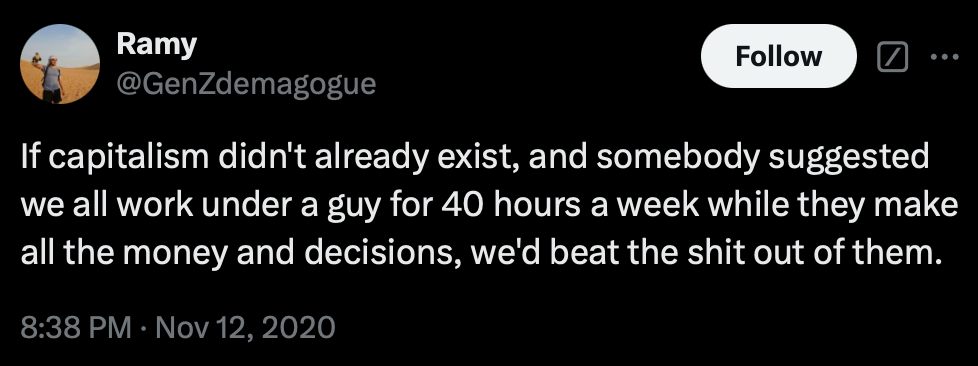

_This is the first in a series of video versions of ‘Reasons To Hate Capitalism’ produced by[Counter-Intuitive](https://audiopervert.substack.com/). _

[YouTube Version](https://youtube.com/shorts/ojIWTs3JyJ8)

There are many reasons to hate Capitalism: You can hate Capitalism for existing it all. Why should some people have capital and others not in a world which produces enough for everyone? But among the many specific reasons to hate Capitalism, here is reason ninety-nine:

 **Capitalism is dumb! [ & Working For Bosses Is Stealing Your Life]**

As Ramy called out in this tweet on X:

If Capitalism didn’t already exist, and somebody suggested we all work under a guy for 40 hours a week while they make all the money and decisions, we’d beat the shit out of them.

In response to this ardent supporters of Capitalism (Capitalismists as I like to call them), might give the example of this one employer who treats their wage slaves (I mean employees), nicely. And Remy had a come back tweet for this too:

> A few slave masters treating their slaves well doesn't justify the institution of slavery. Likewise for capitalism.

And while it is true that employees make some money, 1 penny for every pound or dollar their employer makes if they’re lucky - The Capitalist makes money just by having things: a factory, a mine, an apartment building. And these things often came from their parents or ancestors who claimed a piece of land first, or more likely stole it from some indigenous tribe.

Most of us didn’t grow up so wealthy, and our kids wont be born so lucky. Or should I say that in a Capitalist world most of us are born unlucky, work hard for 40 or more hours per week, and still stay unlucky, and that’s not your fault.

So, complain about your boss if you like, but don’t forget to blame Capitalism

And keep reading this series every month to discover more reasons to hate Capitalism and some solutions to living without it too.

 _Ongoing ‘Reasons To Hate Capitalism’ quotes & memes are posted each weekday on [reasonstohatecapitalism.com](http://reasonstohatecapitalism.com)_

Not convinced that this is Capitalism’s fault? Read the ‘[What Is Capitalism](https://peacefulrevolutionary.substack.com/p/what-is-capitalism)’ series.

Subscribe

[Share](https://peacefulrevolutionary.substack.com/p/working-for-bosses-is-stealing-your?utm_source=substack&utm_medium=email&utm_content=share&action=share)

[Give a gift subscription](https://peacefulrevolutionary.substack.com/subscribe?&gift=true)
