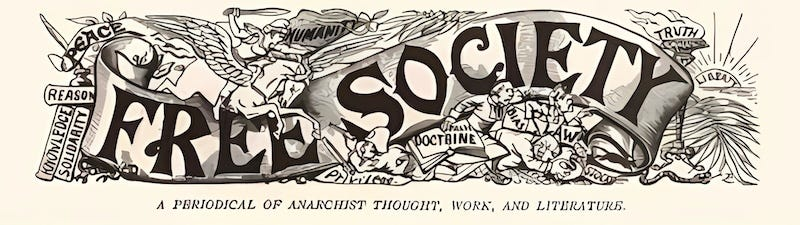

## Dystopia vs Utopia

As shown by many films over the last fifty years, it is easier (or at least more popular) to imagine and believe in a dystopian future than to portray a better possible world. This may be due to the fact that a dysfunctional world gives a film’s protagonists something to rebel against or escape from, which makes plotting such a story all the easier. I also think it is because the dystopian is more familiar to us, it emphasises the problems we already see in the world, or the fears we already have for our future and magnifies them.

I’ve often taken this approach myself, starting my articles with what is wrong with the world to bring attention to it, in the hope that people seeing how bad something is will want to fight to make it better. But it is necessary to believe that something better is possible to believe that it is worth trying to make such a change, and this is where imagining potential utopias can not only be useful, but revolutionary in itself. (By utopia I’m not talking about an impossibly perfect unattainable world, but the better world we may be able to reach if we make our ideals a reality.)

In a previous article reviewing a plan for a better world, [I wrote a list](https://peacefulrevolutionary.substack.com/i/151259102/pillars-of-a-free-society) on the restrictions a society had to rid itself of in order to be truly free. However, even then I was focused primarily on the negatives to be avoided, but true freedom requires positive guarantees too. Building a better world is not just about removing harmful systems, but establishing beneficial alternatives in their place. It is about realising what we are hoping for, beyond just escaping the problems our world has now, and in seeing the solutions to those problems made possible in the process.

If we want to establish and maintain a free society we need to understand what the requirements and essential characteristics of a free society are. We need to know just not what we are against, but what we are for. Below are what I believe are the twelve essential ingredients for guaranteeing a free society, with the reasons why I believe they are necessary, how these freedoms enable better possibilities, and how a better world cannot exist long without them.

## 12 Types Of Freedom

To have a free society your must have:

  1. Freedom of self-determination

  2. Freedom of necessity

  3. Freedom of access

  4. Freedom of non-compliance

  5. Freedom of thought

  6. Freedom of movement/action

  7. Freedom of individual expression

  8. Freedom of identity

  9. Freedom of privacy

  10. Freedom of relationships

  11. Freedom of belief/conscience

  12. Freedom of association

I have purposely not split this into negative (freedom from) and positive (freedom to) freedoms, because a free society is one in which these freedoms are present, however they are achieved. (More on this later)

These freedoms are inseparable and mutually reinforcing - you cannot have one without the others. As we will see as we look more deeply into each of these freedoms, if one of these freedoms isn’t available then society isn’t truly free, and - unless you are in a particularly privileged position - you aren’t either.

### 1\. The Self-Determination Principle

Do you have freedom to make choices - including about what you spend your life doing? Or are those choices made for you?

 **What is the situation now?**

Our current society is built on hierarchical control that systematically strips away self-determination. In the workplace, at-will employment gives employers arbitrary power to terminate workers' livelihoods, leaving many in constant precarity. Corporate management structures further entrench this domination through rigid hierarchies that reduce workers to replaceable cogs, monitored and controlled through layers of supervisors. Even our education system trains people to submit to authority rather than think independently.

At the more dystopian end of the spectrum: The prison-industrial complex creates a modern system of forced labour, whilst immigration detention centres trap people in limbo without basic freedoms, and corporate imperialism employs slave labour overseas, which hides the true human cost of our consumption behind distant factory walls and complex supply chains. These interlocking systems of control create a society where genuine autonomy is increasingly rare, and where most people's major life decisions are effectively made by those with power over them.

The inevitable path of accepting these state and corporate hierarchies is losing autonomy, being subject to coercion, and ultimately being ruled over by dictatorial authoritarianism which punishes dissent harshly.

 **The Free Society Alternative**

To have true self-determination you need to have and maintain autonomy. True freedom requires that each person has control over their own life decisions without being subject to others' authority. If people can't make their own choices about how to live and work, their fundamental human dignity is compromised. Therefore there must be horizontal organisation and consensual decision-making.

Imagine a world in which you decide what’s best for you, you live where you’d like to, you wake up deciding what you want to do that day, and whatever work (if you call it that) you do is what you choose to do. You don’t have to worry about pleasing (or displeasing) a manager, a teacher, a policeman, or a politician, as you don’t have to do what anyone tells you to. The groups you are part of are formed out of common goals and you make decisions together, and you choose to be voluntarily part of such groups because of the purpose, friendships, support and benefits they bring.

  *  _A free society_ Must have: Individual autonomy, collective / communal / consent decision-making, and voluntary cooperation.

  *  _A free society_ Must not have: Imposed authority, hierarchy, mandatory submission, or forced compliance.

Why? Because human dignity and development require the ability to make meaningful choices about one's own life without coercion. Because you want to live a life that isn’t controlled by others, without having to submit to arbitrary power, or being ranked by status or class. Because you want to follow your passions, learn and growing freely, and contribute in your own way.

When people experience genuine autonomy in decision-making, they naturally develop responsibility and consideration for others. The fear that people can't handle freedom often comes from observing behaviours shaped by authoritarian systems.

 **What is needed to achieve this?**

To move towards genuine self-determination, we need to both dismantle existing hierarchical structures and build alternative models based on horizontal organisation. This means creating worker-owned cooperatives / collectives and communes where decisions are made together by everyone (& ideally by consensus), establishing community and regional assemblies for local organisation, and developing mutual aid networks that allow people to meet their needs without dependence on employers or the state. Education can be reimagined through free schools and skill-sharing networks that encourage critical thinking and self-directed learning. The prison system can be replaced with restorative and transformative justice approaches that address harm without removing autonomy. Immigration barriers can be eliminated in favour of free movement and mutual support between communities.

Key to this transition is building dual power and prefiguration - creating alternative institutions that build the new world in the shell of the old, while simultaneously resisting the existing hierarchical one. This could involve workplace organising, tenant unions, and community defence groups that protect against state violence. As these horizontal structures grow stronger, they can increasingly replace authoritarian institutions, allowing people to gradually withdraw from coercive systems and build genuine autonomy through collective action and mutual support.

### 2\. The Economic Liberation Imperative

Do you have freedom to access and use resources - including meeting your basic needs and pursuing your aspirations?

 **What is the situation now?**

Our current society is built on artificial scarcity and economic coercion that systematically creates dependency. In daily life, basic needs like housing, food, and healthcare are commodified and restricted behind paywalls, forcing people into wage labour just to survive. Financial institutions trap people in cycles of debt through predatory lending. Corporate monopolies control access to essential resources, creating artificial shortages to drive up prices.

At the more dystopian end of the spectrum: People die from lack of healthcare access while pharmaceutical companies hoard patents, and food is destroyed to maintain high prices while communities face hunger. These interlocking systems of economic control create a society where genuine material freedom is increasingly rare, and where most people's access to basic needs depends on submission to those who control resources. The inevitable path of accepting economic inequality is increasing concentration of wealth and power, leading to a world where every aspect of human life must be purchased, where survival itself becomes a privilege rather than a right, and where the majority are forced to sell their freedom just to exist.

 **The Free Society Alternative**

To have true economic liberation, you need guaranteed access to resources and collective prosperity. Economic freedom means having your needs met as a basic right, without having to trade away your autonomy or dignity. If people must struggle for basic survival or submit to others' control to access resources, they cannot truly be free. Therefore there must be a complete transformation from market-based distribution to need-based provision, ensuring no one must trade their freedom for survival.

Imagine a world where you never have to worry about going hungry or losing your home, where healthcare and education are freely available to all, and where you can pursue your interests and develop your capabilities without financial barriers. You don't have to stress about paying bills or taking on debt, as resources are shared based on need. The communities you're part of ensure everyone's wellbeing through mutual support networks, but you're not forced to compete or accumulate just to survive.

  *  _A free society_ Must have: Shared resources, mutual support, collective prosperity, guaranteed needs

  *  _A free society_ Must not have: Debt bondage, wealth hoarding, economic coercion, artificial scarcity

Why? Because economic dependency creates power imbalances that inevitably lead to exploitation. Because you want to live in a world where no one has to choose between dignity and survival. Because genuine freedom requires material security and the ability to develop your full potential without economic barriers. Because collective prosperity creates more possibilities than individual wealth accumulation.

Most people naturally want to contribute to their community when their needs are securely met. The belief that people must be motivated by scarcity comes from experiencing artificial resource restrictions.

 **What is needed to achieve this?**

To move towards genuine economic freedom of resources, we need to both challenge the current system of artificial scarcity and build alternative economic models based on mutual aid and collective prosperity. This means creating food sovereignty through community gardens and agricultural cooperatives, developing free clinics and healthcare networks, and building systems of mutual aid that ensure everyone's needs are met. Money and markets can be replaced with gift economies and needs-based distribution.

Key to this transition is building economic dual power - creating alternative resource networks while simultaneously resisting capitalist exploitation. This could involve debt resistance, worker cooperatives, and mutual aid networks that demonstrate practical alternatives to market dependency. As these solidarity economies grow stronger, they can increasingly replace profit-driven systems, allowing communities to gradually withdraw from coercive economic relationships and build genuine prosperity through collective action and resource sharing.

Achieving this could be called economic freedom (or obtaining freedom from capitalist economics), so that nothing that is needed needs be accessed using money, nor is restricted due to lack of money (see below), including having a home. Capitalist ‘libertarianism’ (propertarianism) is not economic freedom - it slavery (for most) with extra steps.

### 3\. The Commons Access Guarantee

Do you have freedom to access and use resources when you need them, without barriers or gatekeepers?

 **What is the situation now?**

Our current society is built on artificial barriers and restricted access that systematically creates scarcity. Essential resources like water, land, and knowledge are increasingly privatised and commodified, with access controlled by corporations and wealthy individuals. While landlords extract wealth through rent from basic shelter, patents and intellectual property laws restrict the sharing of life-saving medicines and vital technologies. Digital resources are locked behind paywalls, while physical commons are increasingly enclosed and policed.

At the more dystopian end of the spectrum: Millions face homelessness while houses sit empty for profit, communities face water shortages while corporations bottle their aquifers for sale, and indigenous peoples are barred from ancestral lands now owned by mining companies. Global capitalism imposes resource extraction that devastates indigenous lands and local ecosystems, which destroys sustainable ways of living and forces communities into market dependency. Crucial scientific research is hidden behind academic paywalls while people die from preventable diseases. Corporate patents on seeds force farmers into dependency, which destroys traditional agricultural knowledge and creates artificial food scarcity. These interlocking systems of resource control create a society where universal access becomes increasingly rare, and where most people's ability to meet their needs depends on the permission of resource gatekeepers.

The inevitable path of accepting private control of essential resources is complete corporate ownership of life itself, from genes to water to air, leading to neo-feudalism where the many must beg for survival from the few who own everything.

 **The Free Society Alternative**

To have true universal access, you need collective stewardship of resources and commons-based management. Freedom of access means being able to use what you need when you need it, without having to seek permission or pay gatekeepers. If people can't access essential resources freely, their basic rights and dignity are compromised. Therefore there must be collective management of commons and needs-based distribution.

Imagine a world where you can freely access any resource you need - from tools to knowledge to natural resources - based simply on need and responsible use. You don't have to worry about being denied access to essentials, as resources are held in common and managed collectively. The communities you're part of ensure sustainable stewardship of shared resources, but artificial barriers don't restrict access to what people need to live and thrive.

  *  _A free society_ Must have: Collective stewardship, needs-based distribution, sustainable sharing, open access

  *  _A free society_ Must not have: Private control of essentials, artificial scarcity, resource gatekeeping, restricted commons

Why? Because restricting access to essential resources forces people into compliance and creates unnecessary suffering. Because you want to live in a world where meeting basic needs isn't dependent on wealth or permission. Because genuine freedom requires unhindered access to the resources needed for life and development. Because collective stewardship creates better outcomes than private enclosure.

People naturally tend to take only what they need when there's genuine abundance. The fear of resource depletion often comes from experiencing artificial scarcity in profit-driven systems.

 **What is needed to achieve this?**

To move towards genuine universal access, we need to both challenge current systems of private resource control and build alternative models based on commons management and collective stewardship. This means creating community land trusts, housing collectives to decommodify shelter, seed libraries, and tool libraries, establishing open-source knowledge repositories, developing shared infrastructure networks, and building systems of collective resource management that ensure sustainable access for all.

Key to this transition is building commons-based dual power - creating alternative access systems while simultaneously resisting privatisation and enclosure. This could involve defending existing commons, rent strikes, reclaiming privatised resources, establishing new commons, and developing protocols for sustainable collective management. As these commons-based systems grow stronger, they can increasingly replace private ownership models, allowing communities to gradually withdraw from restricted access systems and build genuine abundance through collective stewardship and open access.

### The Fundamental Freedoms

These first three freedoms - self-determination, economic liberation, and universal access - form the foundation that makes all other freedoms possible. They are mutually reinforcing and create the conditions for fuller human freedom:

 **Without hierarchy** , there is no one to impose their will or restrict your choices. With genuine autonomy, you can choose your own path, develop your own identity, express yourself freely, and form relationships based on mutual desire rather than dependency or coercion. When no one has power over you, you're free to think independently and act according to your conscience.

 **Without artificial scarcity and commodification** , there is no one who can force you to conform through economic pressure or threaten you with deprivation. With guaranteed access to resources and collective prosperity, you can pursue your interests and develop your capabilities without financial barriers. You can maintain privacy without economic surveillance, build communities of affinity rather than necessity, and express dissent without risking your survival.

 **Without enclosure and privatised property** , you can't be kept from what you need by claims of ownership or corporate control. With collective stewardship of the commons and universal access, you can use any space or resource based on need rather than ability to pay. When land and resources aren't privately owned, you can't be excluded from shelter, sustenance, or community. You can join or leave any community, access knowledge and culture freely, maintain relationships across distances, and find the spaces that allow you to thrive - all without having to submit to property owners or corporate gatekeepers.

These foundational freedoms enable all the others in concrete ways:

  *  **Freedom of thought** requires both autonomy from authority and access to knowledge

  *  **Freedom of expression** needs both material security and absence of hierarchical censorship

  *  **Freedom of identity** depends on both self-determination and access to supportive communities

  *  **Freedom of privacy** requires both economic independence and control over your own space

  *  **Freedom of relationship** needs both personal autonomy and ability to freely associate

  *  **Freedom of conscience** requires both independence from authority and material security to act on beliefs

  *  **Freedom of association** depends on both absence of hierarchy and ability to freely move and access resources

When these three core freedoms are secured, they create a virtuous cycle that strengthens and protects all other freedoms. This is why any movement for liberation must address all three simultaneously - partial freedom isn't truly freedom at all.

Subscribe

[Share](https://peacefulrevolutionary.substack.com/p/a-free-society?utm_source=substack&utm_medium=email&utm_content=share&action=share)

 _The remaining nine freedoms - from freedom of thought to freedom of association - will be explored in detail in the next article, along with common arguments against their implementation and practical examples of how these freedoms have been and can be achieved. As we'll see, many objections to these freedoms stem from experiences within our current hierarchical systems rather than reflecting inherent human nature or insurmountable practical barriers._

