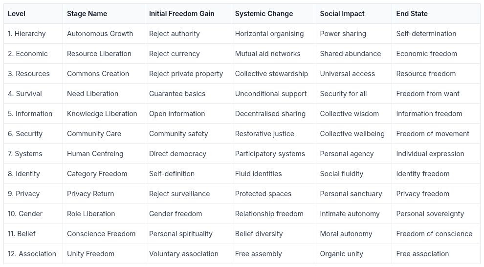
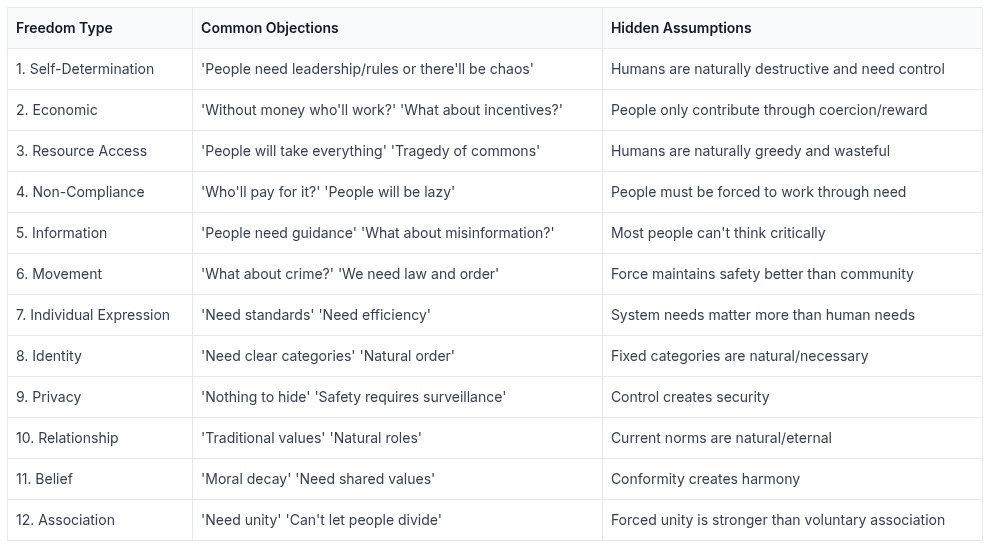
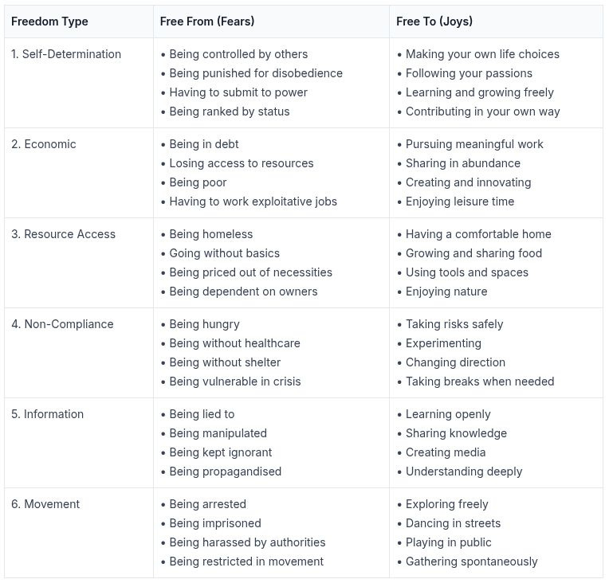
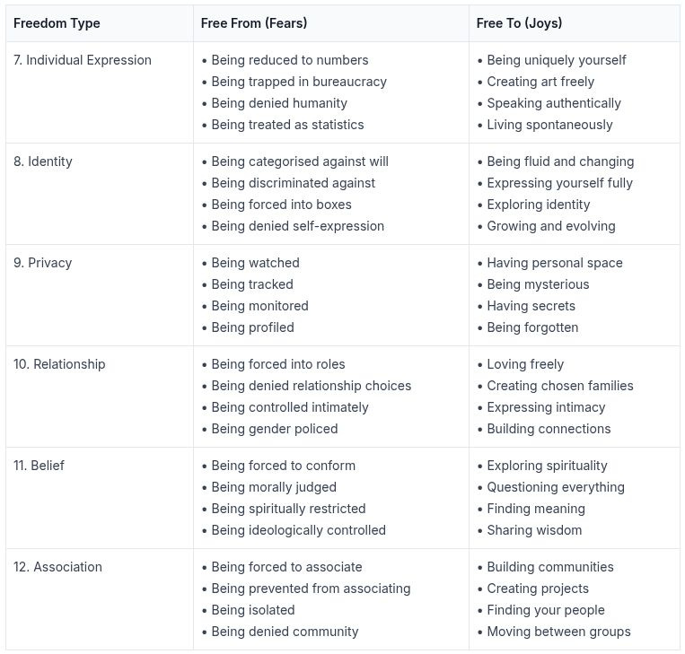
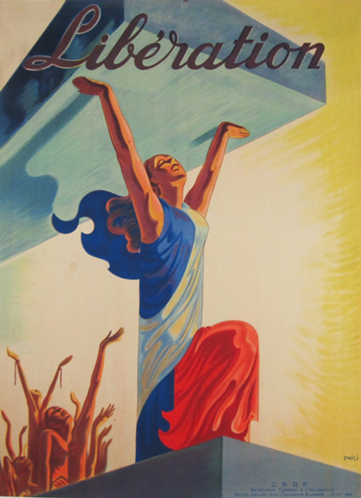

# The Building Blocks of Liberation

In the previous article, [Free Society](https://peacefulrevolutionary.substack.com/p/a-free-society), we explored three fundamental freedoms essential for a liberated society:

 **1\. Self-determination: Freedom from hierarchical control:** Living without bosses, managers, or authorities dictating your choices means being able to wake up each day and decide how to spend your time. It means working because you choose to, learning what interests you, and contributing to projects you believe in. When no one has power over you, you can develop your full potential and work together with others as equals.

 **2\. Economic liberation: Freedom from artificial scarcity:** Imagine never having to worry about paying rent, buying food, or affording healthcare. When resources are shared based on need rather than ability to pay, you're free to pursue a meaningful life instead of wage slavery. You can take risks, change direction, or take time to rest without risking survival. Real economic freedom means having your needs met as a right, not a reward for compliance.

 **3\. Commons access: Freedom from restricted resources:** When resources are held in common instead of privately owned, everyone can access what they need when they need it. This means having a home without landlords, using tools and spaces without fees, and sharing knowledge without paywalls. It means being able to grow food in community gardens, use community workshops, and access education freely. The commons lets everyone benefit from our collective resources.

These core freedoms create the foundation for the additional freedoms we'll examine here. Without them, other freedoms remain fragile or impossible. If we want true and complete freedom, we also need to ensure we have:

 **4\. The Non-Compliance Guarantee:** Can you refuse without risking your life? True freedom requires that survival itself cannot be held hostage. When access to food, shelter, or healthcare depends on compliance with rules or systems, all choices become coerced. Even if resources are held in common, they must be unconditionally accessible - no one should face deprivation for non-compliance with any community, system, or authority.

  *  _A free society_ Must have: Unconditional survival guarantees, ability to live independently, and multiple paths to meet needs.

  *  _A free society_ Must not have: Compliance-based access, dependency relationships, and survival gatekeeping.

Why? Because when survival needs can be denied as punishment, all other freedoms become meaningless. The true test of freedom is whether someone can say ‘no’ to any system or community without facing punishment or death. While most may choose interdependence, the option to survive independently must exist - otherwise all participation becomes coerced.

 **5\. The Open Knowledge Principle:** Can everyone access and share information freely? Understanding requires access to diverse information sources and the ability to share knowledge. If information is controlled or manipulated, people cannot make informed choices. Therefore there must be free information flow.

  *  _A free society_ Must have: Open knowledge sharing, diverse perspectives, and collaborative learning.

  *  _A free society_ Must not have: Centralised media, controlled narratives, and information gatekeeping.

Why? Because controlled information creates controlled minds and prevents genuine understanding. People naturally seek to understand and share knowledge when barriers are removed. The fear of ‘misinformation’ often justifies systems of control rather than fostering critical thinking.

 **6\. The Free Movement Right:** Can everyone move and act freely without borders, guards and police? Freedom of movement and action is fundamental to human dignity. If people are constantly monitored and controlled, they cannot truly be free. Therefore there must be community-based safety approaches.

  *  _A free society_ Must have: Community safety, restorative justice, and free movement.

  *  _A free society_ Must not have: State policing, movement restrictions, and arbitrary confinement.

Why? Because restricting movement and enforcing compliance through violence creates a prison society. Communities naturally develop ways to maintain safety when empowered to do so. The belief that people must be controlled by force comes from experiencing authoritarian ‘security’.

 **7\. The Human Dignity Principle:** Can everyone be treated as a unique individual? Human freedom requires recognition of each person's complexity and worth. If people are reduced to numbers and measurements, their humanity is denied. Therefore there must be human-centred systems.

  *  _A free society_ Must have: Individual recognition, human-scale organisation, and personal agency.

  *  _A free society_ Must not have: Bureaucratic reduction, standardised processing, and statistic-based worth.

Why? Because treating humans as statistics creates systems that ignore human needs and dignity. When systems are built around human needs rather than administrative convenience, they naturally become more effective. The drive to standardise comes from prioritising system efficiency over human wellbeing.

 **8\. The Identity Freedom Principle:** Can everyone define themselves? True freedom includes the right to determine and express one's own identity. If categories are imposed and enforced, people cannot be their authentic selves. Therefore there must be self-determination of identity.

  *  _A free society_ Must have: Self-definition, fluid identities, and voluntary association.

  *  _A free society_ Must not have: Imposed categories, enforced labels, and identity restrictions.

Why? Because forcing people into categories creates artificial divisions and prevents authentic expression. People naturally form fluid and overlapping identities when free from imposed categories. The urge to categorise often comes from systems needing to control and divide.

 **9\. The Privacy Protection:** Can people exist unmonitored? Privacy is essential for personal development and freedom. If everything is surveilled, people cannot experiment, grow, or be themselves. Therefore there must be protection of private space.

  *  _A free society_ Must have: Protected spaces, information control, and a right to anonymity.

  *  _A free society_ Must not have: Universal surveillance, data collection, and privacy invasion.

Why? Because constant monitoring creates self-censorship and prevents genuine freedom. People naturally respect boundaries when their own privacy is protected. The drive for surveillance comes from desire for control rather than safety.

 **10\. The Relationship Freedom Principle:** Can everyone form relationships freely? Personal autonomy requires freedom in intimate and social connections. If relationship forms are restricted or prescribed, people cannot create authentic bonds. Therefore there must be relationship self-determination.

  *  _A free society_ Must have: Relationship autonomy, chosen families, and gender freedom.

  *  _A free society_ Must not have: Enforced relationship norms, prescribed family structures, and gender roles.

Why? Because controlling intimate relationships extends social control into personal life. When people can form relationships freely, they create strong, supportive bonds. The urge to enforce relationship norms comes from systems needing to control social reproduction.

 **11\. The Conscience Freedom Guarantee:** Can everyone follow their beliefs? Spiritual and moral autonomy is fundamental to human dignity. If belief systems are enforced, genuine conviction becomes impossible. Therefore there must be freedom of conscience.

  *  _A free society_ Must have: Belief diversity, personal spirituality, moral autonomy

  *  _A free society_ Must not have: Enforced morality, required beliefs, spiritual authority

Why? Because forcing beliefs creates conformity rather than genuine choice. People naturally develop ethical frameworks when free to explore beliefs. The drive to enforce morality comes from desire for control rather than genuine virtue.

 **12\. The Free Association Principle:** Can everyone choose their communities? Freedom requires ability to join and leave groups. If unity is forced, genuine community becomes impossible. Therefore there must be voluntary association.

  *  _A free society_ Must have: Voluntary groups, free movement between communities, organic unity

  *  _A free society_ Must not have: Forced membership, restricted exit, mandatory unity

Why? Because forced unity creates artificial boundaries and prevents authentic community. People naturally form cooperative groups when free to associate. The push for forced unity comes from fear rather than genuine solidarity.

 _This is the purpose of the ‘Free Society’ blog - to show why these aims are essentials and to show the ways to achieve them._

## Freedom Gains

To understand how we can move from our current system to a free society, we need to examine how each freedom develops and builds upon others. Each of our twelve essential freedoms follows a similar path of development: starting with rejecting current systems of control, moving through the creation of alternative structures, fostering social transformation, and ultimately achieving a liberated state of being. Understanding these stages helps us recognise where we are in the journey and what steps come next.

Here's how each type of freedom grows from initial rejection of control to full liberation:

Each row shows how gaining an initial freedom leads through systemic changes and social impacts to reach a liberated end state. These progressions demonstrate how each freedom builds upon and reinforces the others, creating a framework for complete liberation.

## Objections

While these freedoms represent natural human hopes and desires, common objections often arise from living in and experiencing with world as it is. Most objections to these freedoms stem from deeply ingrained fears and assumptions shaped by living under hierarchical systems. Fear of change leads people to defend even harmful aspects of the current system, while distrust of human nature (often based on observing behaviour shaped by coercive systems) makes people believe control is necessary.

Many mistake the current system's artificial constraints for natural laws, assuming that because something has been this way in their life, it must be this way by nature. The belief that control creates order ignores how many current problems are created by controlling systems themselves, while the assumption that freedom means chaos ignores how genuine freedom fosters responsibility and mutual consideration.

Here are typical objections, often based on fear or misunderstanding:

The key counter-argument is that these fears often describe problems created by current systems rather than human nature or societal conditioning. When people appear greedy, it's usually under conditions of artificial scarcity. When people seem lazy, it's typically in response to coerced labour. When people act destructively, it's often in rebellion against control or from desperation created by the system itself. The so-called ‘tragedy of the commons’ historically emerged not from free access but from enclosure and privatisation of previously well-managed communal resources.

Moreover, historical and anthropological evidence shows humans naturally cooperating when not prevented by hierarchical systems. Indigenous societies often maintained complex systems of resource sharing and collective decision-making without central authority. Modern examples from mutual aid networks to open-source communities demonstrate how people freely contribute to common goals without coercion. Even within the current system, most people's daily cooperation and mutual support happens despite, not because of, hierarchical control.

The real challenge isn't changing human nature - it's breaking free from systems that suppress our natural tendencies toward cooperation and mutual aid. When people experience genuine freedom and security, they typically develop stronger consideration for others and their shared environment, not less. Understanding how different types of freedoms interact is crucial for building effective liberation strategies.

### Negative & Positive Freedoms

The traditional division between 'negative' and 'positive' freedoms serves to maintain systems of control by pretending these freedoms can be separated, and provides an excuse for rejecting those freedom that require people to co-operate together.

Freedom from coercion requires freedom to meet needs, freedom to create requires freedom from exploitation, and so on. The distinction between negative and positive freedoms is artificial - real freedom requires both removing constraints and enabling possibilities. Each freedom depends on and enables all others. A little look at the interconnection of "negative" and "positive" freedoms shows this to be true:

Negative Freedoms (freedom from) require Positive Freedoms (freedom to):

  * Freedom from hunger requires the freedom to access food.

  * Freedom from homelessness requires the freedom to access shelter.

  * Freedom from coercion requires the freedom to meet basic needs.

  * Freedom from exploitation requires the freedom to say no.

  * Freedom from ignorance requires the freedom to learn.

  * Freedom from isolation requires the freedom to associate.

Positive Freedoms require Negative Freedoms:

  * Freedom to learn requires freedom from information control.

  * Freedom to create requires freedom from exploitation.

  * Freedom to associate requires freedom from forced unity.

  * Freedom to be healthy requires freedom from environmental destruction.

  * Freedom to contribute requires freedom from survival pressure.

  * Freedom to develop requires freedom from oppression.

Real freedom requires both removing constraints AND enabling access. The distinction between negative/positive freedom is artificial. Each type of freedom reinforces and requires the other. Systems of control often use this false division to maintain power. The ‘freedom from/freedom to’ division serves to maintain hierarchical control by pretending these freedoms can be separated.

### Slaves To Freedom? Addressing the ‘Forced Labour’ Myth

A common argument against positive freedoms like healthcare access relies on a deliberate misunderstanding: that guaranteeing access to services means forcing people to provide them. This stems from the Capitalist assumption that resources must be privately owned and services must be commodified. Under this view, ‘freedom to have healthcare’ means ‘forcing doctors to work.’ But this ignores that:

  1. Most medical professionals want to help people - the current system often prevents this through bureaucracy and profit motives.

  2. Mutual aid systems allow people to contribute according to ability and receive according to need - no coercion required.

  3. The current system actually creates more coercion:

  4. Doctors forced to rush patients to meet quotas.

  5. People forced to work exploitative jobs for insurance.

  6. Medical debt creating effective indentured servitude.

The ‘forcing others to provide’ argument assumes resources must be privately owned, services must be monetised, and people won't contribute without coercion. But historical examples show:

  * Commons systems work effectively.

  * People naturally want to contribute meaningfully.

  * Removing artificial scarcity enables genuine freedom for all.

The real slavery is the current system where basic needs are held hostage, most people must sell their labour to survive, both providers and recipients are coerced. True freedom means removing these artificial constraints so people can both give and receive freely based on ability and need.

## Freedoms Fears & Joys

While we've explored these freedoms conceptually, what matters most is how they affect our daily lived experience. Beyond abstract discussions of hierarchy and systems, what does freedom actually feel like? What specific fears would be lifted from our shoulders, and what joys could flourish in their place? Let's look at the tangible impact of each freedom in human terms:

### The World We Could Be Living In

Imagine waking up each morning knowing you're truly free - not just abstractly, but in every concrete way that matters. You choose how to spend your day because your basic needs are met unconditionally. You create, learn, and contribute because you want to, not because you're forced to. Your relationships are authentic because they're chosen, not compelled by economic necessity or social pressure.

This isn't mere fantasy. Every freedom described above has existed somewhere, at some time, in human history. Indigenous societies maintained complex resource-sharing systems without central authority. Mutual aid networks today demonstrate how people naturally cooperate when free to do so. Worker cooperatives show how production can function without bosses. Free schools prove learning flourishes without coercion.

Of course, critics will say this vision is impractical or impossible. They'll argue: ‘The world is too complex for horizontal organisation’, ‘People are too selfish to share resources freely’, ‘We need authority to maintain order’, ‘Technology requires hierarchical control.’

But ask yourself: Is living under constant surveillance ‘practical’? Is spending most of your life doing work you hate ‘efficient’? Is destroying our planet's ecosystems for profit ‘realistic’? Is having your basic survival dependent on pleasing those with power over you ‘necessary’?

The real impracticality lies in trying to maintain our current system of artificial scarcity, environmental destruction, and human misery. The real impossibility is believing we can continue this way indefinitely.

We don't have to accept a world of: Constant economic anxiety, meaningless bureaucratic jobs, environmental devastation, surveillance and control, forced conformity, and artificial divisions. We could instead build a world of:

  * Genuine security and abundance

  * Meaningful contribution and creativity

  * Environmental regeneration

  * Privacy and autonomy

  * Authentic self-expression

  * Real community

The choice isn't between practical oppression and impossible freedom. It's between the impossible task of maintaining systems of control, and the very possible project of building systems of liberation. Every step toward these freedoms makes them more real and attainable.

The question isn't whether this transformation is possible - it's whether we're willing to work toward it. Are you content to live in a cage, no matter how comfortable? Or are you ready to break free, spread your wings, and fly?

The world of genuine freedom exists as a possibility within our grasp. We can see glimpses of it in every act of mutual aid, every moment of authentic connection, every successful experiment in horizontal organisation. The only thing stopping us from reaching for it is the belief that we can't. What kind of world do you want to live in?

Subscribe

[Share](https://peacefulrevolutionary.substack.com/p/achieving-liberation?utm_source=substack&utm_medium=email&utm_content=share&action=share)

