_What’s In A Word is a monthly vidcast series on frequently misunderstood political and philosophical terms. Except when it is trying to be humorous it strives to be accurate and informative._

The word conservative originally meant ‘to conserve’ and some argue it still does. Although what is being conserved and why it needs conserving is the larger question I hope to answer later, there are also other understandings of the word.

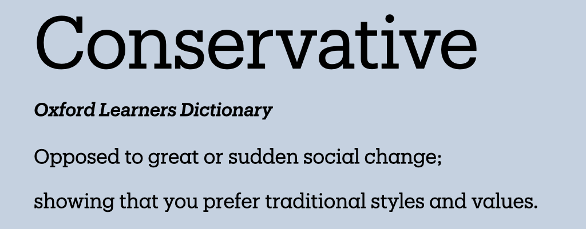

To explore this let's go back to history class. To the 1790s, to a time after the American, British and first French revolution.1

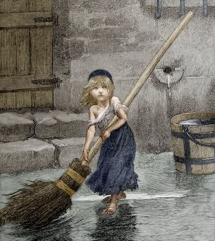Living in pre-revolutionary France was Les Miserables!

It was a time of wars between old and new powers, and old and new philosophies. One of these new philosophies was Conservatism. Yep, you heard me right, Conservatism was the new kid on the block, and it was fathered by a man named Edmund Burke, who gave it its privileged head-start in life.2

Edmund had supported the British and American revolutions, but took great exception at the French Revolution, writing a widely distributed pamphlet against it. (No-one said Conservatives were consistent.) To him revolutions were okay if they didn't inconvenience rich Lords and Ladies, or wealthy merchants and powerful churchmen too much. Burke was a contradictory character. He had been a member of parliament for Bristol3, although he was highly sceptical of democracy, he was in favour of the monarchy, but gave arguments justifying prejudice - at least against what he didn't like, yet he opposed slavery and helped with its abolishment. So not all bad.

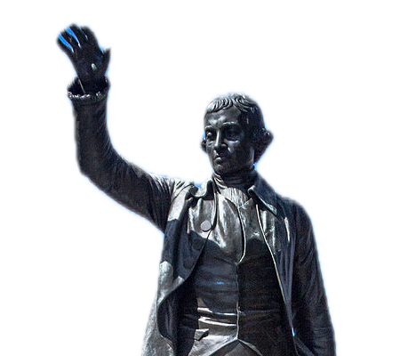Statue of Edmund Burke in Bristol (there is also one in Washington D.C.). Still awaiting being torn down like Colston's was.

His views had their fans - especially the French aristocracy. But immediately raised the ire and replies of Mary Wollstonecraft, the mother of first-wave feminism, who wrote A Vindication of the Rights of Men in response a few weeks later4, followed by the original founding father, Thomas Paine, with his Rights of Man in 1791.5 They took exception to any justification of inherited privilege, especially one that excluded the majority of poor men or ... even women. At all! _Radical, I know._

Conservatism has long been associated with Capitalism which was still in its infancy, and was seen as divine in its origins by Burke who believed that, ‘The laws of commerce are the laws of Nature, and therefore the laws of God.’6 to which Karl Marx replied, that Burke liked to make a buck, and ‘true to the laws of God and Nature, [Burke] always sold himself in the best market.’7 _So there. Na na na na na._

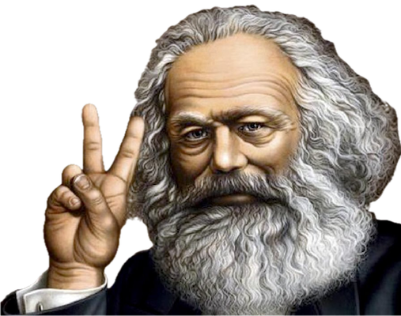 Marx looking uncharacteristically cheery

Others were more complimentary, Churchill called him the ‘foremost apostle of Liberty, on the other as the redoubtable champion of Authority’.8 Churchill, from a rich aristocratic syphilis filled family, had a thing for dead British aristocrats.

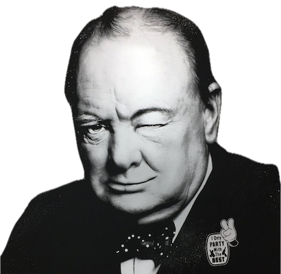Churchill or a bulldog with a bow tie?

But although Burke is called the father of conservative philosophy, the first use of the term in a political context was in France.

The French Conservatives really knew how to party ... political party. Their conservative senate - the first conservative party - established in 1799 following a Napoleon Bonaparte-led Coup, had 60 members appointed for life, who were given an allowance of up to 25,000 francs (which was enough to buy a new estate with servants every year).9 That's how much I guess it cost to be a conservative back then.

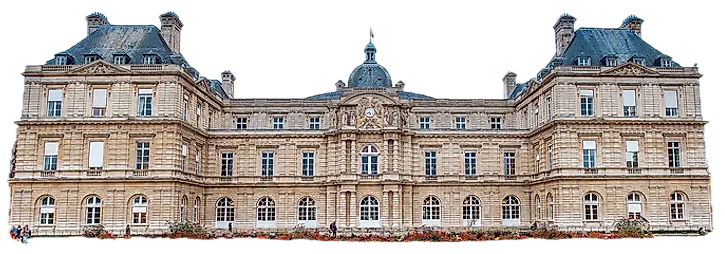 _Sénat conservateur building_

Now you have arrived at the personal opinion section, brought to you by me - if you are offended or intimidated by such things you can switch off now. But remember that because it's personal, that doesn't mean it isn't true

First a disclaimer: Modern neoconservatism does have some differences from the traditional kind, but also many similarities. Conservatives have many ideals, non-Conservatives may even share _some_ of those ideals - if not the methods of achieving them, but ...

## Conservatism - What Does It Mean?

In my be-it-ever-so-humble opinion Conservatism - at its core - is not about

  *  **Conserving the old and good?**  
Nah, if this were true Conservatives would be the biggest environmentalists on the planet.10

  *  **Valuing tradition and the past?**  
This only goes so far though - they (mostly) don't want to go back before borders, money, marriage, and organised religion existed - so they are very selective.11

  *  **Maintaining Freedom?**  
No, as this just raises the question of ‘freedom for who, especially when certain freedoms cost money.’12

  *  **Upholding high morals?**  
 _Nope._ As the high percentage of conservative politicians and celebrities involved in moral scandals goes to show.13

  *  **Rewarding hard work?**  
Sorry. As any African woman carrying water a few miles will tell you those who work the hardest often have the least.14

  *  **Rewarding competition?**  
 _Nu uh._ As it is notorious for leading to cartels, monopolies, corruption, and generally picking winners and losers based on factors other than who makes the best product.15

So what is conservatism really about? I contend that ... Conservatism is about privilege.

>  **Privilege** _noun: **  
> **_ **A special right or advantage that a particular person or group of people has.  
> ** _(This word deserves its own episode)._

Ask a British conservative if we should get rid of the queen or an American conservative whether we should replace Andrew Jackson on the Five Dollar bill.16

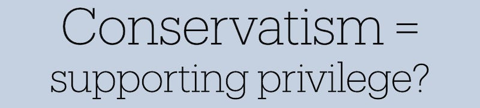

Don't believe Conservatism equals supporting privilege? Despite its origins defending monarchs, lords and the wealthy? Really?

Well, one easy way to prove this is by picking two policies: inheritance & taxes, those two inevitabilities, and seeing how they are viewed within Conservative philosophy.

Let's ask a conservative: **Should the son of a rich man inherit his wealth?**

If Conservatism is all about rewarding hard work then how is his son, who did not do that work, entitled to the father's wealth?

If Conservatism is all about rewarding hard work then the father should be confident that the fine education he paid for and good moral example he gave will inevitably lead to his son becoming rich again through his own merit. In fact he might just send him to an ordinary school, have him work at a fast food place, and just build himself up from there like everyone else should. Right?

 **What about taxes?** Since political power is influenced by wealth, and since wealth takes more resources to service, and has more impact on costs, has more influence on politics, then should the rich be taxed more? No? That wouldn't be fair?

But imagine that the son of a poor working man starts lower down the rung of the ladder and has farther to go to reach where the rich man's son starts. Surely the Conservative would be upset at this, and want the poor boy to get the same chances, by more of his taxes going to better education, nutrition, and opportunities to ensure this happens and he gets just as rewarded for his hard work? Thus giving the hard working poor the same chances as those born rich? Surely Conservatives would support this.

Nah, Conservatives want special treatment for their families (and themselves), they want to benefit from and maintain that privilege, to stay amongst the ranks of the privileged, and are the first to criticise any movement to change this.

Sure a few will still somehow get up the ladder, but in spite of others pulling it up behind them or letting the wood of the rungs rot and it becomes unsafe to ascend. Which is not quite the proof that everyone can make it that some argue it is.

This is what Conservatism has always been about, and still is - despite other differences it is what American and Conservatives in the rest of the world have in common.

Conservatism exists to justify inequality and privilege - not just of wealth, but of opportunity and of power, which always ultimately leads to plutocracy and oligarchy:17

Government of the rich by the rich for the rich - so help us god (so help us all - _well, except the rich_ ).

Next up I will be _attacking_ , I mean explaining, the meaning of the word Liberals, and you will learn why they are not the opposite of Conservatives, but have often been their bedfellows.

If you think I'm wrong about this - tell me why in the comments - but please cite sources, if you want me to take you seriously.

* * *

## Better Words?

Now this brings us to our better words round. My attempt to inject some new words into the English language (or some other language if this has been translated).

If conservatism is often misunderstood, what should we call conservatives then?

We can't just call them _Cons_ that would be unkind. Wouldn’t it? Maybe we could just focus on the aim of conservatism and see what ideas this gives us of what we should we call them?

  *  **Privocrat -** Meaning a privilege-preserver.

  *  **Privilegenti** \- Blending ‘privilege’ with ‘gentry/intelligentsia’

  *  **Elitarch** \- Combining ‘elite’ with the Greek ‘arkho’ (to rule)

  *  **Heritarch** \- From ‘heritage/hereditary’ + ‘arkho’, emphasizing inherited privilege

  *  **Plutoguard** \- Guardians of wealth/privilege (from ‘ploutos’ - wealth)

Any other ideas for words? Let me know - for the sake of future Lexicographers, let us come up with some good ones.

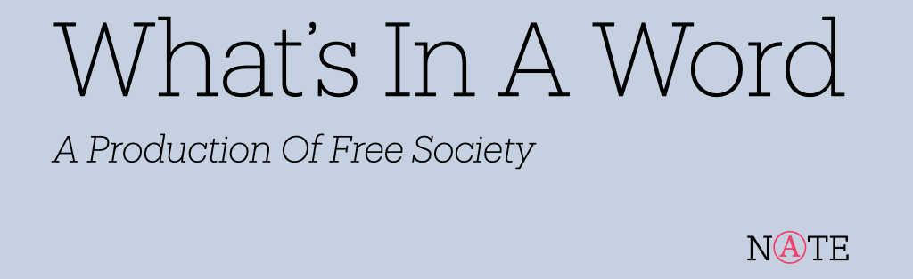

 _Video source: https://archive.org/details/reign-of-terror-1949_

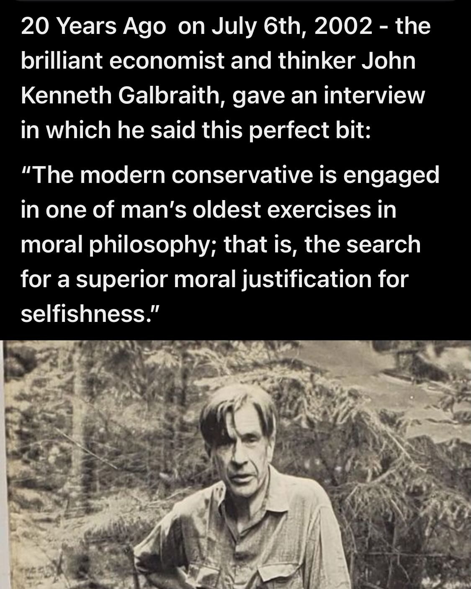

Subscribe

[Share](https://peacefulrevolutionary.substack.com/p/what-is-conservatism?utm_source=substack&utm_medium=email&utm_content=share&action=share)

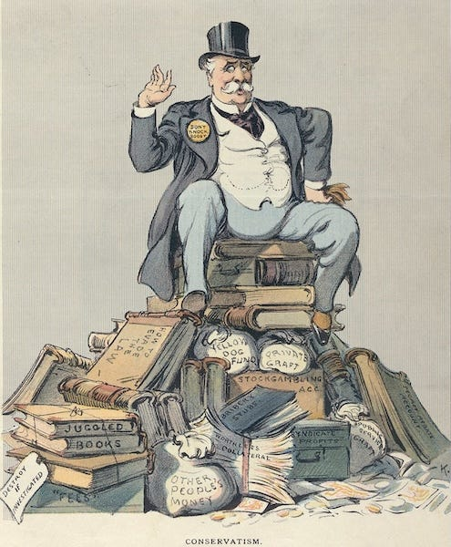

1

While ‘Les Misérables’ by Victor Hugo wasn't written until 1862, it depicted the struggles of French society in the early 19th century, particularly the poor conditions that contributed to revolutionary sentiment.

2

Edmund Burke (1729-1797) was an Anglo-Irish statesman, political theorist, and philosopher. His 'Reflections on the Revolution in France' (1790) is considered foundational to modern conservative political philosophy.

3

Burke served as MP for Bristol from 1774 to 1780. His famous ‘Speech to the Electors of Bristol’ in 1774 is still referenced in discussions about the role of parliamentary representatives.

4

Wollstonecraft's ‘A Vindication of the Rights of Men’ (1790) was published anonymously at first, and was one of the first responses to Burke's 'Reflections on the Revolution in France'. She followed this with ‘A Vindication of the Rights of Woman’ (1792), establishing herself as a pioneer of feminist philosophy.

5

'Rights of Man' (1791-1792), published in two parts, became one of the most widely read books of its time, selling over 500,000 copies in Britain alone. It defended the French Revolution's principles of democratic republicanism and challenged Burke's views on inherited privilege. The book was deemed seditious by the British government, forcing Paine to flee to France.

6

Edmund Burke (1795) Thoughts and Details on Scarcity.

7

Capital Volume One, Chapter Thirty-One, Footnote 13.

8

Churchill's assessment of Burke appeared in ‘Consistency in Politics’ (1932), where he admired Burke's ability to balance seemingly contradictory principles.

9

The Sénat conservateur was established by the Constitution of Year VIII (1799) following the Coup of 18 Brumaire.

10

If conservation was their priority, they would fight to preserve indigenous languages and cultures rather than expecting indigenous people to conform to theirs.

11

They typically focus on colonial and imperial eras to the exclusion of others.

12

Their definition of freedom rarely extends to labour unions’ right to organise, tenants’ right to safe housing, or citizens’ right to protest.

13

Their moral outrage is notably selective - quick to condemn poor families for needing benefits, whilst turning a blind eye to massive corporate tax avoidance that costs society far more.

14

Referring to this quote posted by Joel Mordi @MordiOfficial: 

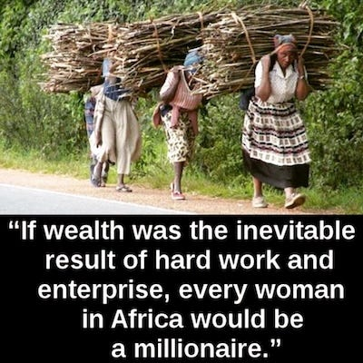

Likewise, essential workers during crises - from nurses to delivery drivers to shop workers - are often among the lowest paid, despite their work being crucial to society's functioning.

15

They consistently oppose measures that would create genuine competition, like breaking up tech monopolies or ending inherited wealth advantages.

16

The video says $5 bill, but he actually appears on the $20 bill. There have been campaigns to replace Jackson with Harriet Tubman, highlighting ongoing debates about historical representation.

17

From the Greek ‘ploutos’ (wealth) and ‘kratos’ (power/rule). The term gained prominence in the 19th century during discussions of political reform.

The word 'oligarchy' comes from the Ancient Greek ‘oligarkhia’, combining ‘oligos’ meaning ‘few’ and ‘arkho’ meaning ‘to rule’. First used to describe systems of government in Ancient Greek city-states where power was concentrated in the hands of a small, wealthy elite, rather than the wider citizenry (demokratia)
