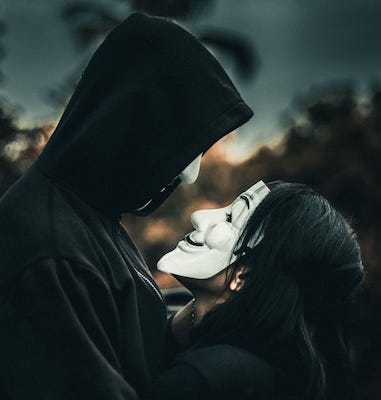
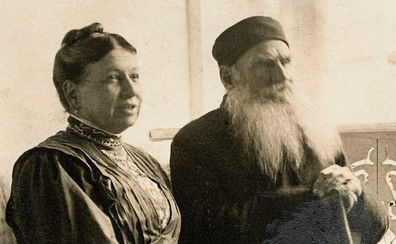
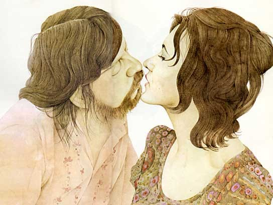
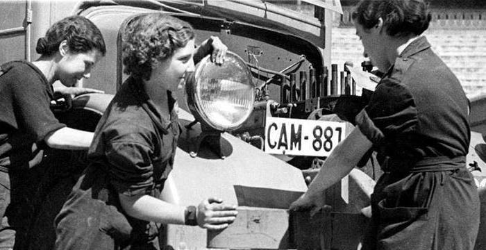
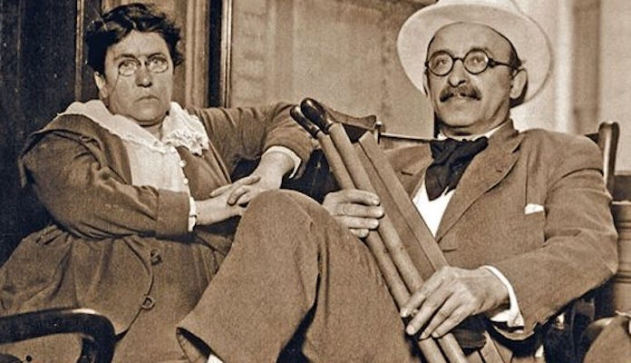
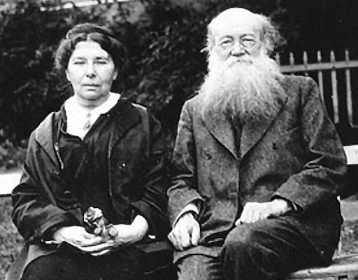
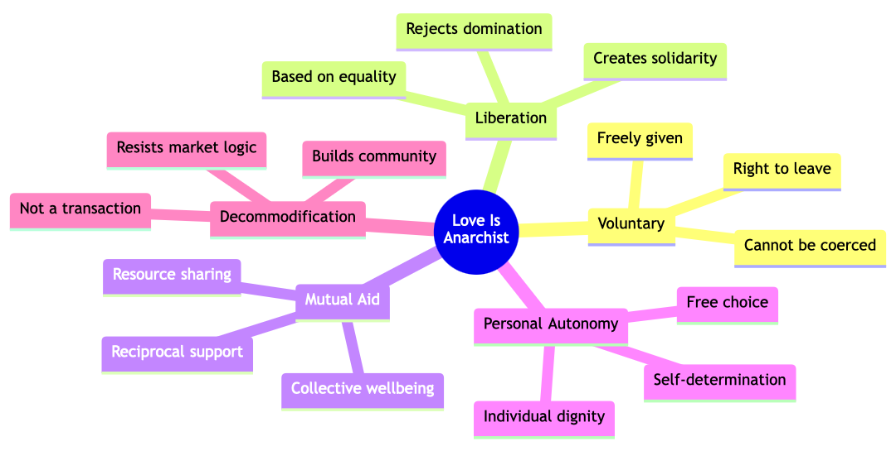
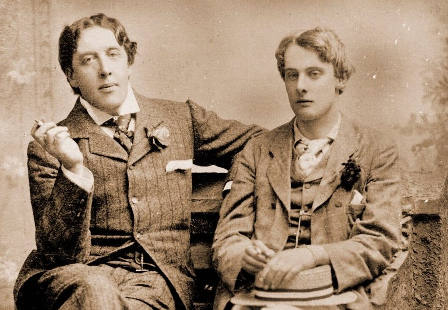

### Many A True Word Spoken In Jest

This article started as a joke. In a conversation with a friend I was making light of how a few right-wing commentators claim there is only freedom under capitalism, and I responded saying that idea was as absurd as believing that love can only exist under Anarchism. However, that has got me thinking ever since about where love might fit best within the spectrum of political ideologies.

When most people think about love, however, ideology doesn’t usually come into it. Even if they look for those who share the same outlook as them, there are other factors apart from this that are part of the initial spark, even if shared ideals may help sustain a relationship over time.

But ideologies do impact relationships, especially if those with the ideals have power to affect others. Ideological laws which may determine what kinds of adult relationships are favoured or even criminalised have long affected what kinds of love are seen as acceptable (such as restrictions on homosexuality in the past). While love can emerge in such harsh circumstances and even grow despite adversity, these constraints often place an immense strain on relationships.

But there are more subtle ways in which politics impacts our social lives, such as meeting and associating with others being effected by government monetary policies. As the cost of going out can determine where and if people meet up, what they do, and how long they can afford to spend when they get there.

### Love Is Anti-Capitalist

This leaves me wondering, ‘Is it possible that perhaps no other political and economic system is worse for love than capitalism?’ Under Capitalism everything that can be will be bought and sold and valued by its ability to produce a profit. Could this apply to romance too?

Sophia & Leo Tolstoy (author War & Peace) - together 48 years

As the Beatles song goes ‘Money can’t buy me love’. Love can do many things, but it cannot be extracted from someone like a mineral from a mine, nor can it be stolen by a thief like a necklace from a jewellery box. Yet capitalism attempts to commodify every aspect of human connection. Under this system, you can buy titillation, attention, and even simulations of passion - although these are mere substitutes for consensual love.1

We see this commodification everywhere: dating apps turning romance into a marketplace, subscription services promising connection through a screen, even the basic infrastructure of love locked behind economic barriers.

There are too many paywalls blocking authentic connection: the cost of ‘third places’ where people might meet naturally, the crushing weight of rent and mortgages that keep people trapped in bad situations or unable to build lives together, even the need to maintain employment and health insurance to ensure loved ones can receive medical care. Each of these represents another way capitalism places a price tag on social interactions and makes unfettered love more difficult to find and maintain.

### Love Is Free

In contrast with this, at its heart, love is free, it is not a property relationship. While we might poetically say ‘I'm yours’ or ‘I belong to you’, no one has the right to own another person. Conservatives try to force people into marriage and to stay even in bad marriages, as if trapping sunbeams in a box will help preserve them, even when the light is long gone. Even liberals focus on the legality of marriage, but the state's involvement does not define the strength of relationships.

Alex Comfort (author of Joy of Sex) & Jane Henderson - together 30 years

But what makes such voluntary association truly possible? At its core, it requires sincere consent - not merely the absence of force, but the presence of real choice and autonomy. This creates a virtuous cycle: Freedom to consent enables real choice, choice creates autonomy, and autonomy reinforces freedom.2

In contrast, capitalism and hierarchy corrupt consent through coercion and power imbalances. A partner dependent on shared housing might ‘agree’ to situations they would otherwise reject. Economic pressures, gender roles, and societal expectations create invisible constraints that limit self-determination. Even seemingly personal decisions in such circumstances become shaped by systemic pressures. Whereas, the dynamics of true consent require:

  * Personal autonomy.

  * Real alternatives and choices.

  * Freedom from social coercion.

  * Absence of exploitable power imbalances.

  * Ability to leave without facing destitution.

  * Protection from social isolation.

Just as workers under capitalism must ‘consent’ to exploitation to survive, people in hierarchical relationships often ‘consent’ to situations they would otherwise reject if given real freedom.3 This demonstrates how personal liberation is inseparable from broader social liberation, and points to why love itself naturally aligns with Anarchism.

### Love Is Anarchism

When we recognise that authentic love requires freedom from coercion, we see how our fundamental interconnection leads us to a crucial truth: Though our initial feelings may catch us unexpectedly, the act of sharing and nurturing love is always a voluntary choice. This element of free collaboration, of choosing to build something meaningful together without pressure to do so, aligns perfectly with Anarchist principles of mutual aid and voluntary cooperation.

Lucía Saornil & Mercè Guillén (Spanish Civil War) - together 34 years

Love might begin with attraction, but it deepens through shared understanding and mutual care. This is why ideologies that reject compassion and cooperation as weakness4, inevitably lead to isolation. While those who wall themselves off from personal ties - whether through fear, conditioning, or ideological belief - miss love's transformative potential.

The materially privileged often avoid truly understanding others' situations because it would demand confronting systemic injustice. Similarly, those who reject their need for others often do so from learned independence, building walls of false self-sufficiency that prevent heartfelt connection. Both responses serve capitalism's need to keep us separated and hierarchical.

While individual kindness and understanding cannot alone overthrow systemic oppression, they create spaces where love can flourish despite those systems. When we understand our shared social bonds and act with genuine care for others' wellbeing, we naturally resist hierarchy and move toward communal care and collective liberation.

Of course romantic love is just one form of love's transformative power. In all its forms - from friendship to community solidarity - love embodies anarchist principles: willingly given, based on mutual care, with the freedom to change or end relationships that no longer serve both parties. This broader understanding of love grows from our capacity for compassion and recognition of shared humanity. These aren't mere personal virtues, but essential aspects of how we form bonds with each other, even within oppressive systems.

True compassion isn't about pity or superiority. It means understanding that everyone's needs matter, that we find fulfilment through mutual understanding and support. It shows itself in practical ways - in sharing what we have, in standing together against hardship, in recognising that individual comfort means little while others suffer. When we see someone without housing while others hoard empty properties, compassion moves us toward action and sharing.

This is not about self-denial or insecurity, but honestly recognising that none of us exists in isolation. We need each other, we strengthen each other, we survive through cooperation. This understanding naturally conflicts with capitalism's demands for competitive individualism - how can we accept hoarding resources while others go without? How can we claim the right to rule over others when we understand our our collective reliance on one another?

### Love Beyond Capitalism

Imagine love unfettered by economic pressure and hierarchy. In a world built on community solidarity rather than exploitation, relationships could develop their full potential because:

  * Partners maintain individual autonomy while choosing to cooperate.

  * Material needs don't create dependency or force compromises.

  * Community support provides realistic alternatives.

  * Power imbalances can't be exploited for control.

  * Each person remains free to grow, change, and if needed, separate.

Emma Goldman & Alexander Berkman (Anarchist activists) - together 47 years

In this way, love doesn't just exist despite capitalism - it actively points the way forward. Every time people choose to support each other's freedom, to build relationships based on shared support rather than dependency, they create tiny pockets of liberation. These relationships show us glimpses of what's possible when we embrace authentic consent as the foundation for human intimacy.

Every truly consensual relationship becomes a small demonstration of ignoring or rejecting hierarchy - people choosing to build something together without compulsion, supporting each other's autonomy while maintaining their own. These moments of natural connection and mutual support aren't just personal choices - they're revolutionary acts that demonstrate another world is possible.

While we need each other, we must choose to act on that need freely. Though our initial feelings may catch us unexpectedly, the act of sharing and nurturing love is always a voluntary choice.

### Anarchism Is Love

When people tell me Anarchy is impractical, impossible and will never win, I respond by telling them it already does - often and in the most important ways. Love transcends capitalism's constraints. Love wins, keeps winning despite the odds. It wins every time people connect across artificial barriers of culture, class, and caste. It persists despite attempts to monetise it, to restrict it, to control it.

Sophia & Peter Kropotkin (author of Mutual Aid) - together 43 years

Every time people share resources without expecting return, support each other through hardship, or choose cooperation over competition, they're practicing Anarchism. Love shows us that human nature isn't inherently competitive or hierarchical - like water finding its level, humans naturally flow toward patterns of reciprocal care and freely chosen kinship when barriers are removed.5

Anarchism is realised when agreements are made willingly, when love and desire are not turned into commodities for sale, when the state isn't involved or contracted with.6 In the end, true Anarchism might simply be the universal application of love's principles: freely chosen association, communal care, the rejection of hierarchy and coercion, mutual growth without constraints, and the freedom to evolve together.

How do we build relationships that prefigure the world we want to see? How do we practice love as resistance? These questions of removing hierarchy and capitalism from our relationships deserve their own thorough examination, which I hope to address in a future article. For now, recognising love's inherently Anarchist nature reminds us that liberation is not just possible - it's already happening in every act of true love and solidarity.

Subscribe

[Share](https://peacefulrevolutionary.substack.com/p/love-is-anarchist?utm_source=substack&utm_medium=email&utm_content=share&action=share)

### Radical Romantic Films & Books

Looking for some radical romantic films to watch or books to read this weekend?

 **Films**

  *  **Salt of the Earth (1954)** – A working-class marriage evolves from patriarchal control to mutual respect amid a labour strike.

  *  **The Battle of Algiers (1966)** – A politically intense film about the Algerian War of Independence that contains an ultimately triumphant love story amidst the struggle for freedom.

  *  **Unrest (2022)** – A passionate love story between anarchist Peter Kropotkin and Sofia, set against political turmoil, where love triumphs despite revolutionary struggles

  *  **Matewan (1987)** – A subtle romance exists within a brutal coal miners' strike, overshadowed by class struggle.

  *  **Love and Anarchy (1973)** – Passionate yet doomed love between a prostitute and an anarchist plotting Mussolini’s assassination.

  *  **Land and Freedom (1995)** – A revolutionary romance grows in the Spanish Civil War, but political betrayal leads to loss.

  *  **Y Tu Mamá También (2001)** – A fleeting love triangle filled with youthful desire, self-discovery, and inevitable loss.

Oscar Wilde (author of Dorian Gray) & Alfred Douglas - together 7 years - imprisoned for their love

 **Books**

  *  **Love in the Time of Cholera – Gabriel García Márquez (1985)** – A lifelong, obsessive romance rekindled in old age.

  *  **The Night Watchman – Louise Erdrich (2020)** – A radical novel focused on Native American resistance and the triumph of love despite political and cultural struggles.

  *  **The God of Small Things – Arundhati Roy (1997)** – A forbidden love defies caste and convention, but societal oppression crushes it.

  *  **The Year of Love and Revolution – Rebecca Gordon-Nesbitt (2023)** – A romance entangled in the ideals and betrayals of revolution.

  *  **Vida – Marge Piercy (1979)** – Love and sex weave through radical leftist politics, but revolution erodes relationships.

  *  **Meridian – Alice Walker (1976)** – Love struggles to survive within the sacrifices of civil rights activism.

  *  **Half of a Yellow Sun – Chimamanda Ngozi Adichie (2006)** – Love, passion, and betrayal unfold amid the horrors of the Biafran War.

 _Note: I have primarily focused on monogamous relationships in this article, not because they are more valid or more important, but because they provide the clearest example of how capitalism and hierarchy affect even the simplest one-to-one bonds. While most of these observations apply equally to polyamorous and other forms of non-monogamous relationships - which can often demonstrate even more complex forms of voluntary association and mutual aid - those deserve their own thorough analysis rather than being addressed superficially here. The core principles of consent, autonomy, and rejection of hierarchy remain vital regardless of relationship structure._

1

While there's no judgment for those who provide or respectfully use services like OnlyFans - although the workers there deserve respect and fair compensation - purchasing attention is not the same as consensual shared love.

2

This concept is a theme I hope to return to in a future article.

3

I’m not judging personal consensual relationship dynamics which are freely entered into here, but addressing systemic power imbalances and economic coercion. The issue isn't personal choices in relationships, but rather the external pressures and dependencies that limit genuine freedom of choice.

4

See Incel philosophy or Randian ‘Objectivism’ for examples of this.

5

At least where insecurity due to artificial scarcity are removed.

6

Though people may legally marry for practical protections.
