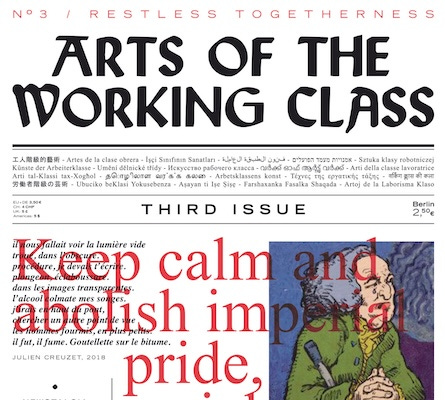
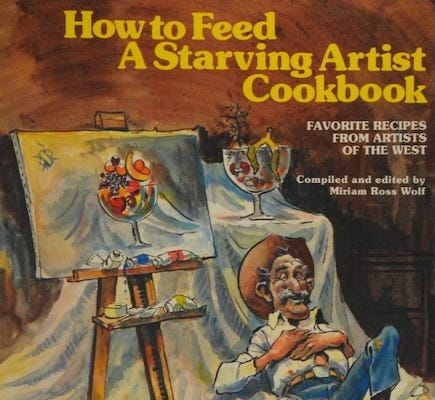
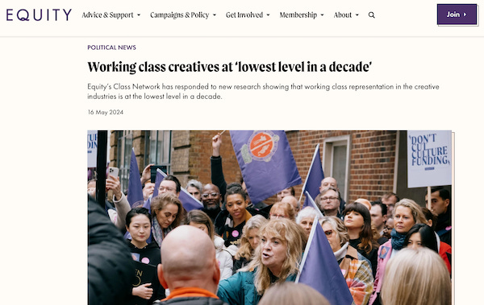
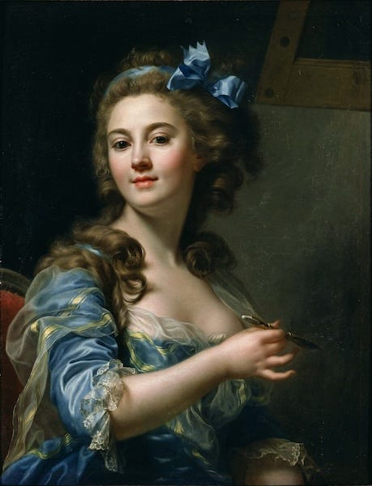

_This is the second in a series of video versions of ‘Reasons To Hate Capitalism’ produced by[Counter-Intuitive](https://audiopervert.substack.com/). _

Although movies and television are full of stories of regular working joes, putting in their hours, trying to support their families, until … they need to rob a bank to get by, or aliens attack, or they get super powers.

The truth is that the working class are often shut out of the arts and media. Ever wonder who writes those stories? It's mostly the upper class.

[YouTube Version](https://youtube.com/shorts/9DeE3F7W4qk)

If you come from the working class you are far less likely to make a living creating art and literature (including writing for, or acting in stage, film and television), which means that our art and entertainment is portrayed and written mostly (84%) by those who have little or no insight into the majority of working and marginalised people, and their lives. 

Why is this? Well, those who buy art and entertainment are more likely to consider and fund projects that they have a personal affinity for, and as they are mostly upper class those they interact with are more likely to be upper class too.

But, what is the effect of this? Undoubtedly concerns and issues related to the working class are overlooked or misrepresented, and the opportunities for people in these fields from working class backgrounds will continue to be rarer, and even when they ‘break through’ they are still having to usually meet the approval of those from the upper classes.

 **How would that be different in a world without Capitalism?**

Art wouldn't be firewalled by wealth or dependent upon rich patrons. The need to make money (or profits) for others - from making art - would not exist. 

The range and depth of art will better represent and entertain the communities the artists are part of, without having to compromise their visions to enrich the already rich.

 **Here's what you can do:**

Support your local poor playwrights, your local community drama1 \- suggest they tell some local and personal stories too (and that you’ll support them when they do).

Go see your local bands, performance poets, comedians, art exhibitions featuring local artists, and support them all financially if you can. 

If you make art yourself don't be afraid to challenge the system, and fight to have your authentic working class voice heard.

 _Ongoing ‘Reasons To Hate Capitalism’ quotes & memes are posted each weekday on [reasonstohatecapitalism.com](http://reasonstohatecapitalism.com)_

Not convinced that this is Capitalism’s fault? Read the ‘[What Is Capitalism](https://peacefulrevolutionary.substack.com/p/what-is-capitalism)’ series.

Subscribe

[Share](https://peacefulrevolutionary.substack.com/p/the-arts-are-a-rich-kids-club?utm_source=substack&utm_medium=email&utm_content=share&action=share)

[Give a gift subscription](https://peacefulrevolutionary.substack.com/subscribe?&gift=true)

## Further Solutions

Someone recently said to me ‘you have no answers to any of the problems’. I began to wonder if that were really true. I knew I had written some posts focused on solutions, but I started to worry that there wasn’t many, and that perhaps their purpose wasn’t as clear as I thought they’d been.

So below I’ve put together a list of articles I believe are focused on positive solutions to Capitalist and hierarchal problems:

  * [The Last Of Us town of Jackson](https://peacefulrevolutionary.substack.com/p/the-last-of-us-town-of-jackson) \- _Shows that communes can work even in difficult (albeit fictional) circumstances_

  * [Cake Vs Guns](https://peacefulrevolutionary.substack.com/p/cake-vs-guns) \- _Suggests a better approach to potential post-collapse survival_

  * [Reasons To Be Hopeful](https://peacefulrevolutionary.substack.com/p/reasons-to-be-hopeful) \- _Making a difference, if but a small one_

  * [Socialism An Introduction](https://peacefulrevolutionary.substack.com/p/socialism-an-introduction) \- _Why Socialism is a solution to Capitalism’s problems_

  * [Digital Pebbles](https://peacefulrevolutionary.substack.com/p/pebs) \- _A fictional alternative value / appreciation / needs system_

  * [Stateless Minds](https://peacefulrevolutionary.substack.com/p/stateless-minds) \- _A reprint of someone’s digital system for non-capitalist distribution_

  * [The Anarchist Jesus](https://peacefulrevolutionary.substack.com/p/the-anarchist-jesus) \- _What could be a more inspiring example?_

  * [The Plumbing Revolution](https://peacefulrevolutionary.substack.com/p/the-plumbing-revolution) \- _A story showing how dirty jobs can be done without coercion_

  * [A Guide For Prospective Tea Monks](https://peacefulrevolutionary.substack.com/p/a-guide-for-prospective-tea-monks) \- _How to set up a travelling listening and consoling service_

  * [Antillia's Utopia](https://peacefulrevolutionary.substack.com/p/antillias-utopia) \- _A couple days on a utopian island, including details of how it operates_

  * [How Anarres Works](https://peacefulrevolutionary.substack.com/p/how-anarres-works) \- _How Le Guin’s utopia works_

  * [Nemik's Anarchist Manifesto](https://peacefulrevolutionary.substack.com/p/nemiks-anarchist-manifesto) \- _Principles by which to overthrow an evil empire_

  * [Playing Pretend](https://peacefulrevolutionary.substack.com/i/145576028/lets-pretend-again) \- _Imagining a better possible world (second half)_

  * [An AI Anarchist Manifesto](https://peacefulrevolutionary.substack.com/p/an-ai-anarchist-manifesto) \- _A possible transition away from hierarchy and capitalism_

  * [A Better Future](https://peacefulrevolutionary.substack.com/p/a-better-future) \- _As it says …_ _Imagining a better future_

  * [Writing In An Anarchist Utopia](https://peacefulrevolutionary.substack.com/p/writing-in-an-anarchist-utopia) \- _A positive vision for how the arts could operate differently_

  * [Were we Born Evil Or Did Capitalism Make Us That Way](https://peacefulrevolutionary.substack.com/p/were-we-born-evil-or-did-capitalism) \- _Encouraging article showing what good things people are capable of_

  * [So You Are Living In A Dystopia, What Next?](https://peacefulrevolutionary.substack.com/p/so-you-are-living-in-a-dystopia-what) / [Resisting Oppression & Making Friends](https://peacefulrevolutionary.substack.com/p/resisting-oppression-and-making-friends) \- _Internal and practical resistance and encouragement_

  * [A Better World Is Possible](https://peacefulrevolutionary.substack.com/p/a-better-world-is-possible) \- _How a better world is possible now and aspects of it are already happening in some places_

  * [In Defence Of The Dispossessed](https://peacefulrevolutionary.substack.com/p/in-defence-of-the-dispossessed) \- _Explaining aspects of Le Guin’s utopian vision_

  * [I Pencil](https://peacefulrevolutionary.substack.com/p/i-pencil-the-true-story) \- _A plan of how to carry out complex production without Capitalism (2nd half)_

  * [Organising Without Rulers](https://peacefulrevolutionary.substack.com/p/organising-without-rulers) \- _A look at how healthcare could work without centralisation and hierarchy_

  * [A Free Society](https://peacefulrevolutionary.substack.com/p/a-free-society) / [Achieving Liberation](https://peacefulrevolutionary.substack.com/p/achieving-liberation) \- _A look at what the world needs to be free and what that will do for us_

  * [Love Is Anarchist](https://peacefulrevolutionary.substack.com/p/love-is-anarchist) \- _What can be a better solution to our problems than true love?_

Along with this many of my articles which focus on bringing attention to the problems with hierarchy and Capitalism also have sections (often toward the end) with suggestions for making the situation better, or are leading to sequel articles that address this. As you may have noticed above, my longer form ‘Reasons To Hate’ videos / articles now do this at the end too.

1

Especially if they are stuck performing well known musicals all the time, not that there is anything wrong with that if they like doing it and people like watching them, but …
