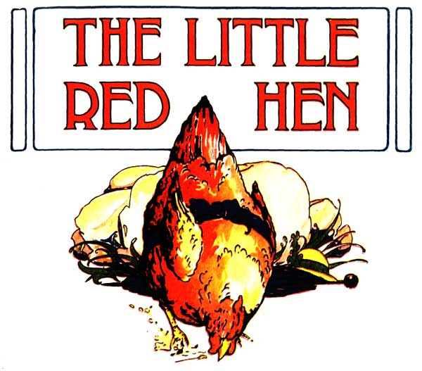
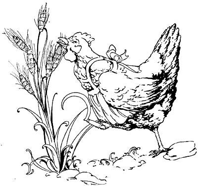
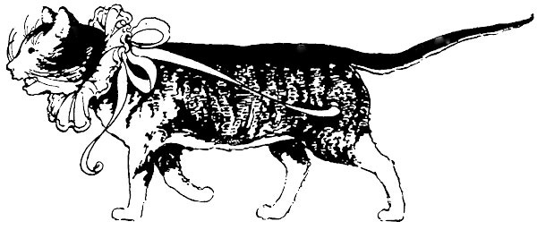
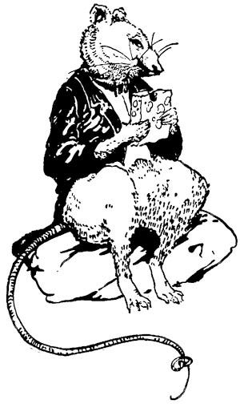
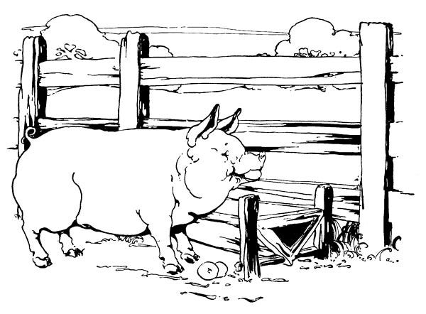
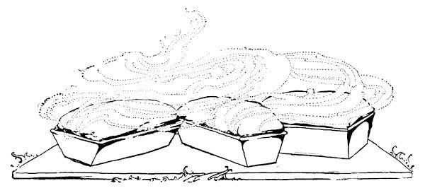
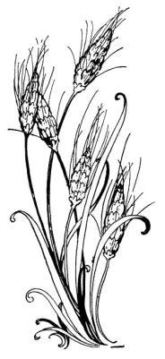
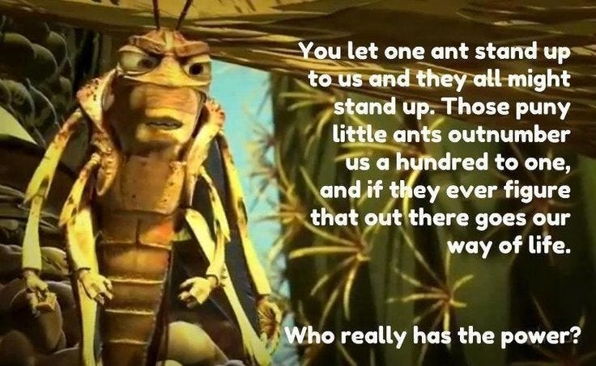

Children’s stories have long been used for political purposes - sometimes to scare them into obeying parents or authority figures, to teach moral lessons about work ethic and social values, or to reinforce cultural norms. Throughout history, these stories have been updated for modern audiences, often shifting their meanings to reflect contemporary social values and political ideologies.

A prime example is the story of the grasshoppers - as seen in Pixar’s ‘A Bug’s Life’ - which subverted Aesop’s original fable ‘The Ant and the Grasshopper’ being retold to explore themes of collective resistance against exploitation, rather than the original’s message about individual work ethic and preparation.

One such tale that has often been used for political purposes, is the story of The Little Red Hen - an old Russian folk tale that became popular in English-speaking countries through Florence White Williams’ ‘The Little Red Hen: An Old English Folk Tale’ (1911) and subsequent retellings, such as Walt Disney’s 1934 animated short film version.

The tale is particularly interesting from a political perspective because it has been used to promote various ideological positions - from capitalist individualism to the dangers of communism, depending on the telling and interpretation.

In the original tale of the Little Red Hen, she keeps asking her farmyard neighbours to help with each step of making bread, from planting a grain of wheat she’s found to the final baking. Each time she asks ‘Who will help me?’ and each time the other animals refuse, saying ‘Not I.’ The story shows this pattern repeating through planting, harvesting, milling, and baking, emphasizing how Little Red Hen does all the work alone.

The tale reaches its climax when the bread is finally baked and smelling delicious. Suddenly, as the story tells us, ‘All the animals in the barnyard were watching hungrily and smacking their lips in anticipation’ - but Little Red Hen refuses to share with those who wouldn‘t help her work. 

This version teaches children that rewards should only go to those who contribute labour, and reinforces the idea that help must be ‘earnt’, or at least that is how it has often been interpreted and retold. During the Cold War this tale was used to contrast capitalism with ‘communist’ sharing, to promote self-reliance over government welfare, and to emphasise the need for private property rights. However, in my opinion there are serious problems with this narrative:

  1. It assumes individualistic rather than communal production.

  2. It ignores why others might not be able to help:

    1. Maybe they were doing other necessary work.

    2. Maybe they were caring for others.

    3. Maybe they were sick or elderly.

  3. It promotes idea that food should be denied to those who don‘t work.

  4. It Presents false choice between complete laziness and individual work

  5. It ignores reality of how communities actually usually function.

  6. It teaches children harmful lessons about withholding basic needs.

Stories can be powerful tools for uncovering truth as well as obscuring it. While researching these political retellings, I discovered something remarkable - the chance to learn what really happened in that farmyard so many years ago. Though the Little Red Hen herself was unavailable, busy with her lucrative speaking circuit, I was fortunate enough to meet the Wise Old Owl who had witnessed it all firsthand, and who was able to give me the original story as he witnesses it, which I can relate to you here.

## The Little Red Hen: The True Tale

You have to remember that back in those days the farmer, who always feared us rising up against him if we co-operate together, tried to tell us that every animals should focus on and look after themselves, and some animals took that to heart, such as the Little Red Hen.

However, when she found herself a tiny wheat seed and wanted to plant it she saw that her little feet were not ideal for the task and so she asked, ‘Who will help me plant this seed?’

‘Not I,’ said Cat, who was actually quite good at digging, but was busy catching mice at the time.

‘Not I,’ said Pig, who knew all about growing things, but was already working on tilling some soil for vegetables.

‘Not I,’ said Rat, who was clever with tools, but was occupied mending one that was broken.

‘Then I shall do it alone,’ said Little Red Hen, feeling rather proud but also very tired before she‘d even begun.

But when I saw her struggle with the heavy spade, I flew down from my perch.

‘Little Red Hen,’ I said gently, ‘may I ask you something? Where did you get that spade?’

‘Why, it’s always been in the barn,’ said Hen.

‘Actually,’ said Mouse, scurrying up, ‘my great-grandparents helped make it. The wood came from trees Beaver’s family felled, the metal was mined by Mole’s ancestors, and it was forged by Badger’s uncle.’

‘And who taught you about planting?’ I asked.

‘My mother,’ said Hen. ‘And she learned from her mother, and...’

‘So you‘re not really doing it alone at all,’ I pointed out. ‘You‘re using tools others made and knowledge others shared.’

Just then, Fox slunk by the fence. Everyone tensed, but I reminded them, ‘Even our need to watch for Fox shows we‘re stronger together. One hen alone would be an easy target.’

Dog, who had been quietly guarding everyone, nodded in agreement.

Little Red Hen looked thoughtful. ‘But I was always taught that if others don‘t help, they shouldn‘t share the reward.’

‘Let me ask you something,’ I said. ‘While you‘re growing wheat, who’s watching for danger? Who’s maintaining the barn where you‘ll store it? Who’s fixing the mill where you‘ll grind it? Who’s teaching the chicks? Who’s keeping our water clean?’

Hen looked around the farmyard with new eyes. She saw Cat catching mice that would eat the grain. She saw Pig turning soil in the vegetable garden that fed them through winter. She saw Rat carefully mending tools everyone used.

‘I think,’ said Hen slowly, ‘I was taught wrong. We‘re all already helping each other, aren‘t we? We just didn‘t see it.’

‘Exactly!’ I hooted. ‘Some can grow food, others can build, others can teach, others can protect. When we share our different skills, everyone has enough.’

‘But,’ said Hen, still puzzling it out, ‘what about those who say we must make others prove they deserve help?’

I gestured to a nest of baby mice. ‘Do they need to prove they deserve to eat? Or your own chicks - do they need to earn their mother’s care?’

‘Of course not!’ said Hen firmly.

‘Then why should we treat each other any differently? We all need help sometimes. We all have something to give sometimes. That’s how a community works.’

So Little Red Hen called out again: ‘Who will help plant this seed?’

This time, Pig offered his farming wisdom, Cat volunteered to mind the chicks while others worked, and Rat brought the tools he‘d carefully maintained. Some animals dug, others watered, and others kept watch.

Through the seasons they all helped as they could. Some built fences, others stored grain, others kept predators away. When the bread was finally baked, everyone celebrated together.

‘This is more than just bread,’ said I, as everyone enjoyed their shares. ‘This is what happens when we stop pretending we can - or should - do everything alone.’

‘And it tastes much better shared,’ said Little Red Hen, watching her chicks play with Cat’s kittens and Mouse’s babies.

From that day on, the farmyard animals remembered that every task contained the work of many paws, wings, and hands - past and present. They learned that different skills were all important, that helping wasn‘t just about the immediate task, and that taking care of each other made everyone stronger.

And when animals from other farmyards asked about their secret to having enough for everyone, they shared that story too. Yet somehow the humans have got an entirely different story, with the opposite message of everything that happened that day. 

_This left me wondering, ‘How did this story turn into the very different one that is often told since?’_

### Differences From Fairy Tale Version

In the true version of the story just told, it is obvious that the traditional narrative has been deliberately inverted. While the original tale serves the interests of those in power, this version shows that it was the farmer was afraid of the animals working together.

While the original tale presents the other animals as lazy or unwilling to help, this version shows them already engaged in essential communal work, and reframes their ‘Not I‘ responses from selfishness to being actively engaged in other necessary labour.

In this more accurate version The Wise Old Owl serves as a mentor figure who helps deconstruct the individualistic message by pointing out:

  * The inherently collective nature of tools and knowledge

  * The invisible labour that makes individual work possible

  * The necessity of mutual protection and shared responsibilities

  * The false dichotomy between ‘deserving‘ and ‘undeserving‘ recipients of help

Ultimately, the moral is completely transformed from ‘those who don't work don't eat‘ to ‘different skills were all important, that helping wasn't just about the immediate task, and that taking care of each other made everyone stronger.’

### The Origins Of The Famous Story

While this tale has been told countless ways over the years, its journey from folk wisdom to political parable is particularly telling. When this story was first told in English, the England of the time was still an empire, it was the world’s largest capitalist power, but America was nipping at it’s heels and ready to bruise it’s pride, so stories were needed to justify its colonialism, its treatment of peasant workers at home, and its emerging industrial capitalist system that was transforming rural communities into urban workforces.

The Little Red Hen’s transformation into a parable of individual industry served multiple ideological purposes. It justified the exploitation of colonial subjects by suggesting that wealth came purely from individual effort rather than systemic exploitation. It reinforced the Protestant work ethic that was so crucial to early industrial capitalism, implying that poverty was a moral failing rather than a structural necessity. And perhaps most importantly, it discouraged collective organisation among workers by promoting the idea that self-reliance was morally superior to mutual aid.

This version of the tale gained particular traction during the Victorian era, when children’s literature was increasingly used to instil 'proper' moral values - which conveniently aligned with the needs of factory owners and colonial administrators. The story's simple message that those who don't work shouldn't eat provided a convenient moral justification for everything from the Poor Laws to colonial resource extraction.

The transformation of this simple farmyard tale into a moral cudgel against the poor reveals how even children’s stories can be weaponised to serve power. But this was not the end of the Little Red Hen’s journey through political history. In Part 2, we'll explore how this tale found new life in the 1970s as a cornerstone of Reaganomics, and hear what happened when the Hen herself was finally confronted by the other animals about her increasingly dubious claims of self-made success.

Subscribe

[Share](https://peacefulrevolutionary.substack.com/p/the-true-story-of-the-little-red?utm_source=substack&utm_medium=email&utm_content=share&action=share)

 _If you liked that story you might like this one:_

### Capitalism Series

If you liked this consider reading more of my [series on Capitalism](https://peacefulrevolutionary.substack.com/about#§capitalism-series)

