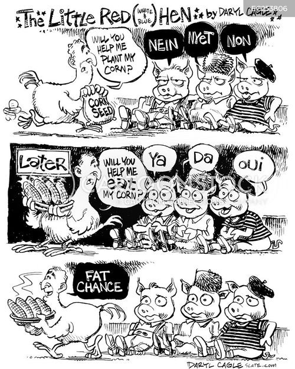
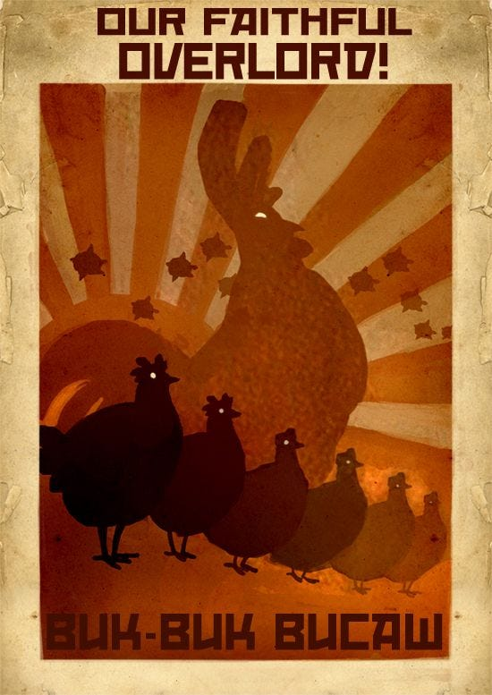
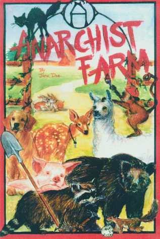

In _**The True Story Of The Little Red Hen**_ , we explored how a simple Russian folk tale about cooperation became transformed during the Victorian era into a story promoting individualism and conditional charity. But perhaps the tale's most dramatic transformation was yet to come.

This is how it became a story often told by Ronald Reagan and Margaret Thatcher to justify cutting social services and promote the myth of ‘welfare queens’ and ‘scroungers’, to put the responsibility for poverty onto the poor themselves rather than systemic inequality, and to promise that unfettered free-market capitalism would reward hard work while conveniently ignoring inherited privilege and structural barriers.

### Reagan’s Dubious Hen Story

The story was a cornerstone of Reagan’s speeches in the 1970s and aligned with his conservative economic philosophy. In his version he transformed the traditional tale of industriousness and consequences into a pointed political allegory. The story begins familiarly with the little red hen finding wheat and seeking help, but quickly incorporates modern labour and welfare themes. The animals' refusals shift from simple laziness to specific references to union rules, welfare benefits, and unemployment compensation. For example, the cow claims ‘Out of my classification’ and the goose protests ‘I'd lose my unemployment compensation.’

The climax diverges sharply from the traditional moral when government intervention forces the hen to share her bread despite having done all the work herself. The story's most pointed moment comes when Reagan explains, ‘That's the wonderful free enterprise system. Anyone in the barnyard can earn as much as he wants, but under our modern government regulations the productive workers must divide their product with the idle.’ The story concludes with a distinctive conservative message about the disincentive effects of redistribution policies, as the hen never bakes bread again, though she ironically claims ‘I am grateful, I am grateful.’ _What a load of rubbish!_

The tale proved particularly useful during the dismantling of post-war social programmes. Its simple narrative — that success comes purely from individual effort and that sharing should be conditional on contribution — provided a perfect framework for attacking collective institutions. The unions were cast as the ‘lazy‘ animals, wanting to share in profits without (supposedly) contributing. The welfare state was portrayed as enabling dependence, much like the animals who wouldn't help with the bread but wanted to eat it.

Thatcher's famous declaration that ‘there is no such thing as society’ echoes the Little Red Hen's initial mindset of individual achievement, while Reagan's ‘welfare queen’ rhetoric painted recipients of public assistance as the greedy animals demanding bread they hadn't helped bake. The story's message that rewards should be strictly proportional to visible labour conveniently ignored all the invisible support systems - from public education to infrastructure - that made individual success possible.

The contrast between this origin story and what really happened in the true version _(shared in the last article)_ could not be starker. Yet the question remains how had the original story become so different over time.

Upon returning to the farmyard years later, I discovered an even more remarkable story. The animals, incensed at the tales the Hen had been telling for profit, had called a meeting in the barn. I was fortunate enough to witness what transpired:

### What Really Happened

The Wise Old Owl perched atop a hay bale, looking every bit the judge presiding over his court. As he called the meeting to order, I noticed all the farmyard animals had gathered, their attention fixed on his weathered form.

He began by calling forth the Little Red Hen - though after years of prosperous living, the word 'Little' hardly suited her anymore. She waddled her corpulent form to the front where all could see her.

‘I would like you to share with your fellow farm animals the story you've been telling across the world,’ the Owl requested, his voice carrying the same gentle wisdom I remembered. ‘I think they'd find it most interesting.’

The Hen seemed eager to oblige, launching into the tale she'd grown accustomed to telling at corporate conferences - the story that had since been adapted into countless children's books. She spoke of how she'd built a bakery empire from nothing but a single wheat seed, without help from anyone.

The animals who had known her their whole lives listened in mounting disbelief. When she concluded with, ‘And to think I started with nothing but a wheat seed I planted myself,’ the barn erupted in what I can only describe as the animal equivalent of raucous laughter.

Through it all, the Hen remained unperturbed, her beak held high with practiced dignity.

When the collective mirth subsided, Old Mouse stepped forward. His whiskers trembling with age and indignation, he reminded everyone how the Hen had actually inherited a small but well-equipped bakery from her grandmother - complete with ovens that the whole community had helped install.

‘I worked entirely alone,’ the Hen declared, her voice carrying the rehearsed certainty of a oft-repeated line.

Around the barn, I watched as those who knew better reacted. Cat, who'd spent years protecting the grain stores from rodents, twitched her whiskers thoughtfully. Dog, who'd kept nightly vigil over the bakery, raised a skeptical eyebrow. The Beaver family, who'd maintained the water wheel powering the mill, simply shook their heads in quiet disbelief.

‘Nobody helped me,’ the Hen insisted again, louder this time.

‘Curious,’ the Wise Old Owl interjected, his voice carrying that same gentle wisdom I remembered. ‘Because I distinctly recall teaching your chicks while you baked. And wasn't it the community who built the roads you use for deliveries? Who maintained the bridges? Who ran the fire brigade that saved your bakery during last summer's heat wave?’

The Hen shuffled her feet, suddenly finding the barn floor fascinating.

‘And,’ the Owl continued, his words measured and clear, ‘wasn't it the community's health inspector who spotted that dangerous wiring before it could cause a fire? The same community whose building regulations ensured your roof withstood last winter's heavy snow?’

As I pieced together the story from various animals’ accounts, it became clear that something had changed as the Hen's bakery grew successful. She began to forget her roots, dismissing worker protection rules as ‘unnecessary red tape.’ When Duck developed wing strain from carrying overloaded trays, she called safety regulations ‘excessive.’ When Pig fell ill from endless night shifts without breaks, she dismissed workers' rights as ‘burdensome.’

The transformation continued: she began charging exorbitant fees for apprenticeships, ensuring only the wealthiest families could afford to learn baking. When other animals attempted to start their own bakeries, she would systematically undercut their prices until they failed, only to raise her prices even higher afterward.

Before long, she controlled most bakeries across several farmyards, proudly declaring, ‘This proves that hard work alone brings success’ - conveniently forgetting the community that had helped her start.

But the other animals remembered. They remembered how things had worked better in the days of mutual support and cooperation. So they organised, coming together to demand change.

(The full story of their successful strike would fill another chapter entirely, but through collective action and unwavering solidarity, they won significant changes.)

Together, they established new rules for the farmyard. Every worker was guaranteed safe working conditions and proper rest breaks. The community maintained paths and bridges for everyone's use, ensuring deliveries could reach all corners of the farm. They created an apprenticeship programme where any young animal could learn baking, regardless of their family's means. Most importantly, they developed a fair system where everyone — including the successful bakeries — contributed to the services they all relied upon.

‘But this is outrageous!’ Hen protested, her feathers ruffling with indignation. ‘How can anyone run a proper business with all these restrictions?’

The Wise Old Owl's gentle smile carried years of patience. ‘The same way you began - as part of a community. These guidelines aren't meant to stop you baking bread. They ensure everyone has the chance to earn their daily bread, not just a privileged few.’

‘But I earned everything myself!’ Hen insisted. As I watched her, I couldn't help but wonder: had she told this version of events so many times she'd begun to believe it herself? Or perhaps, as some animals suggested, had years of speaking at corporate events gradually reshaped her memories?

The Owl's questions came in measured succession:

‘Did you build the roads yourself?’

‘Or maintain the water supply?’

‘Or run the fire brigade?’

‘Or train new bakers?’

‘Or keep everyone safe?’

Each question landed with quiet precision, met only by the Hen's growing silence.

‘You see,’ the Owl continued, his voice carrying throughout the now-hushed barn, ‘success isn't merely about working hard - everyone here works hard. It's about recognising that none of us can achieve anything truly meaningful alone. These expectations aren't punishment for success; they're the foundation that gives everyone a fair chance to succeed.’

### The Co-operative Farmyard

As I continued visiting the farmyard over the following months, I witnessed a remarkable transformation. The Hen's bakery remained successful, but it was no longer alone. New bakeries flourished, each bringing their own special recipes and techniques. Workers moved with the confidence of those who knew their health and safety were protected. Young animals from all backgrounds learned the craft of baking, bringing fresh ideas and energy to the trade.

During my final visit, I found the Wise Old Owl watching a group of young animals - a diverse mix from all families - learning to knead dough together.

‘The funny thing is,’ he mused, his eyes twinkling, ‘we're producing more bread now than when the Hen had her monopoly. It turns out that when everyone has a fair chance, we all rise together.’

And this, I discovered, was the true story - not just of The Little Red Hen, but of how any society functions when it works as it should. The lessons from that farmyard remain relevant today:

That no one truly succeeds alone, even when they believe they have. That mutual aid and cooperation create more prosperity than ruthless competition. That collective memory is a powerful weapon against those who would rewrite history to serve their own interests. That when we recognise our interdependence, we can build systems that benefit everyone, not just a privileged few. And perhaps most importantly, that the stories we tell about success and failure shape how we treat each other - so we must ensure we tell the true ones, not just those that comfort the powerful.

As I left the farmyard for the final time, I couldn't help but wonder how many other such tales have been twisted to justify greed and celebrate so-called rugged individualism, when they once taught us about cooperation and community. Perhaps it's time we revisited more of them, and remembered their real meanings.

Subscribe

[Share](https://peacefulrevolutionary.substack.com/p/capitalist-fairy-tales?utm_source=substack&utm_medium=email&utm_content=share&action=share)

 _You might also like this article looking at how the life of pencil would be different without Capitalism:_

### Capitalism Series

If you liked this consider reading more of my [series on Capitalism](https://peacefulrevolutionary.substack.com/about#§capitalism-series)
