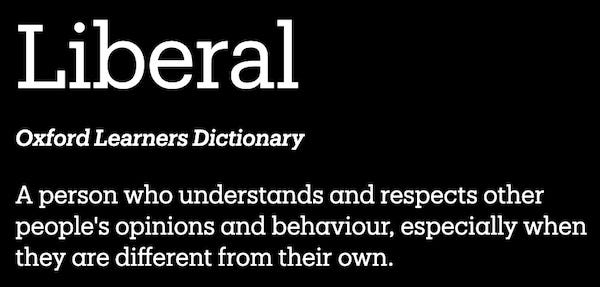
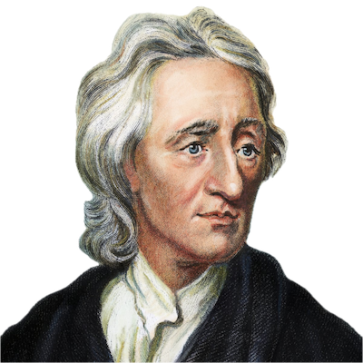
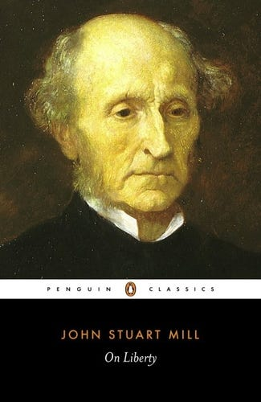
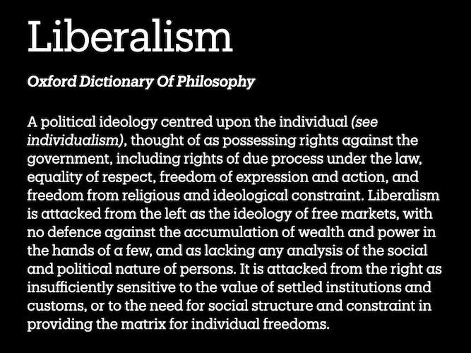
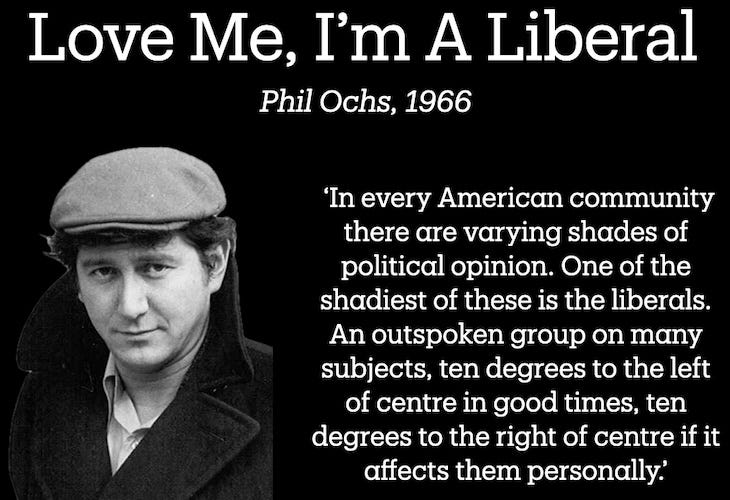

_What’s In A Word is a monthly vidcast series on frequently misunderstood political and philosophical terms. Except when it is trying to be humorous it strives to be accurate and informative. The previous article in this series was on[Conservatism](https://peacefulrevolutionary.substack.com/p/what-is-conservatism)._

Liberals. Love ‘em. Hate em. What are they anyway?

Once upon a time the word Liberal meant unprejudiced, generous, especially when it came to giving - it was synonymous with kindness and broadmindedness, but also sometimes had the negative connotation of being free from restraint or reckless or even licentious.

But Liberals have always come in many kinds -

  * There are socially liberal Liberals - the typical ‘bleeding heart’ Liberals.

  * There are socially conservative Liberals - usually just called Conservatives. _(Really! Conservatism is a liberal ideology)_

  * & There are even Neo-Liberals - fiscal conservatives who may (or may not) be socially liberal.

Confused? - I'll try and make it all a little bit simpler.

### Liberal Philosophers

Hey, so you know that philosopher John Locke? Yes? No? Well, he was kind of a big deal when it came to Liberalism. He invented it. He had this idea that everyone has a right to life, liberty, and property, and that the government can't just go around violating those rights. He also came up with this notion that the government needs the people's consent to be legitimate, and that the church and state should be separate. Which was pretty radical back in 1690.

Fast forward to the Glorious British Revolution of 1688, the American Revolution of 1776, and the French Revolution of 1789. The leaders of these movements used Liberal ideas to justify overthrowing the monarchy. Liberal theorists such as James Madison and Montesquieu conceived the notion of separation of powers, a system designed to equally distribute governmental authority among the executive, legislative and judicial branches. But not everyone liked it, and so conservatism was born a year later.

Liberals (from Adam Smith - the capitalism guy - to John Stuart Mill - the Utilitarianism guy) saw liberty as the freedom from interference by the government and other people. They believed that everyone should have the freedom to develop their own unique abilities without others getting in the way. Mill even wrote this famous book, ‘On Liberty,’ where he said, ‘the only freedom which deserves the name, is that of pursuing our own good in our own way.’

### Liberals & The Left & The Right

Liberalism was and is an individualist philosophy, and came with the concept of fundamental individual rights, but was also created hand in hand with the advent of capitalism. It justified Liberalising wealth - not Liberally giving it away - but opening up the means by which people obtain it.

Now this is where Liberalism parts ways with Socialism and those on the left of the political spectrum. Socialists are wary of commercial property, commercial profits, and the amassing of wealth, as well as being suspicious of people ruling over others, even if they are voted in and promise to represent the majority.

Whereas the philosophy of individualism has traditionally been on the centre-right of the political spectrum - economically and in terms of power dynamics. Maybe to the left of conservatives, but definitely to the right of Socialists.

However, in America especially Liberalism has come to be associated with the left because:

  * There is no popular left party in America (at least not one with politicians) - just a more socially liberal Democratic party.

  * As the more right wing Republican party has become more socially conservative it has dropped the liberal label - although embracing neoliberalism as an economic philosophy.

  * The Democratic party hasn't minded being associated with the term liberal - whilst still being a neoliberal party themselves.

It was in the 1970s that America and England began to move away from traditional Liberalism toward neoLiberalism, a term first applied to Augusto Pinochet's Chilean dictatorship, which was put in place with help from American economists like Milton Friedman.

These are some of the reasons why many Socialists hate being called Liberals. Because they are not & because Liberalism in that sense is against their core beliefs, even though they may share some socially Liberal values.

### A Liberal Is Not A Socialist!

But a Liberal is not a Socialist - I repeat a Liberal is not a Socialist, except in the fevered imaginations of those who don't understand political philosophy.

Therefore, even though Liberalism brought some positive reforms, the left rejects Liberalism as a philosophy, as Liberalism is built upon some assumptions that undermine it's potential for making major structural and societal changes. So they see Liberals as being in the way of the revolution.

The popular 60's folk singer Phil Och's summarised this problem in his song, ‘Love me I'm a Liberal’, in which he sung, 

Text within this block will maintain its original spacing when published
    
    
    Once I was young and impulsive
    I wore every conceivable pin
    Even went to the socialist meetings
    Learned all the old union hymns
    But I've grown older and wiser
    And that's why I'm turning you in
    So love me, love me, love me, 
    I'm a Liberal.

### Better Words?

So, since the word Liberal is so misused and misunderstood, what other words might we use? Here are a few suggestions:

  *  **Ameliorist** \- Seeking to improve conditions without addressing root causes.

  *  **Incrementalist** \- A preference for gradual, step-by-step change.

  *  **Reformocrat** / **Moderatist** \- A preference for reform over revolution.

But we also should remember that they are also Individualists and Institutionists.

& Next time we'll be talking of the self-professed enemy of Liberals everywhere (if you ignore the word's history): Republicans!

 _Video source: The Crowd, King Vidor, 1928._

Subscribe

[Share](https://peacefulrevolutionary.substack.com/p/what-is-liberalism?utm_source=substack&utm_medium=email&utm_content=share&action=share)

You may also find this article interesting:
