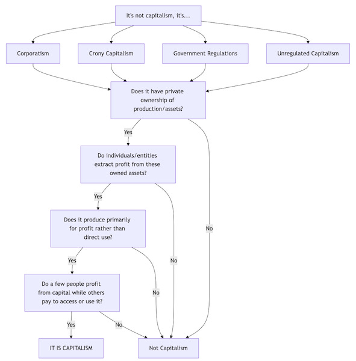
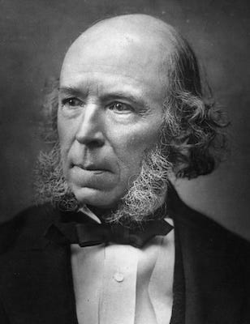
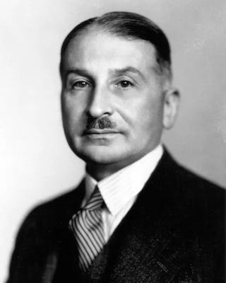
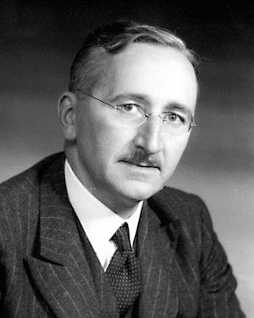
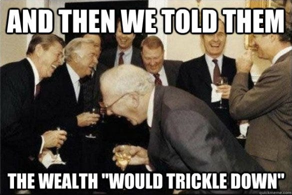

## Real Capitalism

It is quite common, when criticisms of Capitalism are made, to hear someone make one of the following claims in response:

That’s not _real_ Capitalism it’s …

  * Corporatism

  * Crony Capitalism

  * Government Regulations

  * Unregulated Capitalism

  * Socialism / Communism

It is true that people have different ideals that they associate with Capitalism, beneficial outcomes that they believe it can and should be fulfilling, and which they feel corporations, or the state, or regulations (or lack thereof) get in the way of.

There is, however, a word for the type of Capitalism which is imperfect, less than ideal, or hampered by government or corporations: Capitalism.

Whether perfect or imperfect; ideal or less than that, it is still Capitalism. If there is Capital, and a few people profiting from it, and other people have to pay to access it, then it is Capitalism, even if it doesn’t meet some people’s ideals.

> ‘What they call “crony Capitalism” is not some deviation from Capitalism; it is Capitalism working precisely as it must and always has.’ _(Michael Parenti, Against Empire, 1995)_

The question of whether Capitalism would be better if it were free from impediments like regulation or corporate domination is different discussion. Historical examples of unregulated Capitalism don’t show good outcomes for workers. On the other hand, when Capitalism has been reigned in by lawmakers, such regulations are ultimately watered down or removed for the benefits of Capitalists by the politicians they influence.

This pattern reveals a convenient strategy: everything good done under Capitalism is attributed to Capitalism itself, while everything bad done under Capitalism is dismissed as somehow departing from ‘real’ Capitalism. By this logic, nothing being criticised as bad can ever be real Capitalism. 

It's a game of shifting goalposts. Set wide enough to let through any attempt supporting capitalism, yet instantly narrowed to block any criticism from passing through, of even its most idealised version. This resembles the classic ‘No True Scotsman’ fallacy. We might call it the ‘Duck Test’ for Capitalism:

  * Does it look like a duck? (Does it have private Capital?)

  * Does it act like a duck? (Does it use private Capital to generate profit?)

  * Then it is a duck. (Then it is Capitalism.)

But none of the idealistic scenarios for Capitalism I’m aware of remove the hierarchal and political influence aspects of it. I hear people protest that Capitalism is neither hierarchal nor political, but my question to pro-Capitalists in response is this, ‘ **Do you really believe that someone with a great deal of wealth will have no significant influence over others, especially politicians and their political system?** ’ _[Ed: Consider the lobbying effort behind something like Citizens United.]_

The traditional and historical [definition of Capitalism]() refers to an economic system characterised by private ownership of the means of production, profit seeking as the primary motivation, wage labour, a price system, and commodity markets. This definition emerged in the mid-19th century and was first used and popularised by Socialists to precisely describe the economic transformations taking place in industrialising societies — transformations that represented a distinct break from previous economic arrangements.

When defenders of Capitalism respond with ‘You Socialists may have invented the word Capitalism, but you don't know what it means!’ they reveal a profound historical irony. The term was indeed coined and popularised by Socialists, but it was meant descriptively, not negatively. What matters is not what Capitalism means to someone personally, even to a group of people who share the same idealised vision. What matters is what it means historically, in reality, and in practice throughout the world.

## Redefining Capitalism

Many pro-Capitalists, however, consider this an insufficient definition of Capitalism — one that focuses on how the system works rather than what they regard as its benefits. This brings me to the other most common kind of response I receive when I criticise Capitalism: pro-Capitalists picking out what they consider to be a positive benefit they associate with Capitalism in order to defend it, one which they believe I would be silly to object to. This is usually in form of one of the following:

  * ‘Capitalism is just human nature, it has always been around, it is just some working harder and succeeding, and some being lazy and failing, and who are we to get in the way of what is natural?’

  * ‘Capitalism is just money, it’s convenient, you don’t want to go back to trade and barter do you?’

  * ‘Capitalism is just property, it is just what we own, and don’t each of us have a right to own something for ourselves and to sell it to others?’

  * ‘Capitalism is just freedom, without it there is no freedom, so why are you against freedom?’

  * ‘Capitalism is just trade and free markets, it’s people freely exchanging goods, and we’ve always had markets, what’s wrong with having more to choose from?’

  * ‘Capitalism is just competition, it’s a natural part of life, it helps people and things get better, it’s just someone making or offering something of value to someone else, don’t you enjoy the benefits of that competition? Why shouldn’t people be allowed to provide such a service?’

  * ‘Capitalism is the best worst system we have, all others are much worse, so for all it’s imperfection it does the best for the most people, so why would you risk replacing it with something that has tried and failed or hasn’t been tried at all?’

All of these are relatively new arguments, which first began to be heard between the 1930s-50s and ever since. Prior to this, most economists focused on the mechanics of Capitalism, rather than attaching ideals to it. A few Socialists used the word to criticise the financial system, but the average person didn’t use the word at all, focusing instead on how the economy affected them personally.

I want to look at each of these arguments, but first I’d like to look at what the origins for these claims are and who introduced them to the public.

## The Redefiners

### The ‘Natural’ Argument for Capitalism, Herbert Spencer & Social Darwinism

Some defenders of Capitalism argue that ‘ **Capitalism is just human nature, it has always been around, it is just some working harder and succeeding, and some being lazy and failing, and who are we to get in the way of what is natural?** '

One of the first proponents of Capitalism for ideological reasons was Herbert Spencer (1820-1903), the Social Darwinist and defender of eugenics. He didn't use the word ‘Capitalism’ itself as it wasn't in common usage at the time, but instead referred to ‘industrial society,’ and ‘the regime of contract.’ Spencer championed unfettered markets and minimal state intervention as the natural evolutionary outcome of human society.

Spencer saw poverty as a social failing and prosperity as a sign of good character, even good breeding. In his view, economic classes reflected biological differences between humans, with the wealthy demonstrating superior adaptation to social conditions:

> ‘The poverty of the incapable, the distresses that come upon the imprudent, the starvation of the idle, and those shoulderings aside of the weak by the strong... are the decrees of a large, far-seeing benevolence.’ _(Social Statics, 1851)_

Later, American Social Darwinist William Graham Sumner (1840-1910) promoted and popularised similar ideas through his influential essays and lectures. He extended Spencer's framework to the American context, arguing that millionaires were ‘the product of natural selection’ and that poverty was the natural consequence of biological inferiority. Sumner insisted that ‘the drunkard in the gutter is just where he ought to be’ and that attempts to provide social welfare would degrade the evolutionary fitness of society as a whole.

Neither Spencer nor Sumner made the claim that Capitalism was anything but a relatively new system in human history, although they felt it reflected old divisions of those with ‘better breeding’ versus what they dismissively termed ‘the swinish multitudes.’ Their arguments served to naturalise what was in fact a new economic arrangement. As Spencer explicitly stated:

> ‘This survival of the fittest, which I have here sought to express in mechanical terms, is that which Mr. Darwin has called 'natural selection', or the preservation of favoured races in the struggle for life.’ _(Principles of Biology, 1864)_

These early justifications for Capitalism through Social Darwinism and eugenics have since been thoroughly debunked as both racist and anti-scientific. Modern evolutionary biology and anthropology have demonstrated that cooperation, not ruthless competition, has been the primary driver of human evolutionary success. The application of Darwinian concepts to social organisation represents a fundamental misunderstanding of evolutionary theory, one that Darwin himself rejected. Furthermore, eugenics has been discredited not only for its horrific applications in the Holocaust and other genocides but also for its fundamental flaws in understanding human genetics and development.

Critical thinkers have long recognised these distortions of both science and society. As philosopher Andrew Collier astutely observed:

> “To look at people in Capitalist society and conclude that human nature is egoism, is like looking at people in a factory where pollution is destroying their lungs and saying that it is human nature to cough.” _(Andrew Collier, Scientific Socialism and Human Nature, 1981)_

Similarly, anarchist Emma Goldman cut through the façade of biological justification for economic hierarchy:

> “The “natural hierarchy” of Capitalism is as natural as the divine right of kings. It is merely inherited privilege masquerading as merit, and exploitation disguised as natural law.’ _(Emma Goldman, Anarchism and Other Essays, 1910)_

These critiques expose the circular reasoning inherent in Capitalist ‘nature’ arguments and raise important questions:

  * If competition is truly human nature, and humans are naturally competitive individualists, why did we spend roughly 95% of our species' existence in largely egalitarian hunter-gatherer societies?

  * If accumulating wealth is our natural state, why do studies consistently show it doesn't make people happier beyond meeting basic needs?

  * If Capitalism reflects human nature, why does it cause such high rates of depression and anxiety?

  * Why do we need constant propaganda about 'individual responsibility' if it's our natural state?

### The ‘Ancient’ Origins of Capitalism, Money and Ludwig Von Mises

The idea that Capitalism in some primitive form had existed prior to the last three hundred years began with Ludwig von Mises (1881-1973), an Austrian economist who fled the Nazis to settle in the United States, where he became one of the most influential Capitalist thinkers of the 20th century.

Von Mises saw Capitalism not as a recent historical development, but as the natural expression of human economic activity stretching back to antiquity. He argued that market exchange, private ownership, and economic calculation were foundational to civilisation itself, not merely recent innovations. According to Von Mises:

> ‘The body of economic knowledge is an essential element in the structure of human civilisation; it is the foundation upon which modern industrialism and all the moral, intellectual, technological, and therapeutical achievements of the last centuries have been built.’ _(Human Action, 1949)_

Some supporters of Von Mises’ views argue that ‘ **Capitalism is just money, it's convenient, you don't want to go back to trade and barter do you?** ’ This implies that money represents a universal advancement in civilisation, rather than a historically specific development tied to particular forms of social organisation.

Anthropological research, however, decisively refutes the ‘barter myth’ that von Mises and other economists perpetuated. As David Graeber documented in _Debt: The First 5,000 Years_ (2011), money did not evolve as a solution to the inefficiencies of barter — rather, it emerged when complex gift economies, in which communities ensured everyone's needs were met, were transformed by hierarchies into systems of debt used to obliged people into serving their rulers. Von Mises, ignoring this historical reality, treated monetary calculation as inseparable from what he considered a functioning society:

> ‘Economic calculation can only take place by means of money prices established in the market for production goods in a society resting on private property in the means of production.’ _(Economic Calculation in the Socialist Commonwealth, 1920)_

Von Mises believed that money was not merely beneficial but necessary for complex society to function. His famous 'economic calculation problem' argued that without monetary prices determined through market exchange, rational economic planning would be impossible. This became one of the central theoretical arguments deployed against Socialist economics. (Although long since disproved with the advent of corporations like Amazon and Walmart performing similar functions within Capitalism.)

However, his views on what constituted a society worth preserving reveal the ideological foundations of his economic thought. In the interwar period, Von Mises expressed notable sympathy for fascism as a bulwark against Socialism:

> ‘It cannot be denied that Fascism and similar movements aimed at the establishment of dictatorships are full of the best intentions and that their intervention has for the moment saved European civilisation.’ _(Liberalism, 1927)_

Von Mises reveals that in the conflict between Capitalism and freedom pro-Capitalist economists would sacrifice freedom rather than Capitalism.

From Von Mises’ assertions several critical questions arise:

  * If Capitalism is truly ancient, why do we find no evidence of wage labour, private ownership of productive resources, or market-determined prices in most pre-agricultural societies?

  * If money is essential to civilisation, how do we explain the complex gift economies documented in countless indigenous cultures?

  * If Von Mises' conception of economic freedom is so central to human flourishing, why was he willing to sacrifice political freedom to fascist regimes in order to preserve it?

These contradictions reveal the ahistorical nature of Von Mises' approach — one that projects contemporary economic arrangements backwards through time while ignoring the vast diversity of economic systems humans have successfully employed throughout our existence.

### The Property Rights Argument and Friedrich Hayek

Some ask, **‘As Capitalism is just property, isn’t it just what we own, and don't each of us have a right to own something for ourselves and to sell it to others?’**

Friedrich Hayek (1899-1992), the Austrian economist who later taught at the London School of Economics and the University of Chicago, became one of the most influential neoliberal thinkers of the 20th century. His most famous work, _The Road to Serfdom_ (1944), argues that centralised economic planning inevitably leads to totalitarianism and the loss of individual freedom. Hayek claimed that Socialism, despite its good intentions, would necessarily result in authoritarian control by concentrating economic decision-making power in the hands of the state.

However, history hasn't supported his slippery slope argument. Many mixed economies with significant social programs—particularly in Scandinavia—haven't descended into totalitarianism as Hayek predicted, whilst some Capitalist dictatorships have arisen since his book was published. He systematically underestimated the possibility of democratic oversight of economic planning and ignored non-state socialist economic models entirely, because they undermined his central premise. Likewise, blurring the lines between personal property and private property he claimed:

> ‘The system of private property is the most important guarantee of freedom, not only for those who own property, but scarcely less for those who do not.’ _(The Road to Serfdom, 1944)_

This statement fundamentally inverts reality—private property doesn't guarantee freedom; it restricts it. Those without property are forced into wage slavery, compelled to sell their labour on unfavourable terms simply to survive, while those with property exercise tyrannical control over others' lives through their ownership of essential resources. True freedom would require collective ownership of essential resources so that all could benefit from them equally. As early anarchist thinker Alexander Berkman observed:

> ‘Private property rights have always originated in conquest, force and deceit, and are maintained through state violence. The 'freedom' of private property is the freedom of a small minority to deprive the majority of their freedom.’ _(What is Communist Anarchism?, 1929)_

It's crucial to understand that land or property isn't Capital unless it produces enough to be an asset instead of a liability to an owner. Owning a single home to live in isn't Capitalism, but owning multiple houses and using them to produce profit through rent extraction certainly is. If land or a factory is shared for the purpose of producing for need instead of profit, then it isn't operating as Capital.

The distinction is clear: if there is a troll expecting payment to pass, and the troll owns the bridge, then it is Capitalism and the troll is a Capitalist. People had to decide to claim and enforce (or incentivise others to enforce) exclusive ownership of a common resource for Capitalism to emerge.

Capital is not merely property or ownership of something by itself. Only when that property or ownership can be and is used to produce profit beyond what it costs to maintain it does that property or thing become Capital. A Capitalist is someone who owns such property and extracts value from others’ use of it. But if Hayek's theory were correct:

  * Why do those without property consistently experience less freedom than those who possess it?

  * If private property truly protected everyone's liberty, why do we need vast systems of police, prisons, and military forces to maintain property relations?

### Conclusion

The early architects of Capitalist ideology — Spencer, Von Mises, and Hayek — laid the intellectual groundwork for what would become a comprehensive rebranding of Capitalism. What began as a descriptive term for an economic system characterised by private ownership of the means of production, was transformed through propaganda into a synonym for everything good and positive. By conflating Capitalism with human nature, money, property rights, and ultimately freedom itself, these thinkers helped shift public perception of Capitalism from a historically specific economic arrangement to an inevitable and natural expression of human society.

This ideological project would be further developed and popularised by their intellectual heirs — Friedman, Rothbard, and Rand — whose contributions we’ll examine in the second part of this exploration. As we shall see, the false equivalencies and dishonest strategies employed by Capitalism's defenders have evolved but remain fundamentally grounded in the same misdirection: presenting one specific economic arrangement as the source of all human progress, freedom, and prosperity. Whereas in reality, except for a privileged few, nothing could be further from the truth.

 _Thanks to[Dean](https://substack.com/@theeruditeredneck) for editing this article, and others who suggested changes._

Subscribe

[Share](https://peacefulrevolutionary.substack.com/p/redefining-capitalism?utm_source=substack&utm_medium=email&utm_content=share&action=share)

### Capitalism Series

If you liked this consider reading more of my [series on Capitalism](https://peacefulrevolutionary.substack.com/about#§capitalism-series)

