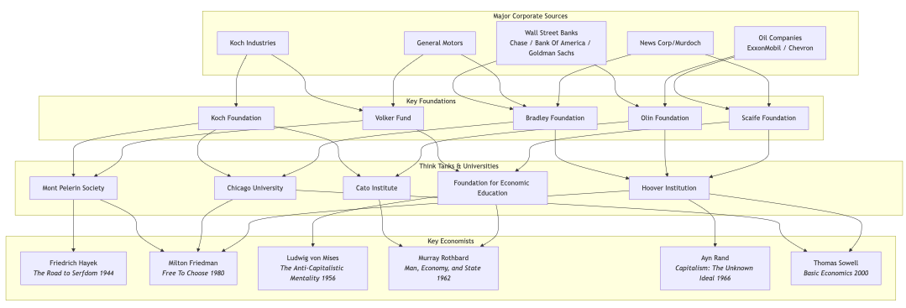
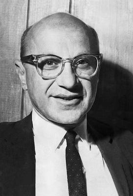
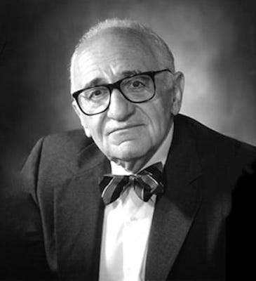
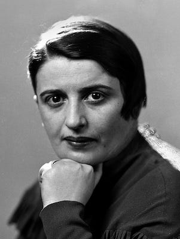
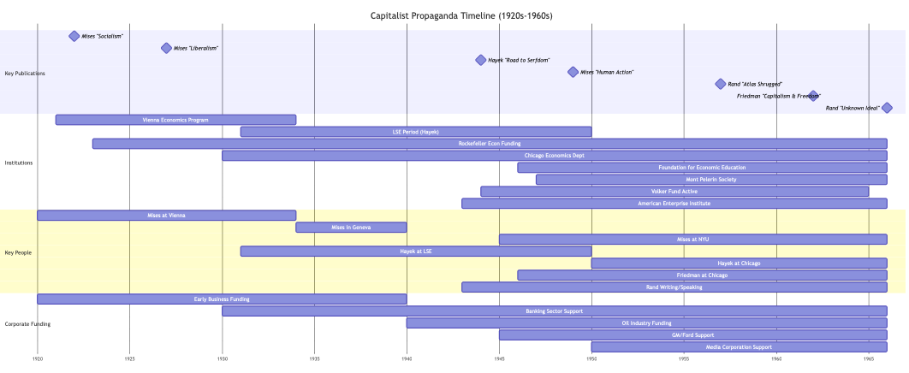
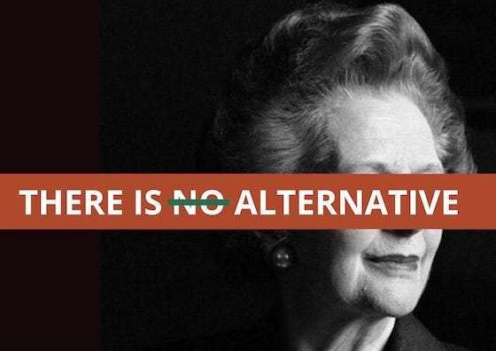

_In[the last article](https://peacefulrevolutionary.substack.com/p/redefining-capitalism) we looked at the first ideological defenders of Capitalism and how they began the process of rebranding it, in this article we’ll look at how their successors took their propaganda even further._

Before examining the more recent ideological defences of Capitalism, it’s worth addressing a particular strategy that is common amongst its defenders: the false choice between ‘good’ Capitalism and its bad alternatives. These arguments typically present Capitalism not on its own merits, but as the only alternative to some greatly feared outcome. Such arguments rely on creating a false choice where any real alternatives are erased from consideration.

### Logical Fallacies

 **Capitalism or Gulags**

Perhaps the most common logical fallacy is the claim that any alternative to Capitalism inevitably leads to totalitarian oppression. This argument gained particular force during the Cold War, when Capitalism was presented not merely as an economic system but as synonymous with ‘the free world’. This assumption persists despite numerous examples of democratic Socialist experiments that never created gulags, and the uncomfortable fact that Capitalist regimes have frequently employed systems of mass exploitation and control, from the brutal chattel slavery that built American wealth, to the modern prison-industrial complex that incarcerates millions, whilst extracting billions in profit from their forced labour.

 **Capitalism or Starvation**

Another common false equivalency suggests that any move away from Capitalism would result in widespread hunger. This ignores the fact that starvation exists persistently under Capitalism, not because of insufficient food production, but because of unequal distribution based on profit rather than need. As Indian economist Amartya Sen demonstrated in his research on famines, starvation is typically a result of entitlement failures, not production failures. It also conveniently overlooks the historic famines created by Capitalist policies, from the Irish Potato Famine to the Bengal Famine under British colonial rule. Both exacerbated by adherence to free market principles even as millions starved.

 **Reward for Success vs Punishment of Success**

Defenders of Capitalism often present it as the only system that rewards success, while characterising alternatives as ‘punishing’ achievement. This creates a false equivalency between the legitimate reward of genuine innovation and the uncritical acceptance of all wealth accumulation regardless of its source. It obscures the reality that much Capitalist ‘success’ derives not from creating value but from extracting it, through rent-seeking, exploitation of labour, environmental destruction, or monopolistic practices. A system that distinguishes between wealth gained through genuine contribution and wealth gained through exploitation is not ‘punishing success’ but refining our definition of what genuine success entails.

 **Western Prosperity vs Global Poverty**

Perhaps the most insidious false equivalency is attributing all material advances of modern society to Capitalism itself. This argument confuses correlation with causation, suggesting that scientific progress, technological innovation, and rising standards of living are uniquely Capitalist achievements rather than human ones. It erases the vital role of public funding in research, collaborative knowledge-sharing outside of markets, and the contributions of Socialist countries to medical and scientific advancement. Most critically, it ignores how Capitalist prosperity in the Global North has historically depended upon the exploitation and underdevelopment of the Global South, a relationship that continues to this day through unequal exchange, debt slavery, and resource extraction.

 **Freedom vs Slavery**

The ultimate false equivalency presents Capitalism as freedom and anything else as slavery. This claim depends upon a narrow definition of freedom as the absence of direct state coercion, while ignoring economic coercion as a form of unfreedom. It requires us to accept the premise that the worker, who must sell their labour to survive is ‘free’ while the person guaranteed their basic needs would somehow be ‘enslaved’. This claim deliberately ignores the daily reality of workplace authoritarianism, where most people spend the majority of their waking hours following orders with minimal democratic input. As American labour organiser Big Bill Haywood observed: ‘The mine owners did not find the gold, they did not mine the gold, they did not mill the gold, but by some weird alchemy all the gold belonged to them!’

These false equivalencies serve a crucial function in Capitalist ideology, they misrepresent any questioning of Capitalism as dangerous extremism rather than reasonable criticism. By establishing these artificial alternatives, defenders of Capitalism shift the burden of proof entirely onto critics while exempting the existing system from justifying its own failures. This strategy has been particularly effective in shutting down meaningful debate about alternatives, and it's precisely this pauperism of imagination that the most influential modern defenders of Capitalism have sought to achieve.

### Milton Friedman and the ‘Freedom’ Argument

Milton Friedman, like Von Mises and Hayek before him, was a paid spokesman for corporate interests who produced [propaganda to promote Capitalism](https://peacefulrevolutionary.substack.com/p/the-capitalist-empire-strikes-back-284), most notably in his influential book _Capitalism and Freedom_ (1962) and the television series _Free To Choose_ (1980).

Pro-Capitalist economists have been paid well by corporations for their progaganda 

Born in 1912 to Jewish immigrants in Brooklyn, Friedman rose to prominence as a professor at the University of Chicago, where he became the leading figure of the Chicago School of Economics. His advocacy for minimal government intervention, deregulation, and monetarism made him one of the most influential economists of the 20th century and a key architect of neoliberalism.

Friedman pushed the shareholder value doctrine, arguing that a corporation's sole responsibility is to increase profits for shareholders – not to consider workers, communities, or the environment. This ideology led directly to the wave of deregulation, union busting, and offshoring that devastated working-class communities from the 1980s onward. This makes it all the more ironic that he made statements such as this:

> ‘Economic freedom is an essential requisite for political freedom. By enabling people to cooperate with one another without coercion or central direction, it reduces the area over which political power is exercised.’ _(Capitalism and Freedom, 1962)_

This led to the common refrain from Capitalist apologists: **'Capitalism is just freedom, without it there is no freedom, so why are you against freedom?'**

This rhetorical sleight of hand works by redefining freedom as Capitalism and, once this equation is established, anyone who opposes Capitalism appears to be against freedom itself. But claims about systems don't determine the definitions of words; the actual use of words in broader society determines their meanings. Capitalism refers to a specific economic system characterised by private ownership of the means of production and wage labour, not to freedom in general.

The man who did the most to promote the idea that Capitalism meant freedom was perfectly comfortable supporting dictatorships that brutally suppressed freedom. Friedman advised and legitimised the Pinochet regime in Chile, which overthrew a democratically elected government and tortured, murdered, and disappeared thousands of citizens in the name of implementing ‘free market’ policies.

Friedman's definition of ‘freedom’ is conveniently limited to market transactions while completely ignoring workplace tyranny. Real economic freedom would mean democratic control of workplaces and resources. The ‘freedom’ of Capitalism is merely the freedom of Capitalists to exploit others. Political freedom becomes meaningless without economic democracy. As anarchist thinker Errico Malatesta observed:

> ‘The “freedom” of a Capitalist society is the freedom of Capital, not of people... The market is not a network of equal exchanges but a system of structured exploitation.’ _(Errico Malatesta, At the Café, 1922)_

This contradiction between claimed liberty and lived reality raises fundamental questions:

  * If Capitalism truly equals freedom, how ‘free’ are you if you must spend most of your waking hours taking orders from someone else just to afford food and shelter?

  * If we're truly so free, why do we need armed police to protect empty houses from homeless people?

  * How free is a system where most people’s only ‘choice’ is which billionaire they'll make richer through their labour?

These contradictions reveal the emptiness of the argument that Capitalism-equals-freedom. True freedom would require democratic control over both political and economic life, precisely what Capitalism is designed to prevent.

### Rothbard and the Free Market Argument

Let's examine another common defense of capitalism often associated with the libertarian tradition:

‘ **Capitalism is just trade and free markets, it’s people freely exchanging goods, and we’ve always had markets, what’s wrong with having more to choose from?** ’

Murray Rothbard (1926-1995) was an American economist and political theorist who founded modern libertarianism and anarcho-Capitalism. Born in New York, Rothbard studied under Ludwig von Mises at New York University and became one of the most radical proponents of unfettered markets. As a founding member of the Cato Institute and the Ludwig von Mises Institute, he spent his career advocating for the complete abolition of the state and the privatisation of all public services, including roads, courts, and even police. He claimed all our needs could be better performed by the market:

> ‘Free-market Capitalism is a network of free and voluntary exchanges in which producers work, produce, and exchange their products for the products of others through prices voluntarily arrived at.’ _(Man, Economy, and State, 1962)_

However, this definition deliberately obscures the coercive foundations of Capitalism. The early anarchist and labour activist Lucy Parsons identified this fundamental deception:

> ‘The wage-worker, although nominally free, must sell their labour-power or starve... The so-called 'free market' is based on the systematic robbery of labour through wage slavery.’ _(Lucy Parsons, The Principles of Anarchism, 1905)_

The claim that ‘ **Capitalism is just free markets, we've always had markets, what's wrong with markets?** ’ fails on multiple levels.

First, Capitalism isn't synonymous with markets. Interestingly, the ‘free’ in ‘free market’ originally meant ‘free from rent’ — unlike feudalism which relied on rents, early Capitalism proponents were particularly anti-landlord. This historical meaning has been conveniently forgotten by modern Capitalist apologists who defend landlordism and rent-seeking.

Second, markets existed long before Capitalism. We have had markets for over two thousand years, but Capitalism as a dominant economic system only emerged in the last few centuries. Commodity markets didn't exist before states and began primarily with the Greek state to supply goods to soldiers. They were always embedded in social relations and subject to moral regulation, not the supposedly ‘natural’ or ‘free’ exchanges that Rothbard described.

Third, Capitalism isn't the stock market either. Stock markets existed before modern Capitalism, although their existence has been closely tied to joint-stock corporations, which were initially created as extensions of state power (like the East India Company) rather than as private enterprises. As economic anthropologist Karl Polanyi incisively observed:

> ‘The freedom of the free market means nothing more than the freedom of those with market power to impose their will on those who lack it.’ _(Karl Polanyi, The Great Transformation, 1944)_

If markets are truly ‘voluntary exchanges’, why are they enforced through state violence? If Capitalism is just markets, why did establishing it require enclosing commons, forcing peasants off their land, and colonial conquest? Why do so-called ‘free markets’ consistently produce monopolies and oligopolies without state intervention to prevent them? Most fundamentally, if markets are truly ‘free’ then:

  * Why do most people enter them with nothing to sell but their labour power, while others come with vast inherited wealth and ownership of productive resources?

  * Why do we call it a ‘free market’ when most people must participate or starve? This fundamental power imbalance makes a mockery of claims about ‘voluntary exchange’ between equals.

  * If markets are efficient, why do we spend more on marketing than on research and development?

  * How efficient is a system where we produce enough food to feed everyone, yet people starve because feeding them isn't profitable?

Rothbard's vision of ‘anarcho-Capitalism’ would not eliminate hierarchy or coercion – it would merely privatise it, replacing public tyranny with private tyranny. True freedom requires not just the absence of state coercion, but the absence of economic coercion as well – something Capitalism, with its concentration of productive resources in private hands, intrinsically cannot provide.

### Ayn Rand and the ‘Competition’ Argument

Now consider this popular capitalist defence, often championed by objectivists and neoliberals:

' **Capitalism is just competition, it’s a natural part of life, and it helps people and things get better. It’s just someone making or offering something of value to someone else. Don’t you enjoy the benefits of that competition? Why shouldn’t people be allowed to provide such a service?** '

Ayn Rand (1905-1982), a Russian-American novelist and philosopher who fled Soviet Russia, became one of the most influential proponents of unfettered Capitalism through her novels and philosophical works. Her book _Capitalism: The Unknown Ideal_ (published in 1966), with additional essays by Nathaniel Branden, Alan Greenspan, and Robert Hessen, presents the central premise that laissez-faire Capitalism is the only moral economic system because it's supposedly the only one consistent with individual rights and human nature.

Unlike scholarly economic texts, Rand's work functions more as a religious document promoting her philosophy of ‘Objectivism’ than an economics textbook. Her vision presents an idealized version of Capitalism that has never existed in practice, dismisses the role of collective action and social cooperation in human advancement, overlooks market failures, externalities, and power imbalances that occur in unregulated markets, and rests on contested assumptions about human nature. Rand claimed:

> ‘Capitalism did not create inequalities between men, it inherited them. It did not start poverty, it started the slow, upward climb toward its elimination.’ _(For the New Intellectual, 1961)_

Her glorification of competition and hierarchy is most clearly expressed in _Atlas Shrugged_ (1957):

> ‘The man at the top of the intellectual pyramid contributes the most to all those below him, but gets nothing except his material payment, receiving no intellectual bonus from others to add to the value of his time. The man at the bottom who, left to himself, would starve in his hopeless ineptitude, contributes nothing to those above him, but receives the bonus of all of their brains.’

This dramatic misrepresentation of social contribution elevates the ‘man at the top’ while disparaging the essential labour of the many as ‘hopeless ineptitude.’ It fundamentally misunderstands how knowledge, innovation, and production actually function in human societies, which rely on collaborative effort and accumulated wisdom rather than isolated genius.

Rand further glorified competition in _Capitalism: The Unknown Ideal_ (1966):

> ‘Capitalism demands the best of every man – his rationality – and rewards him accordingly. It leaves every man free to choose the work he likes, to specialize in it, to trade his product for the products of others, and to go as far on the road of achievement as his ability and ambition will carry him.’

This idealised vision bears little resemblance to actually existing Capitalism, which systematically advantages those born to wealth and privilege while creating barriers for the talented but disadvantaged. The history of Capitalism is not one of the 'best' rising naturally to the top, but of exploitation, colonial plunder, and the systematic suppression of alternatives.

Contrary to Rand's claim that Capitalism merely ‘inherited’ inequality, Capitalism industrialised inequality and created new forms of poverty. What Capitalism inherited was commons and subsistence farming; what it created was wage slavery and artificial scarcity.

Perhaps most revealing of Rand's worldview is her dismissal of indigenous rights:

> ‘Now, I don't care to discuss the alleged complaints American Indians have against this country... [They] didn't have any rights to the land and there was no reason for anyone to grant them rights which they had not conceived and were not using.’ _(Q &A session following her address to the graduating class of West Point, 1974)_

This brings us full circle to the earliest proponents of Capitalism who justified it with racist ideologies – the dispossession of indigenous peoples and the enslavement of Africans was rationalised through claims about the superior rationality and industry of Europeans.

  * If competition truly produces the best outcomes, why do most major innovations come from public funding rather than competitive markets?

  * If the wealthy are naturally superior competitors, why do they need inheritance laws to maintain their position?

  * If hierarchy is natural, why does it require such extensive violence and coercion to maintain?

  * If competition is truly more efficient than cooperation, why do studies consistently show that cooperative workplaces outperform hierarchical ones on measures of productivity and innovation?

These questions expose the fundamental contradictions in Rand's glorification of competition and her assertion that Capitalism represents its most perfect expression.

## Capitalism Redefined

Finally, after pointing out all the negatives, Capitalist arguments often resort to T.I.N.A. – ‘There Is No Alternative’:

 **‘Capitalism is the best bad system we have, all others are much worse. For all its imperfection it does the best for the most people. Why would you risk replacing it with something that has tried and failed or hasn't been tried at all?’**

This sentiment echoes Winston Churchill's famous quip about democracy being ‘the worst form of government except for all those other forms that have been tried.’ The comparison is deliberate – it positions Capitalism as imperfect but ultimately necessary, just as Churchill positioned democracy.

It's not surprising that people who have been propagandised their whole lives – within schools, on television, in movies, by politicians and corporate messaging – believe that Capitalism is good and anything else is evil. What's remarkable is that many believe they've reached this conclusion impartially, without external influence, even as they repeat catchphrases that corporations and think tanks have spent billions implanting in the public consciousness.

This final defence mechanism works because it shifts the burden of proof entirely onto critics. It demands that alternatives must prove themselves perfect before they can be considered, while simultaneously allowing Capitalism to remain despite its profound failures. It also insinuates questioning Capitalism as unpatriotic or even dangerous, associating systemic criticism with historical atrocities through selective and often distorted historical narratives.

The ‘no alternative’ argument deliberately ignores the vast spectrum of economic arrangements that exist beyond the false choice of ‘Capitalism versus Soviet-style state Leninism’. It erases the successful history of worker cooperatives, commons-based resource management, participatory economics, and countless indigenous economic systems that have sustained communities for generations without destroying ecological foundations.

It also conveniently forgets that many supposed ‘failures’ of alternatives were actively sabotaged through economic sanctions, coups, assassinations, and military interventions specifically designed to ensure that alternatives could not succeed and serve as examples.

### What Capitalism Really Is

When defenders have exhausted their redefinitions and apologetics, it's worth returning to what Capitalism actually represents in practice rather than in idealised theory:

 **Capitalism is coercion** – The ‘freedom’ to choose between exploitative work or starvation is no freedom at all. The 'work or die' ultimatum bulwarks the entire system, ensuring a desperate workforce willing to accept increasingly poor conditions.

 **Capitalism is exploitation** – The extraction of surplus value from workers, who produce more value than they receive in wages, is essential to Capitalism. It is its defining feature and primary purpose.

 **Capitalism is violence** – From the colonial violence that established the first accumulations of Capital to the ongoing violence of dispossession, environmental destruction, and militarised enforcement of property rights, Capitalism has always required force to maintain itself.

 **Capitalism is theft** – The enclosure of commons, the appropriation of indigenous lands, the privatisation of public resources, and the extraction of natural wealth without compensation all represent forms of legalised theft.

 **Capitalism is slavery** – While wage labor may differ from chattel slavery in some ways, the underlying dynamic remains: human beings are reduced to tools for profit. Their time and energy are commanded by those who own the means of production.

The TINA argument asks us to accept these fundamental injustices as inevitable. Not because alternatives don't exist, but because questioning the existing order threatens those who benefit most from it.

### How to Respond

I often respond to specific arguments about Capitalism by addressing the particular claim being brought up, as I have above. Recently, however, I've been trying a different approach, hence all the questions accompanying each section of this article. By getting rid of the word ‘Capitalism’ altogether and asking moral questions instead, we can cut through the terminology debates and focus on the underlying ethical issues. Consider these fundamental questions:

  * Should a small group of people be able to hold the needs of many others to ransom because of claiming exclusive ownership of a large piece of land, or a mine, or a factory? Is this moral?

  * Are a worker, the person they work for, and the corporation they buy from equal in trading power or their influence on political power? Are their rights and interests protected equally?

  * Doesn't a few people having exclusive rights over resources others need require the threat of violence (and often actual violence)? Is such violence justified?

  * Why shouldn't workers who produce the wealth share the wealth? Why don't they have any claim on what they produce?

And ultimately, this is the question I've settled on:

> Do you believe that people have a fundamental right to access the resources they need to survive (food, water, shelter, healthcare), or should access to these necessities be determined by one's ability to pay for them?'

This seems to me to be the pivotal question that determines whether someone is a defender of Capitalism or an anti-Capitalist. It puts the focus squarely on the moral consequences of the system rather than abstract definitions or theoretical benefits.

These direct moral questions can still be challenging because pro-Capitalist propagandists have often prepared rehearsed responses. But basic human compassion can be a powerful force. When a question is sincerely confronted, it can open minds in ways that abstract debates cannot.

Whether these questions are enough to defeat the pro-Capitalist thought-terminating clichés we've examined remains to be seen. However, events in the world – especially ones that impact people personally – are causing many to question Capitalism where words alone don't succeed. When people begin to question, they often need to unravel a lot of their programming, and hopefully this article will help with that process.

The most effective counter to decades of pro-Capitalist indoctrination isn't merely better arguments, it's the lived experience of a system that increasingly fails to deliver on its promises for the majority of people. As those contradictions become more apparent, the questions we've raised here may help people make sense of that growing disconnect between Capitalist theory and their daily reality.

 _In the next article I’ll look specifically at the last question about fundamental rights and why pro-Capitalists cannot defend Capitalism without showing the moral problems of its system._

 _With thanks to[Lilith Selene](https://substack.com/@lilithselene) & others for editorial help._

Subscribe

[Share](https://peacefulrevolutionary.substack.com/p/dubious-defences-of-capitalism?utm_source=substack&utm_medium=email&utm_content=share&action=share)

### Capitalism Series

If you liked this consider reading more of my [series on Capitalism](https://peacefulrevolutionary.substack.com/about#§capitalism-series)
