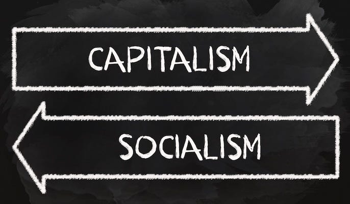
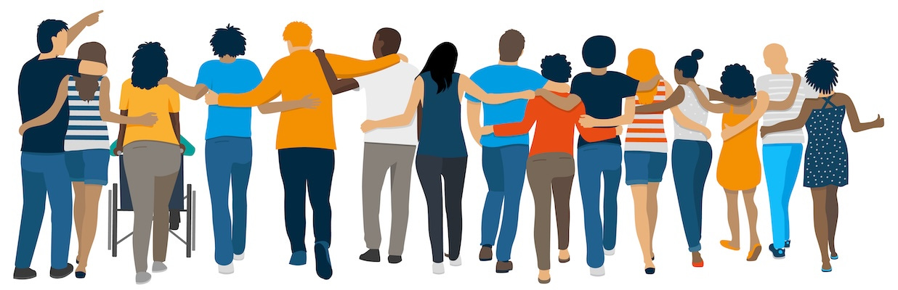

## The Question

I was asked recently to summarise simply the difference between Socialism and Capitalism. When discussing the differences between these two economic philosophies we often get stuck arguing about the various ways each of these words are used. The right might define Socialism as authoritarian control and Capitalism as individual freedom, while the left sees Socialism as collective freedom and Capitalism as exploitation. These conflicting definitions can prevent us from having meaningful discussions.

In trying to move past this impasse, and set aside such loaded terms, I’ve tried to come up with a fundamental question which will reveal what the differences between each group’s core values are, which is:

>  **Do you believe that people have a fundamental right (freedom) to access the resources they need to survive (food, water, shelter, healthcare), or should access to these necessities be determined by one's ability to pay for them?**

I ultimately picked this question because it is a reasonable one, most of us have to pay for food and housing, and we are aware that some struggle to pay for either or both of these. This is a dilemma affecting real people, not just a theoretical situation.

Of course you can explain why you chose that answer, you can argue why that answer is imperfect, or even add conditions to it, but in picking a) ‘people have a right’, or b) ‘people should have to pay’, it gives one clear starting point at which to look at the differences between the two views.

## Ethical Dilemmas

In responding to this question you can only choose one answer, even if it is an imperfect one, because that is the only way to explore the values implied in this issue, by looking at one side, examining it, challenging it, and seeing if the answer still seems right at the end of that process.

As with any ethical dilemma, it’s okay if you’re unsure whether you’ve picked rightly. Maybe you’ll worry about the consequences if you’d made another decision, or conclude there is no right, good,or ideal answer. But starting off looking at one side and focusing on that helps to figure out how certain you are about it.

At the end of this process maybe you’ll find you were right to choose that answer all along, or maybe you’ll decide you were wrong; but confronting the question and its implications will either make you understand the other side better, or be more sure of your conclusions if you don’t change your mind.

##  **Biases**

Now this is the point at which I admit my own bias, because we have to start somewhere, and I’m the one starting this process and can most easily speak to what I know best, which is my own perspective.

You might think me wrong, but I believe that ‘people have a fundamental right to access the resources they need to survive (food, water, shelter, healthcare)’. I am going to try to explain why I’m inclined or even prejudiced towards this view, and then we can move on to objections to my position.

I consider my perspective a people-first position, which might sound over-idealistic of me, and maybe it is, but putting the needs of people first seems to have served me well.

I’ve personally found that …

Our ideals often come from a mixture of our experiences and our reasoning, but I realise that my personal experiences are more subjective, so I am going to focus on why I believe I have good reasons and believe there are good arguments for this people-first view.

I might claim that human life and wellbeing have inherent value and even greater value than anything else, but that’s just an ideal. Ideals can be important: at their best they can motivate wonderful positive changes, but some ideals may be impractical or even impossible.

##  **Others’ Perspectives**

One way to make ethical quandaries seem less like abstract concepts is to apply them to ourselves personally. This is the classic ‘putting yourself in other peoples shoes’ test.

Imagine if you found yourself without money but desperately needing food to avoid starving, or shelter to avoid freezing in the winter. What help would you hope would be available to you? Would you think ‘this must be my own fault, I deserve to starve (or freeze)?’ Probably not.

Most of would be grateful if someone showed us kindness and gave us charity, but there is always a chance someone might not. However, if you could rely on a system in which food or shelter was freely available then your survival wouldn’t be just down to chance — it would be certain. Wouldn’t you be grateful for such a system in that situation?

That is what I would want for myself. In a major emergency any of us could still find ourselves in such a situation. ‘There but for the grace of god go I’, as the old saying reminds us. But even if I were lucky enough never to face that, I’d want for others to have those necessities available to them too.

## Shouldn’t Charity Solve This?

Some people who believe that we should help others do not see this as the responsibility of society collectively, and feel that assisting others should be freely given through charity. They worry that in expecting organisations to do this we are removing the incentive for kindness, and by using the state to carry this out we are putting a burden of taxation on those who might otherwise help. _I consider this[The Dumbest Take On Economics](https://substack.com/@peacefulrevolutionary/note/c-101746565)_

However, my response to this is that relying on charity from the wealthy means accepting that some people's very survival depends on the whims and goodwill of those who have accumulated wealth. This creates a deeply unequal power dynamic whereby the poor must hope for crumbs from the rich rather than having guaranteed access to what they need to live.

Moreover, this wealth that the rich ‘charitably’ give away was created by workers in the first place. The factory owner's ‘charity’ comes from surplus value extracted from their workers’ labour. The landlord's ‘donations’ come from rent extracted from tenants. Rather than hoping the wealthy will kindly give back a fraction of what they've taken, we could organize society so that wealth isn't concentrated in their hands to begin with.

History shows that charity has never been enough to meet society's needs. During the Great Depression, the Irish Famine, and countless other crises, private charity failed to prevent mass suffering while the wealthy remained comfortable. Real solutions require systemic change, not just hoping the rich will be generous enough to keep the poor alive.

The question isn't whether some wealthy individuals might choose to help others, it's whether anyone should have the power to accumulate such wealth while others lack basic necessities. A society that requires charity to meet basic human needs is a failed society.

## Working For A Living

But shouldn’t people work for what they get? If they’re not working aren’t they forcing someone else to work and provide? _[(No, they’re not)](https://peacefulrevolutionary.substack.com/i/156456016/slaves-to-freedom-addressing-the-forced-labour-myth)_

People do generally work for what they get once they are adults, or rather, they work to get the money they use to pay for food and housing which has been placed behind a paywall.

This is true until they retire, or unless they are severely disabled, or unless they are born wealthy, in which case they are probably the ones the worker’s money will ultimately go to.

 **Didn’t they put themselves in this bad situation?**

One commentator who shared this view gave this scenario to illustrate it: ‘ _If you choose to walk out into the desert, no one has a responsibility to spend their time hauling water to you. The very notion is absurd_.’

However, most people aren’t choosing to walk into deserts, they're born into existing societies with infrastructure built by generations of workers. Yet owners of land, mines, factories and other resources can extract wealth from those things forever because we need access to them. But workers who actually build / contribute something valuable to society only get a one-time payment (while they are working on it). If we accept ongoing obligations to property and business owners, shouldn't we also recognise ongoing obligations to those whose work made that property valuable and usable in the first place? Why should one have a legal and financial claim and the other not?

Moreover, the ‘desert walker’ analogy ignores the fundamental interdependence of human society. Any of us could face circumstances beyond our control; illness, injury, job loss, natural disasters that leave us reliant on others. The question isn't about choosing to put ourselves in need, but how we treat each other when needs arise. If you became seriously ill tomorrow, would you want access to healthcare to depend on your current bank balance? The society we build should reflect how we'd want to be treated in our moments of vulnerability, because those moments come to us all. Does that seem absurd? Is such ‘property’ really more important than people?

## Paying For Living

Undeterred by my objections, they asserted: * _‘Yes, your ability to access necessities absolutely must require that you can pay for them.’_ *

But to me that isn’t liberty — that is economic slavery, where basic needs are held hostage, most people must sell their labour to survive, and both providers and recipients are coerced. True freedom means removing these artificial constraints so people can both give and receive freely based on ability and need. Why should someone starve when there such a surplus of food that we destroy it to keep the price high?

There is an important reason I didn’t phrase the question ‘should access to these necessities be determined by one's ability to **work** for them?’, but instead asked, ‘should access to these necessities be determined by one's ability to **pay** for them?'

A slave might work and not get paid, but get food and shelter. We live in a system in which people work for pay and that pay covers those needs if the person is paid well enough.

If I’d used the word ‘work,'it might have become a discussion between working hard or being lazy, instead of whether money should determine access to those needs.

This isn’t a question about people’s personal circumstances but primarily about the systems they live in and what they expect of them. A system in which people don’t have to pay for necessities places feeding and housing people at a higher priority than working to make others a profit does.

## Human Worth

Ultimately this question may come down to fundamental assumptions of the purpose and worth of our fellow humans. _[(The Myth Of Merit)](https://peacefulrevolutionary.substack.com/p/the-myth-of-merit)_

All I can say to someone who says, ‘I worked and sacrificed and suffered through this to get this and so others should too’ is ‘what if you worked hard and still didn’t succeed in getting your needs met? What help would you hope would be available to you then?’ To me it seems like saying that because you were unfortunate enough to be born into a pit (or fell into one), others should experience the same misfortune because you had to, rather than hoping that they that avoid that suffering (and the pit) altogether.

If someone honestly believes that our right to live should be based solely on our ability to pay, then there is a clear difference in our moral frameworks. I believe that human life has inherent value and dignity regardless of someone's ability or willingness to work.

If money is the determining factor in survival then those who cannot work, whether due to disability, illness, age, or lack of available jobs, would seem to deserve to suffer or die. This includes children, the elderly, the severely disabled, and many others. Even for those who can work, their very survival is held hostage to whatever terms employers decide to offer. Do employers deserve such power?

This is why I consider market systems inherently violent, the system uses the threat of starvation, homelessness, and death to coerce people into accepting exploitation. The ‘choice’ to work isn't really free when the alternative is death. A truly free society would ensure everyone's basic needs are met first, allowing people to then choose how they want to contribute to their community.

## Capitalism vs Socialism

This gets to the heart of these two different visions of society; one based on competition and earned survival, versus one based on cooperation and human dignity, and brings us back to the question that forms the crux of this moral debate:

>  **Do you believe that people have a fundamental right (freedom) to access the resources they need to survive (food, water, shelter, healthcare), or should access to these necessities be determined by one's ability to pay for them?**

This question forces us to consider whether fundamental human rights or the Capitalist market is more important. It gets to the core moral difference between Socialist and Capitalist worldviews, with clear implications for how society should be organised.

At its essence, this is a choice between two fundamentally different value systems:

The capital-base approach of Market Fundamentalism, Profit-First or Money-Centred Economics assumes that these things must be paid for, meaning:

  * Basic survival becomes a privilege, not a right.

  * Access is determined by market forces.

  * Those who cannot pay may be left to suffer or die.

  * Private property rights override human needs.

  * Profit can be prioritised over meeting basic needs.

  * Resources can be hoarded or destroyed to maintain prices.

This aligns with Capitalist principles where everything, including necessities for survival, is treated as a commodity.

Conversely, a people-first approach, or what we might call People-Centred or Life-Centred Economics, recognises that if food and housing are necessities and fundamental human rights, then logically:

  * They cannot be commodities to be bought and sold.

  * No one should be denied them due to inability to pay.

  * Society must be organised to guarantee them to all.

  * Resources must be managed collectively to ensure universal access.

  * Private property rights cannot override human rights to survival.

  * Production must prioritise meeting needs over generating profit.

This naturally leads toward Socialist principles, because Capitalism's core mechanisms are inherently in conflict with guaranteeing universal access to necessities.

My hope is that this framing leads to productive discussion about how different economic systems handle basic human needs. Ultimately, this debate illustrates a profound choice: between recognising **People’s right to live** or prioritising the **ability to pay**. People are real and living; money is merely a number in a bank account. Humanity has existed for about 200,000 years, while Capitalism was only invented about three hundred years ago. People can live without capital, but capital doesn’t exist without people. By every meaningful measure, people are superior to capital.

The choice before us is therefore quite stark: Do we organise our society to meet human needs first, or do we continue prioritising capital accumulation at the expense of basic human welfare? How do you answer this question?

 _Thanks to[Emma Cornford](https://substack.com/@emmacornford) and others for editorial help._

Subscribe

[Share](https://peacefulrevolutionary.substack.com/p/capitalism-vs-socialism?utm_source=substack&utm_medium=email&utm_content=share&action=share)

### Capitalism Series

If you liked this consider reading more of my [series on Capitalism](https://peacefulrevolutionary.substack.com/about#§capitalism-series)
