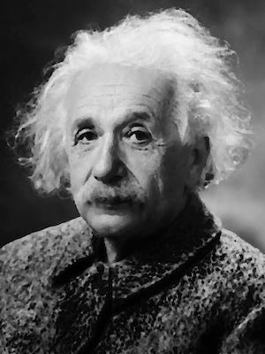
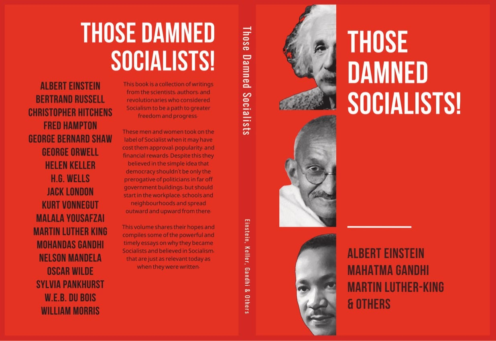

## **Albert Einstein**

 _(1879-1955)_

> ‘Capitalist society as it exists today is, in my opinion, the real source of the evil. … I am convinced there is only one way to eliminate these grave evils, namely through the establishment of a socialist economy.’ _(Monthly Review, May 1949)_

 _Born to a Jewish family in 1879, Albert Einstein fled Nazi Germany in 1932, finding refuge in America where he continued his groundbreaking work. He was most famous for developing the theory of relativity (E=mc2), changed the way scientists perceive space and time, and for which in 1921 he received the Nobel Prize in Physics._

 _Beyond his scientific pursuits, Einstein was a vocal advocate for civil rights, joining the NAACP1 and supporting leaders like W.E.B. Du Bois. He was also a committed pacifist, warning about the dangers of nuclear weapons and co-authoring the Russell-Einstein Manifesto (with Bertrand Russell). He died in 1955, with his name becoming synonymous with genius ever since._

 _Einstein’s concerns extended beyond science to societal issues. He recognised that many injustices stemmed from economic inequalities and unequal access to power. This realisation led him to pen his 1949 essay advocating for socialism as a more equitable system. While responses to his essay have varied, from faint praise to criticism, Einstein’s moral argument for systemic change continues to influence ongoing debates about socialism and capitalism. His call for a more equitable society remains relevant today, inspiring those who see an urgent need for addressing persistent inequalities._

###  **‘The Establishment of a Socialist Economy’**

 _Albert Einstein, 1949 (Excerpts)_

####  _The Concentration of Capital and Power_

Private capital tends to become concentrated in few hands, partly because of competition among the capitalists, and partly because technological development and the increasing division of labour encourage the formation of larger units of production at the expense of smaller ones. The result of these developments is an oligarchy of private capital2 the enormous power of which cannot be effectively checked even by a democratically organised political society.3 This is true since the members of legislative bodies are selected by political parties, largely financed or otherwise influenced by private capitalists who, for all practical purposes, separate the electorate from the legislature. The consequence is that the representatives of the people do not in fact sufficiently protect the interests of the underprivileged sections of the population. Moreover, under existing conditions, private capitalists inevitably control, directly or indirectly, the main sources of information (press, radio, education). It is thus extremely difficult, and indeed in most cases quite impossible, for the individual citizen to come to objective conclusions and to make intelligent use of his political rights.

The situation prevailing in an economy based on the private ownership of capital is thus characterised by two main principles: first, means of production (capital) are privately owned and the owners dispose of them as they see fit; second, the labour contract is free. Of course, there is no such thing as a pure capitalist society in this sense. In particular, it should be noted that the workers, through long and bitter political struggles, have succeeded in securing a somewhat improved form of the ‘free labour contract’ for certain categories of workers. But taken as a whole, the present day economy does not differ much from ‘pure’ capitalism.

Production is carried on for profit, not for use. There is no provision that all those able and willing to work will always be in a position to find employment; an ‘army of unemployed’ almost always exists. The worker is constantly in fear of losing his job. Since unemployed and poorly paid workers do not provide a profitable market, the production of consumers’ goods is restricted, and great hardship is the consequence. Technological progress frequently results in more unemployment rather than in an easing of the burden of work for all. The profit motive, in conjunction with competition among capitalists, is responsible for an instability in the accumulation and utilisation of capital which leads to increasingly severe depressions. Unlimited competition leads to a huge waste of labour, and to that crippling of the social consciousness of individuals which I mentioned before.

This crippling of individuals I consider the worst evil of capitalism. Our whole educational system suffers from this evil. An exaggerated competitive attitude is inculcated into the student, who is trained to worship acquisitive success as a preparation for his future career.

####  _The Socialist Solution_

I am convinced there is only one way to eliminate these grave evils, namely through the establishment of a socialist economy, accompanied by an educational system which would be oriented toward social goals. In such an economy, the means of production are owned by society itself and are utilised in a planned fashion. A planned economy, which adjusts production to the needs of the community, would distribute the work to be done among all those able to work and would guarantee a livelihood to every man, woman, and child. The education of the individual, in addition to promoting his own innate abilities, would attempt to develop in him a sense of responsibility for his fellow men in place of the glorification of power and success in our present society.

 _Originally published in the first issue of Monthly Review (May 1949)._

I encourage you to read [the whole article](https://monthlyreview.org/2009/05/01/why-socialism/).

## My Thoughts

If you were looking for the smartest ally for socialism you could hope for, you couldn’t do any better than Einstein, someone whose name is synonymous with the word ‘genius’. He didn’t just see socialism as a vague aspirational ideal, but as a necessary and practical alternative to capitalism, which he was not shy in sharing his criticisms of.

To Einstein capitalism's fundamental problems were: the concentration of private capital, the exploitation of workers, production for profit rather than use, and the ‘crippling of social consciousness’ through competitive individualism. His observations of how capitalists control information sources and political representation remains remarkably relevant today.

However, Einstein was a product of his time and spoke within the situation he was in and about the kind of socialism he was most familiar with. He believed that socialism would most likely - at least initially - come through the state, but some socialists believe that centralised hierarchical power structures undermine and ultimately thwart attempts at establishing socialism. 

Einstein acknowledges the danger of such government bureaucracy in a planned economy, but he doesn't fully resolve this contradiction. His concern about the ‘far-reaching centralisation of political and economic power’ is precisely why some of us believe state socialism ultimately fails. Whereas his essay stops short of considering decentralised, horizontal forms of economic planning through federated communes and worker councils.

Nonetheless, Einstein's essay provides valuable groundwork by recognising capitalism's inherent contradictions and the need for systemic change rather than reform. His emphasis on replacing competitive individualism with social responsibility is something non-state socialists agree with wholeheartedly, even if his proposed ways of implementing this differs.

## Those Damned Socialists

This essay is one of many I have compiled, edited, and written essays in a new book: **Those Damned Socialists -** _Albert Einstein, George Orwell, Oscar Wilde, Helen Keller, Martin Luther King, Nelson Mandela, Oscar Wilde, and others write about their Socialist views._

 Thanks to Jen for this cover design and her patience with this project

 **Buy Now -[Paperback](https://www.lulu.com/shop/nate-taylor/those-damned-socialists/paperback/product-kvwq5wd.html?page=1&pageSize=4) | [eBook](https://www.lulu.com/shop/nate-taylor/those-damned-socialists/ebook/product-2m48rdd.html?page=1&pageSize=4)**

Subscribe

[Share](https://peacefulrevolutionary.substack.com/p/einstein-the-socialist?utm_source=substack&utm_medium=email&utm_content=share&action=share)

1

The National Association for the Advancement of Colored People (NAACP).

2

‘An oligarchy of private capital’ refers to a system where economic power is concentrated in the hands of a small group of wealthy individuals or corporations.

3

Here, Einstein argued that even in democracies, the influence of private capital on politics and media could undermine true democratic representation and decision-making.
