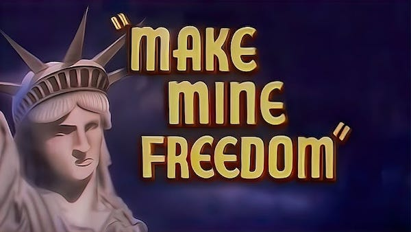
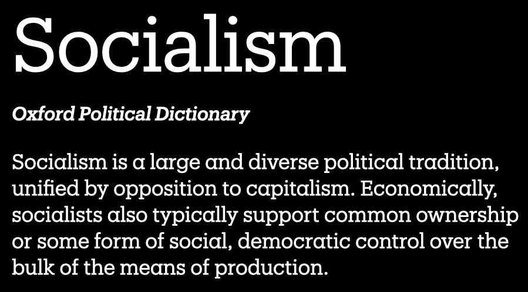
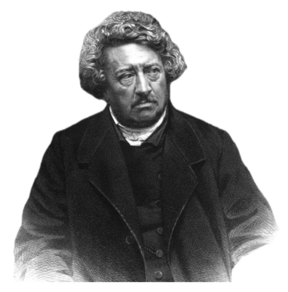
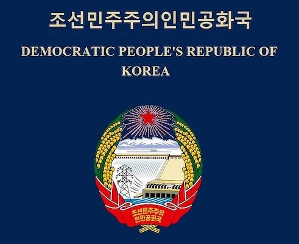
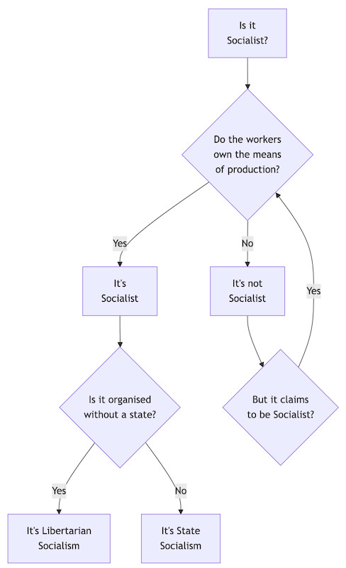
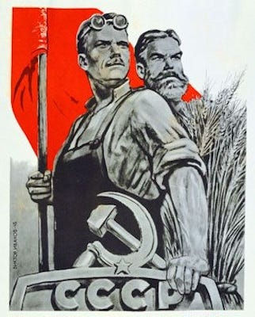
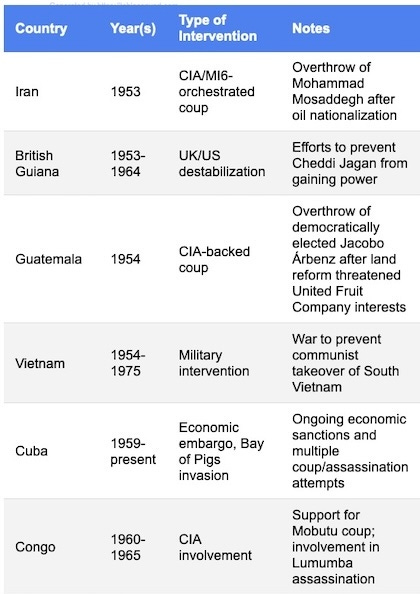
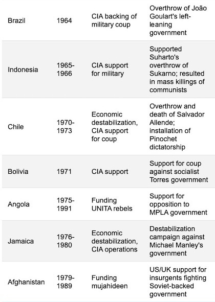
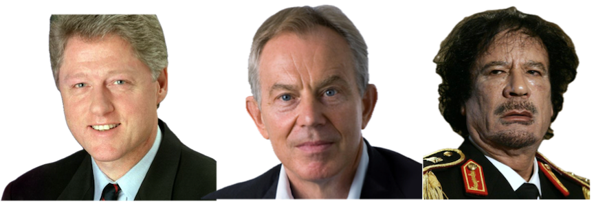
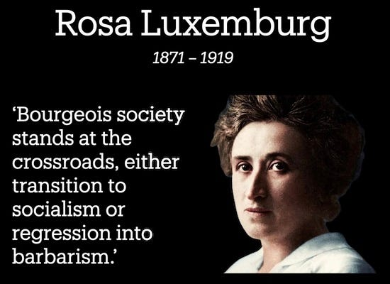

So, Socialism … That's breadlines and gulags, right? — or is that goulash? — I always get those two mixed up. Or maybe it's Lenin and Stalin and cold wars and cold places like Siberia? Or perhaps it's Bernie Sanders and A.O.C. Or could it be hippies and liberals and punks and people wanting to steal your money? Could it be the government, and the more governmentish it is, the more Socialistish it is? Or possibly it's none of those things.

Is the left side Socialism and the right side Capitalism? Nope, both are Capitalism!

Lately its meaning has been broadened to include Democrats, liberals, anything the government does, and anything woke, but what does it mean really?

One thing is for sure: billions have been spent — we have the receipts — to make sure you equate socialism with your freedom being taken away, with starvation, and with hating America (or — if you live elsewhere — hating Indonesia or _[fill in your country here]_ ). But is any of that true?

Pro-Capitalist children’s cartoon, 1948

## Definitions

How did we get to the point where the word has become so controversial? Well, like many political words, the origin of the word socialism is a mix of French and Latin.

As one etymologist explains: ‘The word “Socialism” finds its root in the Latin sociare, which means to combine or to share. The related, more technical term in Roman and then medieval law was societas. This latter word could mean companionship and fellowship as well as the more legalistic idea of a consensual contract between freemen.’

We owe the word we use today to Pierre Leroux, who in 1832 was trying to find a term to describe the utopian co-operative ideals of Henri de Saint-Simon, whom he admired.

Pierre Leroux, 1797 - 1871

After all, what do you call people who aren't liberals or conservatives, because they aren't individualists or propertarians? They were once known by other labels such as associationists or collectivist, but eventually settled for Socialists? After all they believe in a social economy, don't they?

## Names And Claims

The problem you have after this point, however, is that lots of Socialist parties spring up, some of which are not very socialist, or believe that the path to Socialism is through doing everything and anything else first, the most famous example of this being the USSR and China which actually call their system for eventually supposedly getting there 'state Capitalism'.

This is like saying, ‘we are the puppy party - we believe in the necessity of everyone having a puppy - we don't actually have any puppies, but we think if we focus on breeding gerbils in the meantime then at least you'll have those until one day we'll somehow have puppies for you.’

Then outside propaganda says, ‘look at the bad things these so-called puppy people are doing, that's what puppyism is all about. Just ignore the fact that there are no puppies at all. Don't these evil puppyists make you hate puppies?’ No! Puppies are good! Despite what other people who claim to like puppies do, or what people who hate puppies say.

Yes, sometimes some groups have used the word Socialist as an advertising slogan to try and get Socialist followers, one particular German political party from the 1930s comes to mind, who admitted they only did it to get support and always really hated Socialists, whom they killed off at the first convenient opportunity.

But it would be silly to base the meaning of a word on how it has been misused, mislabelled and misapplied. Wouldn't it? Do we have to call the Democratic Republic Of Korea democratic or even a republic just because they say so? No, that would be silly.

North Korean Passport cover

## What It’s Not

In the end if you really want to know what socialism is, ask a socialist. Since I'm a socialist, ask me. Firstly, I can tell you what socialism is not: It is not liberalism; in the US it is not the Democratic Party, and in the UK it isn't the Labour Party. 

Socialism is not governments either, there are non-state and anti-state Socialists. So, it follows that it is not the government owning everything. But since I've already said it isn't governments, you already knew that. Likewise, it is not authoritarianism. It's not about leaders, rulers, states or parties at all.

If you believed it was any of these things, you may have accidentally mistaken propaganda for truth. It's okay, it's easy to do, but now you know better, and needn't make that mistake again.

But what about co-operatives? unions? welfare programmes? Well, some of them may have been inspired by Socialists and even contained some Socialists, but they aren't Socialism by themselves. So what is Socialism? 

## What It Is

I won't keep you in suspense any longer, here's the facts. Socialism is … When workers own and control their workplace. That's it. If they do it is, if they don't it isn't. As simple as that. Here is a handy chart for you to use next time someone says something is socialism to test if it is true:

Do the workers own their workplace? No? Then it isn't Socialism, whatever it calls itself. 

Now, I hear you say (or ask), that's not all Socialism is, is it? Well, it is the basis on which Socialism is built, but there is a little more to it than that. You see, when ownership becomes collective or communal, this isn't usually confined to workplace, but also tends to extend to the communities in which the workers live.

This is because workers working for themselves will usually produce firstly (or only) for need rather than sale, and so essential goods cease to be commodities and workers have no reason to charge money for them.

More complex production can take place through communities and workplaces co-operating — federating as it's called — but not based on producing a profit in a market for Capitalists.

So this leads to a universal entitlement to what people need, and even the ability to supply much of what people want, but with an accountability toward the human and environmental costs of production.

So, where does Communism come into all this? Communism is a kind of Socialism - the words were once used interchangeably, but a distinction came later in which Socialism tended to focus on the process of workers organising themselves and taking over their workplaces, and Communism was the point at which this has been achieved to the extent that there are no more rulers, privatised property, or even money.

Oh, and by the way, Anarchists are also socialists, at least most of them are, because Anarchism is against all domination, including the capitalist kind. It is against all exploitation, for free association, and everyone's needs being met, so that people can truly be free to make decisions without the fear of starvation.

## The Cost Of Opposing Capitalism

Now socialism has, does, and will always work whenever it is given a chance to. There are many examples of this throughout history. Unfortunately — because workers showing and sharing their power challenges the power and wealth of the rich and the governments that serve them — this one interesting thing will often happen when you try to live Socialism …

They will silence you, imprison you, overthrow you, invade you, or assassinate you, depending on whether you are an individual, group or country. This has happened over one hundred times.

You'd think if Socialism was so bad they'd let it fail on its own, but instead they'd rather kill millions to ensure it fails. Those doing the killing in order to prove the superiority of their anti-Socialism (and pro-Capitalism) don't sound like the good guys to me, but then I am personally biased toward anti-killing.

## A Third Way?

Some people wonder if there might be a third alternative? A third way?

Proponents of the ‘Third Way’ - Bill Clinton, Tony Blair & Muammar Gaddafi.

No. Nice try though. But how could there be? There are really only two choices: Workers own their work and what they produce OR owners own workers' work and what they produce.

Most other proposals are just workers sharing some ownership, but never on an equal basis with the overall owner. So any third way is just watered down capitalism. Maybe better than raw unfiltered Capitalism, but still Capitalism.

That's fine if you are the owner, maybe not quite as bad if you are a worker, but I'd be willing to make a bet that the owners will always use their greater power and influence to reduce the power and control of the workers, and you'll always end up back with the owners having full control.

So, as revolutionary Rosa Luxemburg said, you have two choices: Socialism or Barbarism?1 I hope you choose wisely. Hint: Choose Socialism.

## Better Words?

So, since the word Socialism is so misused and misunderstood, what other words might we use? Here are a few suggestions:

  *  **Equinomics** — Equitable Economics

  *  **Shareocracy** — ‘Democratic’ sharing

  *  **Co-opitalism** — Co-operative ‘capital’

Subscribe

[Share](https://peacefulrevolutionary.substack.com/p/what-is-socialism?utm_source=substack&utm_medium=email&utm_content=share&action=share)

## Those Damned Socialists

Want to learn about Socialism from Albert Einstein, George Orwell, Oscar Wilde, Helen Keller, Martin Luther King, Nelson Mandela, Oscar Wilde, and others?

Thanks to Jen for this cover design and her patience with this project

 **Buy Now -[Paperback](https://www.lulu.com/shop/nate-taylor/those-damned-socialists/paperback/product-kvwq5wd.html?page=1&pageSize=4) | [eBook](https://www.lulu.com/shop/nate-taylor/those-damned-socialists/ebook/product-2m48rdd.html?page=1&pageSize=4)**

1

Misattributed to Friedrich Engels, but originally from Karl Kautsky’s widely-read 1892 commentary on the Erfurt Program: ‘As things stand today capitalist civilisation cannot continue; we must either move forward into socialism or fall back into barbarism.’
