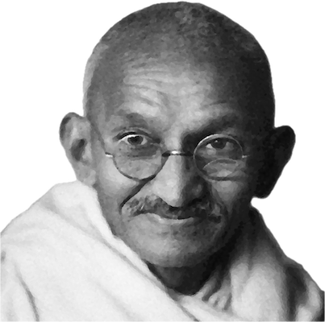

## **Mohandas Gandhi**

 _(1869-1948)_

> ‘I have claimed that I was a socialist long before those I know in India had avowed their creed. But my socialism was natural to me and not adopted from any books.’ _(Harijan, 20 April 1940, Vol. VIII, No. 8, P. 97)_

####  _The Life of Mohandas (Mahatma) Gandhi_

Born in 1869, in a coastal town in present-day Gujarat, India, Mohandas Karamchand Gandhi, as a young man Gandhi studied to be a lawyer in London and practised law in South Africa, where he experienced racial discrimination firsthand, and became involved in civil rights and social justice movements there. During this time he corresponded with Russian writer Leo Tolstoy, which significantly influenced his philosophy and approach to nonviolent resistance, social reform, and ethical living. Gandhi’s philosophy of nonviolent resistance, or satyagraha, became a cornerstone of his activism.

Beyond political liberation, Gandhi was a symbol of unity, advocating for religious tolerance and bridging divides between diverse communities. Gandhi emphasised communal harmony and the welfare of the marginalised, fostering a sense of collective empowerment. His concept of ‘sarvodaya’ (welfare of all) aligned closely with socialist principles, advocating for the upliftment of all members of society.

Gandhi’s commitment to economic self-sufficiency and the revival of traditional industries also contributed to his significance. He championed local production and self-reliance, influencing India’s economic and industrial development. One of his most famous campaigns, the Salt March of 1930, exemplified his strategy of nonviolent resistance against unjust laws and economic exploitation. 

Assassinated in January 1948, Gandhi’s legacy resides in his moral leadership and commitment to human rights. He was called the father of India, and nominated for the Nobel Peace Prize five times. His ideas reverberated globally, impacting civil rights movements and inspiring leaders such as Martin Luther King Jr. and Nelson Mandela to adopt similar nonviolent strategies in their fights for equality and justice.

###  **‘Socialism Is a Beautiful Word’**

 _Mohandas Gandhi, 1947_

>  _Gandhi’s speech ‘Who Is A Socialist?’ presents his unique vision of socialism, rooted in equality, unity, and moral integrity. He argues that true socialism transcends religious and social divisions, viewing all members of society as inherently equal. Gandhi emphasises that socialism begins with individual action and commitment to truth and non-violence. He asserts that pure socialism can only be achieved through pure means, rejecting violent or unethical methods of social change. Ultimately, Gandhi envisions a socialism that is not merely an economic or political system, but a moral and spiritual transformation of society._

####  _The Essence of Socialism_

Socialism is a beautiful word, and, so far as I am aware in socialism all the members of society are equal-none low, none high. In the individual body the head is not high because it is the top of the body, nor are soles of the feet low because they touch the earth. Even as members of the individual body are equal, so are the members of the society. This is socialism.

> ‘In socialism all the members of society are equal-none low, none high.’

In it the prince and the peasant, the wealthy and the poor, the employer and the employee are all on the same level. In the terms of religion there is no duality in socialism.1 It is all unity. Looking at society all the world over, there is nothing but duality or plurality. Unity is conspicuous by its absence. This man is high, that one is low, that is a Hindu, that a Muslim, third a Christian, fourth a Parsi, fifth a Sikh, sixth a Jew. Even among these there are subdivisions. In the unity of my conception there is perfect unity in the plurality of designs.

In order to reach this state we may not look on things philosophically and say that we need not make a move until all are converted to socialism. Without changing our life, we may go on giving addresses, forming parties and, hawk-like, seize the game when it comes our way.2 This is no socialism. The more we treat it as game to be seized, the farther it must recede from us.

####  _The Power of Individual Action_

Socialism begins with the first convert. If there is one such, you can add zeros to the one and the first zero will account for ten and every addition will account for ten times the previous number. If, however, the beginner is a zero, in other words, no one makes the beginning, multiplicity of zeros will also produce zero value.3 Time and paper occupied in writing zeros will be so much waste.

This socialism is as pure as crystal. It, therefore, requires crystal-like means to achieve it. Impure means result in an impure end. Hence the prince and the peasant will not be equalised by cutting off the prince’s head, nor can the process of cutting off equalise the employer and the employed. One cannot reach truth by untruthfulness. Truthful conduct alone can reach truth. Are not non-violence and truth twins? The answer is an emphatic ‘no’.4 Non-violence is embedded in truth and vice versa. Hence has it been said that they are faces of the same coin. Either is inseparable from the other. Read the coin either way. The spelling of words will be different. The value is the same. This blessed state is unattainable without perfect purity. Harbour impurity of mind or body and you has untruth and violence in you.

####  _The Path to True Socialism_

Therefore, only truthful, non-violent and pure hearted socialists will be able to establish a socialistic society in India and the world. To my knowledge there is no country in the world which is purely socialistic.5 Without means described above, the existence of such a society is impossible.6

 _A speech given in New Delhi, 6 July 1947._7

## Those Damned Socialists

This essay is one of many I have compiled, edited, and written essays in a new book: **Those Damned Socialists -** _Albert Einstein, George Orwell, Oscar Wilde, Helen Keller, Martin Luther King, Nelson Mandela, Oscar Wilde, and others write about their Socialist views._

 Thanks to Jen for this cover design and her patience with this project

 **Buy Now -[Paperback](https://www.lulu.com/shop/nate-taylor/those-damned-socialists/paperback/product-kvwq5wd.html?page=1&pageSize=4) | [eBook](https://www.lulu.com/shop/nate-taylor/those-damned-socialists/ebook/product-2m48rdd.html?page=1&pageSize=4)**

Subscribe

[Share](https://peacefulrevolutionary.substack.com/p/einstein-the-socialist?utm_source=substack&utm_medium=email&utm_content=share&action=share&token=eyJ1c2VyX2lkIjoxMzA4MDE0NzUsInBvc3RfaWQiOjE1OTIxNjg0NiwiaWF0IjoxNzQ0NDY1NjgxLCJleHAiOjE3NDcwNTc2ODEsImlzcyI6InB1Yi0xNDQzMDQ3Iiwic3ViIjoicG9zdC1yZWFjdGlvbiJ9.4G10ORvEMM9oiQqzYM-DLc-bFM08ayqjOXBLI6dl_D0)

1

Here, Gandhi is referring to the concept of non-dualism or oneness in some religious philosophies, particularly in Hinduism.

2

This is a metaphor comparing opportunistic socialists to predatory birds, suggesting that some people might try to take advantage of socialism for personal gain rather than truly embracing its principles.

3

Gandhi is using a mathematical analogy to emphasise the importance of individual action in creating social change.

4

Gandhi is emphasising that non-violence and truth are not merely related concepts, but are fundamentally intertwined and inseparable.

5

This statement reflects Gandhi's view in 1947. The geopolitical landscape has changed significantly since then, with various countries adopting different forms of socialist policies to varying degrees.

6

In this spirit the 1976 version of the preamble to the Constitution of India reads, ‘We, the people of India, having solemnly resolved to constitute India into a sovereign socialist secular democratic republic and to secure to all its citizens:’ (Added as part of the 42nd Amendment to the Constitution.)

7

Translated from the original in Gujarati and published in the Harijan newspaper, 13 July 1947 (Vol. XI, No. 24, P. 232).
