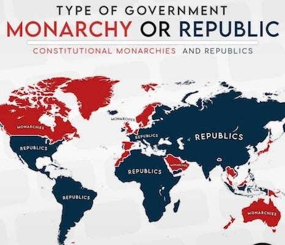
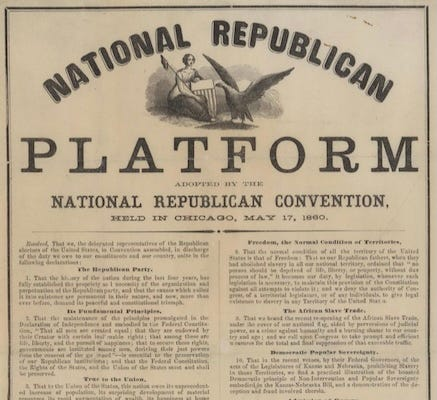
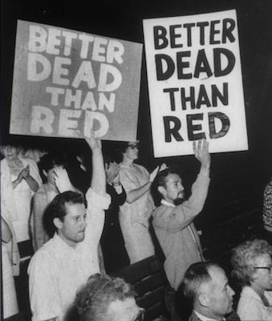
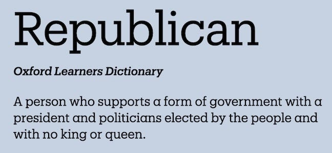
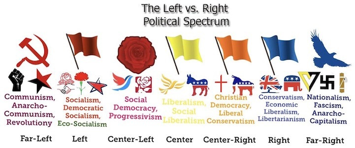

## What Is Republicanism?

If you say the word republican in many countries outside of America people will think you are a Socialist ... Really! Spain is one such country.

However, if you say the word republican in America they will think you are speaking of the right-wing pro-capitalist republican political party known as ... the Republican™ party.

Why does the rest of the world, especially countries that still have a monarchy — England, Spain, Thailand, Jamaica, Australia, etc — often think republican means Socialist, and why in America has it come to mean anti-Socialist? 

How can the same word mean the exact opposite depending on whether you are inside or outside of the United States?

If you read this article for just five minutes you'll know the answer, and find out what the word really means.

## The American Republic

Let us go back to America, because it famously started its colonial existence by being the colony of the Monarchy-led British empire.

Then came along the founding fathers: Thomas Paine, Thomas Jefferson, Thomas Adams, Thomas Fitzsimons, Thomas Heyward Jr., Daniel of St. Thomas Jenifer, Thomas Lynch Jr., Thomas McKean, Thomas Mifflin, Thomas Nelson Jr., Thomas Stone, Thomas Pinckney, Thomas Willing, Thomas Sumter ... and a few people not named Thomas.1

America is a republic because it doesn't have a king as the head of state, like the U.K., Canada, Australia etc. does. There was this skirmish over the whole issue involving tea bags or something, and in 1783 England said okay, you do you.2 ‘You're a [republican] Harry!’

In the early days of the United States of America there was no Republican™ party, because every party was a republican party. In fact the original name for the current Democratic™ party was the Democratic-Republican party.3

## The Republican Party

But in 1854 a new party said they were going to be the most republican party of all the republican parties and called themselves ... the Republican™ party. They had two policies - to get rid of slavery and to get rid of the Mormons (sort of).4

The first Republican™ president, Abraham Lincoln, Karl Marx's slightly less famous pen pal5, wasn't originally a Republican™ at all. He was a Whig - not the kind you wear on your head, they were the second biggest party until the Republicans came along, and people were relieved they could now join a new party with a less silly name.

So America is today a republic, with two republican and capitalist political parties, and almost no Socialists. 

In fact both parties have publicly condemned Socialism and even individual Socialists for their beliefs, even deporting some of them for just being Socialists.6

But in the last few decades the Republican™ party has tried to out-anti-Communist-ify the Democratic™ party by calling almost everything they don't like Socialism or Communism, including the Democratic™ party, which the rest of the world might consider to be on the centre-right of the political spectrum.

## Pro-Republican Socialists

So why is republicanism outside of America associated with Socialism then? Well it has to do with another word I covered a couple weeks ago: conservatism.

Conservatives don't like change, and in many countries that goes as far as keeping a monarchy around, even if just for show. Whereas other conservatives keep strong monarchies with substantial political power around because those monarchies are closely aligned with their conservative values.

Whereas Socialists — and that's a term that needs defining too — they like major fundamental change. What that change entails is another subject we won't cover today, but let's say it doesn't come with a king or emperor, and so Socialists are universally opposed to monarchies and therefore in favour of republics. Something which has cost some Socialists their lives - for being too republican. 

In the UK the anti-monarchy movement has been associated with Socialists since the 1780s. ‘The father of the American revolution’, Thomas Paine, who — after starting the American republican movement — left because of he wasn't as welcome there as an Atheist and Abolitionist, and came back to England to help re-kickstart republicanism in England too, notably aided by socialists such as Mary Wollstonecraft, William Godwin and later, Keir Hardie, founder of the British Labour party.

## What It Is

So a republic is a state in which political power rests with the people (or more commonly their representatives), not ruled over by a dictatorial central leader. A republican is someone who believes there should be no king. Nothing more, nothing less.

They may be Socialist or Capitalist (or even Anarchist), but if they believe that we shouldn't have a king (or queen - it's gender neutral) then they are a republican too. Luckily there is no chance of anyone ever becoming an authoritarian dictator in America. Right?

But this brings us to the question of whether the word still means what it once did and what other word we might use:

Republican still means without a king in the majority of the world. The word is the same in Spanish as English, and a similar word exists in many languages.

In many countries — especially those with a monarchy as part of their history, or still with one — if you say someone is a republican they understand you mean that you are someone who opposes a monarchy, and they will probably presume you are anti-conservative and probably a Socialist.

Now republic's are usually democracies, but not always. What democracy means is another word and another story.

## Letter To America

To my brothers and sisters and non-gendered members of mankind who live in America I have a message:

> Please stop using the word republic differently than the rest of the world. Now you understand what it means you have no excuse.
> 
> Although I know most Americans are neither members of the Republican™ or Democratic™ parties I have a message to those who are.7
> 
> Firstly (not in order of importance), Dear Republican™ party members - This may come as a surprise, but Democrats™ are republicans too. Next, Dear Democratic™ party members - This may sound unbelievable, but Democrats™ are republicans too. Both are republicans because they believe in America being a republic. (Both are also pro-Capitalist political parties which is why Socialists reject both of them.) Now hopefully I've offended you equally. I try to be an equal opportunity offender.

## Better Words?

So, for the sake of clarity and accuracy it would really help if Americans used the word republican in the traditional sense, and came up with new words for members of their political parties, may I humbly suggest -

  *  **Republic** \- a country without a king, whether it is a democracy or not.

  *  **Republican** \- anyone who opposes kings, emperor or dictators ruling over them, even if they are a dirty Commie.

  *  **Republipartians / Republicats** \- members of the U.S. Republican™ party

  *  **Democrepublicans / Democans** \- members of the U.S. Democratic™ (also republican) party.

So, if you are a member of the U.S. Republican™ party perhaps you could start calling yourself a Republicat to help the rest of us out - the other 96% of the world, and please give your fellow foreign Socialist republicans a big hug when you meet them on vacation, as at least this is at least one thing you have in common. Who knows, maybe it'll be ‘the beginning of a beautiful friendship’.

On second thoughts, maybe we need to scrap the word republican completely and go for something else to describe anti-monarchians. How about:

  *  **Crowntagonist** \- antagonistic towards crowns and presumably those wearing them

  *  **Scepticrat** \- a democrat who is sceptical of sceptres, and …

  *  **Throne-breaker** \- which sounds pretty cool, especially if you are strong enough to throw or break thrones.

Subscribe

[Share](https://peacefulrevolutionary.substack.com/p/republicanism-and-socialism?utm_source=substack&utm_medium=email&utm_content=share&action=share)

## Those Damned Socialists

Want to learn about Socialism from Albert Einstein, George Orwell, Oscar Wilde, Helen Keller, Martin Luther King, Nelson Mandela, Oscar Wilde, and others?

Thanks to Jen for this cover design and her patience with this project

 **Buy Now -[Paperback](https://www.lulu.com/shop/nate-taylor/those-damned-socialists/paperback/product-kvwq5wd.html?page=1&pageSize=4) | [eBook](https://www.lulu.com/shop/nate-taylor/those-damned-socialists/ebook/product-2m48rdd.html?page=1&pageSize=4)**

1

Actually Thomas is the third most common first name among the founding fathers, after John and William - but it is more fun to focus on that one.

2

The Treaty of Paris, signed in Paris by representatives of King George III of Great Britain and representatives of the United States on September 3, 1783, officially ended the American Revolutionary War and recognized the Thirteen Colonies, which had been part of colonial British America, to be free, sovereign and independent states.

3

The Democratic-Republican Party (also referred to by historians as the Jeffersonian Republican Party), was an American political party founded by Thomas Jefferson and James Madison in 1792. The modern Democratic Party was founded in 1828 from remnants of the Democratic-Republican Party.

4

They called Mormonism, or Mormon polygamy (‘white slavery’), one of the ‘twin relics of barbarism’ they were going to get rid of, the other being African slavery.

5

In July 2019, Gillian Brockell, writing for The Washington Post, argued that Marx's letter to Lincoln, among other pieces of historical evidence, proved that ‘The two men were friendly and influenced each other’, that ‘Lincoln was regularly reading Karl Marx’, and that Lincoln ‘was surrounded by socialists and looked to them for counsel.’ However, their correspondence was cut short by Lincoln’s visit to the theatre in 1865.

6

See - https://en.wikipedia.org/wiki/Immigration_Act_of_1903 & https://en.wikipedia.org/wiki/Palmer_Raids

7

81.1 million registered members of either party, out of a population of 335 million.
