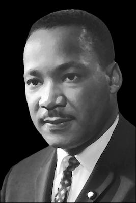

## **Martin Luther King**

 _(1929-1968)_

> ‘Call it democracy, or call it democratic socialism, but there must be a better distribution of wealth within this country for all God’s children.’ _(Speech to the Negro American labour Council, 1961)_

 _Martin Luther King Jr., born on 15 January 1929, in Atlanta, Georgia, emerged as the most prominent leader of the American civil rights movement in the 1950s and 1960s. Inspired by his Christian faith and the nonviolent resistance philosophy of Mahatma Gandhi, King advocated for racial equality through peaceful protest and civil disobedience. His leadership was instrumental in several pivotal moments of the civil rights era, including the Montgomery Bus Boycott of 1955-1956, the Birmingham campaign of 1963, and the March on Washington for Jobs and Freedom in 1963, where he delivered his iconic ‘I Have a Dream’ speech._

 _As his activism evolved, King expanded his focus beyond racial segregation to address broader issues of economic injustice and international peace. He spoke out against poverty, advocating for a guaranteed basic income, and became a vocal critic of the Vietnam War. Despite facing arrests, violent attacks, and constant threats, King remained committed to nonviolent protest until his assassination on 4 April 1968, in Memphis, Tennessee, where he was supporting striking sanitation workers. King’s legacy continues to inspire civil rights and social justice movements worldwide, with his vision of a society free from racial and economic injustice remaining a powerful ideal._

###  **‘More Socialistic in My Economic Theory’**

 _Martin Luther King, 1952 (Excerpt)_

By the way (to turn to something more intellectual) I have just completed Bellamy’s Looking Backward.1 1 It was both stimulating and fascinating. There can be no doubt about it Bellamy had the insight of a social prophet as well as the fact finding mind of the social scientist. I welcomed the book because much of its content is in line with my basic ideas.

I imagine you already know that I am much more socialistic in my economic theory than capitalistic. And yet I am not so opposed to capitalism that I have failed to see its relative merits. It started out with a noble and high motive, viz, to block the trade monopolies of nobles,2 2 but like most human system it fell victim to the very thing it was revolting against.

So today capitalism has outlived its usefulness. It has brought about a system that takes necessities from the masses to give luxuries to the classes. So I think Bellamy is right in seeing the gradual decline of capitalism.

 _Letter to Coretta Scott, 18 July 1952._

> ‘The evils of capitalism are as real as the evils of militarism and evils of racism.’ _(Speech to SCLC Board, 30 March 1967)_
> 
> ‘We are saying that something is wrong … with capitalism…. There must be better distribution of wealth and maybe America must move toward a democratic socialism.’ _(Speech to his staff, 1966)_

Subscribe

[Share](https://peacefulrevolutionary.substack.com/p/martin-luther-king-jr-the-socialist?utm_source=substack&utm_medium=email&utm_content=share&action=share)

## Those Damned Socialists

This essay is one of many I have compiled, edited, and written essays in a new book: **Those Damned Socialists -** _Albert Einstein, George Orwell, Oscar Wilde, Helen Keller, Martin Luther King, Nelson Mandela, Oscar Wilde, and others write about their Socialist views._

 Thanks to Jen for this cover design and her patience with this project

 **Buy Now -[Paperback](https://www.lulu.com/shop/nate-taylor/those-damned-socialists/paperback/product-kvwq5wd.html?page=1&pageSize=4) | [eBook](https://www.lulu.com/shop/nate-taylor/those-damned-socialists/ebook/product-2m48rdd.html?page=1&pageSize=4)**

1

Looking Backward was an influential 1888 utopian novel by Edward Bellamy that depicts a socialist society in the year 2000.

2

During the feudal period, nobles often held monopolies on trade and commerce through legal privileges. The rising merchant class (bourgeoisie) initially positioned itself against these aristocratic monopolies.
