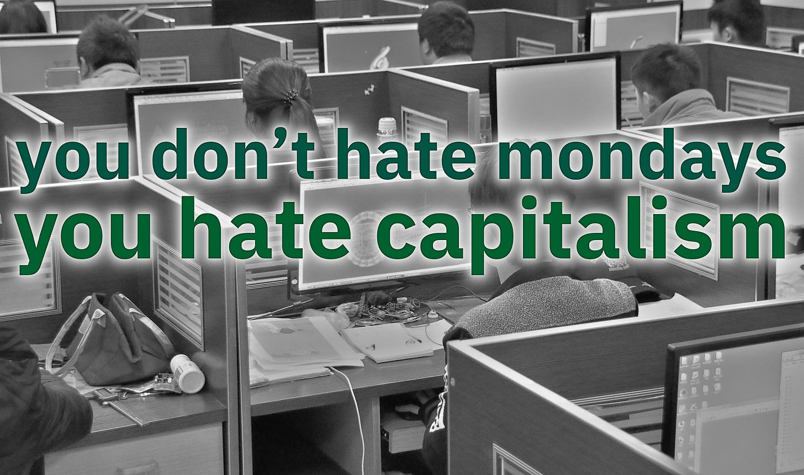
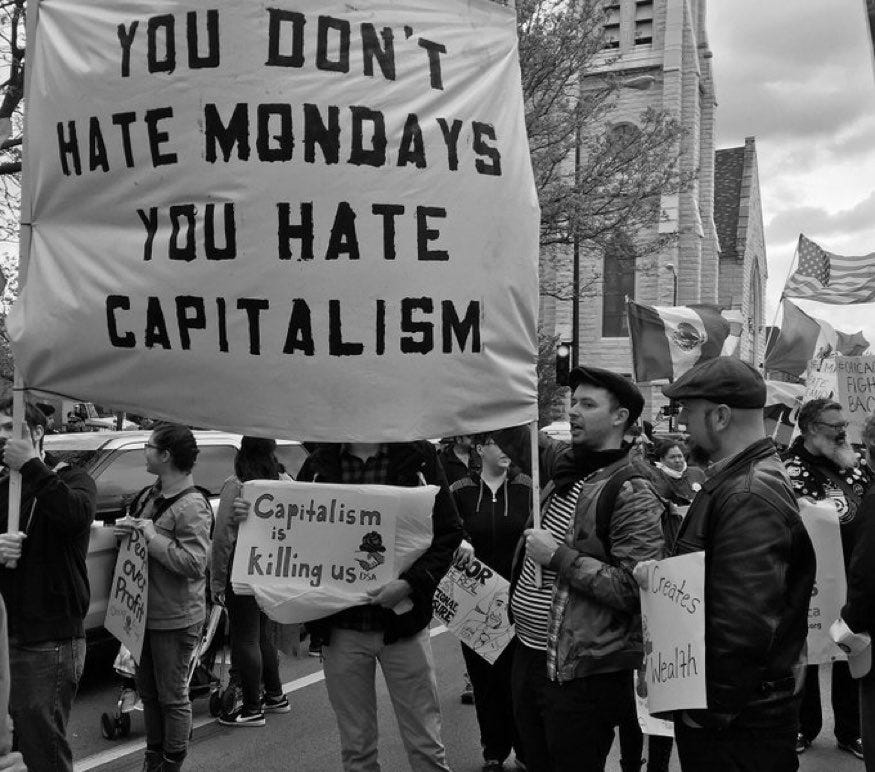

## Why Hate?

I hate using the word hate. When I think of hate I usually think of an irrational, uncontrollable anger and resentment directed at someone who doesn’t deserve it. If I’m in a conversation and that word is used I wince. The idea of one person hating another, even if the other person is horrible, is abhorrent to me. 

‘Hate’ was the one of the few non-swearwords I was banned by my parents from using at home. But they needn’t have worried about me employing it when they weren’t around, because I couldn’t think of a worse word or one I’d be less likely to use. I can be frustrated at someone’s wilful ignorance and greatly saddened by their awful actions, but I just can’t muster up the annoyance to hate them. 

While I can understand the revulsion people have to the word hate itself, there are times when hate seems like the most appropriate word for our feelings against something we consider evil. For example: If we are an empathetic person and love people, then we may say we hate cruelty against people, especially the innocent and defenceless, such as young children who’ve done nothing wrong and can’t protect themselves. We don’t just dislike cruelty against them, nor just prefer the absence of it, but might actually hate when it happens, because of how angry and sad it makes us.

But this is a hate towards an unambiguous evil, something that many people would find understandable, even those like me who bristle at the use of the word ‘hate’ itself. It comes from love, sympathy and compassion, from wanting to spare someone of pain, and to rid them of the source of that pain. If there was ever any noble reason to hate this would seem to be the most appropriate one.

Of course people use the word ‘hate’ in different contexts and with differing degrees of seriousness. Hate is a word used for strongly disliking, detesting or despising something. One person may say they hate chocolate ice-cream so they avoid it, but this doesn’t mean that they want to outlaw it for others, or mandate vanilla ice cream for everyone.

Another will state that they hate sexism, racism or another kind of bigotry and wish it didn’t exist. Someone else will remark that they hate pollution, they hate it choking people’s lungs, giving them diseases, poisoning the water, and killing the earth. But they dislike it precisely because they love people (or the earth they live on).

Should any of these people be considered hateful? Are their lives motivated by and filled with hate? Do they want anything hateful to happen to anyone else? (Even if the other person likes a different ice cream flavour?) No.

Lets say someone did often talk about something specific they hated, something harmful, wouldn’t this be like someone who works with cancer or has lost a family member due to it, who speaks out about its ill effects (as well as positive breakthroughs and recoveries from it) expressing how much they hate the disease? Might they not be doing this to alert and warn others and help them avoid such a fate if possible?

Nevertheless some say the word ‘hate’ should never be used, that it is like an evil spell that the mere uttering of brings evil into our presence. My question to them is: Is there nothing you dislike and detest? Is there nothing you loathe, such as lying, injustice, abuse, or murder? If so, what is another word used for strongly disliking, detesting or loathing something? Hate! Sometimes any other word just seems too tame. Is the word hate as bad as the evils it is directed against? 

## Hating Capitalism?

Yet despite my own dislike of the word, every weekday for the last couple years I have been posting ‘Reasons To Hate’ against a very different target, and one which some people argue doesn’t deserve it: Capitalism. So it is understandable that those people who reserve the word hate for the vilest of acts (or who refuse to use it at all) would find it offensive when – from their perspective – I use it so lightly against something they don’t believe is worthy of or worth such hatred.

But why pick on Capitalism? Haven’t many of us enjoyed a pretty comfortable life, especially those of us of a certain generation who have had some financial security and many conveniences due (presumably) to Capitalism? To many in that situation it may seem strange that younger people and others outside of our ‘developed’ countries might be so angry towards Capitalism, and it would be easy to put their criticisms down to jealousy or laziness, at least until we listened to them more carefully and examined the damaged the system has done to them more closely.

Is Capitalism really deserving of the hate I daily state I have towards it? To those who equate Capitalism with liberty or freedom this must seem an extreme and unjustified response. Who would hate liberty or freedom? Only someone who was crazy. I certainly don’t hate them, but then I don’t consider Capitalism to be either of those things, and believe that hate is the only word strong enough word to convey my antipathy toward it.

Yet I can’t take credit for being the first to use such a strong word against that economic system. I owe that honour to someone who was known for their kindness, even towards those who who weren’t so kind to them: Helen Keller, the deaf-blind author and activist for the disabled.

My particular use of the word hate comes from an essay she wrote criticising those who praised her when she spoke out against injustice, but criticised her when she spoke about the systemic sources of those injustices. Said she, ‘I hate the system which it (Capitalism) represents, apologises for and upholds.’ I found this intriguing when I first read it, that someone who was so compassionate, could hate a system so much. But, the more I learned about this system the more reasons I found to hate it too.

I’m lucky because I’m one of those people who grew up with enough privilege and luck that I didn’t suffer the worst deprivations Capitalism has to offer, but I’ve travelled and have come to know enough people who suffer because of it, all in order to supply and furnish those privileges and comforts some of us enjoy. In my series of short remarks and quotes I try to bring attention to some of theses.

However, reading my short daily lines about Capitalism doesn’t and can’t give a comprehensive view of the evils I believe Capitalism is responsible for and the harm I feel it has done, so I hope my longer posts can make up for any misunderstandings, but I realise some people never get that far to find out if they don’t like my little notes.

Words, especially when forming short sentences, are peskily inadequate things. Such words try to express so much in just a line, and sometimes that line resonates and sometimes it offends. A terse title, a summary, or quote can lack context and doesn’t always express intentions well. 

So I can forgive people for coming to the wrong conclusions if they only read one line I’ve written (or even quoted) about where my focus is and what it is on, but I keep producing these notes because others tell me the lines resonate with them, that they share the same frustrations, and feel supported because of it.

But for those who wonder why I would go to the trouble and why I feel so strongly I feel you deserve a simple answer as to what it is that I hate about Capitalism, and the negatives I am convinced it is responsible for that are hurtful and worthy of our hate.

## What Is Capitalism?

As a great number of the reactions against my messages dispute even the use of the word Capitalism, I’ll start by clarifying what Capitalism isn’t: 

Capitalism isn’t merely the concept of people trading, early communities tended to trade with other groups even before the existence of property and money, some of this exchange was ceremonial and symbolic, for things that had no intrinsic value, but could also be practical as in the sharing of surpluses, and maintaining peaceful co-operation. However, people were not trading as individuals for what they needed, as what they needed was supplied by the communities they were already part of. 

Capitalism isn’t merely markets, as farmers markets and crafts markets existed before there was private capital being traded in commodity and stock markets. Markets have existed in societies in which there has been no private capital beyond what people use personally.

Capitalism isn’t merely property. In most societies personal possessions and some public property exists: your home being personal property and it’s contents being your personal possessions, and a shared river being public or common property. Private property in Capitalism specifically refers to productive (privatised or commercial) assets controlled by a minority owning class.

Capitalism is when someone claims privatised ownership of something like farmlands, mines, factories, or houses, and takes or makes a profit from it, by setting up a cost or price to access it, by selling, trading or renting it out. The thing which is producing this value is their capital, the person who owns it is a Capitalist, and an economic system based upon this commercial arrangement is Capitalism. It is still Capitalism whether it is unregulated or highly regulated. If there is private capital it is capitalism. 

But what about crony / corporate capitalism? What about situations in which the government favours one oligarch over another, or oligarchs effectively control the elections and decisions of the politicians? This is still Capitalism because it is still private ownership of capital. It may not be the ideal of some Capitalists, especially those who have not been favoured in this way, but it is still a capital-based economic system.

## Liberal Vs Conservative Capitalism

Some take umbrage at me speaking about Capitalism countries and Capitalist governments, as if the two systems can be separated. Modern Capitalism has always required state backing to function. The state establishes property rights, enforces contracts, provides infrastructure, bailouts, subsidies for capital, and a backed currency. There's no historical example of Capitalism functioning without strong state support. Capitalism emerged alongside the modern state, with early corporations like the East India Company functioning as extensions of state power. Any attempt to separate Capitalism from the state ignores historical reality. 

Either way Capitalism can and does exist in social democracies and under conservative governments. From my critical point of view the only difference between the two is the level to which nature can be destroyed or the extent to which people can be exploited. I would argue that the divide between liberal and conservative Capitalism is the degree to which the government is involved in determining by how much to provide the poor for life and health emergencies, and by what degree the poor are coerced into low paid work. But under both approaches a Capitalist government already favours, prioritises and protects the capital of the Capitalists above all other concerns, whether it does it in a way that punishes the poor less or more.

Of course you may believe that Capitalism is the only practical, reasonable or possible economic system. I don’t believe that, but my daily notes on the subject don’t usually address that claim at all, instead they focus on whether it is a good system, on what it’s failings are, and occasionally on whether it is possible to do better (we can).

Maybe hate isn’t the best word to use, maybe dislike, detest, or despise would be sufficient, or maybe it is enough to point out the problems and let people make their own mind up, but some of us have researched Capitalism and experienced it personally for decades, and take solace and strength in finding others who share our feelings toward it.

If only we organised the economy differently, if everyone had the same access to the same things, freely and without paywalls and tolls, then no-one could profit from them, and then there would be no Capitalism. Because if everyone co-owned the same means of production, co-operated together to carry out that production, and shared what was produced that would be a different kind of social economic system, which goes by a different name: Socialism.

 _In my next article I will look into what I consider the five most serious ‘Reasons To Hate Capitalism’ and why I believe civilisation cannot survive without it’s removal, without a better system being put in place._

Subscribe

[Share](https://peacefulrevolutionary.substack.com/p/why-hate-capitalism?utm_source=substack&utm_medium=email&utm_content=share&action=share)

### Capitalism Series

If you liked this consider reading more of my [series on Capitalism](https://peacefulrevolutionary.substack.com/about#§capitalism-series)
