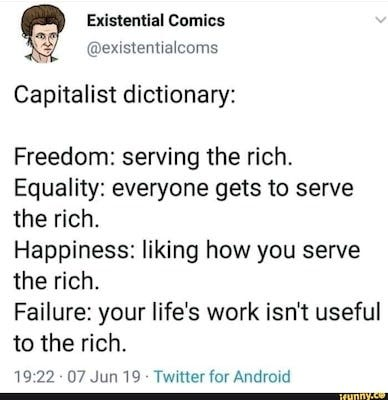
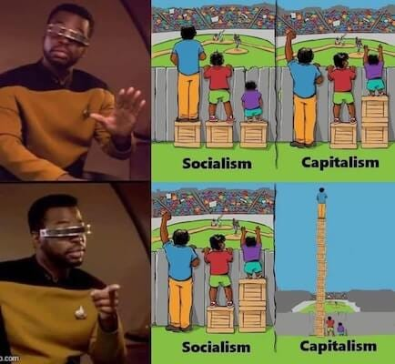

_In[my last article](https://peacefulrevolutionary.substack.com/p/why-hate-capitalism) I looked at the way we use the word hate towards things and systems, including capitalism, and how I defined that word. This article is about the problems which I believe are directly attributable to capitalism._

It is difficult to quantify the human cost of any economic system, because so many benefits are claimed by those who support it and so many negatives by those who oppose it. Yet, I have documented over 150 ‘Reasons To Hate Capitalism’ so far over the last year1, many of which I believe are unique to that particular system, and which have tended to fit into five major categories: How Capitalism affects politics, poverty, morality, the environment, and our safety. These I will go into in greater detail below, each of them deserves an article of their own, but for the sake of this overview I’ll give my own brief reasons, and hope they lead any readers to further study.

### 1\. Hierarchy

>  **Capitalism means the poor will always be ruled over by rich Capitalists**

Some think inequality is not an issue if somehow the profits at the top ‘trickle down’ and ‘all boats rise’, but even if that were true there would still be the same disparity in power. Money corrupts politics, this is the Iron Law of Oligarchy: The rich will always inevitably corrupt political parties and politicians if you allow money into elections and lobbying, but if you don’t allow it the rich will always use their wealth and influence to ensure that it eventually does.

The problem isn’t just that most politicians are rich (which they are) which is the definition of a plutocracy, it isn’t just that they which enrich themselves which is the definition of a kleptocracy, it isn’t just that they are increasingly serving the richest of all which is the definition of an oligarchy, it is that the vote of one poor person will always be worth a billion times less than that of a billionaire. This is the reason 2/3rds of the world’s ‘democracies’ are declining.2

But Capitalism doesn’t care whether democracy exists or not, it can survive and thrive under dictatorships fine, as it has many times, sometimes with the advice of the same economists who call Capitalism freedom, such as Milton Friedman.3

### 2\. Artificial Scarcity

>  **Capitalism will always mean poor people going without what they need even when there is an abundance and it will go to waste otherwise**

There is enough for everyone, we produce more than enough. In fact we produce so much stuff that is never used that it is major factor in the world’s environmental problems _(more about those later)_. We actually pay farmers not grow crops, and even then we have to destroy millions of tonnes of surplus every year.

So why in a world where we produce so much are there still people who go hungry? Why, when so much food is available, do some people still starve? Why do we allow thousands to die daily because of this artificial situation? Because we live in a capitalist economy in which we must keep prices high even at the cost of others going without what they need. This is as true for housing and other essentials too.

But hasn’t poverty gotten better under Capitalism? This is only true if you redefine poverty to the lowest baseline, less than the United Nations says people need to live on to be healthy.4 Otherwise the figures say poverty has gotten worse under Capitalism, as you would expect in a system which the need for a few to profit before the needs of many to survive. Far from being a-moral Capitalism is immoral – you cannot be morally neutral when it comes to withholding food from hungry people.5

### 3\. Morality

>  **Capitalism means that people will be valued more by what they own and how much money they have ( & less by how little they own)**

We may value our friends greatly, and those we love intensely, we may consider the safety of our children to be worth more than any amount of money, and would lay down our lives for a good friend. This is what makes us human: how much we value each other. When we help those close to us are part of a social economic system that leads us to care for others before factoring in costs, as they mean more to us than how much money helping them might take from us or make us.

Capitalism has a completely different set of competing values, however. It values only what it owns and can profit from. That is its capital, it defines the entire purpose of the Capitalist economic system, its raison d'etre. This means that decisions that affect others will be made by how much they cost monetarily far more than how much they cost to people’s happiness, dignity, humanity, or safety.

This leads to the needs of people being met only if they can be capitalised upon, and the worth of people being judged by how much they can contribute to the economy. One person, unless they have substantial capital or specialised skills of use to those who do, is a digit on a spreadsheet, below the consideration of those who make decisions based on their return to shareholders.

Under Capitalism become assets or burdens and success is measured by monetary value rather than wellbeing. Capitalism forces us to make human personal social decisions based on an economic system which serves a few, rather than have a system which serves us and enables us to make those decisions without fear

For these reasons Capitalism corrupts people morally, it makes otherwise good people do bad things to survive, it makes make good men do bad and bad men worse. Some say Capitalism is amoral, but being amoral in the face of desperate need when you can alleviate that suffering is unkind, unjust and immoral.

### 4\. Apocalypse

>  **Capitalism means that rich Capitalists are free to destroy the world and the poor will always be left to pay for it with their lives**

Capitalism poisons the air, water, and ground. Some will argue that it isn’t Capitalism but corporations that do this, but Capitalism is the system that gives corporations exclusive access to the resources and incentivises them to profit off of doing this.

Capitalism incentivises waste, obsolescence, resource depletion, and consumption of useless things. It defecates two billion tonnes of waste annually, depletes irreplaceable resources as quickly as it can obtain them, and creates a culture of unsatisfying consumption that fails to meet genuine needs. All of this leaving to widespread environmental destruction due to climate catastrophes, and the prospect of the planetwide mass extinction of plant, insect and animal life with one million species at risk, including us.

Others will argue that it is our responsibility individually to not buy products which produce such pollution, but people buy what they can afford, from what is on offer, and Capitalism determines the affordability and availability of such choices.

Lastly, some will say that it is the responsibility of government to regulate these corporations and their pollution, but this just takes us back in a loop to the first problem with capitalism: that corporate money influences those politicians more than our votes do.

What financial incentive are there for this to change? It could be argued that without living customers that corporations wont make profits, but this has never stopped cigarette or soda companies from selling products that kill those who buy from them, nor does such logic persuade share holders looking for a short term profits.

### 5\. Fear & Violence

>  **Capitalism requires coercion to exist - it cannot exist without threats and insecurity**

People stay in risky jobs, putting their health and lives at risk because of Capitalism.6 People live in places unfit for human habitation because of Capitalism. People stay in abusive relationships and bad marriages because of Capitalism. They can’t afford to work, live or go elsewhere.

Why do workers submit to this? They fear hunger and homelessness, they fear the pain and possible death that comes from not earning a living. Capitalists are not only the gatekeepers to you getting a job which is required to ‘earn’ a living, but they rely on you needing to access necessities through their paywalls, in order to coerce you into taking poorly paid work and accepting insecure economic living conditions.

This means they are not just the source of the money for you buying food and paying rent, but also you not earning enough and not having what you need, including food and shelter. So, if we call multimillionaires and billionaires job creators when they offer jobs then we have to admit they are job destroyers when they take them away too, and in their ideal world they’d replace you with a robot if they were cheaper, or pay employees nothing if they could get away with it.

This leaves the poor facing not only constant job, food and housing insecurity, but with an economic and political system which is gamed in favour of those who run the companies or own them. I would argue that this is a form of violence, because it threatens to destroy people’s safety and security, and to destroy their lives.

#### 5 ½. Theft & Exploitation

>  **Capitalism requires stealing the value of your labour from you, and required stealing land, people and resources from others to exist**

Imperialism, invading and occupying other countries, chattel slavery, and workhouses were all required to obtain the capital necessary to make Capitalism possible. Imperial expansion was explicitly driven by the need for new markets, resources, and investment opportunities for capital.7

Then, when lords and merchants couldn’t find enough workers at home they enclosed their common land and threw them off their feudal land so they would be available as cheap workers in the new Capitalist economy. Capitalism literally invented homelessness and unemployment!8

Overseas imperialist corporations such as the East India Trading Company did the same thing with traditional co-operative farms and stole and shipped away their resources. Capitalism turned theft into a respectable and legal process when done by corporations!9

Imperialism and neo-colonialism extracted this wealth via violence. Hundreds of millions were killed through imperial wars and conquest, with trillions still being extracted annually from former colonies. And what happens if these former colonies try to take back their resources? They are quickly and often violently dealt with.

Even up to the present day, Capitalism still isn’t content to just let people try to be something else other than Capitalists – it invades, overthrows, occupies, and murders to maintain it’s power and profits – because it values it’s monetary and property values more than the value of people. Capitalism relied on theft and violence in order to exist, and still relies on exploitation and the threat of violence to maintain its dominance now.

### Capitalism Better?

These problems seem pretty bad to me, and I've covered a couple hundred reasons to hate Capitalism so far, and aren't running out of any reasons anytime soon. But I still often hear the argument, ‘Isn’t Capitalism just the best us imperfect humans can accomplish?’

No-one disagrees that Capitalism has some benefits over Feudalism, but that is a pretty low bar to meet. The real question is whether it's the best system possible now. I would argue that, no, it isn't.

The progress sometimes associated with Capitalism has mostly come from advances Capitalism has fought against, science and inventions which disrupted its established its existing markets and sources of income, and workers rights and welfare benefits obtained by those fighting against Capitalism.

Of course, Capitalists will tell you that you are or will be better off by accepting and working for the system that benefits the Capitalists far more than the workers. They’ll fund university economics departments so that the ‘experts’ they hire are on their side, they’ll fill schools with educational materials supporting their views, they’ll even promote religious leaders who will take their money to give sermons on the superiority of Capitalism, they will fill the media and news with positive portrayals of their system and negative ones of anything that challenges it.

They’ll work with advertisers to instill the message that buying and consuming their products represents who you are, and that you will be inadequate without them, to the point that you will have seen two hundred thousand hours of such propaganda before you become an adult. That’s not even including the product placements in your sports events and the movies you see, and everywhere you travel on billboards and buildings. Nor is it accounting for the pro-Capitalist idealogical content in your schoolbooks, television shows, workplace, and even churches.

So, is it any wonder that so few people question Capitalism, and that so many people think it must be the best system, having been told so in one way or another every day of their life, millions of times at a cost of billions of dollars? It is actually an amazing testament to the capabilities of the human mind that some can still question their claims and come to a different conclusion. Thus, I have a lot of sympathy for those who tell me Capitalism is the the most efficient, free, rewarding, fair system, even as they repeat the catchphrases they’ve been taught from birth as if they are their own ideas, and take offence at anyone suggesting otherwise.

But let’s say they might be right, that perhaps Capitalism is better, or at least as good as it gets, we still have a major – life threatening problem – with it continuing: The world cannot survive if Capitalism continues. You just can’t out innovate the destruction being caused, especially when there is more profit in continuing it in the same way. Only changing the system will change the results. Otherwise, it will ultimately kill all of us, even eventually the billionaires in their bunkers too.

### When The Hate Stops

Ultimately there is one time to stop hate towards Capitalism, that is when Capitalism is in the past, and then you can express happiness that it is over, peace at being without it, and laugh about how dumb the world once was for putting up with it.

Yet, even with all the good reasons for such hate, hate isn’t my life’s focus. It takes thirty seconds to come up with yet another reason to hate Capitalism, and most of the time I’m sharing other people’s reasons. Offline I spend most of my time focused on what Capitalism can’t provide and is best without: love, friendship, kindness, and happiness.

My ‘Reasons To Hate’ series is just me saying this is a reason why I believe Capitalism is hurting us, this is why I think we need something better, and that a better world is possible without it, and this is how we can get there.

About half of what I write is drawing attention to many of the world’s problems, but the other half is focused on the positive alternatives and solutions to Capitalism, reasons to be hopeful that we can achieve them. Below are some examples:

  * [The Last Of Us Town Of Jackson](https://peacefulrevolutionary.substack.com/p/the-last-of-us-town-of-jackson) \- _Shows that communes can work even in difficult (albeit fictional) circumstances_

  * [Cake Vs Guns](https://peacefulrevolutionary.substack.com/p/cake-vs-guns) \- _Suggests a better approach to potential post-collapse survival_

  * [Socialism An Introduction](https://peacefulrevolutionary.substack.com/p/socialism-an-introduction) \- _Why Socialism is a solution to Capitalism’s problems_

  * [The Plumbing Revolution](https://peacefulrevolutionary.substack.com/p/the-plumbing-revolution) \- _A story showing how dirty jobs can be done without coercion_

  * [Antillia's Utopia](https://peacefulrevolutionary.substack.com/p/antillias-utopia) \- _A couple days on a utopian island, including details of how it operates_

  * [How Anarres Works](https://peacefulrevolutionary.substack.com/p/how-anarres-works) \- _How Le Guin’s utopia works_

  * [Nemik's Anarchist Manifesto](https://peacefulrevolutionary.substack.com/p/nemiks-anarchist-manifesto) \- _Principles by which to overthrow an evil empire_

  * [Playing Pretend](https://peacefulrevolutionary.substack.com/i/145576028/lets-pretend-again) \- _Imagining a better possible world (second half)_

  * [An AI Anarchist Manifesto](https://peacefulrevolutionary.substack.com/p/an-ai-anarchist-manifesto) \- _A possible transition away from hierarchy and capitalism_

  * [A Better Future](https://peacefulrevolutionary.substack.com/p/a-better-future) \- _Imagining a better future_

  * [Writing In An Anarchist Utopia](https://peacefulrevolutionary.substack.com/p/writing-in-an-anarchist-utopia) \- _A positive vision for how the arts could operate differently_

  * [A Better World Is Possible](https://peacefulrevolutionary.substack.com/i/148414536/entitlement-series) \- _How a better world is possible now and aspects of it are already happening in some places_

  * [I Pencil](https://peacefulrevolutionary.substack.com/p/i-pencil-the-true-story) \- _A plan of how to carry out complex production without Capitalism (2nd half)_

  * [Organising Without Rulers](https://peacefulrevolutionary.substack.com/p/organising-without-rulers) \- _A look at how healthcare could work without centralisation and hierarchy_

  * [A Free Society](https://peacefulrevolutionary.substack.com/p/a-free-society) / [Achieving Liberation](https://peacefulrevolutionary.substack.com/p/achieving-liberation) \- _A look at what the world needs to be free and what that will do for us_

  * [Love Is Anarchist](https://peacefulrevolutionary.substack.com/p/love-is-anarchist) \- _What can be a better solution to our problems than true love?_

Besides these, many of my other articles which focus on bringing attention to the problems with Capitalism also have sections with suggestions for making the situation better, or are leading to later articles in the series that will address this.

Perhaps you’re already an anti-Capitalist, but take exception to my use of the word hate, and we just disagree about what is just a matter of tone, or phrasing. You are entitled to have your own irks and dislikes, and I respect that my little messages don’t appeal to everyone, so although we approach this differently I think it takes many different approaches to accomplish a better world, and a better world is possible - without Capitalism.

Subscribe

[Share](https://peacefulrevolutionary.substack.com/p/reasons-to-hate-capitalism?utm_source=substack&utm_medium=email&utm_content=share&action=share)

### Capitalism Series

If you liked this consider reading more of my [series on Capitalism](https://peacefulrevolutionary.substack.com/about#§capitalism-series)

1

Reasons 101-250, and another 100 I haven’t posted yet.

2

2/3rds of the world’s ‘democracies’ are declining

3

<https://peacefulrevolutionary.substack.com/i/158090061/milton-friedman-and-the-freedom-argument>

4

less than the United Nations says people need to live on to be healthy.

5

<https://peacefulrevolutionary.substack.com/i/158985664/the-question>

6

Billions in precarious work, 160 million child labourers, and 50 million people in modern slavery.

7

Yes, imperialism predates Capitalism, but modern Capitalist imperialism took distinctly new forms driven by capital's need for markets and resources.

8

Property rights themselves require state enforcement - without it, what prevents someone simply taking ‘private property'‘? Even right-wing ‘Libertarian’ (propertarian) theorists like Robert Nozick acknowledge this fundamental relationship.

9

Someone pointed out that this was a loss tax wise overall for governments, but it certainly wasn’t for corporations and shareholders.
